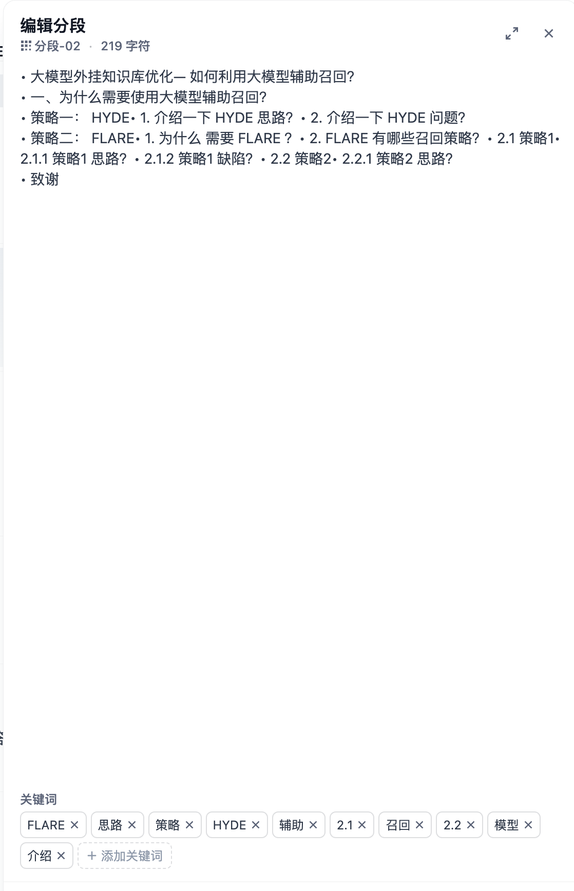

# 分段标签与关键词需求文档

## 1. 产品目标

为解析后的内容分段补充不可编辑的结构标签和可维护的内容关键词，使用户能按结构或主题筛选检索范围，提升精确匹配、过滤和可解释性。

## 2. 数据模型

| 字段 | 含义 | 编辑规则 |
|---|---|---|
| 结构标签 | 标识分段在文档中的版面或层级角色 | 系统生成，不可修改 |
| 关键词 | 反映主题、实体、时间、情感或摘要的内容标签 | 自动生成后可人工维护 |
| 关键词索引 | 支撑关键词匹配、组合搜索和过滤 | 随关键词保存更新 |

结构标签包括正文、不同级别标题、父章节、脚注、图片和代码块等。结构标签描述“内容处于什么位置”，关键词描述“内容关于什么”，两者不能混用。

## 3. 自动生成与管理

- 分段完成后，系统为足够长度的内容生成关键词；短于最小长度阈值的分段不自动生成。
- 自动关键词覆盖主题、分类、实体、时间、情感和摘要等维度，但应控制数量和去重，避免低质量堆砌。
- 每个分段最多 30 个关键词；自动生成约 10–15 个，用户可在剩余配额内补充。
- 用户可添加、编辑或删除关键词；保存前校验空值、重复和数量上限。
- 关键词修改应更新索引，并记录更新时间与修改来源。

## 4. 搜索与筛选

### 4.1 关键词搜索

- 支持单关键词匹配、多个关键词组合和排序。
- 对大小写、分词和常见变体提供一致的匹配规则。
- 可用于仅关键词检索，或作为语义 / 全文检索的前置过滤条件。

### 4.2 关键词筛选

用户可先以关键词将知识库缩小至子集，再在子集内进行语义、全文或混合检索。筛选条件应在结果页可见，避免用户误解检索范围。

## 5. 多模态与验收

音频、图片和视频的关键词生成是后续能力，需要先定义内容来源、置信度、时间范围和人工修订方式。

验收标准：

- 分段获得正确的结构标签，且用户无法把结构标签改为任意文本。
- 关键词自动生成、人工增删改、去重、上限和索引更新正确。
- 关键词可用于检索和筛选，并与结构标签筛选明确区分。
- 关键词变更不破坏分段内容、来源定位和其他处理结果。
