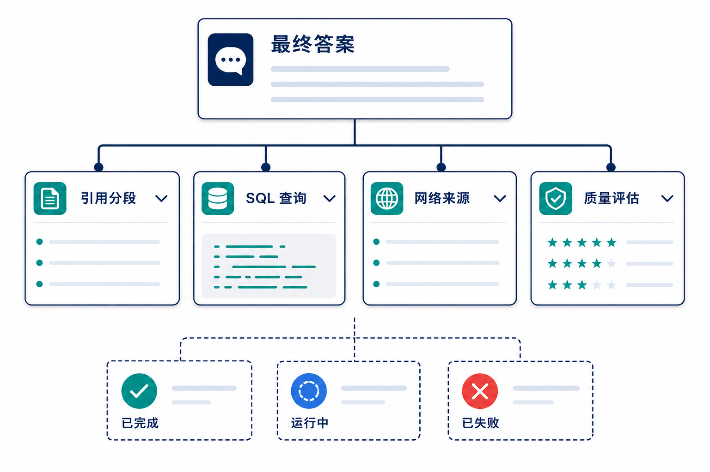

# 数据探索执行明细需求文档

## 1. 产品目标

执行明细让用户理解回答依据、核对结构化查询、查看外部信息来源并监控复杂任务的子任务状态。它将对话从黑盒结果升级为可检查的执行记录，但不泄露系统提示词、凭据或不必要的内部实现细节。

## 2. 入口与范围

用户在一轮回答中打开“执行明细”，查看该轮及其子任务的四类信息：参考分段与质量、SQL 查询、网络来源、评估结果。入口位于回答区域，默认收起；无拆解时显示“执行明细”，有拆解时显示“执行明细（拆解成 N 个子任务）”。入口在回答完成后可见，加载时展示状态但不可将不完整内容误标为最终依据。

## 3. 明细内容

| 区域 | 展示内容 | 主要交互 |
|---|---|---|
| 参考分段 | 来源文件、片段、召回或质量信息 | 展开原文、查看关联文件、标记问题 |
| SQL 查询 | 查询意图、SQL、状态、耗时、结果摘要 | 查看结果表、复制 SQL、定位失败原因 |
| 网络来源 | 来源标题、摘要、访问时间与引用位置 | 打开来源、展开摘要、查看使用范围 |
| 质量评估 | 可用性、引用覆盖与异常提示 | 查看评估口径；不把未实现指标伪装成结论 |

### 3.1 参考分段

引用分段需显示来源、内容、分段类型和与回答的关联。模块默认收起；有结果时显示引用数，无结果时显示“无结果”且不可展开。每张卡片显示文件类型、来源文件、两行内容预览（可展开）、字符数和召回次数。用户点击后可查看原文或媒体定位：文档定位到页，图片打开原图，音视频定位到对应时间点。质量评估只评估“问题与分段”的相关性，按完全相关、相关性高、相关性低和不相关展示分数与状态；不能将模型自述当作事实证明。

### 3.2 SQL 查询

展示用于回答的 SQL、执行状态、数据范围和结果摘要。模块默认收起；执行过 SQL 即使结果为 0 行也应计入查询次数。多条查询按执行顺序提供切换；单条记录显示完整 SQL、复制入口和结构化结果表。结果表每页 10 行，支持分页；成功但 0 行时保留 SQL 并显示空结果态。执行失败的 SQL 不得作为回答证据；错误信息应可行动且不包含凭据或敏感连接信息。

### 3.3 网络来源

仅在本轮启用网页搜索时显示该模块。展示外部来源的标题、域名、两行摘要、获取时间和新标签打开入口；有结果显示数量，无结果不可展开。来源失败、不可访问或超时需明确标识，不能将其作为已验证证据。

### 3.4 子任务

复杂分析将任务拆为子任务，用户可查看每个子任务的名称、输入摘要、状态、耗时、产物和失败原因。子任务可折叠；展开某一子任务后，复用其独立的参考分段、SQL 查询和网络来源模块。失败子任务不应阻塞用户查看其他已完成结果。

### 3.5 回答一致性评估

回答一致性评估与检索质量评估不同：前者判断最终回答是否得到引用分段支持，后者判断问题与分段是否相关。该能力仅在用户开启且评估完成后展示；未实现或只覆盖部分数据类型时必须注明范围，不能用绿色状态暗示完整验证。

## 4. 安全与验收

- 明细只展示当前用户有权限查看的数据、文件、表和外部来源。
- 不展示系统提示词、API Key、访问令牌或完整内部调用参数。
- 用户能从最终回答回到其引用、SQL 结果或外部来源，并识别失败或未参与回答的步骤。
- 子任务状态、耗时、错误和产物正确关联到当前会话轮次。
