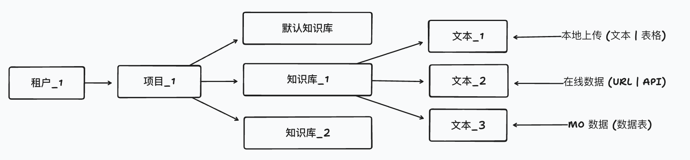
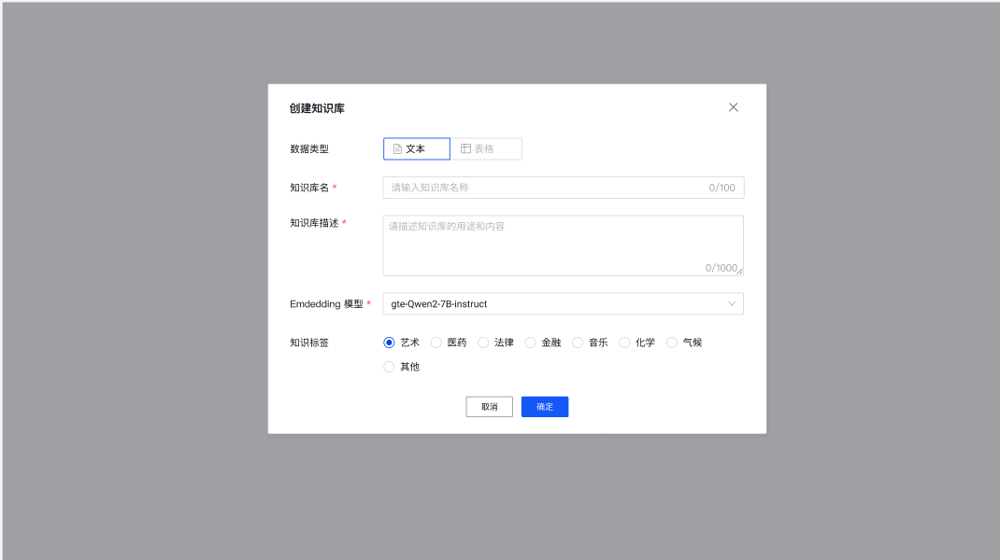

# 知识管理产品需求文档

## 1. 产品目标

知识管理为 AI 应用提供可组织、可处理、可检索和可分享的数据基础。知识库是同类别、同用途知识内容的逻辑容器，支持文本型知识问答与表格型自然语言查询两种主要使用方式。

## 2. 核心概念

| 概念 | 定义 |
|---|---|
| 知识库 | 数据管理逻辑单位，包含同一数据类型和处理规范的多项内容 |
| 知识内容 | 一个文件、在线来源、数据表或其处理结果 |
| 文本型知识库 | 用于检索召回和问答，内容按统一规则切分与嵌入 |
| 表格型知识库 | 用于结构化数据查询与计算，内容具有一致的表结构 |
| 知识广场 | 用于发布、浏览和订阅可共享知识库的可选能力 |

## 3. 创建知识库

### 3.1 基础信息

| 字段 | 规则 |
|---|---|
| 知识库 ID | 系统生成、全局唯一、不可修改、不直接向用户展示 |
| 名称 | 当前项目内唯一，1–100 字符；支持中文、字母、数字、下划线、连字符和美元符号 |
| 描述 | 可选，最多 1,000 字符 |
| 数据类型 | 必选且创建后不可改：文本或表格 |
| 嵌入模型 | 文本库必选；同一知识库统一使用一个模型 |
| 标签 | 可选，用于分类和筛选 |

### 3.2 类型约束

| 类型 | 主要来源 | 处理规则 | 主要用途 |
|---|---|---|---|
| 文本 | 本地文档、在线页面 | 全库使用一致的切分策略和嵌入模型 | 知识问答、检索与内容生成 |
| 表格 | CSV、Excel、在线数据、数据库表 | 全库表结构一致；按行或定义的结构处理 | 自然语言查询、计算与分析 |

- 同一知识库可包含多个内容，但必须属于同一数据类型。
- 文本库首次添加内容时确定默认切分策略；表格库首次添加内容时定义结构约束。
- 图像及其他多模态知识来源不在本期范围内。

## 4. 知识库列表与详情

### 4.1 列表

列表支持按名称模糊搜索、嵌入模型筛选、分享状态筛选及大小、更新时间排序。每项展示名称、数据类型、描述、内容数、大小、嵌入模型、更新时间、来源和分享状态。

操作包括编辑基础信息和标签、启用或禁用、删除和分享。禁用后，所有使用者均不能继续检索该知识库。

### 4.2 详情

详情展示名称、来源、大小、内容数、切分数及内容列表。用户可在详情中添加、查看、更新、重处理或删除内容。内容列表支持按名称、来源、大小、创建时间和更新时间筛选或排序。

## 5. 添加与处理内容

### 5.1 文本内容

本地文本支持常见文档格式。单次可上传多个文件；页面展示名称、状态、大小、进度和删除操作。文件名在同一知识库中必须唯一。

| 配置 | 默认 | 可选范围 |
|---|---|---|
| 切分符 | 换行 | 换行、句末标点或后续自定义规则 |
| 最大切分长度 | 800 | 100–2,000 |
| 预处理 | 无 | 清理连续空白、换行、制表符及可选 URL / 邮箱清理 |

上传后异步执行入库与嵌入，并展示处理状态。用户可离开当前页面继续其他操作，在内容列表中查看最终状态。

在线文本来源支持 URL 校验、单页或递归采集、可选择的发现页面以及不自动更新、每日、每周、每月等更新周期。访问失败或内容获取失败必须明确报错。

### 5.2 表格内容

本地表格支持 CSV 与常见电子表格格式。导入时用户选择工作表、表头行和数据起始行，并维护列名、列类型和列描述。系统按定义展示预览，供用户确认结构和数据范围。

在线表格与数据库表使用相同的结构定义与预览机制；数据库数据可选择快照或持续更新方式。表格内容不要求生成文本嵌入，但必须完成结构校验和数据可用性检查。

### 5.3 内容维护

- 可修改内容名称、删除内容和按原创建流程更新数据。
- 文本可重新设置切分规则并重处理。
- 表格可更新结构定义，新增数据时必须与既有结构兼容。
- 在线内容可调整更新周期。
- 若产品限制同一知识库同时存在异步处理中内容，应在页面明确提示并限制冲突操作。

## 6. 知识广场

知识广场为后续能力，用于让用户发布和订阅知识库。

### 6.1 发布

用户可从知识库列表或详情发起分享，配置可见范围和访问条件。发布前应确认：来源主体、知识库名称、可访问范围、描述与价格或订阅条件。共享范围支持公开或白名单；不支持将不具备权限的原始内容绕过控制分享出去。

### 6.2 浏览与订阅

分享列表支持名称搜索、大小范围、类别、更新时间和使用指标排序。详情展示概览、描述、有限内容预览和订阅入口。已订阅内容不允许重复订阅；发布者本人不显示订阅入口。

## 7. 验收与限制

### 验收标准

- 用户可创建文本或表格知识库，类型、名称、模型与结构约束正确生效。
- 用户可导入、处理、预览、更新和删除文本与表格内容。
- 异步状态、失败原因和处理进度可见；不会把未处理内容当作可检索数据。
- 列表、详情、筛选、启用、禁用和删除操作符合权限与生命周期规则。
- 分享与订阅在授权范围内工作，并避免泄露来源和受限内容。

### 限制

- 图片、多模态、自定义数据源和部分在线导入为后续迭代项。
- 嵌入模型与处理参数的具体可用范围取决于部署和模型服务。
- 知识广场的价格、计费、内容审核和跨组织权限需由独立治理规范定义。
