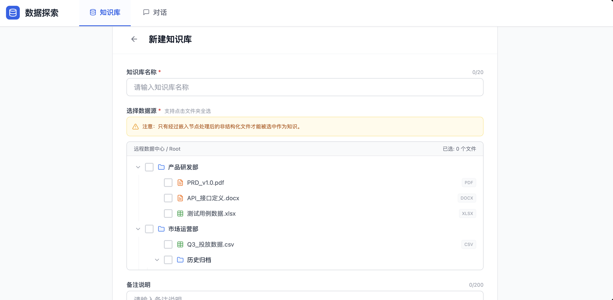

# 多知识库与多会话需求文档

## 1. 产品目标

本功能提供隔离的多知识库、可配置的分析模板和可持久化的多轮会话。用户可针对不同业务主题创建知识库，在固定范围或自由范围内提问，并通过原文引用查看答案依据。

## 2. 核心对象

| 对象 | 说明 |
|---|---|
| 知识库 | 一组经过处理后可用于检索或分析的文件与数据表 |
| 分析模板 | 面向复杂分析问题的拆解步骤与总结规则 |
| 固定会话 | 始终绑定一个知识库，适合深度问答 |
| 自由会话 | 可在对话中选择一个或多个知识库，适合跨域问题 |
| 引用来源 | 回答引用的文档片段或表格范围，可在预览面板中查看 |

## 3. 多知识库管理

### 3.1 列表

知识库以卡片或列表展示，支持分页与响应式布局。每项展示类型标识、名称、备注、文件摘要和数量。

- 名称为必填且在当前范围内唯一，长度不超过 20 字。
- 备注为必填，长度不超过 200 字，用于说明内容范围并支持会话中的知识库路由。
- 仅允许选择已完成嵌入或可检索处理的非结构化文件和结构化数据表。
- 支持最多 100 个知识库；列表每页展示 20 项。

### 3.2 创建与更新

创建表单包含名称、知识选择、备注和可选高级配置。名称非空、已选择至少一项知识且备注非空后，创建按钮才可用。更新时完整回显基础信息、已选数据和高级配置；若变更数据源，保存后刷新索引并更新卡片摘要。

### 3.3 删除

删除为不可恢复操作，必须二次确认。固定会话的关联库被删除后保留历史记录但不可继续对话；自由会话自动从可选范围中移除该库，其他已选知识库仍可继续使用。

## 4. 分析模板

分析模板用于为复杂问题提供可复用的拆解框架，适用于检索问答和结构化数据分析。

| 字段 | 规则 |
|---|---|
| 问题示例 | 必填，最多 100 字 |
| 拆解步骤 | 必填，至少 1 步，最多 100 步；单步最多 200 字 |
| 分析总结 | 必填，最多 300 字，用于指导最终输出 |

用户可新增、修改和删除步骤；最后一个步骤不能删除。高级配置在创建和编辑知识库时可完整回显。

## 5. 会话

### 5.1 固定会话

用户从知识库卡片点击“对话”后，系统创建并选中与该知识库绑定的会话，加载该库上下文并显示欢迎语。固定会话中不能更改知识库范围，以保证深度问答的稳定性。

### 5.2 自由会话

用户从会话侧栏新建对话后，可在输入区上方多选知识库。没有发送消息的空白对话不保存，也不允许连续创建多个未发送的空白会话。

### 5.3 多轮交互与引用

- 输入为空或仅有空格时不能发送；模型生成期间不能重复发送。
- 会话最多保留 100 轮。
- 回答中的引用片段可打开右侧源文件面板。
- 非结构化内容在预览中定位并高亮到引用段；表格展示相关行与列。
- 面板可手动打开、收起；收起后对话区自适应扩展。

## 6. 会话历史与异常

### 6.1 历史侧栏

侧栏支持收起与展开。悬停会话项时显示更多操作：

| 操作 | 规则 |
|---|---|
| 置顶 / 取消置顶 | 置顶会话排在列表上方；取消后按时间排序 |
| 重命名 | 不超过 20 字，不能为空，可与其他标题重复 |
| 删除 | 二次确认后永久删除会话并刷新列表 |

### 6.2 异常

固定会话的知识库缺失时，展示明确的不可用状态并移除或禁用输入区；自由会话不应因其中一个知识库被删除而整体失效。加载、引用预览或回答失败时，保留已可用内容并提供重试提示。

## 7. 验收标准

- 用户可创建、编辑、删除和浏览多个隔离的知识库。
- 创建时只能选择符合处理条件的数据，且名称、备注和选择项校验正确。
- 固定会话与自由会话的知识范围、保存规则和删除影响符合定义。
- 分析模板可定义复杂问题拆解并在编辑时回显。
- 用户可管理历史会话、查看引用源文件，并在知识库变更后看到清晰的可用性状态。
