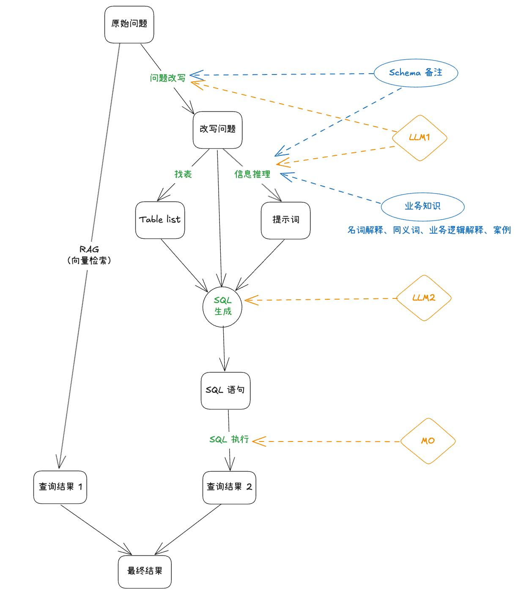

# NL2SQL 业务知识与查询需求文档

## 1. 产品目标

NL2SQL 让用户以自然语言查询结构化数据。系统通过可维护的业务知识上下文、示例案例和分析模板提升 SQL 生成准确性；在混合数据探索中，结构化查询结果与文档检索证据分开呈现，再共同支持最终回答。

## 2. 核心链路

~~~text
用户问题 + 已选数据表 + 业务知识上下文
        ↓
意图理解与相关知识选择 → SQL 生成 → 语法 / 权限 / 安全校验
        ↓
执行 SQL → 结果与执行明细 → 与检索证据合成回答
~~~

SQL 执行失败时，失败结果不得作为生成模型的事实上下文；页面应将文档参考分段与 SQL 查询明细清晰区分。

## 3. 业务知识上下文

### 3.1 术语表

术语表定义业务专有名词、指标口径和状态含义，帮助模型理解“是什么、如何计算”。

| 字段 | 规则 |
|---|---|
| 名称 | 必填，最多 30 字 |
| 描述 | 必填，最多 100 字；可包含计算与过滤规则 |

支持新建、编辑、删除和分页。删除必须二次确认；修改后影响后续生成，不改写历史查询。

业务知识的变更应记录版本、操作者和时间。创建或编辑时支持按已选表、字段和关键字筛选关联范围，避免把不相关知识注入所有查询。

### 3.2 同义词

同义词将不同表达映射到标准术语以及相关表、字段，减少口语化和行业别称造成的歧义。

| 字段 | 规则 |
|---|---|
| 标准词 | 必填，最多 30 字 |
| 同义词 | 必填，可输入多个 |
| 关联表与字段 | 可选；一个标准词可关联多张表，每张表关联一个字段 |

系统在生成 SQL 前将用户表达归一化，并保留命中的映射供执行明细查看。

### 3.3 业务逻辑

业务逻辑用于表达无法由单术语描述的规则，例如相对时间、排除范围、统计口径和复杂业务过程。

| 类型 | 规则 |
|---|---|
| 智能判断 | 由模型依据当前问题决定是否使用；默认推荐 |
| 全局规则 | 对所有查询生效，适用于统一口径与必要过滤条件 |

描述必填，最多 200 字。全局规则属于高影响配置，保存前应明确提示影响范围。

## 4. 优化案例

### 4.1 通配符

通配符为可变参数定义名称和候选值，用于将一类相似问题抽象为可复用案例。名称必填、最多 20 字；枚举值可选且可多值维护。修改或删除通配符时需提示受影响案例。

### 4.2 问题—SQL 案例库

案例由自然语言问法和预期 SQL 组成，可引用已定义的通配符。问法必填、最多 200 字；SQL 必填、最多 2,000 字，并需通过语法与安全校验。案例仅用于指导生成，不应绕过用户的数据权限和执行限制。

### 4.3 分析模板

分析模板用于“为什么”“分析一下”等复杂问题，将一个问题拆解为多个子查询并按固定框架总结。

| 字段 | 规则 |
|---|---|
| 问题模式 | 必填，最多 100 字 |
| 拆解步骤 | 必填，有序多步骤；每步最多 100 字 |
| 总结模板 | 必填，最多 300 字 |

执行时记录每个子查询、结果、失败与最终汇总依据，避免将未执行步骤当作已验证结论。

模板执行中某一步失败时，应保留其他已完成步骤及其证据，并在最终总结中标出缺失部分；不得用模型推测替代未取得的查询结果。

## 5. 混合数据探索

用户可选择表格、文档、图片、音视频等不同数据类型：

| 选择范围 | 执行方式 | 明细 |
|---|---|---|
| 仅结构化表 | 仅 NL2SQL | SQL 查询与结果 |
| 仅非结构化内容 | 仅多模态检索 | 参考分段 |
| 混合选择 | 并行执行两路能力 | 参考分段与 SQL 查询分别展示 |

最终回答可结合两类成功结果。若某一路失败，应说明其未参与依据，而不能用失败内容补全回答。

## 6. 安全、状态与验收

- 仅允许对用户具备访问权限的表、列和数据执行查询。
- 生成 SQL 需通过语法、对象存在性、只读或允许操作范围及资源限制校验。
- 展示 SQL、状态、耗时、数据范围、结果摘要与失败原因；不展示凭据、连接信息或内部提示词。
- 用户可维护各类业务知识；变更只影响后续查询。
- 在混合探索中，SQL 与检索证据的状态、来源和回答贡献必须可区分。
