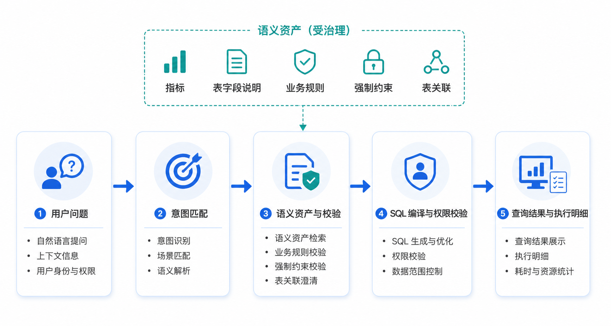

# NL2SQL 语义层重构需求文档

## 1. 产品目标

语义层将业务指标、数据表、字段、规则、强制约束、表关联和标准查询组织为可校验、可编译、可追溯的资产。模型负责理解用户意图和选择候选资产；编译器负责表、字段、关联、聚合、过滤、权限和 SQL 的确定性生成。

目标是让业务人员能清楚地判断配置归属，并让每次查询能够解释：使用了哪些语义资产、哪个版本、如何生成 SQL、哪些条件来自指标定义、哪些来自本次问题。

## 2. 语义域与查询链路

语义分为两个独立域：

| 语义域 | 资产 | 作用 |
|---|---|---|
| NL2SQL | 指标、表与字段说明、业务规则、强制约束、表关联、标准问答、动态查询 | 支撑结构化数据查询与 SQL 编译 |
| RAG | 文件型业务规则、文件型标准问答 | 支撑基于已解析文件的回答与引用 |

~~~text
用户问题 → 意图识别与资产匹配 → 语义校验与查询计划
→ 编译表、字段、关联、指标和约束 → 权限与安全校验
→ 执行 SQL / 动态查询 → 结果、引用与执行明细
~~~

- 结构化、稳定的业务口径必须用可编译资产表达，不能仅写在提示词或说明文本中。
- 业务规则只描述需要模型判断的条件性逻辑；无条件、不可覆盖的过滤必须使用强制约束。
- 语义资产的名称和说明可帮助匹配，但不改变已经定义的计算、关联或权限边界。

## 3. 指标

### 3.1 分类与范围

指标是有稳定业务名称、可执行且可复用的数值计算口径。它定义来源表、固定计算规则、指标内部筛选和展示信息；本次问题中的时间、组织、地域等查询条件不属于指标定义。

第一阶段支持单表聚合指标和同源表派生指标，支持 `SUM`、`AVG`、`COUNT` 等聚合、固定系数、嵌套 `AND` / `OR` 条件及数字展示格式。

不支持跨表指标、指标内部 JOIN、多来源表、任意 SQL 片段、跨模型派生、单位自动换算或循环引用。

### 3.2 基础指标结构

| 字段 | 规则 |
|---|---|
| `metric_key` | 知识库内稳定唯一标识；仅小写字母、数字、下划线和连字符，长度 1–50 |
| `name` | 业务名称，知识库内唯一，最多 50 字符 |
| `description` | 口径说明；帮助理解和匹配，但不能替代正式计算 |
| `synonyms` | 用于意图匹配的别名；同一知识库内不可重复 |
| `source.table` | 必填，来自数据目录的稳定表标识；基础指标只能引用一张表 |
| `metric_type` | `aggregate` 或 `derived` |
| `calculation` | 与指标类型相符的结构化计算定义 |
| `output` | 可选展示格式；未配置时省略该对象，不保存空对象 |

基础指标的 `calculation` 由聚合、固定筛选与可选系数组成：先按指标筛选数据，再执行聚合，最后对聚合结果应用系数。系数不得隐式作用于明细行。

### 3.3 条件表达式

条件树只有两类节点：

| 节点 | 作用 | 规则 |
|---|---|---|
| `group` | 组合条件或子组 | 使用 `and` 或 `or`；子节点可继续嵌套 |
| `condition` | 判断一个字段 | 指定字段、操作符和值 |

支持字符串、数值、集合、区间和空值判断。模糊匹配由编译器处理通配与转义，配置者不直接填写数据库通配符。保存前必须校验字段存在、操作符和值类型匹配、条件组非空。

### 3.4 派生指标

派生指标只由同一来源表中的基础指标组成公式，不包含聚合、指标内部筛选或系数。创建时先选择来源表，再展示可引用的基础指标；更换来源表会清空公式并要求重新选择。

公式是表达式树：

| 节点类型 | 内容 | 约束 |
|---|---|---|
| `operation` | 加、减、乘、除；包含左右两个子节点 | 所有运算为二元运算 |
| `metric_ref` | 引用一个基础指标的 `metric_key` | 必须与当前派生指标同源，不能引用派生指标 |
| `constant` | 数字常量 | 必须为有效数值 |

- 保存前检测缺失操作数、非法运算、除零风险、引用不存在、跨表引用及循环引用。
- 同一来源表、相同公共筛选和分组下的基础指标可合并为一次扫描；派生计算在外层结果中完成。
- 指标内部固定口径与本次查询筛选必须分层生成，用户筛选不得覆盖指标内部条件。

### 3.5 指标编译与界面

SQL 生成分为三层：

1. 内层指标层：为每个基础指标编译独立聚合和固定条件。
2. 公共查询层：追加本次问题解析出的时间、组织、分组等公共条件及强制约束。
3. 外层结果层：选择展示指标、别名并执行派生公式。

指标列表展示 Key、名称、指标类型、来源表、计算规则、更新时间与操作；支持按 Key、名称和来源表搜索。基础指标编辑器使用可嵌套条件组，并实时显示安全的条件预览；派生指标编辑器提供指标引用、运算符和常量输入，并在保存前完成公式校验。删除需二次确认，并在存在下游派生引用时阻止删除或要求先解除引用。

## 4. 数据表与字段说明

表和字段说明补充数据库原生注释不能表达的稳定业务信息，例如一行数据代表什么、数据范围、单位、字段格式、技术字段限制和相近字段的差异。

| 资产 | 关键字段 | 规则 |
|---|---|---|
| 表说明 | `table`、`description` | 绑定一个目录中的表；不改变原生注释 |
| 字段说明 | `table`、`field`、`description`、`nl2sql_enabled` | 绑定目录中的字段；默认启用 |

- 原生注释和语义补充说明同时保留并共同提供给查询规划。
- 关闭 `nl2sql_enabled` 的字段不进入普通字段检索、表结构探索或模型自由选择；字段仍存在于数据库中。
- 已被指标、强制约束、关联或标准查询明确引用的字段即使关闭自动检索，仍允许编译器按已验证定义使用。
- 表详情页展示表说明与字段列表；用户可编辑补充说明和启停状态。保存前检查表、字段存在以及说明长度。

## 5. 业务规则与强制约束

### 5.1 业务规则

业务规则处理不适合固定表达式的条件性业务判断，例如业务时间转换、特殊场景下的表或字段选择、未定义指标的探索方式，以及动态查询结果的使用方式。

| 字段 | 规则 |
|---|---|
| `rule_key` | 语义域内稳定唯一标识 |
| `tables` | 可选关联表列表，用于缩小适用范围 |
| `dynamic_query_keys` | 可选；每一项必须引用可用动态查询 |
| `rule` | 描述触发条件、判断方式和处理指引 |

规则命中后只提供明确的业务上下文，不能绕开强制约束、数据权限、字段禁用或 SQL 安全校验。

### 5.2 强制约束

强制约束是某张表参与任何 NL2SQL 查询时都必须追加的结构化过滤条件。它必须绑定单表、无条件生效、可直接编译，且用户与模型均不可移除或覆盖。

若用户条件与强制约束冲突，系统停止生成 SQL，明确指出冲突的字段或条件并要求调整问题，而不是静默改写用户意图。

强制约束列表展示 Key、关联表、说明、更新时间与操作；编辑器复用指标条件树和同样的字段、操作符、值校验。

## 6. 表关联、标准问答与动态查询

### 6.1 表关联

表关联只定义两张表如何连接，不定义何时使用。多表查询必须优先匹配经确认的关联，不能仅依据同名字段猜测 JOIN。

| 字段 | 规则 |
|---|---|
| `relationship_key` | 知识库内稳定唯一标识 |
| `left_table` / `right_table` | 目录中存在的两张不同表 |
| `join_type` | 受支持的连接类型 |
| `join_conditions` | 至少一个字段对与可编译比较操作符 |
| `description` | 关联语义、基数或使用限制说明 |

- 保存前校验表与字段存在、两侧字段类型可比较、连接条件不为空和 Key 唯一。
- 编译器记录选中的关系、版本和连接条件。若多条关系均可用且无法消歧，要求用户或规划阶段明确选择。
- 对可能扩大行数或重复聚合的关联，显示风险提示并在执行前进行计划校验。

### 6.2 NL2SQL 标准问答

标准问答保存已确认的典型问题与只读 SQL，用于提高稳定性和解释性。

| 字段 | 规则 |
|---|---|
| `qa_key` | 稳定唯一标识 |
| `question` / `similar_questions` | 主问题及可选等价问法 |
| `sql` | 仅允许通过语法、安全、对象和权限校验的只读 SQL |
| `description` | 适用范围与限制 |

标准问答被命中时仍需按当前用户权限、表字段状态和强制约束验证；历史 SQL 不能成为绕开最新治理规则的通道。

### 6.3 动态查询

动态查询是可复用的受控查询能力，业务规则可通过 `query_key` 引用其结果作为上下文。每个动态查询必须定义稳定 Key、输入范围、允许的处理方式、结果类型和只读 SQL 或等价受控实现。

- 结果处理模式必须明确是返回单值、列表、表格还是作为规则上下文。
- 执行前校验参数、权限、资源限制和返回结构；失败结果不得作为模型事实继续使用。
- 列表展示 Key、用途、返回类型、更新时间和操作；禁止把凭据或连接信息写入资产。

## 7. RAG 语义

RAG 语义与 NL2SQL 语义分组存储、独立校验。文件型业务规则绑定已解析文件，为回答提供条件性解释；文件型标准问答绑定来源文件、标准问题、相似问题、答案与使用方式。

| 使用方式 | 命中要求 | 回答行为 |
|---|---|---|
| `reference` | 语义相关即可召回 | 作为依据，允许结合当前问题组织回答 |
| `force` | 意图、业务对象和关键筛选一致 | 使用标准答案，仅允许必要格式化 |

`force` 仍必须保留来源文件并可追溯。相同 `kind` 在两个语义域内可存在，但按“语义域 + kind + 稳定 Key”区分身份；同一条资产不可同时带有结构化表引用和文件引用。

## 8. 权限、版本与审计

- 语义资产的创建、编辑、删除、导入、导出需受知识库与配置权限控制；查询使用权不等于编辑权。
- 每次指标、关联、约束、标准问答和动态查询的变更生成新版本，保留创建时间、更新时间、变更摘要和操作者标识；不在对外导出文件中保留人员信息。
- 查询执行明细记录被使用的资产 Key、版本、编译结果、冲突或拒绝原因，以及不含敏感数据的运行状态。
- 语义资产只能引用当前用户及目标知识库可见的表、字段和文件。导出不迁移数据表、文件二进制、权限、运行日志、账号或凭据。
- 删除被引用资产时，系统显示依赖并阻止破坏性删除，或在用户明确处理依赖后创建可追溯的新版本。

## 9. 语义导入与导出

### 9.1 导出协议

导出当前知识库中已保存的全部语义，使用 UTF-8 JSON。导出文件按 `semantics.nl2sql` 和 `semantics.rag` 分组；每个数组可为空，但两个数组必须存在。

| 顶层字段 | 规则 |
|---|---|
| `format` | 固定协议标识 |
| `schema_version` | 导出协议版本 |
| `exported_at` | 可选来源信息，不参与导入冲突判断 |
| `knowledge_base` | 可选来源标识，仅用于追溯，不限定导入目标 |
| `semantics` | 包含 `nl2sql` 与 `rag` 两个数组 |

系统生成的内部 ID、人员字段、运行状态、界面状态和版本字段不作为迁移内容。导出的当前版本文件必须可无损导回兼容版本。

### 9.2 稳定身份与导入模式

稳定身份由“语义域 + kind + 稳定 Key”组成；表说明使用表标识，字段说明使用表标识加字段标识。名称、说明、SQL、答案、来源信息和时间均不参与冲突判断。

| 模式 | 行为 |
|---|---|
| 追加（默认） | 仅新增目标中不存在的稳定身份；同身份项跳过，不覆盖既有资产 |
| 覆盖 | 全量校验、再次确认后，以文件中的全部语义替换当前知识库全部语义配置；不删除来源表和文件 |

同一导入文件中重复稳定身份必须报错。追加模式下名称重复但稳定身份不同允许导入，并在预览中给出警告。

### 9.3 校验与原子性

导入流程为：选择文件 → 全量校验与预览 → 选择追加或覆盖 → 确认写入。

| 校验层级 | 重点校验 |
|---|---|
| 文件 | JSON 格式、UTF-8 编码、大小限制、可解析性 |
| 协议 | 格式标识、支持的版本、两个语义数组 |
| 资产 | kind 是否属于所在语义域；必填字段、类型、枚举、长度与 Key 格式 |
| 表达式 | 条件树、指标聚合、派生公式、只读 SQL、动态查询结构 |
| 引用 | 表、字段、指标、关系、动态查询与文件在目标或本次文件中可解析 |
| 治理 | 权限、强制约束冲突、循环引用、跨表派生和不允许的未定义字段 |

- 存在错误时禁用导入；错误需定位到资产、稳定 Key、字段和原因，并支持导出完整错误报告。
- 预览显示总数、两个语义域数量、新增数、跳过数、警告数和错误数。
- 正式写入使用单次事务；任一项写入失败时整体回滚，知识库不能进入半导入状态。
- 覆盖操作使用警示样式并要求再次确认；取消、校验失败或写入失败均不改变当前语义。

### 9.4 兼容策略

兼容读取旧版扁平语义和旧的表说明、非结构化规则结构；导入预览必须展示转换结果。官方导出仅生成当前分组协议。不支持的主版本直接阻止导入，并说明支持范围；不能静默丢弃或猜测语义含义。

## 10. 验收标准

- 用户能创建、编辑、搜索和删除各类语义资产，分类边界、字段校验与依赖关系正确。
- 基础指标按固定口径编译；派生指标仅引用同源基础指标，能识别非法公式与循环引用。
- 查询 SQL 正确分离指标内部条件、公共查询条件、强制约束与派生结果层；用户条件不能覆盖强制约束。
- 表字段说明、字段启停、表关联、业务规则、标准问答和动态查询在规划与执行时按定义生效，并可从明细追溯。
- 权限、版本、审计和删除依赖符合生命周期规则，不泄露凭据、账号、内部环境或受限数据。
- 当前协议导出后可直接导入；追加、覆盖、冲突预览、错误定位和事务回滚符合定义；旧版兼容转换可见且可审查。
