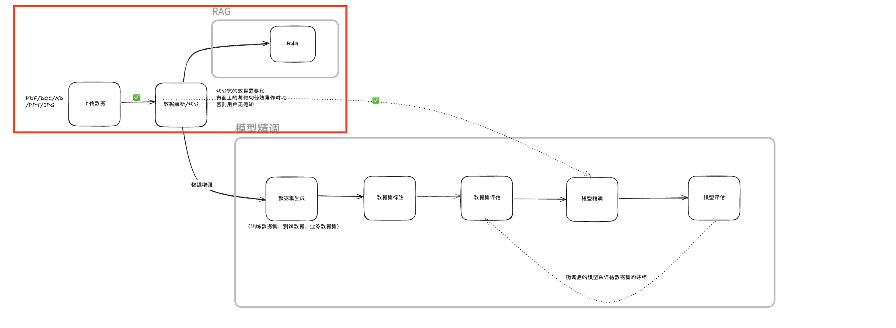

# 多模态 RAG 数据处理评测演示需求文档

## 1. 产品目标

该演示用于验证不同数据处理策略对 RAG 检索与回答质量的影响，重点考察文字、图片、表格和版面信息是否被正确解析、切分和引用。演示以同一份经授权的通用测试集为输入，公平对比多种处理策略及其 RAG 输出。

## 2. 演示原则

- 测试数据必须为可公开使用或明确授权的通用样例，不使用客户文件、人员信息或真实业务报价。
- 各策略使用同一份输入、相同的分段参数、相同的检索深度和相同的评测问题。
- 对比展示必须同时包含回答和引用证据，不能只比较主观文案。
- 不将演示结果表述为对任何第三方产品的普遍结论；结论仅适用于指定数据集、参数和评测版本。

## 3. 功能流程

~~~text
选择或创建演示知识库 → 上传通用多模态样例
→ 以多种策略处理并建立索引 → 查看分段对照
→ 发起相同测试问题 → 并排展示回答与引用 → 计算评测指标
~~~

### 3.1 知识库管理

- 提供内置只读演示知识库，用于快速体验；用户创建的知识库可添加或删除文件。
- 创建时配置分段最大长度、重叠长度和分段符。创建完成后该知识库的处理参数锁定，后续新增文件沿用相同配置，保证可比性。
- 文件类型和大小遵循数据处理能力的通用限制；不在本需求中定义具体服务商集成。
- 同一轮比较必须记录输入文件版本、处理策略版本、模型版本、分段配置、检索深度和问题集版本；任何一个维度变化都应作为新的评测运行。

### 3.2 分段对照

选择文件后以并排方式展示不同策略得到的解析和分段结果。用户可查看文本、图片、表格及其关联描述、OCR、位置和元数据，评估：

- 图文是否被同时识别；
- 表格标题、主体和注释是否保留关系；
- 切分是否保持语义连续性与来源定位；
- 原始文件和输出分段之间能否相互追溯。

### 3.3 RAG 对照

对同一问题使用相同的检索深度，左右并排展示各策略的回答、Top-K 引用和来源分段。问题集应覆盖文本、图像、表格、跨段关联和版面信息等类别。用户可点击引用查看分段，不应只展示无依据的最终回答。

## 4. 评测指标

### 4.1 Hit Rate@K

对于每个查询，若 Top-K 返回中至少有一个相关分段，则记为命中：

~~~text
HitRate@K = 命中的查询数 / 查询总数
~~~

该指标衡量相关证据是否进入前 K 个结果，但不衡量它排在第几位。

### 4.2 MRR

对每个查询，取第一个相关分段的排名倒数；若没有相关结果则取 0，再对全部查询求平均：

~~~text
MRR = 平均(1 / 首个相关结果排名)
~~~

MRR 同时体现命中与排名靠前程度。

### 4.3 相关性标注

Ground truth 应以分段唯一 ID 保存。推荐流程是先固定切分粒度，再定义“足以直接回答问题或包含关键证据”为 Relevant。标注可来自人工精标、答案跨度映射、线上反馈、弱监督或模型辅助，但评测报告必须说明来源、抽样复核和局限性。

若策略产生不同的分段边界，相关性标注应保存到对应策略的分段版本，或以原文证据范围映射后再计算；不能将一个策略的分段标注直接套用到边界不一致的另一个策略。

## 5. 验收标准

- 用户可用统一样例、参数和问题集运行多策略对照。
- 分段、回答和引用可视化且可追溯。
- Hit Rate@K、MRR 和相关性标注规则可复算。
- 演示数据、截图和报告不包含客户、人员或未经授权的商业内容。
