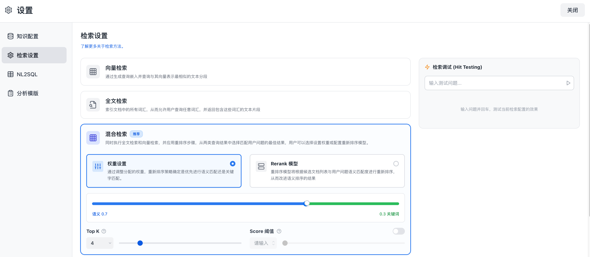

# 检索模式与调试需求文档

## 1. 产品目标

为知识库提供向量检索、全文检索和混合检索，兼顾语义理解、精确术语匹配与结果排序质量。管理员可按知识库配置策略、阈值、重排序或融合权重，并通过检索调试验证实际召回结果。

## 2. 检索模式

| 模式 | 机制 | 适用场景 |
|---|---|---|
| 向量检索 | Query 与分段向量相似度召回 | 语义匹配、同义表达、跨语言或模糊问题 |
| 全文检索 | 基于倒排索引和关键词匹配 | 编码、术语、标识符、精确字面匹配 |
| 混合检索 | 并行执行向量与全文召回再融合 | 同时存在语义理解和精确匹配需求；默认推荐 |

## 3. 配置

检索设置位于知识库设置中。所有模式均支持：

| 参数 | 默认 | 范围与规则 |
|---|---|---|
| 最大召回数 Top K | 5 | 1–10 的整数，表示提交给生成模型的最终片段数量 |
| 得分阈值 | 关闭 | 开启后按 0–1 分数过滤低相关片段 |
| 重排序 | 可选 | 开启后选择可用 Rerank 模型，对候选集重排 |

混合检索二选一配置：

- 重排序融合：使用 Rerank 模型对两路候选统一打分，作为默认推荐。
- 权重融合：通过滑块指定语义与关键词分数的权重，适合无可用 Rerank 模型或明确偏向某一路的场景。

配置保存后作用于该知识库的新查询；系统应校验模型可用性、参数范围与权重和。

### 3.1 页面状态与交互

- 检索设置作为知识库设置中的独立页面；新建知识库默认选择混合检索和系统推荐的重排序模型。
- 向量检索与全文检索均可单独启用或关闭重排序；关闭后仍按 Top K 与阈值完成召回和过滤。
- 混合检索只能在“重排序融合”和“权重融合”中选择其一。权重融合用单一滑块联动两侧权重，左端为纯向量、右端为纯全文，中间值必须相加为 1。
- 所有参数改动先作为未保存草稿展示；切换模式或离开页面时，若有未保存改动，要求用户保存或放弃。
- 无可用重排序模型时，重排序选项不可提交，并提示用户改用权重融合或先配置模型。

## 4. 检索调试

管理员可输入测试 Query，查看各阶段结果。测试只运行召回与重排序，不调用回答生成：

1. 使用的检索模式、参数和模型；
2. 向量与全文候选及原始分数；
3. 融合或 Rerank 后的最终排名；
4. 被阈值或 Top K 截断的原因；
5. 最终返回的分段及来源。

结果列表与对话执行明细复用同一分段卡片：显示文件类型、来源文件、两行内容预览（可展开）、字符数、召回次数，以及已启用的质量评估类型和分数。无结果、空 Query、无权限文件和服务不可用均须在面板中说明原因。

调试不修改线上配置，除非用户明确保存当前策略。调试结果不得泄露无权限原文内容。

## 5. 验收标准

- 三种模式可独立选择，混合模式的两种融合方式互斥且校验正确。
- Top K、阈值和重排序在所有模式中正确生效。
- 调试能帮助定位精确匹配、语义漂移和排序问题。
- 无效模型、非法参数和无结果状态有明确反馈。
