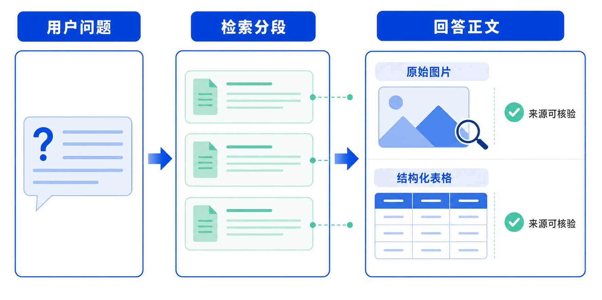

# 检索结果中的图片与表格展示产品需求文档

## 1. 产品目标

当检索召回的参考分段包含原始图片或表格时，直接在搜索与问答结果中呈现可验证的原始内容，而非仅展示 OCR 或文字描述。

## 2. 图片结果

- 图片采用正文嵌入式布局，穿插在相关文字段落中，保证阅读连续性。
- 图片显示宽度不超过回复容器的 80%，严格保持原始宽高比，不得拉伸。
- 图片前后必须有解释性引导文本，说明图片与当前问题或结论的关系，不允许只展示孤立图片。
- 用户可通过图片本身验证检索内容，而不必依赖描述文本。

## 3. 表格结果

- 后端接口返回表格 HTML、表格图片引用及相关元数据。
- 搜索结果直接渲染结构化表格，提供适合阅读与数据核验的交互。
- 表格组件应在搜索、问答与数据浏览场景保持一致的渲染和交互规则。

## 4. 用户场景

| 用户 | 行为 | 期望 |
|---|---|---|
| 数据分析人员 | 搜索业务指标 | 在结果中直接查看并核对表格 |
| 方案设计人员 | 搜索系统图或说明图 | 在正文中查看原始架构图 |
| 研发人员 | 搜索部件或图纸 | 快速预览图片细节而非阅读文字转写 |

## 5. 验收要点

| 场景 | 验收标准 |
|---|---|
| 图片 | 原图在结果中嵌入显示，尺寸与比例正确，前后带语义引导 |
| 表格 | 表格分段可被检索并渲染为结构化表格 |
| 一致性 | 同一类型内容在搜索与问答结果中使用一致的组件与交互 |
| 可验证性 | 用户可直接查看原始图片或表格，核验检索结论 |
