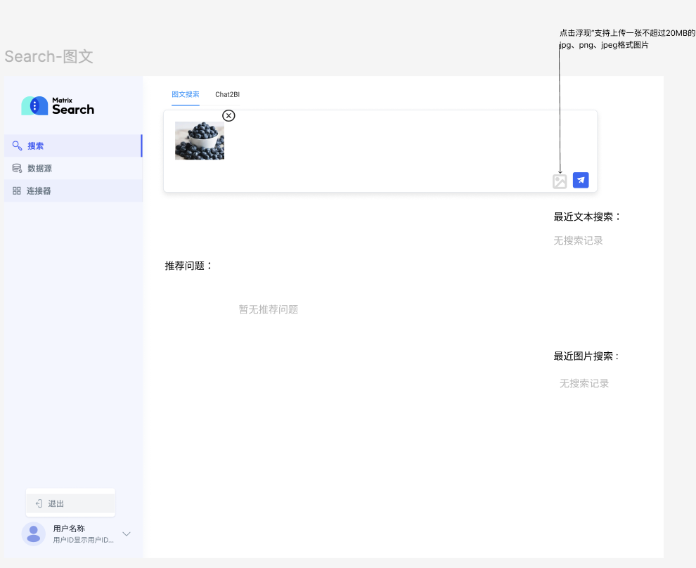

# AI Search 交互体验优化需求文档

## 1. 目标

优化搜索入口、搜索历史和结果呈现，使用户能快速理解不同搜索模式、看懂系统输出，并在失败或无结果时获得明确反馈。

## 2. 搜索模式

搜索入口采用平铺模式选择，不使用难以辨识的下拉分类。

| 模式 | 输入 | 数据范围 | 输出 |
|---|---|---|---|
| 图文搜索 | 文字，或一张符合格式与体积限制的图片 | 文本文件与图片文件 | 推理过程、总结结果、相关图片、引用内容 |
| 结构化数据分析 | 文字 | 已接入的数据库表 | 推理过程、文字结论、数据结果、图表、引用内容 |

### 图文搜索规则

- 文字查询可返回文本摘要，若命中相关图片则同时返回图片与说明。
- 图片查询返回图片总结和相似图片。
- 输入框根据当前模式展示不同提示；模式切换时保留或按兼容性清理输入内容。

## 3. 最近搜索与推荐问题

- 搜索页展示“最近搜索”和基于历史形成的“推荐问题”，各最多显示五条。
- 图文搜索与结构化数据分析分别维护历史和推荐内容。
- 首次使用或无记录时不显示虚构内容。
- 用户点击历史、推荐问题或开始新输入后，可隐藏引导区，避免与结果区混杂。
- 推荐问题仅在发生新搜索后更新；重新打开搜索页时展示最新状态。

## 4. 查询结果

### 4.1 输出结构

每次结果由以下部分组成：

1. 推理过程：流式输出，默认可见；完成后自动折叠并显示耗时。
2. 总结性结果：以流式方式输出；完成后提供一键复制。
3. 引用内容：由结果中的引用入口打开，默认折叠，按来源展开查看。

不再将系统输出拆分为难以理解的不同助手或上下文概念；界面只区分过程、结果与引用依据。

### 4.2 页面状态

| 状态 | 行为 |
|---|---|
| 查询中 | 推理过程与结果逐步输出，保留加载反馈 |
| 查询成功 | 展示结果、复制入口和引用内容 |
| 无结果 | 展示过程后明确说明未找到相关内容 |
| 查询失败 | 展示友好错误和重试入口；保留原查询输入 |
| 刷新页面 | 恢复最近一次查询内容与已得到的结果状态 |

### 4.3 布局与可用性

- 引用入口位于结果末尾的固定位置，避免与正文混在一起。
- 引用块默认收起，展开后显示来源文件与对应片段。
- 图片、图表和结构化分析结果需在窄屏下保持可查看，不遮挡核心文字和操作。
- 用户不能将“推理过程”误认为最终结论；最终结果区域应有明显层次。

## 5. 验收标准

- 用户可清楚识别并切换图文搜索与结构化数据分析。
- 两种模式的输入限制、数据范围和输出类型正确生效。
- 最近搜索和推荐问题按模式隔离、数量受限且无虚构空状态内容。
- 结果支持流式呈现、自动折叠过程、复制结果和展开引用。
- 查询失败与无结果分别给出明确反馈，刷新后可恢复最近查询内容。
