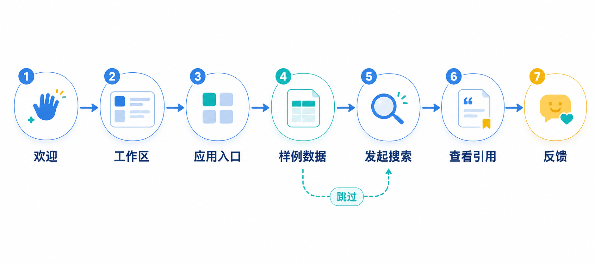

# Search 快速上手需求文档

## 1. 产品目标

快速上手在用户首次进入 Search 时，使用可跳过的分步引导完成“了解工作区—进入应用—连接或跳过数据源—上传样例—发起搜索—理解结果—提交反馈”的最小体验闭环。

## 2. 引导原则

- 引导必须可跳过、可关闭，不阻断已熟悉产品的用户。
- 每一步只解释当前操作所需信息，不暴露内部实现或无关配置。
- 样例数据与样例问题必须为通用、可公开的演示内容，不包含用户、客户或真实业务数据。
- 用户离开或刷新后应保存合理进度；已完成用户不重复强制引导。

## 3. 上线引导流程

| 步骤 | 页面与动作 | 预期结果 |
|---|---|---|
| 欢迎 | 说明 Search 能力与本次演示目标 | 用户知道将完成一次搜索体验 |
| 工作区与数据实例 | 介绍应用所在工作区和数据入口 | 用户理解数据从何处进入 |
| 应用市场 | 引导进入 AI 应用入口 | 用户定位 Search 应用 |
| 打开 Search | 跳转搜索页面 | 用户看到统一的搜索入口 |
| 连接器说明 | 简介外部数据连接；允许跳过 | 不要求首次用户先完成复杂配置 |
| 数据源 | 进入数据页 | 用户了解文件或数据表的管理位置 |
| 上传样例 | 上传或选择通用样例文件 | 样例进入可检索状态，并展示处理进度 |
| 发起搜索 | 填入示例问题或由用户输入 | 返回检索和引用结果 |
| 结果分析 | 解释总结、引用和继续追问的方式 | 用户理解如何判断答案依据 |
| 反馈 | 收集体验评分与意见 | 形成可改进的反馈记录 |

## 4. 交互细则

### 4.1 引导状态

- 首次进入显示欢迎页；用户可开始、跳过或关闭。
- 当前步骤、总步骤和返回入口清晰可见。
- 跳过后不自动执行上传、搜索或连接操作。
- 用户已完成样例上传或数据接入时，引导应识别状态并跳过重复步骤。

### 4.2 上传与处理

- 引导仅使用通用样例数据，支持显示上传、解析、嵌入或可检索状态。
- 处理失败时说明原因并提供重试或跳过；不能把未完成处理的数据用于后续演示搜索。
- 用户可在引导中选择前往正式数据页继续操作。

### 4.3 搜索与结果

- 搜索页提供可编辑的示例问题，用户可替换为自己的问题。
- 结果区展示总结、引用和来源查看入口；引导说明引用用于核对答案依据。
- 无结果、失败或加载中状态均使用真实状态反馈，不能以固定样例结果伪装成功。

### 4.4 结语与反馈

用户完成引导后可进入正式 Search，也可提交评分和反馈。反馈可包含步骤、问题类型和自由文本，但不得默认采集用户输入内容或敏感数据。

## 5. 验收标准

- 新用户可独立完成或跳过引导，不需要先理解连接器和数据模型。
- 引导能带领用户到达可检索样例、发起查询并理解引用结果。
- 已完成或跳过状态被正确记录，重复访问不强制重播。
- 异常状态可见、可恢复，样例与反馈不包含个人或业务敏感信息。
