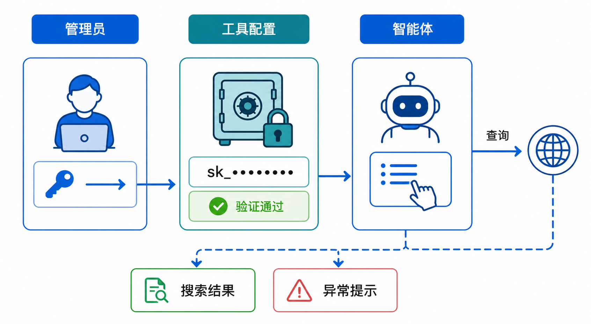

# Web Search 工具配置需求文档

## 1. 产品目标

Web Search 工具库为工作区提供多个独立的第三方网页搜索通道。管理员为每个通道配置一份凭据；智能体创建者只选择工具，不接触凭据。系统清晰管理凭据的保存、验证、启用、异常、更换和删除，并确保凭据永不以明文出现在界面、日志或任务结果中。

## 2. 范围与非目标

### 目标

- 多个搜索服务作为独立工具展示并可同时配置。
- 每个通道在一个工作区中最多保存一份凭据。
- 智能体可添加一个或多个已启用搜索工具，由运行时按任务选择调用范围。
- 管理凭据状态、访问权限、审计和部署差异。

### 非目标

- 不支持同一通道配置多个 Key、别名或 Key 池。
- 不提供全局默认服务商、费用策略、负载均衡或第三方 Key 自动切换。
- 不允许用户查看、复制、导出或在智能体中直接选择 Key。
- 不负责外部服务的采购、账单、发票或充值流程。

## 3. 工作区级模型

| 对象 | 规则 |
|---|---|
| 搜索工具 | 每个服务商是一个独立工具和凭据槽位 |
| 凭据 | 工作区级资源；每个工具最多一个，工具之间彼此独立 |
| 工具管理员 | 可配置、测试、更换和删除凭据；只能看到掩码和状态 |
| 智能体创建者 | 从有权限且已启用的工具中选择；不读取凭据 |
| 智能体 | 保存工具引用，不复制凭据；运行时受当前工作区状态约束 |

- 不同工作区的凭据完全隔离；复制智能体时只复制工具引用。
- 工作区删除时删除凭据，仅保留不含敏感信息的必要审计记录。
- 一个工具的状态变化不影响其他工具的凭据和状态。

## 4. 配置流程与页面

### 4.1 首次配置

~~~text
工具市场 → 工具详情 → 配置凭据 → 保存（未验证）
→ 测试连接 → 已启用 / 失败状态
~~~

配置页仅展示标题、用途说明、密码输入框、保存和取消。首次配置必须输入；保存后不回显完整凭据。保存成功只表示已安全保存，不代表连接可用。

### 4.2 已配置详情

详情展示工具名、掩码状态、凭据状态、最近检测结果和最近配置时间。支持测试连接、更换凭据和删除凭据；不提供查看明文、复制、导出或“停用但保留”操作。

### 4.3 更换与删除

- 更换时旧凭据不回显；留空保存保留当前凭据；输入新值后以原子操作覆盖当前槽位。
- 新凭据保存失败时必须保留旧凭据，不能先删后存。
- 更换后状态重置为“未验证”，其他工具不受影响。
- 删除需二次确认，删除后回到“未配置”；引用该工具的智能体保留工具引用但显示不可用，便于后续重新配置自动恢复。

## 5. 凭据生命周期

| 状态 | 含义 | 可用于新搜索 | 用户操作 |
|---|---|---|---|
| 未配置 | 从未保存或已删除 | 否 | 配置 |
| 未验证 | 首次保存或更换后 | 否 | 测试、更换、删除 |
| 已启用 | 测试连接成功 | 是 | 测试、更换、删除 |
| 测试失败 | 网络或服务端测试失败 | 否 | 重试、更换、删除 |
| 额度不足 | 服务商返回额度耗尽或限流 | 否 | 补充额度后测试、更换、删除 |
| 已失效 | Key 错误、撤销、过期或无权限 | 否 | 更换、删除 |

### 5.1 测试和运行时更新

- 测试使用最小必要请求，不创建正式业务任务。
- 鉴权错误更新为“已失效”；额度错误更新为“额度不足”；短暂网络或服务异常更新为“测试失败”。
- 运行时成功调用更新最近使用时间；零结果是成功调用，不改变状态。
- 运行时发生鉴权或额度异常时，状态同步到工作区内所有引用该工具的智能体。
- 临时网络错误只记录最近失败，不能直接判定凭据永久失效。

### 5.2 恢复

测试失败可通过重试恢复；额度不足必须在外部问题解决后重新测试；已失效必须修复或更换凭据并测试。系统不得仅因时间过去而自动恢复异常状态。

## 6. 智能体使用规则

- 智能体选择的是工具而非凭据。
- 创建者只能添加自己有使用权限且状态为已启用的工具。
- 单次搜索默认调用一个已添加工具；只有任务明确要求交叉验证时才调用多个工具。
- 一个工具不可用时，不自动切换到其他用户配置的外部通道。
- 任务失败时说明失败的工具与可行动建议，不显示 Key、请求头或敏感的第三方响应。

## 7. 公有云与私有化边界

两种部署使用相同的配置与生命周期页面。公有云可按平台规则提供未对用户暴露的系统搜索能力；私有化不依赖该能力。该差异不应出现在用户 Key 配置页，也不应让用户误以为系统凭据属于个人或可被导出。

## 8. 安全、审计与验收

### 安全与审计

- 凭据加密保存；前端仅保存掩码与状态。
- 审计记录工作区、操作者、工具、动作、时间、前后状态和结果，但不记录凭据或测试请求内容。
- 只有具备配置权限的成员可进入编辑；具备工具使用权限的成员只能通过智能体调用。

### 验收标准

- 用户可独立配置多个搜索工具，且每个工具最多一个凭据。
- 保存、测试、更换、删除和异常状态转换符合生命周期定义。
- 多个智能体可共享工作区工具状态，但不能看到凭据。
- 跨工作区复制智能体不会迁移凭据。
- 页面、审计与任务错误信息均不泄露明文或敏感调试信息。
