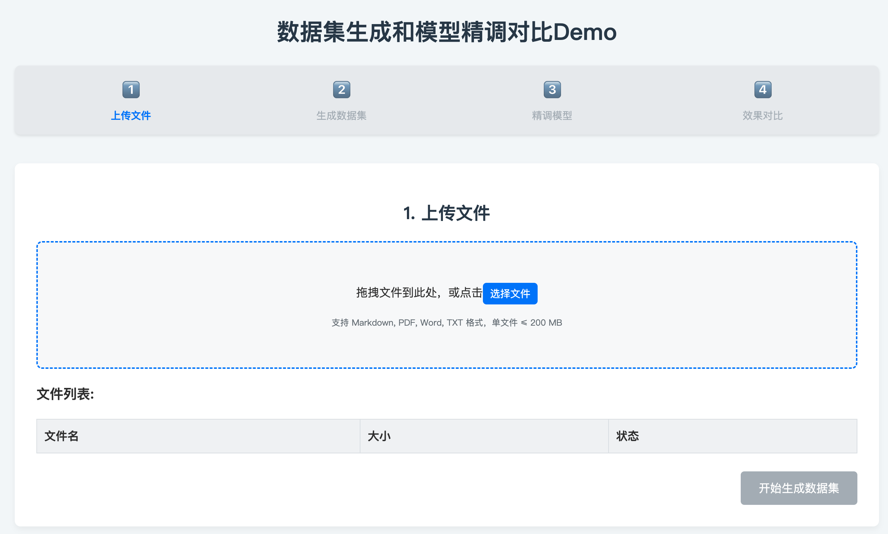

# 对话式数据精炼智能体产品需求文档

## 1. 产品定位

对话式数据精炼智能体将企业原始数据转化为可追溯、可度量、可版本化的数据集，供检索增强、模型训练和多模态应用使用。用户只需接入数据并描述目标，系统完成数据画像、工作流规划、执行、质量评估与反馈迭代。

核心目标是用可运行的最小闭环展示：杂乱文档在短时间内变为可使用的数据集，且用户能够查看质量指标、处理血缘和版本，并通过反馈改进处理策略。

## 2. 用户与使用链路

| 角色 | 任务 |
|---|---|
| 数据提供者 | 上传或连接原始数据，并选择处理范围 |
| 任务参与者 | 通过对话描述目标、约束和反馈，查看结果 |
| 数据使用者 | 导出数据集，或将其供给知识库、检索、模型训练等下游能力 |

~~~text
选择数据 → 描述目标 → 数据画像 → 生成工作流 → 执行处理
→ 质量评估与结果预览 → 自然语言反馈 → 调整并重跑 → 版本化交付
~~~

### 2.1 目标澄清

用户以自然语言描述目标，例如从文档中提取指定字段、清除敏感信息、清洗重复内容或形成可检索知识单元。系统对模糊需求追问，最终得到输出格式、质量约束、数据范围和可接受处理方式。

### 2.2 数据画像与规划

Profiler 对原始文件进行一次初步扫描，提取类型、语言、文本规模、结构、表格特征、潜在敏感信息和 OCR 需求等信号。系统结合数据画像与用户意图，按规则匹配流程模板；复杂任务可由多个专长模块协作规划处理节点。

### 2.3 执行、评估和迭代

系统按规划流程调用解析、清洗、抽取、OCR、去重、嵌入和导出能力。每一步输出处理摘要和指标；完成后，系统呈现样例数据、质量指标和问题清单。用户的自然语言反馈会被映射到相关节点，形成新版本流程并重新执行，不覆盖旧版本。

## 3. 系统模块

| 模块 | 输入 | 输出 | 职责 |
|---|---|---|---|
| 数据接入与 Profiler | 原始文件或数据连接 | 数据画像 | 接入数据，扫描结构与质量信号 |
| 意图识别 | 用户对话 | 任务目标与约束 | 澄清数据目标、输出规格和质量要求 |
| 工作流规划 | 意图、数据画像 | 处理计划 | 规则匹配或多模块协作生成节点序列 |
| Manifest 管理 | 全链路事件 | 统一元数据记录 | 记录数据特征、决策、执行、质量和版本 |
| 解析执行 | 工作流、原始数据 | 结构化数据单元 | 调用解析、OCR、清洗、抽取、嵌入等工具 |
| 质量评估 | 处理结果 | 质量报告 | 计算准确性、完整性、一致性及任务指标 |
| 反馈调整 | 用户反馈、Manifest | 新工作流版本 | 定位问题、更新节点并重跑 |
| 版本与输出 | 数据集、Manifest | 可交付版本 | 导出、访问控制、下游消费与回溯 |

## 4. Manifest：统一处理记录

Manifest 是每份数据单元的统一事实来源，贯穿画像、规划、执行、评估、反馈与版本化。所有模块读取既有记录并追加自己的结果，以支持审计、复现、比较和回滚。

### 4.1 基础字段

| 字段类别 | 示例内容 |
|---|---|
| 文件标识 | 唯一标识、校验值、来源、文件类型 |
| 结构摘要 | 文本规模、页或块边界、表格结构、语言 |
| 风险与质量 | 潜在敏感信息、OCR 需求、缺失或异常信号 |
| 任务定义 | 用户目标、输出规格、质量约束 |
| 处理计划 | 工作流模板、节点顺序、节点参数与选择依据 |
| 执行记录 | 节点输入输出摘要、耗时、状态、错误与重试 |
| 质量评估 | 覆盖率、完整性、字段准确性、一致性与抽样结果 |
| 版本信息 | 版本号、生成时间、质量评分、父版本与数据血缘 |

### 4.2 演进规则

- 核心画像在写入后保持可追溯；后续变化以新记录或扩展项表达。
- 每个工具或模块在独立命名空间写入执行结果，避免互相覆盖。
- 处理策略调整、重新解析和重新分段均生成可比较的新版本记录。
- Manifest 必须能回答：输出来自哪些源数据、经过哪些步骤、使用了哪些参数、为何得到当前结果。

## 5. 功能需求

### 5.1 数据接入与画像

- 支持从已接入的数据源选择一个或多个文件、文件夹或数据对象。
- 依据文件类型自动标记文本、扫描件、表格、图片及其他处理特征。
- Profiler 优先复用首次扫描结果，除非流程明确要求重新读取或执行 OCR。
- 用户在任务面板中可查看待处理对象、处理状态和初步标签。

### 5.2 意图识别与工作流规划

- 用户以自然语言描述处理目标、输出格式、质量门槛和隐私要求。
- 系统对未明确的关键约束追问，例如目标字段、匿名化范围、输出结构或验收口径。
- 简单任务由规则路由匹配标准模板；复杂任务生成可审阅的处理计划。
- 计划需显示主要节点及其顺序，例如解析、OCR、切分、增强、去重、指标计算与导出。
- 当推荐计划涉及敏感信息处理、覆盖既有结果、外部写入或成本显著的执行时，必须先显示影响范围并要求用户确认；低风险只读分析可直接执行。

### 5.3 处理执行

支持的基础处理节点包括：

| 节点 | 输入 | 输出 |
|---|---|---|
| 文档 / 表格 / 图像解析 | 原始内容 | 文本、表格、图片块与元数据 |
| OCR | 图像或扫描页 | 可编辑文本与识别置信信息 |
| 文本清洗 | 文本块 | 标准化内容、规则命中与异常记录 |
| 敏感信息处理 | 文本或结构化字段 | 脱敏结果与处理摘要 |
| 字段抽取 | 半结构化内容 | 结构化字段与置信信息 |
| 切分与增强 | 文本内容 | 知识单元、上下文与索引字段 |
| 去重与分类 | 数据单元 | 去重结果、标签、关联信息 |
| 嵌入与导出 | 处理结果 | 向量、数据集和下游可用输出 |

- 运行时展示总体进度、节点状态、成功和失败对象数。
- 某个文件或节点失败时，需保留错误原因和范围，不以整体任务失败掩盖局部问题。
- 用户可查看数据样例和节点输出摘要，但无需操作内部工具细节。

### 5.4 质量评估

质量报告至少包含：

- 处理覆盖率与成功率；
- 字段完整性、格式一致性和重复情况；
- 解析或 OCR 的异常项与待人工确认项；
- 任务相关的正确性抽样或规则校验；
- 与上一版本相比的变化和质量趋势。

系统不得把缺少依据的推断当作数据事实；当质量不足或结论不可确认时，应在结果中明确标识。

### 5.5 反馈闭环

- 用户可直接指出字段缺失、匿名化不完整、格式不符或分类错误等问题。
- 系统根据 Manifest 定位影响节点，提出修改策略并记录其理由。
- 调整后的流程创建新版本，用户可比较处理计划、指标和输出样例。
- 用户保有最终决策权，可要求解释某一步、继续调整或保留当前版本。
- 自动调整前后应明确展示受影响文件、节点、参数和质量变化；无法判定改动收益时，不把建议表述为已验证的提升。

### 5.6 版本与交付

每次完成的处理结果与对应 Manifest 形成一个版本。版本必须记录生成时间、流程摘要、质量结果、父版本和血缘。用户可下载结果或通过受控接口将其提供给知识库、检索、向量库或模型训练流程；访问控制继承或映射自原始数据权限。

## 6. 页面与交互

| 页面 | 内容 |
|---|---|
| 对话工作区 | 目标澄清、计划说明、进度反馈、结果问答和用户反馈 |
| 数据任务面板 | 选择的数据对象、类型标签、处理状态和异常项 |
| 工作流视图 | 规划节点、依赖关系、运行状态与节点输出摘要 |
| 数据样例 | 原始与处理结果对照、抽取字段、异常定位 |
| 质量面板 | 指标、问题清单、抽样结果和版本对比 |
| 血缘与版本 | 输入来源、处理路径、版本关系、导出与回滚入口 |

## 7. 验收标准与限制

### 验收标准

- 用户可从已接入数据中选择对象，并通过对话完成目标澄清。
- 系统能够生成并展示处理计划，执行时反馈节点级进度与异常。
- 输出包含可查看样例、质量报告、Manifest 记录和可追溯版本。
- 用户反馈可形成可比较的新版本，而非覆盖既有结果。
- 下游使用者可在权限范围内获得数据集和其血缘说明。

### 限制与待确认项

- Manifest 核心字段的可变更边界和跨版本合并策略需要进一步定义。
- 多智能体规划的成本、失败降级策略和人工确认节点需在实现阶段明确。
- 质量指标因数据类型和任务而异，不能以单一分数替代业务验收。
- 高敏感数据的脱敏规则、权限继承、留存和审计要求需由治理规范约束。
