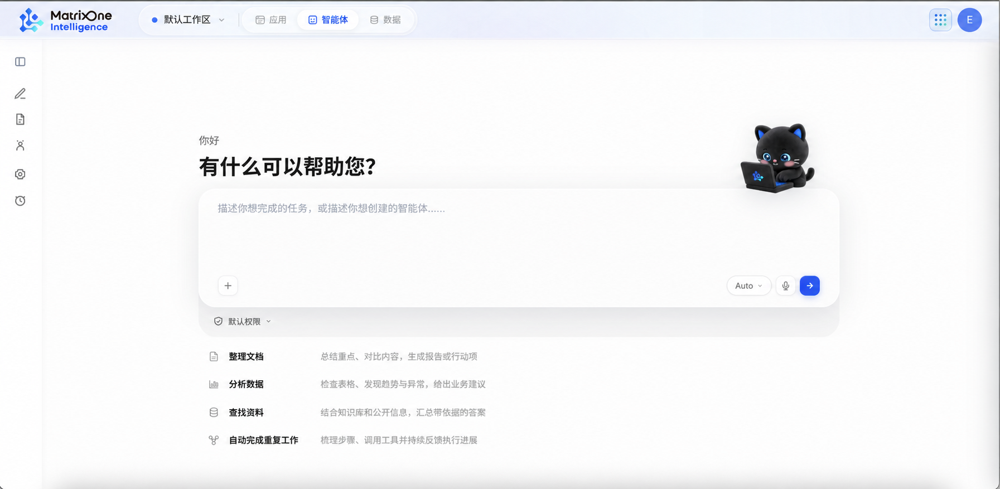

# 智能体工作台产品需求文档

## 1. 产品目标

智能体工作台以对话作为任务入口，将智能体、技能、工具、知识库、自动化和成果组织在同一工作区。用户可以直接描述任务、补充资源并跟进执行，也可以创建可复用的专属智能体；任务生成的文件可在成果页统一查找。

### 目标

- 让用户从自然语言任务开始，而不必先理解底层能力配置。
- 将平台资源、自建资源和会话临时资源清晰区分。
- 支持任务执行、结果沉淀、复用、评测和自动化的完整闭环。
- 对删除、外部写入、外部发送等高影响动作提供可见的范围与确认。

### 非目标

- 不定义模型部署、执行引擎、底层接口协议与内部数据结构。
- 不覆盖工作区、组织权限、计费、运营后台和完整发布流程。
- 语音输入、评测和部分广场能力可作为后续迭代项，不影响核心工作台闭环。

## 2. 用户与核心对象

| 用户 | 主要任务 |
|---|---|
| 任务使用者 | 描述任务、上传文件、添加资源、追问并获取结果 |
| 智能体创建者 | 创建、配置、测试和维护专属智能体 |
| 自动化使用者 | 将重复任务配置为定时或规则触发，并查看执行记录 |
| 管理者 | 管理默认模型、平台资源和可用权限范围 |

| 对象 | 定义 |
|---|---|
| 普通会话 | 不绑定专属智能体的任务会话，保存后进入“最近” |
| 智能体会话 | 与一个专属智能体关联的会话，按智能体分组展示 |
| 平台智能体 | 平台提供的只读智能体，可查看详情和直接使用 |
| 我的智能体 | 用户创建的智能体，可编辑、删除和配置资源 |
| 会话临时资源 | 当前对话添加的技能、工具、知识库或文件；不改变智能体配置 |
| 成果 | 已保存会话生成的文件，包含来源会话与来源智能体信息 |
| 自动化任务 | 绑定智能体、模型、指令和触发规则的重复执行任务 |

## 3. 信息架构

| 一级入口 | 子页面 | 主要能力 |
|---|---|---|
| 新对话 | 首页、会话页 | 发起任务、补充资源、持续追问、查看会话上下文 |
| 成果 | 文件列表、预览 | 按类型或智能体筛选、预览、下载输出文件 |
| 智能体 | 智能体广场、我的智能体 | 浏览、使用、创建、编辑、删除智能体 |
| 评测 | 评测集、评测任务 | 维护样本、运行评测、比较版本与分数 |
| 资源中心 | 技能、工具、知识库 | 浏览平台资源、管理自定义资源与知识库 |
| 自动化 | 规则列表、历史记录 | 创建、启停、编辑、删除和查看触发记录 |
| 会话列表 | 置顶、智能体、最近 | 返回历史会话、重命名、置顶、删除 |

页面由顶部工作区导航、左侧功能与会话导航、中央工作区、会话快捷侧栏和右侧任务面板组成。会话中“产物、子智能体、任务”属于当前对话上下文，不与资源中心的可复用资源混合。

## 4. 新对话与任务执行

### 4.1 首页

首页提供问候语、任务输入框、资源添加入口、模型选择、权限选择和通用任务引导。

- 问候语在未取得显示名时使用通用欢迎语；不在界面文案中暴露账号信息。
- 输入框支持多行自然语言；用户可使用发送按钮或快捷键提交。
- 首页任务引导面向整理文档、分析数据、查找资料、自动完成重复工作等任务类型。点击后只填充示例，不自动发送。
- 默认由通用工作助手承接任务；行业或专属智能体通过智能体入口选择。
- 默认模型由后台配置；用户可在允许范围内切换模型。

### 4.2 添加内容

“添加”菜单按文件、智能体、工具、技能、知识库提供入口。

| 内容 | 规则 |
|---|---|
| 文件 | 显示在输入区上方；发送后可在当前会话的上传区查看 |
| 智能体 | 单选；再次选择视为切换；取消选择后回到通用工作助手 |
| 技能 / 工具 / 知识库 | 以不可逐字编辑的资源引用插入输入内容；可整体移除 |

- 单次会话添加的技能、工具、知识库只在当前会话生效。
- 已选资源的名称随用户任务一起发送，便于用户与系统识别本次调用范围。
- 智能体选择菜单支持搜索；选择动作不自动发送消息。
- 资源引用应显示来源和可用状态；资源被删除、下架或失去授权后，不再允许新任务调用，但历史消息保留资源名称与不可用原因。
- 文件附件在发送前可移除；发送后作为会话输入保留。删除会话不应删除用户在其他位置仍可访问的原始文件。

### 4.3 权限与执行

默认以受限权限执行。用户切换至高权限模式时，必须看到风险提示，并通过明确确认后才能启用；每次切换均需确认。会话过程中允许调整权限。

执行流程：

~~~text
输入任务与资源 → 选择智能体 / 模型 / 权限 → 发送任务
→ 对话内反馈处理进度 → 文字回复或输出文件 → 继续追问或补充资源
~~~

用户发送第一条消息后，系统创建并保存会话；仅打开新对话、添加资源或输入但未发送时，不创建历史记录。

## 5. 成果

成果页汇总已保存会话生成的文档、表格、演示文稿和其他输出文件。

### 列表与筛选

- 默认按生成时间倒序展示。
- 支持按文件类型、来源智能体和关键词筛选。
- 每项至少展示文件名、文件类型、生成时间、来源会话和来源智能体。
- 支持预览、下载并返回列表。

### 生命周期

- 成果来自会话输出，不等同于用户上传的原始文件。
- 删除来源会话后，对应成果不再在成果页展示。
- 成果页不在本期内承担分享、协作、权限设置或文件编辑能力。

## 6. 智能体

### 6.1 智能体广场

广场用于浏览平台提供的智能体。列表支持搜索和筛选；详情展示名称、描述、适用任务、能力与可用资源。平台智能体只读，不提供创建和编辑入口；用户点击“使用”后进入新对话并预选该智能体。

### 6.2 我的智能体

我的智能体用于管理用户自建能力。列表展示名称、描述、更新时间和关联资源，支持搜索、查看详情、使用和删除。

创建流程：

1. 用户描述智能体目标、输入、期望结果和约束。
2. 系统对缺失信息进行追问，但不重复询问已给出的信息。
3. 信息足够后，展示待确认方案，包括任务目标、系统提示词、技能、工具与知识库。
4. 用户确认后创建；用户可取消候选方案并返回继续修改。

用户可修改名称、描述、系统提示词和绑定资源。删除前必须说明其关联会话和自动化任务将一并删除，并二次确认。

### 6.3 评测集与评测任务

评测集用于保存评测样本，支持上传、搜索、查看详情、新增、编辑、删除样本及删除评测集。评测任务绑定智能体候选版本与评测集，支持创建、筛选、排序、暂停、继续、查看详情和删除，并显示进度、版本、分数与结果摘要。

## 7. 资源中心

资源中心统一提供技能、工具和知识库管理。市场资源与自定义资源在同一能力域内分开呈现。

| 能力域 | 平台资源 | 用户资源 |
|---|---|---|
| 技能 | 技能市场：浏览、搜索、查看详情，只读 | 自定义技能：上传或通过对话创建、编辑、删除 |
| 工具 | 工具市场：浏览、连接、测试、查看详情，只读 | 自定义工具：创建、配置、测试、编辑、删除 |
| 知识库 | — | 创建、搜索、查看详情、维护与删除 |

- 列表的搜索、筛选、分页和空状态保持一致。
- 删除自定义资源前，系统需提示其被哪些智能体引用；已存在的历史会话仍应可理解，后续会话不可再添加已删除资源。
- 知识库详情不展示与任务无关的内部状态字段。

## 8. 自动化

自动化用于将智能体任务按时间或规则执行。页面包含规则列表、历史记录和当日触发流。

### 8.1 创建与管理

创建自动化时需配置智能体、模型、任务指令、触发频率、时间与启停状态。规则列表支持搜索、筛选和分页；用户可编辑、暂停、恢复和删除任务。历史记录按时间倒序展示，记录触发时间、运行状态、耗时和结果入口。

### 8.2 边界

- 外部发送、写入业务系统或其他高影响动作需遵循当前权限与确认规则。
- 失败重试、通知对象、长期留存和跨工作区可见性为待确认项。
- 自动化每次运行必须生成可查看的执行记录，包含触发原因、使用的智能体与资源版本、状态、耗时、输出摘要和错误说明；记录不得包含凭据、提示词或受限文件正文。

## 9. 会话管理

### 9.1 分区与排序

左侧会话区固定按“置顶、智能体、最近”排序：

| 分区 | 内容 | 排序 |
|---|---|---|
| 置顶 | 用户置顶的任意已保存会话 | 最近活动时间倒序 |
| 智能体 | 按专属智能体分组的未置顶会话 | 分组由用户拖拽排序；组内按最近活动时间倒序 |
| 最近 | 通用工作助手与未选专属智能体的会话 | 最近活动时间倒序 |

- 空分区不显示标题或占位。
- 智能体分组默认展示最近 5 条会话，可通过“更多”展开全部并再次收起。
- 新会话只进入其所属分组首位，不应导致已有智能体分组自动跳动。
- 用户可拖拽调整智能体分组顺序，系统保存该个人偏好。
- 置顶会话只在置顶区显示一次；取消置顶后回到原归属区。

### 9.2 单条会话

| 操作 | 规则 |
|---|---|
| 打开 | 进入相应对话；仅浏览不改变最近活动时间 |
| 置顶 / 取消置顶 | 在置顶区与原归属区之间移动，不修改会话内容或资源 |
| 重命名 | 空名称不保存，不影响排序 |
| 删除 | 二次确认；删除会话及消息，不删除关联智能体、技能、工具或知识库 |

智能体停用、下架或授权失效时，历史会话保留可读；若无法继续发送，输入区应展示原因与下一步操作。加载或保存失败时，保留已可读取内容并提供重试入口。

## 10. 生命周期与验收

### 关键生命周期

| 操作 | 影响 |
|---|---|
| 删除会话 | 删除消息；来源成果不再展示；不删除关联资源 |
| 从侧栏移除智能体分组 | 仅隐藏分组；不删除智能体、历史会话或自动化 |
| 删除我的智能体 | 删除智能体、关联会话和自动化；关联成果不再展示 |
| 删除自定义资源 | 阻止新会话继续引用；保留历史会话的可解释性 |

### 验收重点

- 用户能从首页提交任务、添加文件和会话资源，并在会话中获取回复或成果。
- 未发送内容不会产生历史会话；已发送会话即使执行失败也可返回查看和重试。
- 平台智能体和我的智能体在权限、可编辑性与删除影响上清晰区分。
- 成果可按类型和智能体检索、预览和下载，并随来源会话删除而消失。
- 会话列表正确实现置顶、分组、排序、展开、重命名与删除规则。
- 自动化任务可创建、启停、编辑、删除并查看触发历史。
