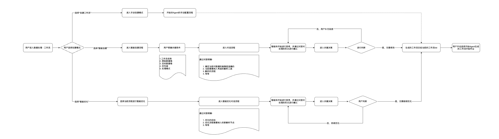

# MOI 4.0 Agent 产品需求文档

## 1. 产品目标

MOI 4.0 Agent 将“创建工作流”从配置驱动改为意图驱动：用户从首页的智能创建入口描述目标、选择或上传原始数据，系统基于数据画像优先匹配可靠模板；必要时才生成可视化工作流草案，并由用户确认采纳后进入工作流中心执行。

本期定位是路由、理解和结果判断，不把复杂 ETL 编排作为默认交互。对常见文件解析场景，系统优先采用预置超级节点或模板；只有模板无法覆盖且置信度不足时，才进入工作流搭建回退路径。

## 2. 用户旅程

~~~text
首页快速入口 → 智能创建 → 填写目标与选择数据
→ 数据画像 → 模板匹配 / 生成草案 → 用户确认采纳
→ 跳转工作流中心执行 → 查看结果与智能优化
~~~

| 阶段 | 用户操作 | 系统行为 |
|---|---|---|
| 进入 | 点击智能创建 | 展示 Beta 能力说明与创建入口 |
| 基础信息 | 描述目标、选择输入和目标数据位置 | 校验必填信息，保存可编辑草稿 |
| 数据选择 | 选择已有原始数据卷或本地上传 | 默认选中所选卷的全部内容；本地文件自动创建原始数据卷 |
| 理解与路由 | 确认任务 | 提取文件特征、识别意图、匹配模板或生成工作流草案 |
| 采纳 | 查看并确认建议 | 确认后生成工作流并进入工作流中心；拒绝后继续对话调整 |
| 优化 | 对现有工作流提出优化需求 | 根据最新处理信息与目标生成可确认的优化分支 |

## 3. 快速入口与创建流程

### 3.1 首页入口

- 首页导航提供“智能创建”入口，与手工创建工作流并列。
- 入口展示能力摘要；Beta 标记用于提示试用范围和说明，而非隐藏产品限制。
- 用户点击入口后进入对话式创建流程。

### 3.2 三步创建

| 步骤 | 内容 | 规则 |
|---|---|---|
| 1. 任务目标 | 名称、业务目标、期望输出和约束 | 用户可在进入下一步前修改；系统仅追问缺失关键信息 |
| 2. 原始数据 | 选择已有数据卷或上传本地文件 | 对选中的卷默认全选；上传完成后提示数据已创建并可在载入页查看 |
| 3. 目标位置 | 选择或创建处理结果位置 | 用于承接工作流输出并支持后续检索、分析或复用 |

- 本地上传形成独立原始数据卷，名称应避免冲突并具备可识别的时间或唯一标识。
- 基础信息完成后可回退编辑；编辑后需刷新受影响的路由建议。
- 未提交的草稿不应被误认为正式工作流。

## 4. Agent 行为与路由

### 4.1 输入

Agent 基于以下信息工作：用户任务、原始文件或数据卷、Profiler 输出、现有工作流与最近处理结果。

### 4.2 决策优先级

1. 匹配已验证的模板解析流程。
2. 使用通用解析能力完成可覆盖的常见任务。
3. 当上述方式无法满足需求或置信度不足时，生成可编辑的工作流草案作为回退。

### 4.3 对话规则

- 明确告知用户系统理解到的任务、数据范围和建议路径。
- 模板命中时，展示模板概要、输入输出与预期结果，请求“确认采纳”后再创建或执行。
- 回退到工作流搭建时，展示节点、顺序、关键参数和低置信原因；用户可以要求增删节点后再次确认。
- Agent 不应在未经确认的情况下对外执行高影响操作或覆盖已有工作流。
- 本期聚焦核心信息，不要求保存完整闲聊历史；任务事实和关键决策通过 Manifest 记录。

## 5. 工作流与智能优化

### 5.1 生成与查看

用户确认方案后，系统生成或更新工作流，并引导进入工作流中心。工作流页面展示输入、输出、节点、运行状态、处理样例和错误信息。用户可以查看已采纳方案的来由与当前版本，而不是只看到不可解释的节点图。

### 5.2 智能优化

智能优化基于现有工作流的分支创建，不直接覆盖主版本。系统参考：

- 用户目标与新反馈；
- 最新解析结果与异常；
- 现有流程配置和执行历史；
- Profiler 与 Manifest 的结构、质量和风险信号。

优化输出为可确认的变更草案。用户确认后运行新分支，并比较结果、质量和成本；拒绝则保留当前工作流不变。

## 6. 结果、边界与验收

### 6.1 结果反馈

执行过程中展示进度、节点状态和可理解的阶段性信息。完成后展示输出数据、质量摘要、异常和可继续优化的建议。用户能返回数据与工作流页面查看全量结果。

### 6.2 验收标准

- 用户能从首页进入智能创建，完成目标、原始数据和输出位置配置。
- 已有数据卷和本地上传都能成为创建输入；本地上传后可在数据载入中定位。
- Agent 能在模板、通用解析和回退工作流之间按置信度路由，并在执行前征得确认。
- 生成的工作流可在工作流中心查看和运行；优化通过新分支表达，不覆盖原流程。
- 对话显示理解、建议、确认与结果，避免把复杂节点配置作为用户的默认负担。

### 6.3 限制

- 模板覆盖范围、置信度阈值与回退触发条件需由实际场景持续校准。
- 复杂工作流自动生成仍需支持人工审阅和修改。
- 图片、扫描件和高度非标准化文档的解析质量依赖底层工具能力，需在结果中给出异常提示。
