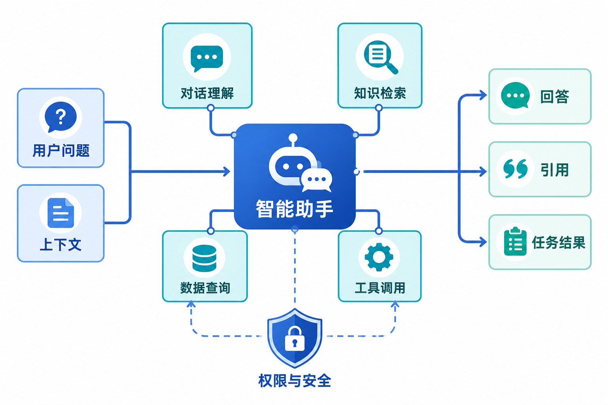

# MOI 产品小助手需求文档

## 1. 产品目标

MOI 产品小助手是面向产品使用问题的中文帮助助手。它基于官方帮助文档、常见问题和教程，回答功能操作、产品概念、常见故障和最佳实践，并为可引用的结论提供原文出处。

## 2. 服务范围

| 支持 | 不支持 |
|---|---|
| 产品功能操作说明 | 索取密码、密钥或个人身份信息 |
| 已知问题与排查步骤 | 账户隐私、计费和需后台操作的复杂问题 |
| 产品术语与概念解释 | 与产品无关的开放式闲聊或内容创作 |
| 基于文档的最佳实践 | 没有资料依据的猜测与编造 |

小助手在平台相关入口提供一致服务，不因用户从不同页面进入而产生不同身份或不同知识范围。

## 3. 知识与更新链路

~~~text
官方帮助文档与教程 → 解析与入库 → 产品知识库
                         ↑
              文档仓库变更触发重新解析与更新
                         ↓
                   小助手检索并流式回答
~~~

- 知识库内容从官方文档解析、处理并入库，端到端使用产品提供的数据能力。
- 文档仓库新增、修改或删除时触发相应内容重新解析与更新，保证回答基于当前资料。
- 集成过程中记录调用痛点，形成 API 或产品改进建议作为交付物。

## 4. 回答规则

### 4.1 基础原则

- 只依据官方知识库回答；资料无法支持时，明确说明无法确认。
- 语气友好、专业、简洁；复杂操作使用清晰的编号步骤。
- 关键按钮、页面和术语使用一致命名，避免用户难以在界面中对应。
- 回答以流式方式输出，并在完成前保持可理解的加载状态。

### 4.2 引用与转人工

- 当结论主要来自某一篇或多篇帮助文档时，在回答末尾提供可访问的来源引用。
- 不暴露内部链接、内部账号或文档管理地址；对外仅呈现适合用户访问的帮助中心入口。
- 遇到账户隐私、计费、后台故障或超出知识范围的问题，明确说明限制，并引导用户联系人工支持。

### 4.3 安全与边界

- 不主动询问、收集或复述密码、API Key、身份凭据等敏感信息。
- 不将检索结果中未被资料支持的推论表达为产品事实。
- 对产品无关的问题礼貌拒绝，并将对话引导回产品使用支持。

## 5. 需求与验收

| 优先级 | 需求 |
|---|---|
| P0 | 完成从官方文档解析到知识库入库的端到端集成 |
| P0 | 文档源变更自动触发知识库更新 |
| P0 | 在产品相关入口提供一致的中文小助手入口 |
| P1 | 回答末尾提供相应公开帮助资料的来源引用 |
| P1 | 流式输出、无答案说明和转人工引导 |

验收时应验证：文档更新后回答能反映新内容；每个有依据的关键答案可定位来源；无答案、敏感问题和超出范围问题均按边界规则响应；助手不要求用户提供敏感信息。
