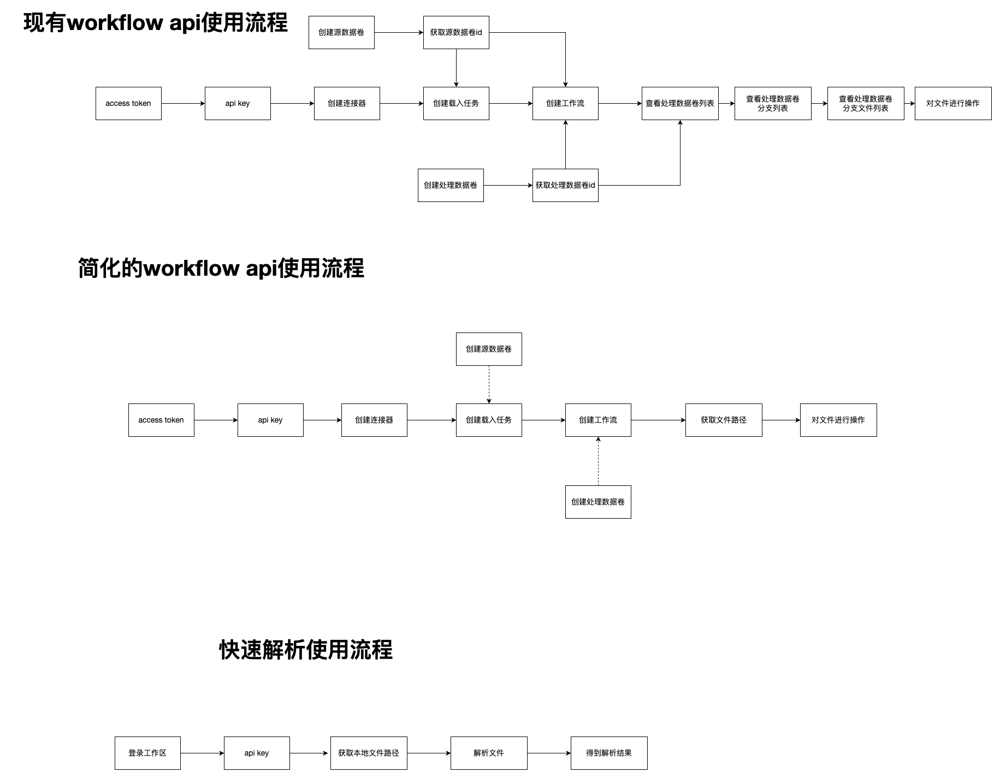

# API 路径寻址与告警能力产品需求文档

## 1. 产品目标

用稳定、可读的 Catalog 路径替换外部调用中的内部数据卷和文件 ID，并补齐工作区告警与数据块说明 API，降低 API 编排成本和资源发现难度。

## 2. 路径寻址规范



资源的内部 ID 仍可在响应中返回，但外部请求优先使用完整路径。

```text
/source-volumes/<volume-name>/<optional-folders>/<file-name>
/processed-volumes/<volume-name>/<optional-folders>/<file-name>
```

| 场景 | 使用路径字段 |
|---|---|
| 创建处理数据卷 | `parent_volume_path` + `name` |
| 创建/修改工作流 | `source_volume_paths`、`target_volume_path` |
| 创建作业 | `target_volume_path`、文件 `catalog_path` |
| 列出分支卷 | `parent_volume_path` |
| 查询/删除文件 | `file_path` |
| 文件原始内容、关联作业、数据块 | `file_path` |

示例中的路径仅使用通用占位符：`/processed-volumes/<volume>/<file>`。

## 3. Catalog 与文件 API

| 操作 | 方法与路径 | 关键参数 |
|---|---|---|
| 查看目录 | `GET /catalog` | 可选父路径、分页 |
| 创建处理卷 | `POST /processed-volumes` | `parent_volume_path`、`name` |
| 列出分支卷 | `GET /processed-volumes/branches` | `parent_volume_path` |
| 列出卷文件 | `POST /files/list` | `volume_path`、筛选、分页 |
| 删除文件 | `DELETE /files` | `file_path` |
| 下载原始内容 | `GET /files/raw-content` | `file_path`、`need_embeddings` |
| 查询关联作业 | `GET /files/associated-jobs` | `file_path` |
| 查询数据块 | `POST /files/blocks` | `file_path`、搜索与分页 |
| 删除数据块 | `DELETE /files/blocks` | `file_path`、块 ID 数组 |

工作流元数据与作业元数据可继续使用内部工作流/作业 ID，但它们引用数据卷和文件时必须使用路径。

`GET /catalog` 返回当前调用者有权访问的目录树或指定父路径下的直接子项；每个项至少包含 `name`、`path`、`resource_type`、`has_children` 和更新时间。文件列表和数据块列表统一接受 `page`、`page_size`，并返回 `items`、`total`、`page`、`page_size`；不允许客户端依赖内部 ID 拼接后续路径。

对文件的变更接口必须区分资源不存在（404）、路径存在但无权限（403）、资源正被任务使用（409）和参数不合法（400）。`DELETE /files/blocks` 需返回请求块数、实际删除数与未删除原因；重复删除同一块时应以已删除/不存在的明确结果收敛，不能静默删除其他块。

## 4. 告警 API

### 4.1 通知对象

支持创建、查询、修改、删除通知对象。对象定义接收渠道、接收地址、启用状态和描述；敏感渠道配置需脱敏返回。

通知对象的输入包含 `name`、`channel_type`、`destination` 和可选 `description`；查询支持按名称或脱敏后的接收信息模糊筛选。创建/更新返回 `id`、名称、渠道、脱敏接收信息、描述、创建/更新时间。删除成功可返回 204；被告警规则引用时返回 409 并给出受影响规则数量。

### 4.2 告警规则与记录

| 资源 | 操作 |
|---|---|
| 告警规则 | 创建、列表、查看、删除 |
| 告警记录 | 按时间、状态、规则、严重级别查询 |

规则需关联监控条件、阈值、持续时间、通知对象和启用状态。告警记录返回触发时间、恢复时间、当前状态和相关资源路径。

规则还应包含 `category`（数据载入或数据处理）、`expression`、`severity`（紧急、重要、提示）、`notify_once` 与 `notification_recipient_ids`。规则状态允许启用、永久禁用和临时禁用；临时禁用必须携带到期时间，到期后自动恢复启用。告警记录支持按规则、表达式、级别、开始/结束时间和状态分页筛选，至少返回记录 ID、规则 ID、规则名称、级别、触发时间、恢复时间与实际通知对象。

## 5. 类型与层级说明

提供只读说明 API，返回解析块的 `type` 与 `level` 枚举说明，帮助调用方正确理解文本、标题、图片、表格等不同块的语义及其层级值。

基础枚举至少覆盖 `text`、`image`、`title`：图片的 `level` 可表示 OCR 或 caption，标题的 `level` 表示 1、2、3 等标题层级。说明 API 返回枚举值、展示名称和解释，不与具体文件内容混用。

## 6. 验收标准

| 编号 | 验收项 |
|---|---|
| AC-01 | 数据卷、文件和工作流配置均可用完整路径寻址。 |
| AC-02 | 文件 API 不要求调用方先查询内部文件 ID。 |
| AC-03 | Catalog API 可用于发现可访问路径。 |
| AC-04 | 通知对象、告警规则和告警记录 API 支持完整生命周期管理。 |
| AC-05 | 调用方可获取块类型与层级的标准说明。 |
