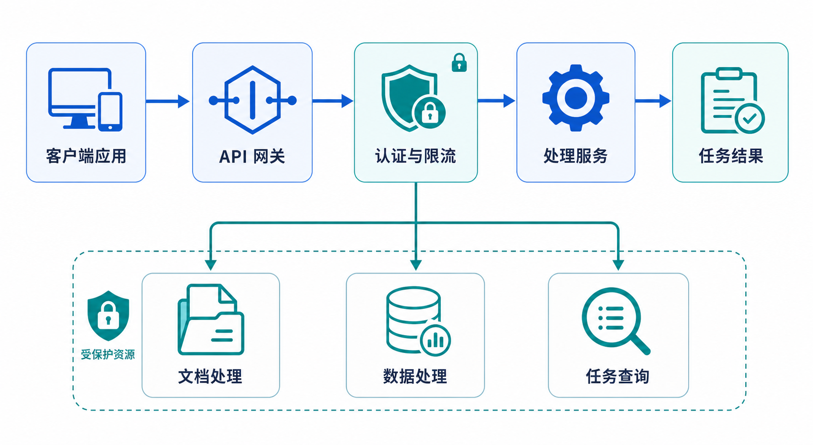

# 平台核心 API 产品需求文档

## 1. 产品目标

为连接器、数据载入、工作流、作业和数据卷提供一致的 API。创建操作必须返回资源标识或路径，避免调用方额外查询；工作流组件采用稳定类型标识，不暴露会变化的内部实例编号。



## 2. 全局规范

| 项目 | 规则 |
|---|---|
| 基础地址 | https://api.example.com（文档示例，不代表真实环境） |
| 认证 | `Authorization: Bearer <access-token>` 或 `X-API-Key: <api-key>` |
| 请求 | JSON；上传文件使用 `multipart/form-data` |
| 响应 | 成功返回 `data`，失败返回稳定错误码与可读消息 |
| 分页 | `page`、`page_size`；响应包含 `total` |
| 异步任务 | 返回任务 ID、状态与资源路径 |

```json
{
  "code": "OK",
  "message": "success",
  "data": {}
}
```

### 2.1 认证

支持用户名密码换取短期访问令牌和刷新令牌；访问令牌过期前可用刷新令牌换取新令牌。长期集成优先使用可独立轮换的 API 密钥。认证响应不得在日志、浏览器地址栏或错误消息中泄露凭证。

登录请求包含工作区/账户上下文、用户名和密码；成功响应返回用户标识与过期时间，短期令牌可通过响应头或受保护响应字段交付。刷新请求必须同时校验访问令牌、刷新令牌和用户上下文；刷新失败不应透露凭证是否存在。后续接口统一从认证头读取身份，不接受把管理员密码作为业务请求参数的替代方案。

列表接口默认采用 `page`、`page_size`，响应中必须回显 `page`、`page_size`、`total` 和 `items`。对于保留 `offset` 的历史接口，服务端需要明确转换规则，不能在同一响应中混用两套游标含义。

## 3. 接口目录

| 模块 | 接口 | 核心操作 |
|---|---|---|
| 鉴权 | /auth/login、/auth/refresh | 登录、刷新访问令牌 |
| 连接器 | /connectors/create、/validate、/list、/update、/files/list | 创建、测试、查询、更新、浏览源文件 |
| 数据载入 | /task/create、/list、/get、/update、/delete、/pause、/resume、/retry、/files | 创建、调度、状态控制、失败重试与文件明细 |
| 工作流 | /workflow/create、/list、/details、/update、/delete | 创建、查询、配置更新和删除 |
| 作业 | /job/list、/details、/files/list、/files/reprocess | 执行快照、运行详情、文件明细和失败项重处理 |
| 原始数据卷 | /source-volume/create、/list、/files/list、/files/download、/files/delete | 管理原始文件 |
| 处理数据卷 | /target-volume/create、/list、/files/list、/files/download、/files/blocks | 管理处理结果与块 |
| 指标 | /metric/observe | 上报或查询平台指标 |

### 3.1 鉴权接口

| 接口 | 请求字段 | 响应字段 | 行为要求 |
|---|---|---|---|
| POST /auth/login | account_name、username、password | uid、Access-Token、Refresh-Token、过期时间 | 成功后在响应头返回短期访问令牌和刷新令牌；正文不返回密码。 |
| POST /auth/refresh | Access-Token、Refresh-Token、uid、type | 新 Access-Token、Refresh-Token | 旧令牌仍有效时可刷新；刷新失败必须返回稳定错误码。 |

后续请求携带访问令牌与用户/工作区上下文。服务端日志、浏览器地址栏、异常堆栈和审计导出均不得记录完整凭证。

### 3.2 连接器

| 接口 | 必填输入 | 输出 / 行为 |
|---|---|---|
| POST /connectors/create | name、source_type、config | 返回 connector_id、名称和初始状态。 |
| POST /connectors/validate | source_type，加 connector_id 或 config 二选一 | 返回 valid 与可诊断错误信息。 |
| GET /connectors/list | 分页、筛选条件 | 返回 ID、类型、名称、状态、创建/更新时间、关联任务和脱敏后的配置摘要。 |
| PUT /connectors/update | connector_id、config | 更新配置后返回 ID、状态和更新时间。 |
| GET /connectors/files/list | connector_id、路径、分页 | 返回可选源文件/目录，供载入任务选择。 |

创建连接器需提交名称、数据源类型与对应连接配置。对象存储配置包括 Endpoint、访问凭证、桶名、区域和路径风格。任何查询接口都不得返回完整访问密钥。

源文件列表至少返回 `uri`、`filename`、`size` 和 `type`；类型可区分文本、文档、图片、演示文稿、表格、列式文件、SQL 文件与目录。连接验证使用“已有连接器 ID”或“未保存配置”二选一，二者同时提交时返回 400，验证失败返回可诊断但不含凭证的原因。

### 3.3 载入任务

| 接口 | 核心输入 | 输出 / 行为 |
|---|---|---|
| POST /task/create | connector_id、源文件范围、target_volume、载入模式、周期、过滤规则 | 返回 task_id 与首次执行状态。 |
| GET /task/list | 分页、名称/状态筛选 | 返回任务列表、总数、最近执行时间和状态。 |
| GET /task/get | task_id | 返回任务配置、调度、来源、目标卷和执行汇总。 |
| POST /task/update | task_id 与可变配置 | 更新过滤规则、调度或载入范围；返回新配置快照。 |
| POST /task/pause | task_id | 停止后续调度，不中断已完成记录。 |
| POST /task/resume | task_id | 恢复周期或持续载入。 |
| POST /task/delete | task_id | 删除前校验关联资源和运行状态。 |
| POST /task/retry | task_id、file_ids | 仅重试指定失败文件。 |
| GET /task/files | task_id、状态、分页 | 返回文件级状态、错误、重试次数和处理时间。 |

载入任务声明连接器、源文件范围、目标数据卷、一次或周期模式、过滤规则和冲突策略。文件状态至少覆盖等待、处理中、成功与失败；详情必须提供最近运行时间、成功/失败统计和可定位的错误信息。

周期配置需显式表示执行一次、按分钟、按小时或按天，不允许用魔法数让调用方推断。创建失败的文件应在响应或任务详情中给出 `task_failed_file_ids`；重试请求只能接受失败文件集合。任务状态至少区分可执行/运行中、暂停中、已暂停和已完成，文件状态还需区分等待、上传中、暂停、失败、成功和重试中。

### 3.4 工作流

| 接口 | 核心输入 | 输出 / 行为 |
|---|---|---|
| POST /workflow/create | 名称、源/目标数据卷、文件类型、处理模式、调度、节点配置 | 返回 workflow_id、默认分支/版本和执行状态。 |
| GET /workflow/list | 分页、筛选 | 返回名称、版本、输入输出、状态和最近作业。 |
| GET /workflow/details | workflow_id、版本或分支 | 返回完整节点图、节点参数、依赖关系和执行汇总。 |
| POST /workflow/update | workflow_id、版本、变更后的节点图 | 进行配置校验，返回更新后的工作流快照。 |
| DELETE /workflow/delete | workflow_id | 返回删除结果；历史作业仍可按保留策略查询。 |

工作流声明源数据、目标位置、处理模式、文件类型和节点配置。节点类型使用稳定语义名称，例如 file_parser、text_chunker、ocr、text_embedding；节点参数不得依赖前端生成的实例后缀。

节点定义至少包含节点类型、显示名、输入端口、输出端口、参数、上游依赖、超时与失败策略。创建和更新时必须校验：节点 ID 唯一、依赖无环、端口类型兼容、必填参数完整，且所有输入/输出数据卷在当前工作区可访问。

工作流详情必须返回工作流 ID、名称、源/目标卷、处理模式、文件类型、版本/分支、节点图、创建/更新时间和运行状态。文本分段参数应校验最大块长度的允许范围；清洗、OCR、嵌入和自定义节点各自保留其配置对象，不能压缩成不可解释的自由文本。

### 3.5 作业

作业是工作流的一次执行快照，返回作业 ID、工作流版本、开始/结束时间、处理统计和文件级状态。失败文件支持重新处理，不重复执行成功文件。

| 接口 | 核心输入 | 输出 / 行为 |
|---|---|---|
| GET /job/list | 分页、状态、工作流、时间范围 | 返回作业列表、文件统计、耗时和状态。 |
| POST /job/details | job_id | 返回运行时工作流快照、节点状态、错误和资源统计。 |
| POST /job/files/list | job_id、状态、分页 | 返回每个文件的处理结果、失败节点和错误消息。 |
| POST /job/files/reprocess | job_id、file_ids | 创建重处理动作，只处理失败或用户选中的文件。 |

作业文件列表至少包含 `file_id`、`filename`、`file_type`、`file_status`、失败节点与错误消息，并支持按状态分页。重处理请求必须验证文件属于该作业且处于可重试状态；不满足条件时返回逐文件拒绝原因，不能把成功文件重新排队。

### 3.6 数据卷与文件

| 数据对象 | 接口 | 输入与行为 |
|---|---|---|
| 原始数据卷 | POST /source-volume/create、POST /source-volume/list | 创建卷、查看卷列表与状态。 |
| 原始文件 | POST /source-volume/files/list、POST /source-volume/files/download、DELETE /source-volume/files/delete | 按卷列文件、下载单个文件、删除指定文件。 |
| 处理数据卷 | POST /target-volume/create、GET /target-volume/list | 创建处理卷、查看卷列表与状态。 |
| 处理文件 | POST /target-volume/files/list、POST /target-volume/files/download | 列出处理后的文件、下载导出结果。 |
| 处理块 | POST /target-volume/files/blocks、DELETE /target-volume/files/blocks | 按文件查询文本/图片块，按稳定块 ID 删除。 |

处理块查询至少返回 block_id、块类型、内容或图片引用、上下文内容、解析/OCR 状态、向量状态和所属文件。块删除接口返回请求数、实际删除数和未删除原因。

原始卷和处理卷列表分别返回卷 ID、名称、大小、文件数与状态；文件列表返回文件 ID、名称、类型、状态、路径和更新时间。下载接口以文件流返回内容，并提供安全的文件名；删除原始文件与删除处理块均需明确成功状态（200 或 204）及部分失败信息。

### 3.7 指标接口

POST /metric/observe 用于记录或查询平台指标。请求必须明确指标名称、时间范围、工作区或资源范围、聚合方式；响应返回指标值、单位、统计口径和时间窗口。

## 4. 错误与幂等

| 状态 | 含义 | 调用方动作 |
|---:|---|---|
| 400 | 参数或格式错误 | 修正请求 |
| 401 / 403 | 凭证无效或无权限 | 更新凭证或权限 |
| 404 | 资源不存在 | 检查 ID 或路径 |
| 409 | 名称、版本或状态冲突 | 修改输入或等待状态变更 |
| 429 | 超过速率限制 | 按退避策略重试 |
| 5xx | 服务端错误 | 使用幂等键安全重试 |

创建任务、重试和上传操作应支持 `Idempotency-Key`，避免网络重试产生重复资源或重复处理。

## 5. 验收标准

| 编号 | 验收项 |
|---|---|
| AC-01 | 全部资源按统一的 URL、认证、响应与分页规范提供接口。 |
| AC-02 | 创建连接器、数据卷、载入任务与工作流均直接返回可用标识。 |
| AC-03 | 工作流节点配置不依赖临时实例编号。 |
| AC-04 | 任务和作业提供文件级状态及仅失败项重试能力。 |
| AC-05 | 认证、错误与幂等行为按全局规范执行。 |
