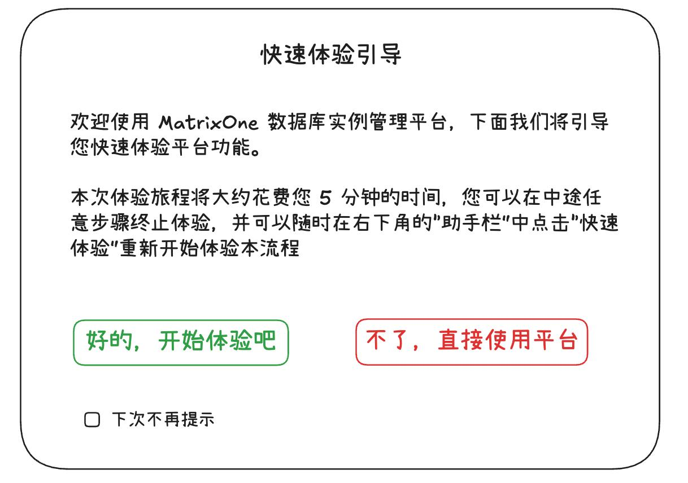

# 数据库实例快速开始产品需求文档

## 1. 产品目标

在用户尚未拥有数据库实例时，以可随时退出的交互引导帮助其创建试用实例、完成首次登录，并体验导入样例数据、SQL 查询、执行分析与历史查询等核心能力。

## 2. 触发与退出

- 仅在实例列表为空时自动触发创建引导。
- 用户可以在任意步骤退出，退出前二次确认。
- 用户可选择下次登录是否再次显示引导；仅在仍无实例时生效。
- 登录后可从助手区域手动再次启动“快速体验”。

## 3. 创建实例引导

| 步骤 | 用户动作 | 引导内容 |
|---:|---|---|
| 1 | 创建实例 | 开始创建数据库实例 |
| 2 | 选择套餐 | 说明试用与生产套餐的资源与计费差异 |
| 3 | 选择云与区域 | 按业务部署位置选择云厂商和地域 |
| 4 | 设置管理员密码 | 创建高权限管理员凭证；不得在引导文案或日志回显密码 |
| 5 | 配置网络访问 | 设置允许访问数据库的网络策略 |
| 6 | 命名实例 | 填写实例名称 |
| 7 | 确认创建 | 审核实例名称、网络和套餐后提交 |
| 8 | 查看实例状态 | 在实例卡片确认创建状态与基本信息 |
| 9 | 连接实例 | 选择在线管理工具或外部 SQL 客户端 |

套餐、云/区域、网络策略、实例名称均由对应页面完成校验；引导只解释选项，不代替用户提交。若创建失败，保留用户可安全重试的配置，但不保留明文密码。引导仅在仍无实例的条件下再次触发。

## 4. 首次登录与体验

若可识别用户刚创建的实例，登录页可预填管理员用户名，但不得预填或保存密码。登录成功后可启动体验引导：

1. 从助手区域选择样例数据；
2. 导入基准测试样例并等待导入完成；
3. 在数据库对象页查看样例库、表及统计信息；
4. 打开 SQL 编辑器，选择样例数据库，执行预置查询；
5. 查看查询结果，必要时放大或下载结果；
6. 进入执行详情，查看 SQL、统计信息与资源消耗；
7. 打开查询分析，以执行计划树查看算子、数据流、连接条件与局部 SQL；
8. 进入查询历史，按条件筛选、查看详情或下载查询记录。

快速体验入口位于助手区域，弹窗提供开始、关闭与“不再自动打开”选项。每一步可退出并需要二次确认；体验结束后展示下一步入口，而不是自动修改数据库设置。引导无法可靠关联刚创建实例时，不自动预填用户名或启动登录引导。

## 5. 验收标准

| 编号 | 验收项 |
|---|---|
| AC-01 | 无实例用户自动进入创建引导，有实例用户不自动触发。 |
| AC-02 | 用户可安全设置套餐、网络、实例名与管理员密码，并在提交前确认。 |
| AC-03 | 用户可在任意步骤退出并设置后续是否重启引导。 |
| AC-04 | 首次登录后可导入样例数据并完成 SQL 编辑、结果查看与执行分析。 |
| AC-05 | 引导不展示、记录或回显明文密码、实例内部标识或连接凭证。 |
