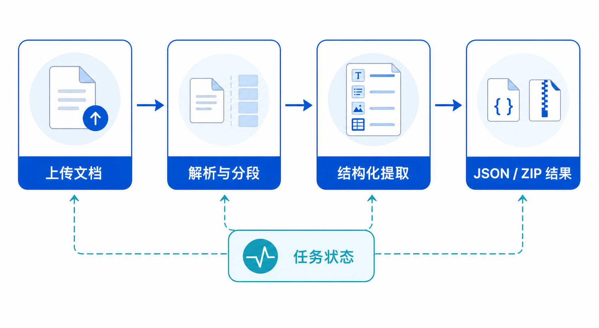

# 文档智能 Demo API 产品需求文档

## 1. 产品目标

将在线 Demo 中的文档解析、结构化抽取和问答生成能力开放给开发者，便于在应用中验证文档理解效果并为后续 SDK 集成建立稳定接口。



## 2. MVP 范围

| 能力 | 输入 | 输出 | 状态 |
|---|---|---|---|
| 结构化抽取 | 单个 PDF、输出 Schema | JSON | 本期 |
| 文档解析 | 单个文档、解析策略 | 结构化内容 | 后续 |
| 问答生成 | 单个文档、生成配置 | QA 对 | 后续 |

## 3. 结构化抽取 API

| 项目 | 规则 |
|---|---|
| 方法与路径 | `POST https://api.example.com/general/v0/extract` |
| 认证 | `unstructured-api-key: <api-key>` |
| 输入格式 | `multipart/form-data` |
| 文件 | 表单字段 `files`；单个 PDF，最大 100 MB |
| Schema | `output_schema`，JSON 字符串 |
| 输出 | `application/json` |

```bash
curl -X POST 'https://api.example.com/v1/extract' \
  -H 'X-API-Key: <api-key>' \
  -F 'file=@./document.pdf' \
  -F 'output_schema={"document_name":"string","document_date":"string"}' \
  -o result.json
```

用户提交的文件与抽取结果应遵循平台数据保留策略，并在 API 文档中明确说明保留时长、访问控制和删除机制。

`output_schema` 为必填 JSON 字符串，顶层字段名为调用方期望的输出字段，字段值描述期望类型。成功响应为 JSON，可返回一个或多个抽取对象；空字段应按 Schema 表示为空值，而不是悄然丢弃字段。失败响应至少覆盖：缺少或无效 API 密钥（401）、非 PDF 或文件超限（400/413）、缺少或无法解析 Schema（400）、服务处理失败（5xx）。

## 4. 后续能力

- 提供 Python SDK；密钥仅通过环境变量或受管密钥存储提供，不写入示例源码。
- 支持更多文件格式、批量任务和异步查询。
- 文档解析提供布局元素、标题、段落、表格及可配置分段策略。
- 问答生成按文件内容产生结构化问题与答案。

后续解析接口仍采用单文件上传和相同认证方式；响应应包含布局元素类型、文本、页码或位置引用。问答生成需要显式的生成配置与异步/批量策略后才开放，避免与本期同步单文件抽取混为一个接口契约。

## 5. 验收标准

| 编号 | 验收项 |
|---|---|
| AC-01 | 开发者可使用 API Key 上传合规 PDF 并获得符合 Schema 的 JSON。 |
| AC-02 | 超过文件大小、缺少 Schema 或认证失败时返回明确错误。 |
| AC-03 | API 示例仅包含通用域名、通用文件名和占位符凭证。 |
| AC-04 | API 文档说明用户数据的留存与访问控制规则。 |
