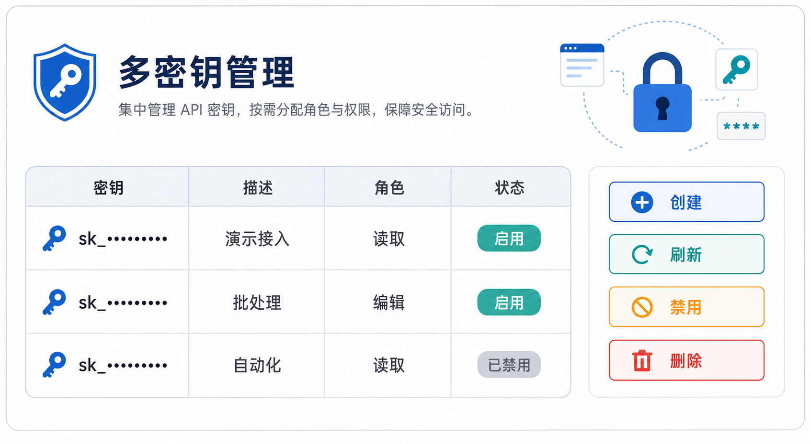

# 多 API 密钥与权限管理产品需求文档

## 1. 产品目标

支持一个用户创建和管理多个 API 密钥，并为每个密钥分配角色、描述、启用状态和生命周期，实现最小权限、可轮换和可审计的服务访问。

## 2. 密钥数据模型

| 字段 | 规则 |
|---|---|
| 密钥 | 页面仅脱敏显示；创建或刷新时完整值只展示一次 |
| 描述 | 必填，最长 100 字 |
| 角色 | 必填，多选；决定密钥可调用的 API 权限 |
| 创建时间/刷新时间 | 分别记录首次创建与最近轮换时间 |
| 状态 | 启用或禁用 |

列表默认按创建时间倒序，支持按启用状态筛选。禁用密钥以灰色显示。

页面顶部固定展示凭证安全提示；空列表展示空状态与“新建 API 密钥”入口。每一行展示脱敏密钥、描述、角色标签、首次创建时间、最近刷新时间、启用状态及操作。描述超出展示宽度时截断，完整值仅在受控的编辑弹窗中显示。

## 3. 用户操作

| 操作 | 规则 |
|---|---|
| 创建 | 描述与至少一个角色必填；成功后展示完整密钥一次 |
| 编辑 | 可修改描述与角色，不直接展示完整密钥 |
| 刷新 | 生成新值、废弃旧值并更新刷新时间 |
| 启用/禁用 | 即时生效；禁用后拒绝 API 调用 |
| 复制 | 用户主动操作后复制完整值 |
| 删除 | 二次确认后永久删除，不可恢复 |

创建与编辑共用弹窗：创建时字段为空，编辑时回填描述和角色但不回填完整密钥。保存前校验描述非空、长度不超过 100 字且至少选择一个角色；取消不会保存草稿。刷新、启停、复制、创建、编辑和删除均需提供成功/失败反馈，失败不得显示完整密钥。

## 4. 管理员视图

管理员可查看其他用户的密钥元数据与脱敏值，并按归属筛选。管理员对自己的密钥拥有完整操作权；对其他用户密钥默认仅可查看，不能复制、编辑、刷新、启用/禁用或删除，从而避免越权获取凭证。

管理员切换到其他用户视图时，列表增加密钥归属列；列表为空时显示空状态。对其他用户的“查看”仅返回脱敏值、描述、角色、状态和时间，不能通过详情、导出、刷新或剪贴板绕过限制。

## 5. 权限变更联动

当用户角色权限减少时：

1. 使用被收回权限的启用密钥自动禁用；
2. 密钥标记为“权限需刷新”，不可复制或编辑；
3. 用户刷新密钥后，系统按最新角色权限生成新密钥并恢复正常状态；
4. 新建密钥始终使用当前角色权限。

权限增加不改变既有密钥权限；需要新建或刷新后才获得新增权限。

受权限回收影响的密钥应记录具体状态原因，并将刷新入口标记为需要处理；此时允许删除或刷新，不允许编辑和复制。刷新成功后按当前角色重新计算权限并清除异常标记。所有创建、刷新、启停、权限收回和删除动作写入审计事件，但审计事件仅保留密钥标识和脱敏摘要。

## 6. 验收标准

| 编号 | 验收项 |
|---|---|
| AC-01 | 用户可创建多个带描述和角色的 API 密钥。 |
| AC-02 | 密钥支持脱敏展示、复制、刷新、启停、删除和状态筛选。 |
| AC-03 | 创建与刷新后完整密钥仅展示一次。 |
| AC-04 | 管理员只能查看其他用户的密钥元数据，不能获取或修改其密钥。 |
| AC-05 | 权限收回会禁用受影响密钥，并要求刷新后按最新权限重建。 |
