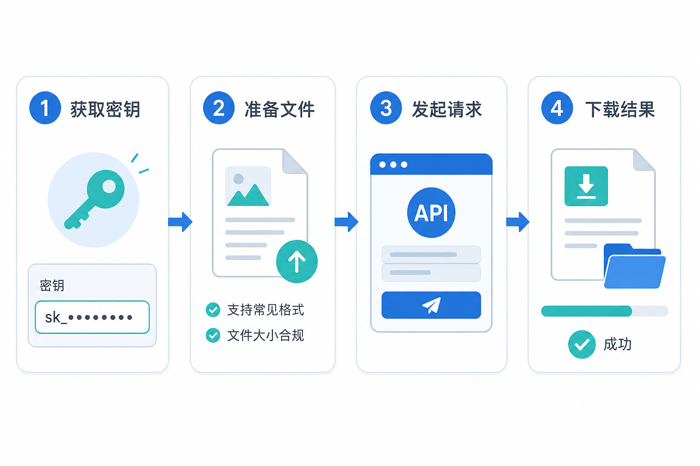

# 快速开始文档处理 API 产品需求文档

## 1. 产品目标

提供面向开发者的原子与组合式文档处理 API，覆盖解析、分段、信息提取和数据增强，并以统一认证、文件上传和响应规范降低集成门槛。



## 2. 全局规范

| 项目 | 规则 |
|---|---|
| 基础地址 | `https://api.example.com/v1` |
| 认证头 | `moi-key: <api-key>` |
| 请求格式 | `multipart/form-data`；复杂参数以 JSON 字符串传递 |
| 文件来源 | 本地 `files` 或公网 `file_url`，两者二选一 |
| 文件流响应 | 解析、分段、增强返回 ZIP |
| JSON 响应 | 信息提取返回 JSON |

支持文档、图片、音频和视频格式：PDF、Office、文本、表格、常见图片、音频与视频。请求失败返回标准 HTTP 状态和 `{ "error": { "code": "...", "message": "..." } }`。

## 3. API 套件

| 能力 | 方法与路径 | 输出 |
|---|---|---|
| 解析 | `POST /parse` | 结构化结果 ZIP |
| 解析并分段 | `POST /parse_and_chunk` | 分段结果 ZIP |
| 信息提取 | `POST /extract` | JSON |
| 解析并提取 | `POST /parse_and_extract` | JSON |
| 解析、分段与增强 | `POST /process_and_augment` | 增强数据 ZIP |

### 3.1 通用解析配置

`parse_config` 可包括图片描述、OCR 与 CSV 解析设置。所有设置均可省略并使用默认值。

```json
{
  "ocr_config": { "enabled": true },
  "image_caption_config": { "enabled": true, "language": "zh-CN" },
  "csv_config": { "use_first_row_as_header": true, "delimiter": "," }
}
```

`image_caption_config` 可包含 `enabled`、`language` 和可选模型选择；`ocr_config` 可包含 `enabled` 与可选模型选择；`csv_config` 还支持 `quote_char` 与 `backslash_escape`。配置对象作为字符串字段传递，服务端解析失败时返回 400，并指出发生错误的配置字段，不回显上传文件内容。

### 3.2 分段与提取

`chunk_config` 支持分隔符、块大小、重叠长度；`embedding` 是独立的可选字符串布尔字段，控制是否生成向量。`extraction_schema` 为必填 JSON Schema，定义需要返回的字段及类型。

```json
{
  "properties": {
    "document_title": { "type": "string" },
    "document_date": { "type": "string" }
  }
}
```

### 3.3 数据增强

`augmentation_config` 定义生成样本数、目标模型和输出字段。增强结果应可被导出为标准 JSON 或 JSONL 训练数据。

每个端点的文件输入字段统一为 `files` 或 `file_url`，且必须二选一；同时提供或同时缺失均返回 400。`POST /extract` 直接对文件提取，必须提供 `extraction_schema`；`POST /parse_and_extract` 额外接受可选 `parse_config`；`POST /process_and_augment` 必须提供 `augmentation_config`，并可选传入解析与分段配置。成功的解析、分段、增强类端点返回 `application/zip` 和下载文件名；两个提取端点返回 `application/json`。

## 4. 通用调用示例

```bash
curl -X POST 'https://api.example.com/v1/parse_and_chunk' \
  -H 'moi-key: <api-key>' \
  -F 'files=@./document.pdf' \
  -F 'chunk_config={"chunk_size":512,"overlap":64}' \
  -o result.zip
```

## 5. 错误处理

| 状态码 | 场景 |
|---:|---|
| 400 | 文件、配置或 Schema 不合法 |
| 401 | API 密钥缺失或无效 |
| 413 | 文件超过服务限制 |
| 429 | 超过请求频率 |
| 5xx | 服务端处理失败 |

## 6. 验收标准

| 编号 | 验收项 |
|---|---|
| AC-01 | 五类 API 使用统一认证、请求格式和错误结构。 |
| AC-02 | 本地文件与公网 URL 可二选一作为输入。 |
| AC-03 | 解析、分段和增强返回可下载的 ZIP，提取返回 JSON。 |
| AC-04 | 解析、分段、提取、增强配置均可按 JSON 字符串传入。 |
| AC-05 | 文档中所有 API 示例均使用通用地址和占位符。 |
