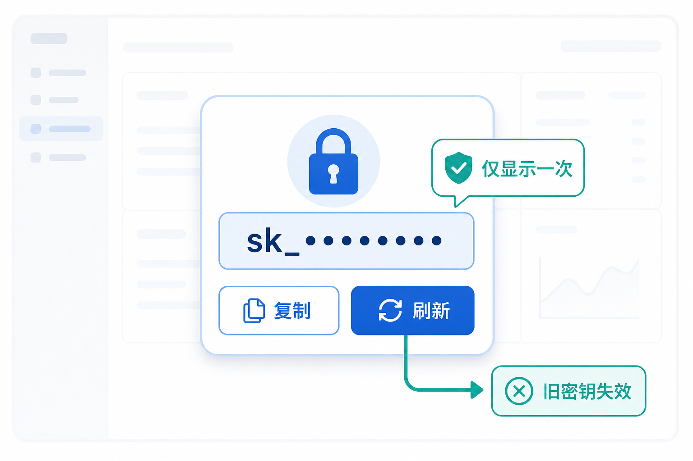

# 单 API 密钥管理产品需求文档

## 1. 产品目标

为每个账户提供一个长期 API 密钥的查看、复制和安全刷新能力，方便脚本与第三方应用接入，同时避免页面长期明文暴露凭证。



## 2. 页面与数据

入口位于用户菜单的“API 管理”。页面展示脱敏后的密钥、创建时间和操作按钮。

| 字段/操作 | 规则 |
|---|---|
| 密钥展示 | 仅显示固定前后缀，中间脱敏；重新进入页面始终保持脱敏 |
| 复制 | 仅在用户主动点击时写入剪贴板，并显示成功反馈 |
| 刷新 | 旧密钥立即失效，生成新密钥；需二次确认 |
| 生命周期 | 默认长期有效，直至被刷新 |

首次进入时，服务端保证账户已有唯一密钥。新密钥只在刷新成功后的安全确认界面完整展示一次，用户应立即复制并妥善保存。

密钥管理使用模态视图：标题为“API 密钥”，密钥展示框旁固定提供复制和刷新入口。复制后保持页面脱敏状态，并给出短暂成功提示。刷新确认必须清晰告知旧值会立即失效且操作不可撤销；确认成功后展示新值和复制入口，关闭或重新进入后恢复脱敏展示。单密钥版本不提供描述、删除或批量操作。

## 3. 接口与安全

密钥生成、查询与刷新接口必须使用当前会话身份校验，不能依赖在请求体中传递明文管理员密码。接口响应只在创建或刷新时返回完整密钥；其余查询仅返回脱敏值和元数据。

创建/刷新响应除 `key`、`created_at` 外可返回稳定的密钥标识和状态；查询响应只返回密钥标识、掩码值、创建时间和状态。复制动作仅在客户端收到一次性完整值后执行，服务端查询接口不得因“复制”调用而重新返回明文。刷新操作须具备幂等保护：同一确认请求的网络重放不能连续生成多把新密钥。

```json
{
  "data": {
    "key": "<api-key>",
    "created_at": "<timestamp>"
  }
}
```

## 4. 验收标准

| 编号 | 验收项 |
|---|---|
| AC-01 | 用户可在统一入口查看自己脱敏后的 API 密钥。 |
| AC-02 | 用户主动复制时才可获得完整密钥，页面不常驻明文。 |
| AC-03 | 刷新需二次确认；成功后旧密钥立即不可用。 |
| AC-04 | 完整密钥仅在生成或刷新时返回一次，后续查询只返回脱敏值。 |
| AC-05 | 密钥接口以当前会话身份授权，禁止在请求体传递管理员明文密码。 |
