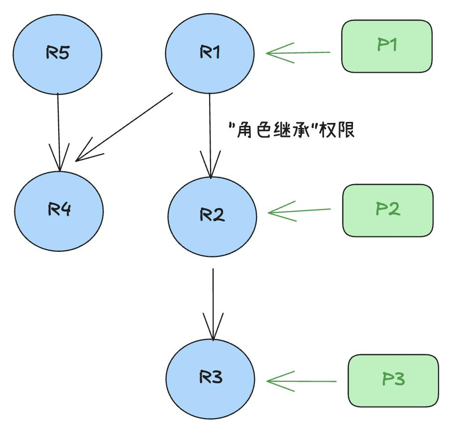

# 权限操作简化产品需求文档

## 1. 产品目标

在既有角色权限模型上降低大规模授权与维护成本，支持通过用户标签实现动态行级权限、通过角色继承复用权限，并提供面向对象的批量授权和角色复用能力。

## 2. 适用场景

| 场景 | 当前痛点 | 本期能力 |
|---|---|---|
| 多租户数据隔离 | 每个租户都需单独创建角色和行权限，维护量随租户增长。 | 用户标签作为行权限参数。 |
| 组织层级授权 | 下级权限变化后，需要手动同步给上级角色。 | 角色继承自动传播有效权限。 |
| 大量数据对象授权 | 同一对象需要授予多个角色。 | 在对象侧批量配置角色与权限。 |
| 相似角色创建 | 新建角色时重复勾选大量权限。 | 基于已有角色创建副本。 |

## 3. 用户标签与动态行权限

### 3.1 标签管理

管理员可维护“用户标签”字典；每个标签由标签名和标签值组成。标签管理为独立全局权限，默认授予超级管理员。

| 操作 | 规则 |
|---|---|
| 新增标签名 | 标签名在工作区内唯一。 |
| 修改标签名 | 已被引用的权限配置同步更新名称。 |
| 删除标签名 | 已被用户或角色权限引用时不允许删除。 |
| 设置用户标签 | 在新建用户和编辑用户信息时维护；标签名从字典选择，标签值手工填写且不能为空。 |

- 同一用户不能重复添加同一个标签名。
- 标签的新增、编辑、绑定和解绑均记录用户审计日志。

### 3.2 行权限中的标签引用

设置表的行级规则时，可引用标签名作为动态参数。执行查询时，系统将参数替换为当前用户对应的标签值，再执行权限表达式。

~~~sql
-- 示例：仅返回当前用户所属组织的数据
organization_id = {{user_tag.organization_id}}
~~~

标签值缺失时，规则不得放宽数据可见范围；应按无匹配值处理并给出可定位的错误或空结果提示。

- 标签替换只能发生在已声明的规则参数位置；标签名和标签值均作为数据处理，不能通过替换拼接出未校验的 SQL 片段。
- 修改或解绑用户标签后，后续请求按新值计算；运行中的作业继续使用启动时已解析的授权上下文。

## 4. 角色继承

### 4.1 继承规则

- 被继承角色的有效权限变更后，继承角色的有效权限自动更新。
- 角色继承属于独立管理权限；只有具备该权限的用户可以维护关系。
- 禁止形成环，例如 `角色 A → 角色 B → 角色 C → 角色 A`。
- 存在继承关系的角色不可删除，需先解除所有关联。

### 4.2 交互设计

角色列表新增“继承”入口，包含以下视图：

| 视图 | 内容 | 支持操作 |
|---|---|---|
| 继承角色 | 当前角色继承的角色列表 | 添加、移除。 |
| 授权角色 | 继承当前角色的角色列表 | 添加、移除。 |
| 关系查看 | 可视化展示角色关联；入边表示继承、出边表示被继承 | 查看完整上游继承链和第一层下游授权关系。 |

在角色的全局权限与对象权限列表中，继承权限需用标识区分：仅由继承获得的权限为半选且不可取消；若同时直接授予，则显示为实选。

## 5. 对象权限批量赋权

在数据资产对象列表中新增“权限配置”入口，覆盖目录、库、卷和表等对象。

| 能力 | 说明 |
|---|---|
| 按对象配置 | 选择对象后，为其一种或多种权限添加多个角色。 |
| 按角色查看 | 查看指定角色在当前对象上的全部权限，并可编辑。 |
| 来源区分 | 由全局权限获得的权限只读；对象级授权可在对象页编辑。 |
| 批量操作 | 同一对象的多个权限可一次配置给多个角色。 |

该能力与角色编辑页中的“为角色添加多个对象权限”互补，二者应读取和写入同一权限数据。

## 6. 基于已有角色创建

新建角色时提供两种方式：

| 方式 | 行为 |
|---|---|
| 从零创建 | 填写角色信息并手动配置权限。 |
| 基于已有角色创建 | 选择一个已有角色，复制其当前权限配置进入新建页；默认名称为“原角色名 + 副本”，可继续编辑。 |

复制仅生成新角色的直接权限配置，不自动创建或改变原角色的继承关系。

创建副本前应再次校验源角色可见性与新角色名称唯一性。复制失败时不得创建只含名称、不含预期权限的半成品角色。

## 7. 验收要点

- 标签重命名会同步更新已引用的行权限；被引用标签不能删除。
- 标签引用在运行时按当前用户替换，缺失值不会扩大数据访问范围。
- 角色继承实时传播、界面可追溯且无法形成环。
- 对象侧批量授权与角色侧对象权限配置一致，能区分全局和对象级来源。
- 基于角色创建可复制权限且不影响原角色。
