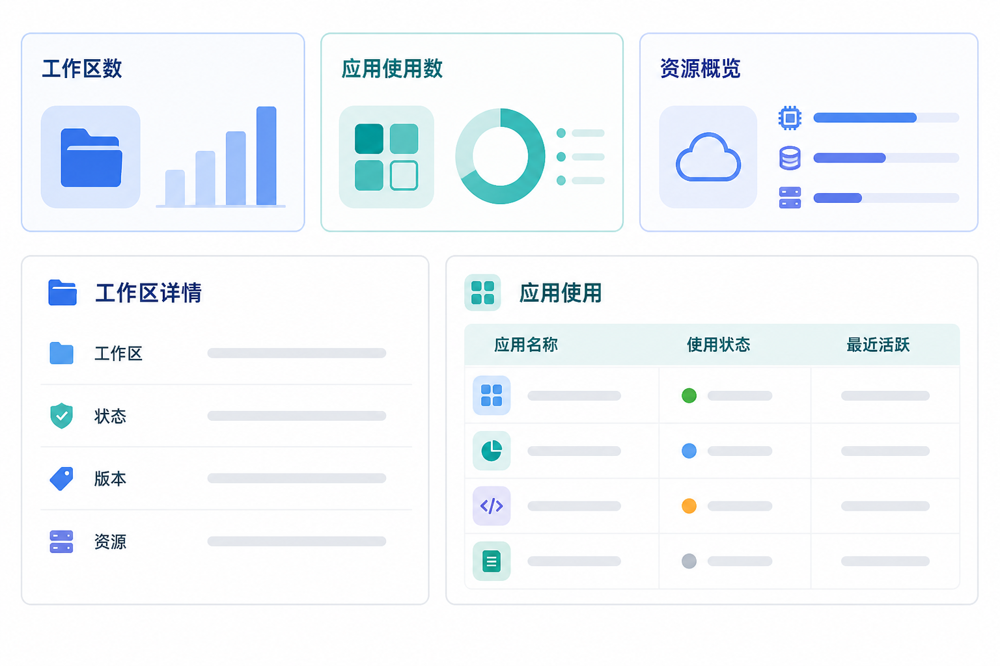

# 管理后台：工作区与 AI 应用运营产品需求文档

## 1. 产品目标

扩展管理后台的组织、实例与应用运营能力，使运营人员能够查看工作区资源使用情况，并按组织追踪 AI 应用的启用和使用状态。

## 2. 组织管理

### 2.1 工作区统计

组织列表增加“工作区数”，统计组织创建的工作区数量。点击数量后跳转至实例管理，并自动带入当前组织和“工作区”实例类型筛选条件。

组织资源统计需将数据库实例与工作区区分展示，例如数据库免费实例数和数据库付费实例数。

### 2.2 AI 应用使用统计

组织列表增加“AI 应用使用数”，表示该组织已使用的应用数量。点击后跳转至 AI 应用列表，并带入当前组织筛选条件。

## 3. 工作区实例管理

### 3.1 实例列表

- 实例类型新增“工作区”，与数据库实例并列展示和筛选。
- 工作区当前按免费类型展示。
- 实例名称为详情入口，替代独立的详情操作按钮。

### 3.2 工作区详情

| 分组 | 字段 | 说明 |
|---|---|---|
| 基本信息 | 工作区名称、实例 ID、实例类型、付费类型、实例状态 | 用于识别和判断服务可用性。 |
| 归属信息 | 组织名称、组织 ID | 用于组织维度筛选和追溯；不展示主账号联系方式。 |
| 版本与时间 | 服务版本、创建时间、最近修改时间 | 最近修改包含名称、访问凭据等配置变化。 |
| 资源概览 | 连接器数、载入任务数、工作流数、存储量 | 任务和工作流显示运行中数量与总数量；存储量为全部数据卷的汇总。 |

实例详情由实例标识定位，列表筛选、详情跳转和聚合统计必须使用同一组织归属关系。工作区删除、状态变更或资源统计延迟时，应展示统计更新时间或“数据更新中”，不能将过期值当作实时值。

## 4. AI 应用运营

### 4.1 应用使用判定

应用使用状态分为“未使用”和“已使用”。不同应用可配置独立的激活条件：

| 应用类型 | 已使用判定 |
|---|---|
| 智能搜索类应用 | 至少存在一个成功接入或解析的数据源，且用户至少执行过一次搜索（结果成功或失败均计入）。 |
| 垂直检索类应用 | 至少存在一个成功解析的数据源，且用户至少执行过一次搜索。 |

最近一次使用时间在连接器变更、数据源变更或搜索执行时更新；具体事件可按应用类型配置。

### 4.2 AI 应用列表

| 列名 | 说明 | 搜索与筛选 |
|---|---|---|
| 组织名称 | 应用所属组织 | 模糊搜索。 |
| 组织创建时间 | 组织创建时间 | 支持排序，默认倒序。 |
| 应用名称 | 已接入的应用类型 | 多选筛选；点击可查看使用详情。 |
| 使用状态 | 未使用、已使用 | 多选筛选。 |
| 最近一次使用时间 | 最近活跃事件发生时间 | 支持排序。 |

列表不展示可识别个人身份的主账号信息。

### 4.3 使用详情

使用详情按应用类型展示匿名化的资源与行为聚合指标，例如：

- 数据连接器数量、文件数量、数据总量；
- 已接入的数据表数量和数据规模；
- 图文检索、对话检索或其他搜索能力的调用次数。

详情只展示汇总数据，不展示文件名、查询内容、账户信息或业务数据。

- 应用启用、数据源变更和搜索执行以事件写入使用时间；重复事件可聚合，但不得漏记首次满足“已使用”条件的时点。
- 组织筛选、应用筛选和详情权限应在服务端执行；运营页不返回可被前端还原的原始搜索内容或资源名称。

## 5. 验收要点

- 组织列表可正确统计并跳转查看工作区和 AI 应用使用情况。
- 工作区实例详情包含状态、版本、时间和资源概览，且不泄露账号联系方式。
- AI 应用使用状态与最近活跃时间按定义更新，列表支持筛选、排序和详情查看。
