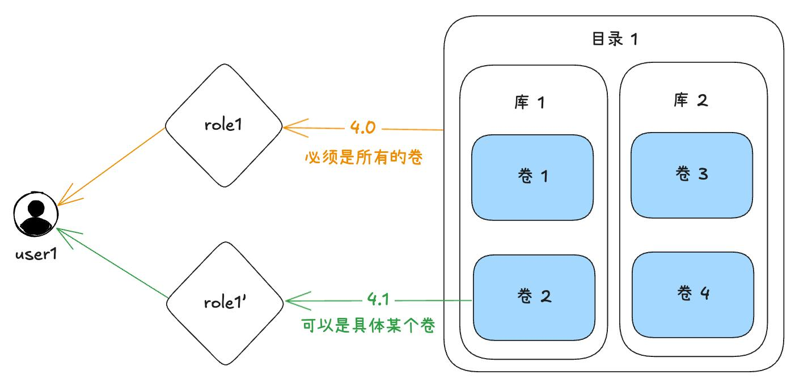

# 细粒度权限管理产品需求文档

## 1. 产品目标

在工作区角色权限体系中加入对象级、行级和列级访问控制。管理员可以将权限授予全部同类对象，也可以限制至指定连接器、任务、工作流、数据资产、告警或知识库，并为数据表进一步配置行列规则。

## 2. 权限模型

### 2.1 全局权限与对象权限

| 类型 | 作用范围 | 示例 |
|---|---|---|
| 全局权限 | 当前工作区内某类对象的全部实例 | 查看所有连接器、创建所有工作流、读取所有数据卷。 |
| 对象权限 | 指定的一项或多项对象 | 修改某个工作流、读取某个数据卷、查询某张表。 |

同一操作只要通过任一角色、全局授权或对象授权获得许可，即可执行。创建细粒度对象后，创建者所在角色自动获得该对象的全部对象权限。

### 2.2 权限对象与典型操作

| 对象类别 | 对象级操作 |
|---|---|
| 连接器 | 查看、修改、删除、使用。 |
| 载入和导出任务 | 查看、修改、暂停、恢复、重试、删除。 |
| 工作流 | 运行/重试、查看、停止、修改、删除。 |
| 告警规则与通知对象 | 查看、修改、启停、删除；查看告警记录。 |
| 目录、库、卷、表、视图 | 创建、查看、修改、删除、读写及数据库对象操作。 |
| 知识库 | 查看、修改、删除、使用。 |
| 发布与订阅 | 发布、查看、修改、删除、订阅管理。 |

### 2.3 可见性与运行边界

- 有任意子对象权限时，系统展示必要的父级路径，以支持对象定位。
- 有目录、库、卷、表等列表查看权限时可查看完整下级集合；否则仅展示可访问对象。
- 本期不引入父级 `USAGE` 权限。
- 对象创建后不再依赖创建者的角色或权限；创建者角色被删除或撤权，不影响已创建对象和已启动作业。
- 同一对象的各项权限相互独立。例如重新运行停止的工作流仅校验运行权限，不额外校验创建时所需的输入输出权限。
- 列表查看与对象详情查看应分别校验：拥有列表权限可浏览同类对象；仅具备某一对象权限时只展示该对象及必要父级路径。

## 3. 角色权限配置

### 3.1 配置界面

新建和编辑角色的“权限配置”分为“全局权限”和“对象权限”两个页签：

- 全局权限按模块分组，支持全选和已选数量统计。
- 对象权限支持选择对象类别、具体对象和对应权限，均可多选或全选。
- 数据库对象需要以完整路径显示，避免同名对象混淆。

| 对象权限列表字段 | 说明 |
|---|---|
| 对象类别 | 连接器、任务、目录、库、卷、表等。 |
| 对象名称 | 对象名称；数据库对象显示完整路径。 |
| 对象权限 | 已授予的权限集合，过多时可展开查看。 |
| 操作 | 编辑、删除。 |

### 3.2 对象侧配置角色

对象列表的操作栏提供“权限配置”入口，用于查看和编辑“角色 × 权限”关系。

- 可为某项权限批量添加或移除多个角色。
- 可点击角色查看并编辑该角色在当前对象上的全部对象权限。
- 由全局权限继承得到的权限在对象页只读，不允许在对象页删除。

## 4. 表的行级与列级权限

为表配置对象查询权限时，可进一步限定可见列和可访问行。

### 4.1 列权限

管理员通过勾选字段配置可见列；未授权列不得出现在查询、预览或结果导出中。

### 4.2 行权限

每列可配置多个过滤表达式，多个表达式整体只能采用“全部满足”或“满足任一”之一。

| 条件类型 | 输入规则 |
|---|---|
| 比较 | `=`、`!=`、`>`、`>=`、`<`、`<=`，输入单个值。 |
| 集合 | `IN`，输入一个或多个值。 |
| 模式匹配 | `LIKE`，输入匹配表达式。 |
| 正则 | 输入 SQL 正则，并可选大小写、多行等修饰参数。 |
| 完整表达式 | 输入完整 SQL 条件表达式，支持多行。 |

系统需校验表达式语法和条件组合的合法性，避免生成相互矛盾或无法执行的规则。

- 同一列的多条规则只能整体选择“全部满足”或“满足任一”，不可在一个规则组中混用 AND/OR。
- 正则规则支持大小写、多行等受控修饰项；完整表达式允许多行输入，但保存前必须由受限解析器验证，不能以客户端拼接替代校验。
- 行列规则须同时用于查询、预览和导出；无列权限的字段既不能出现在结果中，也不能作为可绕过的筛选或排序输出字段。

## 5. 角色管理权限

在未引入对象所有权委派模型前，创建角色和修改角色的权限默认仅授予超级管理员。对其他角色授予此类权限时，界面需提示其可进一步扩散高权限的风险。

## 6. 验收要点

- 全局与对象权限可组合且权限来源可追溯。
- 对象创建者自动获得完整对象权限，对象后续不依赖创建者权限。
- 角色页和对象页编辑同一套对象权限数据，且能限制全局来源权限的编辑。
- 表的列选择和行级表达式能正确限制查询、预览和导出结果。
