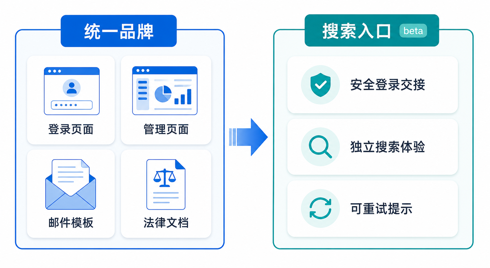

# 平台品牌升级与搜索入口产品需求文档

## 1. 产品目标

将数据库管理产品升级为统一的数据智能平台品牌，确保页面、邮件、法律文档和产品入口的命名与视觉识别一致，并在数据库管理界面新增独立的搜索 Beta 入口。

## 2. 品牌替换范围

| 范围 | 变更 |
|---|---|
| 注册、验证、登录、重置密码 | 新 Logo、产品名称和统一描述 |
| 数据库实例与管理页面 | 新 Logo 和产品名称 |
| 邮件模板 | 发件人名称、页脚、支持联系方式与产品名称 |
| 服务条款、隐私协议、SLA | 产品名称、支持联系方式和站点引用 |
| 官网与文档 | 统一品牌、商标和产品描述 |

迁移清单需覆盖应用配置、前端硬编码文本、邮件模板、文档和子域名配置。实际生产域名、邮箱和环境标识不得写入需求文档或示例代码，应由部署配置管理。

## 3. 搜索 Beta 入口

- 在数据库管理导航中新增一级菜单“搜索（Beta）”。
- 入口位于仪表盘与数据库相关菜单之间。
- 点击后在新页面打开独立搜索体验，并通过受控的实例级登录交接完成认证；初期不要求与数据库对象建立联动。

### 3.1 升级与回归校验

- 品牌替换应由可配置名称、Logo 与站点配置驱动，避免把域名、支持邮箱或环境标识硬编码进前端和邮件模板。
- 升级发布前校验注册、验证、登录、重置密码、实例管理、数据库管理、邮件和法律页面；旧标识搜索结果为零后再切换对外入口。
- 搜索入口认证失败或搜索服务不可用时，保留数据库管理会话并给出可重试提示，不泄露实例凭据或跳转参数。

## 4. 验收标准

| 编号 | 验收项 |
|---|---|
| AC-01 | 所有列出的页面、邮件和法律文档使用统一品牌标识。 |
| AC-02 | 配置、代码与模板中的旧品牌文本均被迁移清单覆盖。 |
| AC-03 | 产品文档不包含生产域名、邮箱、内部环境名或凭证。 |
| AC-04 | 数据库管理界面可打开独立的搜索 Beta 页面并继承登录状态。 |
