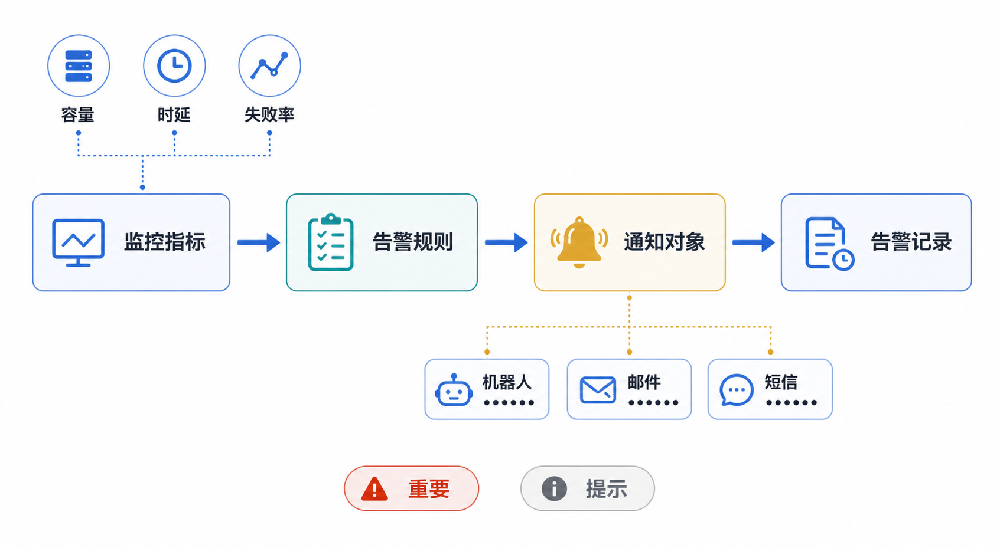

# 工作区告警管理产品需求文档

## 1. 产品目标

在工作区内提供独立的运行监控与告警能力，覆盖数据载入和数据处理的容量、时延、积压、失败率与失败事件。用户可配置告警规则、通知对象并查看告警记录。

## 2. 功能范围

| 功能 | 说明 |
|---|---|
| 告警规则 | 配置阈值、严重级别、通知周期和通知对象。 |
| 通知对象 | 维护可复用的机器人、邮件、短信和电话接收端。 |
| 告警记录 | 查看规则触发历史及通知结果。 |

- 单个工作区最多创建 100 条告警规则。
- 事件类告警固定为“触发一次，不重复通知”；周期类告警可按规则设置通知周期。
- 告警级别分为“提示”和“重要”。

## 3. 告警规则

### 3.1 数据载入监控项

| 监控项 | 默认阈值 | 类型 | 默认级别 | 默认通知 |
|---|---:|---|---|---|
| 单次任务文件数过多 | 1,000 个 | 事件 | 提示 | 不重复 |
| 一段时间内成功载入文件数过多 | 24 小时 / 1,000 个 | 周期 | 提示 | 每天 |
| 单次任务数据量过高 | 1,024 MB | 事件 | 提示 | 不重复 |
| 同一数据卷出现重名文件 | — | 事件 | 提示 | 不重复 |
| 工作区等待载入文件积压 | 100 个 | 周期 | 提示 | 每小时 |
| 单次任务平均载入时延过高 | 5 秒 | 事件 | 提示 | 不重复 |
| 存在文件载入失败 | — | 事件 | 重要 | 不重复 |
| 单次任务成功率过低 | 99.99% | 事件 | 重要 | 不重复 |

阈值字段需要校验为有效正数，并在界面展示单位、有效范围和默认值。重名文件与失败文件以一次载入任务聚合后通知，避免单文件重复告警。

周期型规则须同时校验统计窗口和阈值；事件型规则固定为不重复通知。状态在启用、禁用与更新后立即影响后续触发，不重写既有告警记录。

### 3.2 数据处理监控项

| 监控项 | 默认阈值 | 类型 | 默认级别 | 默认通知 |
|---|---:|---|---|---|
| 单个作业处理文件数过多 | 1,000 个 | 事件 | 提示 | 不重复 |
| 一段时间内成功处理文件数过多 | 24 小时 / 1,000 个 | 周期 | 提示 | 每天 |
| 单个作业处理数据量过高 | 1,024 MB | 事件 | 提示 | 不重复 |
| 单作业等待处理文件积压 | 100 个 | 周期 | 重要 | 每 30 分钟 |
| 工作区等待处理文件积压 | 100 个 | 周期 | 重要 | 每 30 分钟 |
| 单文件分段数过多 | 1,000 个 | 事件 | 提示 | 不重复 |
| 单文件处理耗时过长 | 600 秒 | 事件 | 提示 | 不重复 |
| 单作业平均处理时延过高 | 100 秒 | 事件 | 提示 | 不重复 |
| 作业中存在文件处理失败 | — | 事件 | 重要 | 不重复 |
| 单作业文件成功率过低 | 95% | 事件 | 重要 | 不重复 |

失败文件、分段异常和耗时异常应按作业聚合展示，并在告警详情中提供工作流、作业、时间和受影响文件摘要。

### 3.3 通知对象选择

- 创建或编辑规则时，字段名称统一为“通知对象”。
- 默认提供一个空的邮件对象选择器；用户可添加更多通知对象类型。
- 同一类型可选择多个已创建的对象。
- 支持永久禁用规则；限时禁用作为后续优先级需求。
- 规则列表显示关联通知对象；鼠标悬停可查看对象类型、名称及可安全展示的摘要信息。
- 规则保存时至少保留一个有效、启用的通知对象；若全部对象被禁用或删除，规则状态应显示“无可用接收端”，不能伪装为已通知。

## 4. 通知对象管理

### 4.1 新建通知对象

| 字段 | 规则 |
|---|---|
| 名称 | 工作区内唯一，最长 128 字符。 |
| 类型 | 单选：机器人、邮件、短信、电话。 |
| 接收信息 | 随类型变化：机器人密钥、邮箱或手机号；按对应格式校验。 |
| 备注 | 可选，用于说明用途。 |

机器人密钥等敏感值不得在列表、规则悬停层或日志中明文展示。扩展型协作工具通知渠道可在后续接入。

### 4.2 通知对象列表与操作

| 字段 | 支持能力 |
|---|---|
| ID、名称、类型、对象信息 | 名称和对象信息支持搜索；敏感信息脱敏显示。 |
| 创建时间、最近修改时间 | 支持排序，创建时间默认倒序。 |
| 状态 | 支持按启用、禁用筛选。 |

- 编辑时允许更新全部字段，并在保存前提示受影响的告警规则。
- 禁用后，关联规则不再向该对象通知；重新启用后恢复。
- 删除前需二次确认并列出关联规则；删除成功后自动移除规则中的该对象。

## 5. 告警记录

告警记录沿用统一的查询和追溯能力，至少包含规则名称、触发时间、告警级别、告警摘要、状态、关联任务或作业、通知结果。支持按规则、级别、状态和时间范围过滤，并可从规则详情跳转至关联记录。

- 每次通知尝试记录通道类型、脱敏接收端、发送时间和结果；密钥、完整邮箱、手机号与消息中的业务文件名不得写入告警记录。
- 通知发送失败应更新该次记录的通知结果，不自动改变规则启用状态；重试策略须与“不重复通知”语义分开处理。

## 6. 验收要点

- 规则数量上限、默认阈值、事件/周期通知策略正确生效。
- 通知对象的格式校验、脱敏、启停和删除影响处理正确。
- 告警触发可聚合失败或异常文件，避免高频重复通知。
- 告警记录可完整追溯规则触发及通知结果。
