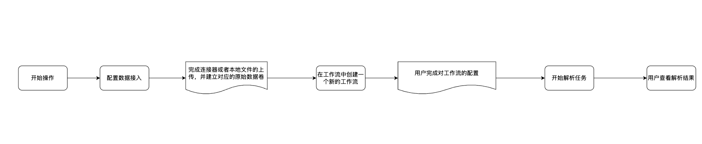

# 制造业文档解析 MVP 产品需求文档

## 1. 产品目标

面向制造业文档处理场景，提供一个可快速演示和复用的文档解析流程。用户上传 PDF、演示文稿或文字处理文档后，可在工作流中完成版面解析、文本识别、图文内容提取和复杂表格处理，并在数据资产中预览结果。

## 2. 典型使用场景

用户批量上传包含正文、表格、图片、页眉页脚、注释等内容的文档，希望将结构化和非结构化信息统一解析为可预览、可检索的 Markdown 结果。

本期聚焦单一解析节点的能力验证，不包含去重、复杂增强或多节点编排优化。

## 3. 用户流程

~~~text
上传文档
  ↓
配置文本内容选择
  ↓
在工作流中配置“综合内容解析”节点
  ↓
运行处理并进入处理数据资产
  ↓
选择处理结果并预览源文件与 Markdown
~~~

## 4. 功能需求

### 4.1 综合内容解析节点

工作流提供“综合内容解析”节点，将以下能力封装为一次处理：

- 文档版面识别与文本抽取；
- 图片文字识别与图文内容提取；
- 复杂表格识别，包括跨页表格的连续性处理；
- 面向 PDF、演示文稿和文字处理文档的统一 Markdown 输出。

文本内容选择沿用现有工作流配置方式；解析能力在该节点内完成，不要求用户单独拼接多种解析节点。

节点输入为用户选择的文档集合；每个文件独立产出解析状态、Markdown 和可选的结构块索引。单个文件失败不能阻塞其他文件完成，失败项需保留文件级原因，但不输出伪造的 Markdown。

### 4.2 处理结果预览

| 文档类型 | 预览要求 | 优先级 |
|---|---|---|
| PDF | 支持源文件与解析结果联动查看；Markdown 排版和内容应准确呈现。 | P0 |
| PDF 跨页表格 | 尽量消除跨页处不应保留的分割线，维持表格行列连续性。 | P1 |
| 演示文稿与文字处理文档 | 支持原文与 Markdown 的关联预览，保证内容准确性；本期不要求位置高亮。 | P0 |

预览页以“源文件 / Markdown / 解析状态”为基本信息；PDF 在存在可靠版面映射时支持双向定位，缺少映射时只展示内容而不绘制误导性的高亮。表格、图片和正文的阅读顺序应与文档顺序一致。

## 5. 已知限制

- 不同文档类型的版面坐标和内容定位能力可能不同；无法可靠定位时，预览需优先保证 Markdown 内容正确展示。
- 本期不承诺对所有图片内容和所有复杂版式提供同等精度的定位高亮。
- 跨页表格连续性作为重点优化项，需通过样本文档验收解析效果。

## 6. 验收要点

- 用户可完成上传、配置、运行和结果预览的完整链路。
- 解析节点能够输出包含文本、表格和图文内容的 Markdown。
- PDF 支持源文件与结果的联动浏览；演示文稿和文字处理文档支持原文与结果关联预览。
- 跨页表格在典型样本中保持合理连续性，解析失败可定位到具体文件。
- 对包含正文、图片、单页表格与跨页表格的通用样本分别验收；验收记录仅保留能力结论、匿名样本类别和失败类型，不包含来源单位、项目名、人员、账号、系统名或原始业务内容。
