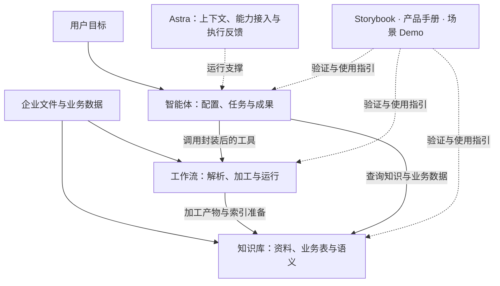

# 产品全景与实习工作说明：从企业数据到业务智能体

MatrixOne Intelligence（MOI）面向企业 Agent 应用，组织数据加工、知识与业务语义、智能体构建及运行能力。这份案例集围绕一个问题展开：如何让企业已有的文件、表格和业务数据，成为智能体可以理解、查询和调用的资源，并最终交付可检查的业务结果？

我的实习工作集中在工作流和知识库产品设计，同时参与智能体与 Astra 底座相关的产品梳理，并负责 Storybook 场景设计、产品手册撰写和远程 Demo 搭建部署。本文将这些工作整理为产品问题、具体设计与交付材料，供读者沿着同一条任务链理解。

快速了解可以先读第 1—2 节；关注设计细节可以进入第 3—6 节；关注场景落地与验收可以阅读第 7—8 节。文中的链接指向公开案例材料，材料类型与版本说明见第 9 节。

## 1. 产品背景：数据、知识与执行如何连接

企业任务通常同时依赖三类信息：原始资料中的事实、业务数据库中的数值，以及业务人员掌握的规则。例如，一份经营分析既要查询订单与退款数据，也要理解统计口径，还需要把结果组织成报告。

这要求平台同时解决数据处理、知识维护和任务执行的问题。我参与的工作主要位于 AI Studio 的产品使用链路，以及它与 Agent 运行底座的衔接处。工作流、知识库、智能体和 Astra 是本文的四个工作部分，并非 MOI 全部产品的顶层分类。

| 工作部分 | 用户需要完成的事 | 关键产品对象 |
| --- | --- | --- |
| 工作流 | 配置、复用并运行数据加工过程 | 流程定义、算子、输入输出、发布版本、作业与日志 |
| 知识库 | 管理资料和业务表，维护可查询的知识与口径 | 数据来源、处理状态、分段、索引版本、语义条目 |
| 智能体 | 将目标、知识和执行能力组合为业务应用 | 候选配置、知识库绑定、Skill、工具、会话、成果与发布版本 |
| Astra | 为智能体提供执行任务所需的运行能力 | 上下文、模型与工具接入、执行身份、运行状态与记录 |

图中表达的是产品协作关系：工作流产物可以进入知识库，已有工作流也可以封装为工具供智能体调用；智能体根据任务选择查询或处理能力，Astra 承接运行。具体服务部署和调用拓扑以对应实现为准。

## 2. 我的职责与交付内容

| 工作范围 | 参与方式 | 具体工作与交付内容 |
| --- | --- | --- |
| 工作流 | 负责相关产品设计 | 梳理创建与编辑流程、解析能力配置、节点数据绑定，以及运行和异常定位方式 |
| 知识库 | 负责相关产品设计 | 组织文件与表的管理流程，展开 Agentic RAG、NL2SQL、语义配置和结果核验设计 |
| 智能体 | 参与产品梳理与设计 | 衔接需求澄清、候选编辑、资源绑定、工具授权、任务反馈与版本使用 |
| Astra | 参与适配需求与产品边界梳理 | 明确平台配置向运行时传递的能力、上下文、访问范围和反馈要求 |
| Storybook | 负责场景设计 | 定义前置条件、固定输入、操作路径、结果断言、失败证据和资源清理要求 |
| 产品手册与 Demo | 负责文档撰写及远程 Demo 搭建部署 | 将概念、配置、任务操作和排障组织为指引，搭建包括简历筛选在内的场景演示 |

下文展开的是这些职责涉及的产品规则和方案。公开 PRD、架构与场景链接帮助读者检查设计细节；个人职责以本节范围为准，不按仓库全部功能或代码规模推算。

## 3. 工作流：从能力配置到运行结果

### 需要解决的问题

企业文件的处理方式取决于材料结构和下游用途。文本 PDF、扫描件、电子表格和图片需要不同的解析路径；同一份报告用于知识问答或字段提取时，对分段与输出结构的要求也不同。用户需要把这些处理步骤组合起来，并在失败时知道该改配置还是查执行。

我的工作重点是将解析等处理能力组织为工作流中的配置项、节点与数据关系，串联创建、编辑、运行和排障。

### 多种创建方式，共用一份流程定义

手册梳理了模板、画布、代码和自然语言四种创建方式。它们面向不同使用习惯，最终围绕同一份流程定义展开：模板帮助用户快速开始，画布帮助检查和调整结构，代码适合精细配置，自然语言用于表达处理目标并生成候选。

由此需要明确三类对象：流程定义保存处理规则；画布提供编辑方式；运行记录某次执行使用的输入、状态与结果。用户修改草稿、发布版本和启动任务时，应能理解各自影响。

Agent 辅助编排的设计路径进一步展开为：描述目标、发现可用算子、查看输入输出规格、组织节点与参数绑定、生成候选，再根据可用的校验反馈修正。候选应允许查看与修改，并清楚标明保存、发布和执行状态。

### 数据解析：围绕产物定义配置

解析能力的产品化要明确“保留什么、输出什么、交给谁使用”。我的相关设计与文档工作重点包括材料类型、解析配置、增强选项和产物使用路径。

| 处理对象 | 关键设计内容 | 验证时检查什么 |
| --- | --- | --- |
| 文档正文 | 正文、标题层级、页面与阅读顺序的关联 | 关键内容是否遗漏，章节关系是否仍可理解 |
| 文档内表格 | 将表格主体与标题、脚注关联，保留可展示和导出的结构 | 金额、单位与脚注是否归属正确，预览和导出是否一致 |
| 电子表格 | 识别工作表、表头和有效数据区域，明确后续提取或查询所需结构 | 字段与行列是否对应，是否混入说明区或空白区域 |
| 图片 | 区分文字识别与内容理解，保留图片和解析内容的关联 | 识别结果能否回到原图核对 |

以文档表格为例，只有单元格文本可能不足以解释数据：标题说明统计对象，脚注可能说明单位或排除项。公开案例把标题、主体和脚注作为关联对象，并要求预览、JSON 与导出内容保持一致。这个设计将解析质量落实到用户能检查的产物，而不是只显示一个成功状态。

解析档位与增强选项则需要说明适用材料、输出差异及耗时或成本取舍。处理产物继续进入分段、信息提取、索引与存储时，还要保留必要的来源关联。

### 节点之间如何接上数据

工作流中的执行顺序与数据绑定需要分别定义。启动参数、跨节点中间结果和相邻节点输出承担不同职责；上游输出了某个字段，并不意味着任意下游都会自动取得它。

产品设计与使用说明因此需要回答：输入从哪里来，哪些字段必须保存供后续引用，文件以什么形式传递，以及输出如何进入目标资源。文件引用也需要与可访问性共同检查，才能让下游节点读取正确材料。

一条文档知识准备流程可以按“读取—解析—分段—建索引—写出与存储—登记来源关系”理解。用户应能沿节点查看中间产物，定位错误开始出现的位置。

### 运行与排障

手册把手动、定时和文件卷触发作为不同的运行入口，并给出文件级作业的检查路径。对批量材料，单个文件的失败需要能够定位到节点、输入和日志。

我在产品与文档梳理中将排查路径分为两类：输入取值或绑定不正确时，检查上游产物和流程定义；输入符合要求而处理失败时，检查执行节点与日志。保存前校验的具体覆盖范围需按版本确认，运行排障仍是完整流程的一部分。

**相关公开材料：**[复杂工作流管理](prd/02-workflow-processing/complex-workflow-management-prd.md) · [文档表格解析](prd/02-workflow-processing/document-table-parsing-prd.md) · [工作流安全预览与验收场景](../storybook/workflow/safe-workflow-review-and-qa-package.md)。前两项展示设计要求，后一项展示验收方案。

## 4. 知识库：知识管理、Agentic RAG 与业务问数

### 需要解决的问题

企业知识同时存在于文件和结构化业务表中，业务规则还决定了数字应如何计算。知识库需要统一管理可用资料、查询范围与维护入口，再通过 Agentic RAG、NL2SQL 和语义配置服务用户及智能体。

我负责的相关产品设计覆盖数据管理、内容维护、查询使用及结果核验，重点在于让用户能够理解知识何时可用、答案依据什么、出现偏差应修改哪里。

### 管理可查询的知识范围

文件进入数据列表后，还需要经过处理和检查。手册将处理状态、启用状态、有效期和更新时间放在管理流程中，帮助用户判断某份资料是否参与当前查询。

对于文档，维护路径包括解析预览、分段编辑与启停、重新生成向量和版本检查。分段内容修改后，需要确认索引与当前版本，再用问题抽检；替换文件时，也要处理旧资料的启用状态，避免新旧内容同时影响回答。

对于业务表，检查重点则是字段、样例、数据范围与业务含义，并通过语义配置补充统计口径。这两类资源在同一个知识库中组织，但维护对象各有不同。

### Agentic RAG：让检索围绕问题推进

Agentic RAG 的设计重点是根据问题发现来源、取得证据，并在信息不足时继续检索。公开架构将这一过程拆为会话、规划、文档证据、数据证据与引用等职责。

具体设计需要考虑问题涉及的对象、时间和来源范围；在文件发现后使用全文、向量或视觉检索取得候选，结合重排序和上下文扩展读取必要内容，再选出实际支撑回答的证据。涉及多来源的问题，还需要检查证据是否覆盖了每个子问题。

用户侧的重点是看懂查询过程与回答依据：来源指向哪份资料，命中片段是否包含完整语义，哪些查询失败或没有结果。执行明细中，文档片段、SQL 结果和其他来源分别呈现，便于回到原始证据核验。

### NL2SQL：连接自然语言与业务数据

自然语言问数需要理解表、字段与关联关系，再结合指标口径形成查询。设计链路包括问题理解、相关表与语义选择、SQL 生成及校验、执行、结果展示和明细检查。

例如，“本月净收入”至少涉及月份按哪个日期字段划分、哪些订单参与计算，以及退款如何计入。表结构提供可查询字段，语义配置提供业务定义，结果明细帮助用户检查本次查询实际采用的范围。

这里还要区分成功但返回零行、SQL 执行失败和缺少访问权限。零行结果仍应保留查询及范围信息；失败查询不能被继续当作已取得的事实。

### 语义配置：把业务口径变成可维护对象

手册中的语义配置包含以下 10 类条目。下面以通用例子重新说明它们的用途：

| 条目类型 | 解决的问题 | 通用示例 |
| --- | --- | --- |
| 维度列 | 按什么角度分组或筛选 | 地区、产品类别、月份 |
| 事实列 | 哪些数值参与统计 | 金额、数量 |
| 业务指标 | 固定统计口径如何表达 | 净收入的计算定义 |
| 表关联 | 多张表如何连接 | 订单与订单明细的关联键 |
| 术语解释 | 业务词汇是什么意思 | “有效订单”的含义 |
| 命名过滤 | 如何复用常用筛选范围 | 已支付且未取消 |
| 列偏好 | 相似字段优先使用哪个 | 统计时优先采用支付时间 |
| 标准问答 | 如何复用确认过的问题与 SQL | 某类月度汇总的标准查询 |
| 规则注入 | 什么条件下应用业务规则 | 某业务场景的时间解释规则 |
| SQL 结果集 | 如何复用经过治理的查询 | 供后续分析使用的汇总结果 |

我的相关工作关注条目类型、关联表、必填内容、编辑与校验、导入导出，以及配置后的问答验证。表关联要对应已添加的数据表，语义内容也要有明确的适用范围，才能避免无关规则进入查询。

仓库另外保留了[语义层重构方案](prd/03-knowledge-search/nl2sql-semantic-layer-prd.md)，进一步讨论结构化指标、强制约束和受控查询编译。它与手册的条目分类、导入方式不同，应作为独立方案阅读，不拼接成同一版本的功能清单。

### 从错误答案回到维护入口

产品手册中最有价值的一部分，是把用户看到的错误现象对应到具体维护动作。这也为我组织验收和使用指引提供了依据。

| 用户看到的现象 | 优先检查 | 修订后的核验 |
| --- | --- | --- |
| 文件已添加，但没有可用答案 | 处理状态、启用状态和来源范围 | 确认就绪后重新提问 |
| 回答遗漏内容或引用无关段落 | 解析预览、分段及当前版本 | 检查索引更新与引用片段 |
| 数值能查出，但指标或联表不对 | 指标、维度、表关联及规则 | 对照已知结果检查 SQL 与数值 |
| 新资料已加入，仍引用旧内容 | 新旧文件启用状态及生效版本 | 用版本敏感问题抽检来源 |
| 无法理解系统做了什么 | 执行明细或开发者视图 | 定位失败步骤与已取得的证据 |

**相关公开材料：**[Agentic RAG 查询架构](architecture/knowledge-base/agentic-rag-query.md) · [语义配置架构](architecture/knowledge-base/semantic-configuration.md) · [NL2SQL 业务知识与查询](prd/03-knowledge-search/nl2sql-prd.md) · [执行明细设计](prd/03-knowledge-search/execution-details-prd.md) · [混合知识问答验收场景](../storybook/data-knowledge/hybrid-knowledge-question-answering.md)。

## 5. 智能体：构建、能力组合与持续使用

### 需要解决的问题

业务用户能够描述目标，但未必熟悉知识库、Skill、工具和连接配置。智能体产品需要把这些能力组织为可编辑的方案，并帮助用户完成授权、首次使用、结果检查和后续更新。

我的参与重点是梳理这些对象的关系与操作衔接，让工作流和知识库的能力能被业务任务使用。

### 从自然语言需求到可编辑候选

手册中的构建流程从任务目标、输入资料、所需能力和输出要求开始。信息不足时继续澄清，随后展示包含名称、提示词、知识库、技能和工具的候选配置。

候选阶段允许查看资源详情、增删绑定、修改提示词或继续补充要求；用户确认后再创建，并完成必要的授权和连接配置。这个过程把系统的资源选择展示给用户，也为修正误解保留了入口。

### 知识、方法、工具与连接各负其责

| 对象 | 在任务中的作用 | 产品上需要说明的内容 |
| --- | --- | --- |
| 知识库 | 提供资料、业务数据与语义依据 | 哪些资源可查询，资料是否就绪 |
| Skill | 提供处理方法、步骤与输出规范 | 适用任务和使用条件 |
| 工具 | 查询系统或执行具体操作 | 用途、输入、结果及调用策略 |
| 外部连接 | 为需要它的工具提供连接与授权配置 | 使用哪个连接，授权是否有效 |

手册明确了已有工作流封装为工具的路径：选择工作流，设置名称与描述，说明输入要求和调用方式，再配置直接运行或确认后运行的策略。工具随后绑定到智能体，成为可以按任务复用的处理能力。

工具绑定与连接授权需要分别检查。解除工具与某个智能体的绑定，也应区别于删除工具本身，以免影响其他使用者。

### 执行反馈与版本发布

任务使用阶段需要能查看进度、工具结果和文件产物，并在失败时继续检查已有结果。公开工作台方案进一步区分会话临时资源、智能体长期配置和可复用成果，明确当前操作影响的范围。

手册还给出了一个具体的版本规则：保存修改会产生独立版本；对外发布时选择一个版本；后续修改配置，不会自动把已发布渠道切换到新版本。这个规则让继续编辑和更新对外使用配置成为两个明确动作。

**相关公开材料：**[智能体工作台 PRD](prd/04-agent-applications/agent-workbench-prd.md)展示对象与任务交互；[多能力助手候选构建场景](../storybook/agent/SB-AG-022-agent-builder-portfolio.md)展示候选、资源与权限的验收要求。发布版本规则来自手册梳理，工作台 PRD 本身未覆盖完整发布流程。

## 6. Astra：平台能力如何进入 Agent 运行时

### 产品适配的关注点

智能体界面保存了配置之后，还需要运行时理解这些配置、取得上下文并调用能力。[Astra 的公开仓库](https://github.com/vitoworleone/Astra)将自身定位为可自托管的 Agent 运行时，涉及持续任务、上下文组织、工具接入和执行记录等能力。

我在这部分参与的是平台与底座之间的适配需求及产品边界梳理。适配需要回答：产品侧选中的模型、知识、Skill、工具和文件，如何成为当前任务可使用的资源；执行进度、产物与异常，又如何回到产品侧。

### 将配置转化为可检查的适配要求

| 适配面 | 产品侧需要明确 | 验证关注 |
| --- | --- | --- |
| 模型与工具 | 可选择哪些能力，工具的用途与输入输出是什么 | 运行时是否收到正确配置，调用结果能否继续使用 |
| 知识与文件 | 当前任务绑定哪些资料，文件来自哪里 | 查询与读取是否落在绑定范围内 |
| Skill 与任务上下文 | 稳定规则、处理方法、当前目标和临时材料各是什么 | 规则是否正确传入，长任务中关键约束是否保留 |
| 身份与授权 | 哪个身份使用能力，哪些动作需要确认 | 配置权限在执行时是否继续成立 |
| 状态与产物 | 用户需要看到哪些进度、错误与结果 | 反馈能否关联到正确任务，失败是否有可行动的原因 |

长任务中的上下文管理还涉及稳定指令、历史信息和工具结果的取舍。产品适配需要说明必须保留的任务目标与约束，以及过程记录如何用于问题定位。具体压缩算法、恢复机制和运行时实现，应到 Astra 对应版本的公开资料中继续阅读。

这部分的交付侧重能力接入需求、配置传递关系与验证项；Astra 的整体工程能力和后续迭代不作为个人实现成果。

## 7. Storybook、产品手册与 Demo：把设计交给用户检验

### Storybook：围绕任务定义验收

我负责 Storybook 场景设计，围绕用户目标组织输入、前置条件、操作步骤、预期结果和失败证据。这里的 Storybook 指场景化产品演示与验收设计。

不同能力需要不同的检查方式：

| 能力 | 主要断言 | 需要保留的证据 |
| --- | --- | --- |
| 解析与提取 | 内容、表格结构和关键字段符合预期 | 输入版本、解析产物及字段比对 |
| 工作流运行 | 数据绑定正确，取得完整终态，失败位置可定位 | 配置版本、节点状态、输入输出及异常原因 |
| 知识问答 | 答案有来源，资料范围正确，缺少依据时明确说明 | 问题、回答、引用及来源核对 |
| NL2SQL | 数值、指标定义、筛选与关联符合预期 | SQL、结果表、使用口径及参考结果 |
| 智能体任务 | 选择合适能力，遵守授权范围，产物可用 | 资源绑定、调用记录、产物与清理结果 |

场景输入与参考答案需要固定版本，开放式质量评价与确定性字段校验分别记录。运行结束后，还要记录失败归因与临时资源清理，才能在下一次迭代中重复比较。

本仓库的[混合知识问答场景](../storybook/data-knowledge/hybrid-knowledge-question-answering.md)和[批量资料匹配场景](../storybook/agent/SB-AG-034-batch-profile-matching.md)展示了这种组织方式；它们当前记录为 `not run`，公开材料支持检查验收设计，尚未提供通过结果。

### 产品手册：把概念、操作和异常处理连起来

我承担产品手册撰写，将模块关系和产品规则组织为可执行的使用指引。手册中的细节也帮助本文还原具体工作：工作流的定义与运行、知识库的内容与索引版本、智能体的工具与连接，以及配置保存与发布版本之间的区别。

一份操作说明需要告诉用户：开始前准备什么，操作修改了哪个对象，完成后应看到什么，以及结果不符合预期时从哪里查起。例如：

- 工作流失败：先定位文件作业和失败节点，核对输入，再决定修改定义或排查执行。
- 知识回答偏差：先检查来源与处理状态，再检查分段、语义或版本，修改后用同一问题复核。
- 智能体无法调用能力：检查资源绑定、工具输入和连接授权，再核对当前使用的配置版本。

这些内容使手册与 PRD、场景验收能够互相对照：需求描述预期行为，手册解释使用路径，Storybook 定义如何判断结果。

### 远程 Demo：将能力放入具体任务

我搭建部署了包括简历筛选在内的远程 Demo，串联资料输入、解析提取、条件匹配和结果查看，支持完整任务的演示与体验。

这一类场景需要特别检查字段是否来自对应文件、缺失信息是否明确标注，以及匹配理由能否回到事实依据。公开案例保留通用任务结构与合成输入设计，最终判断仍由使用者复核。

可继续阅读[PoC 方案](poc/)与[场景目录](../storybook/)，或从[仓库首页](../README.md)进入可交互原型。原型、验收方案与实际 Demo 各自提供不同类型的材料，不以其中一项代替其他项的运行证据。

## 8. 一个贯穿模块的例子：生成带口径依据的经营摘要

以下是为解释产品关系重新设计的合成场景，并非某次客户交付或已运行 Demo 的记录。

用户提供合成订单表、退款表和一份统计口径说明，要求：“汇总指定月份各地区的净收入，说明退款处理方式，并输出可核对的摘要。”这个任务同时需要处理文件、理解口径、执行查询和组织产物。

| 阶段 | 产品动作 | 可检查的输出 |
| --- | --- | --- |
| 准备资料 | 用工作流解析口径文件，检查结构，准备知识分段与索引 | 文件预览、分段与来源关系 |
| 组织知识 | 将文件与业务表关联到知识库，确认处理状态和启用范围 | 明确的资料与数据表清单 |
| 配置口径 | 定义净收入、地区、日期口径及表关联 | 可维护的语义条目和参考查询 |
| 构建智能体 | 配置任务目标，绑定知识库及所需工具，确认访问范围 | 可审阅的智能体配置 |
| 执行任务 | 查询表数据计算数值，检索文件解释规则，组织摘要 | SQL 结果、文档引用和摘要产物 |
| 验证与修订 | 按 Storybook 逐项比对；按手册回到对应维护入口 | 断言结果、问题归因和复核记录 |

Astra 在执行阶段承接运行能力，工作流与知识库提供处理和查询资源。若数值不对，应核对日期、指标及联表；若说明缺少依据，应核对文件处理、分段和引用；若工具无法使用，应检查绑定与授权。

这条场景可以展示我对跨模块产品流程的理解，同时为设计评审提供具体的输入、产物和检查问题。

## 9. 材料类型、版本与公开说明

本文根据已确认的职责、产品手册及仓库案例重新组织。手册用于核对概念和操作规则，公开案例用于展示设计与验收方法；它们不是内部文档原件或交付记录的公开副本。

| 材料 | 能帮助读者检查什么 | 阅读时的范围 |
| --- | --- | --- |
| 本文职责说明 | 我的工作范围与参与方式 | 不将整个平台能力归为个人实现 |
| PRD 与架构案例 | 对象、方案、交互规则与设计取舍 | 设计要求不自动等于已上线行为 |
| 手册归纳 | 概念、操作前置条件与排障路径 | 按所参考手册的范围理解，不视为本次运行验证 |
| Storybook | 输入、断言、失败与清理口径 | 运行结论以具体记录为准 |
| 交互原型 | 页面组织与操作体验 | 后端接通与生产交付需另行验证 |
| Astra 公开仓库 | 运行底座的公开设计与实现 | 以对应版本为准，不反推实习期适配状态 |

两处材料差异值得单独保留：工作流 PRD 提出保存前校验要求，而手册仍说明部分定义错误在运行时暴露；语义层重构 PRD 提出新的资产分类与导入模式，而所参考手册采用 10 类条目，并限定导入目标为空。本文按各自材料解释，不据此构造统一上线版本。

公开内容使用通用或合成场景，不包含客户标识、真实业务资料、内部访问入口、凭据或未经核实的效果数据。发布约定见[公开边界](../DISCLAIMER.md)。
