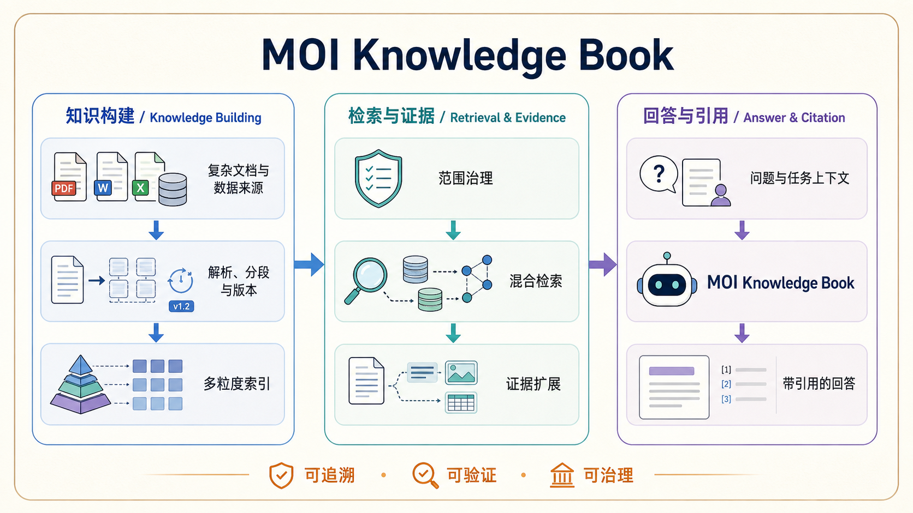

# MOI Knowledge Book：面向复杂企业知识的可追溯检索设计

MOI Knowledge Book 是一个面向企业知识使用场景的产品案例。它关注的不是“把文件交给模型后得到一段回答”，而是让复杂资料能够被理解、检索、引用和持续治理。

> 核心目标：让用户不仅获得答案，也能判断答案依据了什么、是否仍然有效，以及问题出在知识处理还是检索过程。

  

[查看高清架构图](../../../assets/architecture/moi-knowledge-book-rag-architecture.png)

## 1. 要解决的问题

企业知识通常散落在 PDF、Word、表格、图片与业务数据中。即使资料已经被上传，用户仍会遇到三个问题：

- **难以理解**：扫描件、跨页表格、图片和长文档很难被直接转化为可用知识；
- **难以相信**：回答只给结论，无法回到原文件、段落、表格或图片核验；
- **难以维护**：文件更新、失效或权限变化后，旧内容仍可能进入检索结果。

MOI Knowledge Book 将这些问题拆为一条可观察的链路：知识构建、检索与证据、回答与引用。

## 2. 设计目标

| 目标 | 含义 |
| --- | --- |
| 可理解 | 复杂文档经过解析后，保留文本、表格、图片与结构关系。 |
| 可检索 | 同时兼顾语义召回、关键词命中与业务范围约束。 |
| 可追溯 | 每条回答都能回到具体来源与证据片段。 |
| 可治理 | 来源状态、标签、版本和有效期能够影响检索范围。 |
| 可验证 | 产品可以定位“没有召回”“证据不足”或“回答不一致”等失败原因。 |

## 3. 端到端链路

### 3.1 知识构建：从资料到可用索引

1. **接入来源**：用户选择复杂文档、图片、表格或业务数据，并明确知识范围。
2. **解析与分段**：先完成文档理解，再按照内容结构和使用场景形成分段；解析和分段不是同一件事。
3. **建立版本**：每次处理结果都对应可追踪的版本，便于更新、回退和比较。
4. **构建多粒度索引**：以文档、章节和片段三个层次保存内容，既支持定位整份资料，也支持精确召回证据。

### 3.2 检索与证据：从命中到可阅读上下文

1. **范围治理**：先根据知识库、来源状态、标签、权限和有效期限定可检索的资料。
2. **混合检索**：语义检索适合表达相近但措辞不同的问题；全文检索适合术语、编号和精确表述。两类候选共同构成召回范围。
3. **证据扩展**：命中一个片段后，按需要补齐相邻段落、表格行、相关图片与来源信息，避免用孤立句子回答复杂问题。
4. **结果呈现**：检索结果应能区分“直接证据”“补充上下文”和“来源元数据”，而不是只给一个分数。

### 3.3 回答与引用：从证据到可核验结论

1. 用户提出问题，或在任务中携带业务上下文。
2. Agent 从知识工具获得经过范围控制的证据，而不是直接访问无边界的原始资料。
3. 回答基于已选择的证据组织，并附上可跳转的文件、段落、表格或图片引用。
4. 当证据不足、来源失效或结果互相冲突时，产品应明确提示限制，而不是生成确定性结论。

## 4. 关键设计取舍

| 设计取舍 | 原因 |
| --- | --- |
| 解析与分段分离 | 先理解原始内容，才能针对检索、问答或抽取选择合适的分段方式。 |
| 多粒度索引，而非只存 chunks | 长文档问题需要文件和章节上下文；精确问题则需要小片段。 |
| 先治理范围，再检索 | 企业资料是否可用与权限、有效期和版本有关，不能只依赖相似度排序。 |
| 证据扩展独立于召回 | 命中不是答案；表格、图片和邻近段落常是完成理解所必需的上下文。 |
| Agent 以证据为输入 | Agent 负责组织和行动，知识系统负责提供受控、可引用的事实依据。 |

## 5. 如何验证设计是否有效

验证不应只看模型回答是否流畅，还应覆盖完整链路：

- **召回质量**：正确资料是否进入候选集，关键术语和语义表达能否同时命中；
- **证据完整性**：回答引用是否覆盖结论所需的段落、表格或图片；
- **引用准确性**：用户跳回来源后，能否验证回答中的关键判断；
- **治理正确性**：已禁用、已过期或不属于当前范围的资料是否被排除；
- **失败可定位性**：面对无答案、解析失败或低置信结果时，是否能给出下一步处理方式。

## 6. 与产品原型的关系

该案例的交互表达可在 [MOI Platform Prototype](../../../product/moi-platform-prototype/) 中查看；其中知识库、检索、来源治理与 Agent 交互共同构成 MOI Knowledge Book 的产品体验。功能范围与暂不纳入的能力见 [能力范围与设计取舍](moi-knowledge-book-rag-scope.md)。
