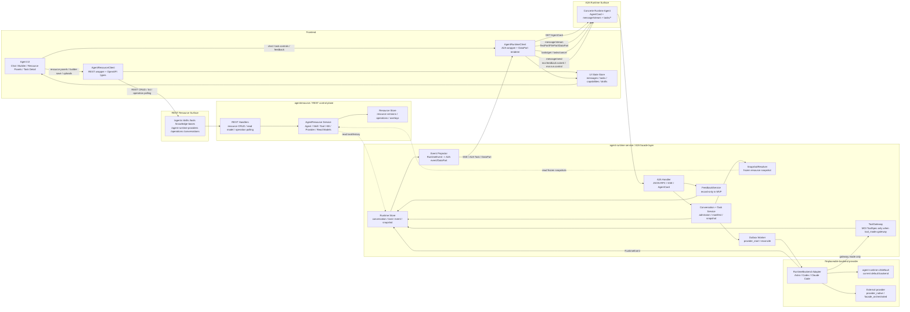
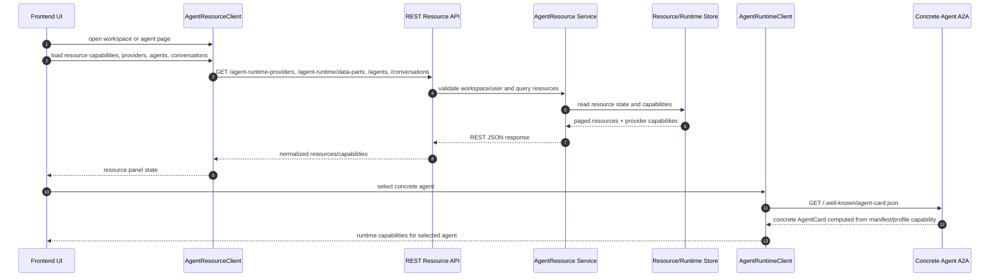
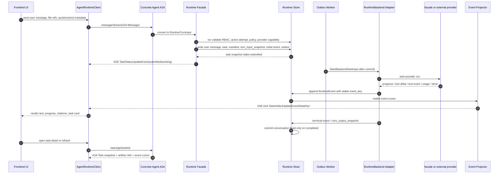

# Agent Runtime Facade over A2A

## 背景

MOI 智能体模式需要从前端 prototype 中的本地 mock 走向后端托管运行。当前前端已经形成了稳定的产品概念：

- Agent：名称、描述、系统提示词、模型、技能、工具、知识库、审批策略、运行限制
- Skill：自然语言工作簿，声明任务方法、资源需求和工具需求，但不直接授予工具执行权
- Tool：系统算子、MCP、HTTP API、市场工具、代码类工具
- Knowledge Base：Catalog 数据的逻辑视图，供智能体检索和引用
- Conversation：多轮对话与附件上下文
- Task：长任务、定时任务、审批、执行轨迹

目标是新增一个 `agent-runtime` 抽象。它对前端暴露稳定协议，对后端实现做门面代理。Agent 资源层未显式指定 runtime 时保持兼容默认 `default/default`；普通业务智能体作者入口和 Genesis 会显式写入产品态运行目标 `astra/default`。运行时选择会保存在 Agent 资源、RuntimeManifest 和 RuntimeTask read model 中。`astra/default` 通过 Astra provider-side Agent Binding、MOI capability gateway 和 model gateway 执行对话；`default/default` 的 backend implementation 仍是内部 `agent-runtime-v2`。后续接入更多外部 provider 时，只增加新的 provider/profile 和 backend adapter，不改变前端 A2A/REST 协议。

`agent-runtime` 对前端暴露两套协议：

1. **A2A**：用于 agent 运行时通信 — 对话、流式回复、任务状态、审批响应、取消。
2. **REST API**：用于资源管理 — Agent/Skill/Tool/Knowledge Base CRUD、绑定、版本、配置。

A2A 是 agent-to-agent 运行时通信协议，不适合做资源 CRUD。资源管理走标准 HTTP API，前端用已有的 REST hooks 消费，调试用 curl 直接调。两套协议互不依赖：前端资源管理页面不需要理解 A2A，对话页面不需要理解 REST CRUD。

原型里需要但不属于 agent-runtime 公共运行时的资源管理能力，例如 Skill/Tool/Knowledge Base 完整管理、文件解析索引、模型配置和构建向导，单独见 [agent-prototype-resource-roadmap.md](./agent-prototype-resource-roadmap.md)。本文只保留 runtime 创建任务所需的资源快照、manifest 和接口边界。

## 设计目标

1. 运行时通信只依赖 A2A（对话、流、任务、审批）。
2. 资源管理只依赖标准 REST API（Agent/Skill/Tool/KB CRUD）。
3. `agent-runtime` 是代理门面，不把前端绑定到 Claude Code、Codex 或任一外部 provider 实现。
4. 当前产品态只向普通业务智能体创建入口暴露 `astra/default`。`default/default` 由内部 `agent-runtime-v2` backend 实现，但只作为 legacy/internal profile 显式解析，供尚未迁移的内置智能体使用；状态、task、manifest、event、outbox 和 conversation read model 仍走 runtime canonical store。
5. 工具、技能、知识库、审批策略都从元数据装配，不写死在 runtime 中。
6. 对外支持流式文本、思考/进度、工具调用、引用、任务、审批和取消；内部按 provider capability 原生执行或降级。
7. 支持会话持久化和任务回溯，后续接入 MO git-for-data 快照。
8. 不引入语言绑定的业务词典、行业硬编码或 case 分支。

## 非目标

- 首期不实现完整 UI。
- 首期不要求 Claude Code/Codex/Astra 原生 adapter 可用；这些 provider target 可以由 facade 路由到当前默认 `agent-runtime-v2` backend，后续替换 adapter 时不改变前端协议。
- 首期不把 Catalog 直接暴露给模型；模型只能通过受控工具访问知识库或数据资产。
- 首期不把 MCP 替代为 A2A。MCP 仍用于工具和资源接入，A2A 只用于 agent 运行时通信。
- 不把 Memory/Memoria 作为 agent-runtime 的通用外部能力。若某个 provider 有原生 memory，它属于 provider 内部状态或独立产品域，不在本协议中暴露 CRUD、boost、weight 等接口。
- A2A 不承载资源管理。Agent/Skill/Tool/KB 的 CRUD、绑定、版本管理走 REST API，不走 A2A DataPart command。

## 现有依据

### Prototype 前端对象

`moi-prototype/html/app-dev/index.html` 中已有可落地的数据形态：

- `currentAgent` / app list：`name`、`desc`、`prompt`、`skills`、`tools`、`kbs`、`approvalPolicy`、`approvalTools`、`advancedConfig`、`model`、`modelConfig`
- `conversations`：`id`、`label`、`agent`、`messages`、对话中创建的 Agent、会话归档/排序入口
- `messages`：`text`、`skills`、`tools`、`kb`、`prompt`、`citation`、`task`、`task_update`、`agent_created`，以及构建向导专用 `agent_name`、`agent_prompt`、`agent_kb`、`agent_tools`、`agent_done`
- 消息操作：点赞/点踩、引用、重新生成、分享、导出、划除/隐藏
- `mockTasks`：`queued`、`working`、`completed`、`failed`、`approval`，并带 `trigger`、`cron`、`steps`、审批操作和任务详情编辑；这些字段在后端分别落到 A2A task、REST task read model 和 Workflow/Mowl 调度域
- Skill/Tool/KB 管理已经区分系统内置、自定义、市场、MCP、HTTP API、知识库数据源、版本、启停、绑定关系和分页筛选
- Knowledge Base 详情已经包含文件上传/覆盖、文件标签、有效期、元数据、版本记录、文件预览、分段检索、分段编辑、分段启停、结构化表详情
- 模型选择已经区分内置模型、自定义模型和自定义 API onboarding

后端接口应保留这些产品语义，但把 ID、权限、版本、状态和审计补齐。

### agent-runtime-v2 内部实现

首期 runtime 不接入旧 agent loop。Catalog 内部使用 agent-runtime-v2 的 task、manifest、turn snapshot、event、outbox、conversation 和 feedback read model 作为运行时权威状态；A2A handler 只负责协议转换，Agent Resource 只负责资源快照和 provider capability。

agent-runtime-v2 内部只维护 Responses-style 的 `ResponseItem` / `ResponseEvent` 上下文。不同模型网关的 HTTP wire protocol 由 `ResponsesClient` 边界处理：默认使用 `wire_api=chat`，按 Codex 旧实现把 Responses item 转成 `/v1/chat/completions` request，并把 Chat SSE 转回统一 `ResponseEvent`；只有冻结后的 `model_config.metadata.wire_api=responses` 显式声明时才调用 `/v1/responses`。runtime 不做错误内容驱动的 responses-to-chat 重试。Chat wire 不支持 `output_schema`；上下文压缩使用 chat completion 摘要请求后再投影回 Responses-style history。

## 协议分层

```
Frontend
  |
  |-- REST API (Resource Management)
  |     /api/v1/agents, /api/v1/skills, /api/v1/tools, /api/v1/knowledge-bases
  |     CRUD / binding / version / config / file upload
  |       |
  |       v
  |     agentresource service
  |     Resource store / operation store / read models
  |
  |-- A2A (Agent Runtime)
        AgentCard / message/send / message/stream / tasks/get / tasks/cancel
        Runtime turn / Approval response / Feedback submit
          |
          v
        agent-runtime service / A2A facade layer
          |
          |-- SnapshotResolver
          |     Frozen Agent/Skill/Tool/KB/Policy snapshots from agentresource
          |
          |-- RuntimeRouter (A2A handlers)
          |     provider = default | astra
          |
          |-- RuntimeBackend interface
                Start + optional Attach / Resume / GetTask / Cancel / Close
```

### 为什么两套协议

- **REST 做资源管理**：前端已有成熟的 REST 消费模式（hooks、SWR、分页）；curl 调试直观；Swagger/OpenAPI 文档生成标准；Go/Python SDK 直接调用。
- **A2A 做运行时通信**：agent-to-agent 互操作是 A2A 的设计目的 — 消息、流、任务状态、artifact、审批。运行时协议不需要分页/筛选/版本这些 CRUD 语义。
- **互不耦合**：资源管理页面只用 REST，不需要理解 A2A；对话页面只用 A2A stream，不需要理解资源 CRUD。
- **后端实现切换时**：REST API 不变（资源模型稳定）；A2A 行为随 provider 能力变化（通过 capability 投影）。

## 组件设计

下面是 runtime 目标态 package map，不代表 MVP 必须一次性创建所有文件。当前已落 `a2a` handler、AgentCard、`RuntimeBackend` 接口、provider capability contract、task/event/manifest/outbox store、agent-runtime-v2 backend 和 RuntimeManifest 只读 ToolGateway。REST 资源管理、builder、conversation/message read model、task read model、Skill/Tool/KB/Model/WorkflowBinding 等控制面服务放在 `agentresource` 或 `agentruntime/resource` 包，具体见 [agent-prototype-resource-roadmap.md](./agent-prototype-resource-roadmap.md)。

```
moi-core/catalog/pkg/agentruntime/
  service.go                 # service composition and orchestration
  snapshot_resolver.go       # reads frozen Agent/Skill/Tool/KB/Policy snapshots for RuntimeManifest
  feedback.go                # A2A feedback submit/result handling
  input_request.go           # generic user input request/resolution state machine
  message_control.go         # regenerate and runtime message controls
  policy_profile.go          # runtime policy profile resolution and validation
  artifact.go                # exportable artifacts and generated file references
  artifact_lineage.go        # artifact provenance, retention and export lineage
  notification.go            # task push event delivery and audit; sink config is resource-owned
  credential_flow.go         # secondary auth / credential acquisition state machine
  guardrail.go               # input/output and gateway-tool guardrail evaluation
  checkpoint.go              # canonical checkpoints, replay and fork metadata
  trace.go                   # spans, usage, cost and privacy read boundary
  lifecycle_event.go         # lifecycle event taxonomy and provider hook projection
  manifest.go                # immutable RuntimeManifest captured per task
  backend.go                 # RuntimeBackend minimal interface and optional capability interfaces
  router.go                  # provider -> backend
  provider.go                # provider capability/config schema registry
  task_store.go              # runtime task/session/event persistence
  event_projector.go         # backend event -> A2A event/data/artifact
  instruction.go             # protocol-neutral InstructionBundle
  tool_gateway.go            # the only MOI ToolSpec executable egress path
  approval.go                # approval policy evaluation and resume input
  a2a/
    types.go                 # A2A JSON-RPC types used by MOI
    handler.go               # AgentCard and JSON-RPC HTTP handler
    sse.go                   # message/stream SSE writer
  backends/
    agent_runtime_v2/
      backend.go             # current default backend implementation behind agent-facade
    claude_code/
      backend.go             # later
    codex/
      backend.go             # later
    astra/
      backend.go             # later, external Astra run lifecycle adapter
```

首期可以先放在 `catalog/pkg/agentruntime`，由 Catalog 托管。因为 Catalog 已经掌握工作区、Catalog 数据、Mowl、Workflow Agent、LLM router 和 RBAC 上下文。后续如需独立服务，可把该包外提为单独二进制。

## 抽象边界

`agent-runtime` 内部必须分成三层：

1. **Protocol layer**：A2A JSON-RPC、SSE、AgentCard、MOI runtime DataPart、REST resource handler、HTTP status、RBAC header/context 解析。
2. **Runtime facade layer**：协议无关的 turn/task/conversation/tool gateway/feedback/auth/input/guardrail/checkpoint/trace/notification/policy/artifact 模型。
3. **Backend adapter layer**：把 facade 层输入转换给具体 provider，例如 Claude Code、Codex、外部 A2A agent。

任何 backend 不允许直接依赖 A2A 类型，也不允许直接依赖 Gin/HTTP 类型。Runtime facade 也不返回 A2A 类型。A2A 只存在于 `a2a/handler.go`、`a2a/types.go` 和 `event_projector.go` 的协议边界处。

这样做的原因：

- Claude Code/Codex 这类后端不应理解 A2A，只需要理解一次“用户 turn + runtime manifest + capability-gated ToolAccess”。
- A2A 将来升级或新增传输方式时，不影响 backend adapter。
- 后续内部也可以提供非 A2A 调用入口，例如 Go SDK、Python SDK、Workflow/Mowl 节点调用。

## 核心接口

```go
type RuntimeConversationService interface {
    DescribeAgent(ctx context.Context, workspaceID, userID, agentID string) (*RuntimeAgentDescriptor, error)
    StartTurn(ctx context.Context, input RuntimeMessageInput) (*RuntimeTaskSnapshot, error)
    StreamTurn(ctx context.Context, input RuntimeMessageInput, sink RuntimeEventSink) (*RuntimeTaskSnapshot, error)
    ResumeTurn(ctx context.Context, input RuntimeResumeInput, sink RuntimeEventSink) (*RuntimeTaskSnapshot, error)
}

type RuntimeSnapshotResolver interface {
    ResolveManifest(ctx context.Context, input RuntimeManifestResolveInput) (*RuntimeManifest, error)
    DescribeAgent(ctx context.Context, workspaceID, userID, agentID string) (*RuntimeAgentDescriptor, error)
    GetProviderCapabilities(ctx context.Context, input CapabilityRequest) (*BackendCapabilities, error)
}

type FeedbackService interface {
    Submit(ctx context.Context, input RuntimeFeedbackInput) (*RuntimeFeedbackResult, error)
}

type MessageControlService interface {
    Regenerate(ctx context.Context, input RuntimeRegenerateInput, sink RuntimeEventSink) (*RuntimeTaskSnapshot, error)
}

type CredentialFlowService interface {
    Require(ctx context.Context, input RuntimeCredentialRequest) (*RuntimeCredentialChallenge, error)
    Resolve(ctx context.Context, input RuntimeCredentialResponse) (*RuntimeCredentialResult, error)
}

type InputRequestService interface {
    Require(ctx context.Context, input RuntimeInputRequest) (*RuntimeInputChallenge, error)
    Resolve(ctx context.Context, input RuntimeInputResponse) (*RuntimeInputResult, error)
}

type GuardrailService interface {
    CheckInput(ctx context.Context, input GuardrailInput) (*GuardrailDecision, error)
    CheckOutput(ctx context.Context, output GuardrailOutput) (*GuardrailDecision, error)
    CheckTool(ctx context.Context, call ToolInvokeRequest) (*GuardrailDecision, error)
}

type CheckpointService interface {
    Save(ctx context.Context, input RuntimeCheckpointInput) (*RuntimeCheckpoint, error)
    Load(ctx context.Context, checkpointID string) (*RuntimeCheckpoint, error)
    Fork(ctx context.Context, input RuntimeForkInput) (*RuntimeTaskSnapshot, error)
}

type TraceService interface {
    StartSpan(ctx context.Context, input RuntimeSpanInput) (*RuntimeSpan, error)
    EndSpan(ctx context.Context, input RuntimeSpanEndInput) error
    RecordUsage(ctx context.Context, usage RuntimeUsage) error
}

type NotificationService interface {
    Deliver(ctx context.Context, input RuntimeNotificationEvent) error
}

type RuntimePolicyService interface {
    Resolve(ctx context.Context, input RuntimePolicyProfileInput) (*RuntimePolicyProfile, error)
    ValidateTask(ctx context.Context, input RuntimePolicyValidationInput) (*RuntimePolicyDecision, error)
}

type ArtifactService interface {
    Register(ctx context.Context, input RuntimeArtifactInput) (*RuntimeArtifactRef, error)
}

type TaskService interface {
    GetTask(ctx context.Context, workspaceID, userID, taskID string) (*RuntimeTaskSnapshot, error)
    CancelTask(ctx context.Context, workspaceID, userID, taskID string) (*RuntimeTaskSnapshot, error)
}

// RuntimeService handles A2A runtime interactions (conversations, tasks, approvals).
type RuntimeService struct {
    Conversations RuntimeConversationService
    Snapshots     RuntimeSnapshotResolver
    Feedback      FeedbackService
    Messages      MessageControlService
    Credentials   CredentialFlowService
    Inputs        InputRequestService
    Guardrails    GuardrailService
    Checkpoints   CheckpointService
    Traces        TraceService
    Notifications NotificationService
    Policies      RuntimePolicyService
    Artifacts     ArtifactService
    Tasks         TaskService
}

type RuntimeBackend interface {
    Provider() string
    Capabilities(ctx context.Context, req CapabilityRequest) (BackendCapabilities, error)
    Start(ctx context.Context, input BackendStartInput, sink BackendEventSink) (*BackendStartResult, error)
}

type BackendStartResult struct {
    StartState     string // created | attached | already_running | unknown | failed
    ProviderRunRef ProviderRunRef
    InitialCursor  string
    ReconcileAfter time.Duration
    Metadata       map[string]any
}

type ProviderRunRef struct {
    Provider            string
    ExternalTaskID      string
    ExternalRunID       string
    ExternalSessionID   string
    ExternalWorkspaceID string
    ResumeTokenRef      string
}

type CapabilityRequest struct {
    WorkspaceID    string
    UserID         string
    Profile        RuntimeProfile
    RuntimeConfig  RuntimeConfig
    ModelConfigRef string
    PolicyRefs     []string
    CredentialRefs []string
}

type BackendCapabilities struct {
    A2AProfile                string // minimal | streaming | async | enterprise
    StreamingMode             string // native | none
    Attach                    bool
    Resume                    bool
    CancelMode                string // native | cooperative | facade-only | none
    TaskSnapshotMode          string // provider | facade | none
    MoiToolApprovalResumeMode  string // tool_result | task_resume | restart_required | unsupported
    ProviderNativeApprovalMode string // provider_pause | run_level | unsupported
    WorkspaceMode             string // none | server-managed | provider-managed | external
    ExternalNetwork           string // none | tool-gateway-only | provider-policy | workspace-policy
    LongRunning               bool
    CheckpointMode            string // facade | provider | hybrid | none
    SecondaryAuthMode         string // facade | provider | unsupported
    InputRequestMode          string // facade | provider | unsupported
    GuardrailMode             string // facade | provider | hybrid
    TraceMode                 string // facade | provider | hybrid
    ArtifactMode              string // facade | provider | hybrid
    PermissionModel           string // none | facade-policy | provider-policy | hybrid
    ToolMode                  string // gateway | facade_orchestrated | provider_native | none
    FileInput                 bool
    NativeCodeExec            bool
    NativeFileEdit            bool
    NativeShell               bool
    NativeToolPolicy          []string
    HookPoints                []string
    Subagents                 bool
    Handoff                   bool
    DiffArtifact              bool
}

type AttachableBackend interface {
    Attach(ctx context.Context, input BackendAttachInput, sink BackendEventSink) error
}

type ResumableBackend interface {
    Resume(ctx context.Context, input BackendResumeInput, sink BackendEventSink) (*BackendResumeResult, error)
}

type TaskSnapshotBackend interface {
    GetTask(ctx context.Context, taskID string) (*BackendTaskSnapshot, error)
}

type CancelableBackend interface {
    Cancel(ctx context.Context, taskID string) error
}

type ClosableBackend interface {
    Close(ctx context.Context, taskID string) error
}

type BackendStartInput struct {
    WorkspaceID   string
    UserID        string
    TaskID        string
    Conversation  ConversationSnapshot
    Turn          RuntimeTurnInput
    Manifest      RuntimeManifest
    Instructions  InstructionBundle
    ToolAccess    ToolAccess
    RuntimeConfig RuntimeConfig
}
```

MVP 的 `RuntimeService` 可以为 Post-MVP 服务提供 no-op/unsupported implementation，例如 `Credentials`、`Inputs`、完整 `Guardrails`、`Notifications`、完整 `Traces`、完整 `Artifacts` 和 `Checkpoint.Fork`。当前 resource/runtime read-model PR 落 `Feedback.Submit`、`tasks/get`、`tasks/cancel`、`moi.run.control action=regenerate` same-manifest 新 attempt，以及最小 task/snapshot/event 存储；checkpoint replay/fork 在后续 controls PR 落地。feedback 列表/统计、message annotation、conversation list、runtime task list/history、artifact export 和 trace export 是 REST read model 或协作资源，不进入 runtime execution service。所有占位实现必须返回统一 A2A unsupported error 或 no-op allow，不能返回 nil service 导致 handler panic。

A2A handler 是薄适配层：`DescribeAgent` 投影成 AgentCard，`RuntimeTaskSnapshot` 投影成 A2A Task，`RuntimeEvent` 投影成 A2A stream event，`moi.feedback.submit` 投影成 `RuntimeFeedbackInput`，`moi.auth.*` 投影成 credential flow，`moi.input.*` 投影成通用用户输入请求，`moi.guardrail.*` 投影成 guardrail event。后端实现只处理协议无关的 `BackendStartInput` / `RuntimeTurnInput` / `RuntimeEvent`，不关心 HTTP、JSON-RPC、SSE、RBAC、AgentCard。

Provider adapter 只参与 runtime conversation/task，不感知 Agent/Skill/Tool/KB CRUD、feedback review 或 runtime task read model。

Credential flow、generic input request、guardrail、checkpoint、trace、notification、runtime policy 和 artifact lineage 是 runtime service 横切能力。provider 可以提供原生信号或原生策略，但不能绕过 runtime service 的最终权限、审计、保留策略和对外状态。

### RuntimeTurnInput

```go
type RuntimeTurnInput struct {
    ContextID   string
    MessageID   string
    Role        string // user | agent | tool
    Parts       []RuntimePart
    Controls    []RuntimeControl
    ResumeToken string
    Metadata    map[string]any
}

type RuntimePart struct {
    Kind     string // text | file | data
    Text     string
    File     *RuntimeFileRef
    Data     map[string]any
    MimeType string
}

type RuntimeFileRef struct {
    URI      string // moi://files/... or moi://catalog/...
    Name     string
    MimeType string
    Size     int64
    Digest   string
}
```

`a2a.Message` 在 protocol layer 转换为 `RuntimeTurnInput`。backend 返回 `RuntimeEvent`，再由 projector 转回 A2A `TaskStatusUpdateEvent`、`TaskArtifactUpdateEvent` 或 MOI DataPart。

引用消息不作为特殊 provider 能力。前端在 `RuntimeTurnInput.Metadata` 或 `Controls` 中携带 `quotedMessageId`、`quotedPartIndex` 和可展示摘要；facade 校验被引用消息属于同一 workspace/context 后，把引用作为 conversation context 和 trace 关系保存。provider 只看到经过 adapter 渲染后的上下文，不直接访问任意历史消息。

### RuntimeFeedbackInput

```go
type RuntimeFeedbackInput struct {
    WorkspaceID string
    UserID      string
    FeedbackID  string
    Target      FeedbackTarget
    Rating      string // up | down | neutral
    Intent      string // record_only | apply_next_turn | interrupt_and_resume
    Comment     string
    Correction  map[string]any
    Labels      []string
    Metadata    map[string]any
}

type FeedbackTarget struct {
    AgentID    string
    ContextID  string
    TaskID     string
    MessageID  string
    ArtifactID string
    ToolCallID string
    PartIndex  *int
}
```

`RuntimeFeedbackInput` 只进入 feedback store、审计和后续评测管道，不传给 `RuntimeBackend`。

### Backend lifecycle

不同 provider 生命周期差异很大：

- `default/default` 当前由 agent-runtime-v2 backend 完成一个 turn；`agent-runtime-v2` 是 backend implementation 名称，不作为显式 provider/profile 选择保存在 Agent 资源和 RuntimeManifest 中。Catalog 不提供开发态 stub provider，不能用假 provider 作为 default/provider peer 的降级实现。
- Claude Code/Codex 可能需要独立进程、工作目录、PTY/session、长时间执行和断线重连。
- 外部 A2A provider 可能已经有自己的 task id，需要 task id 映射。

因此 backend interface 只强制 `Start`。其余能力按 capability 和可选接口声明：

- `Start`：必选，创建一个 provider run 或把当前 turn 交给 provider。
- `Attach`：可选，客户端断线后重新订阅 provider 原生事件。
- `Resume`：可选，审批、澄清问题、继续输入。
- `GetTask`：可选，查询 provider 自身任务快照；没有该能力时使用 runtime task store。
- `Cancel`：可选，请求 provider 原生取消；没有该能力时 facade 只能标记取消并停止继续投影。
- `Close`：可选，释放 provider 进程、workspace、临时凭证等资源。

facade 对外保持统一 A2A 行为，但内部必须根据 `BackendCapabilities` 和可选接口决定是否原生执行、由 facade 模拟、降级，或返回 A2A 标准错误。capability 不是只由 provider/profile 静态决定，还必须纳入 workspace plan、用户 RBAC、runtime config、模型配置、安全策略和凭证可用性；因此 task 创建前必须用同一组输入重新校验一次能力，不能只信任 provider registry 的缓存结果。

`Start` 的工程契约必须固定，避免不同 provider adapter 自行解释：

- `Start` 只能在 task、manifest、turn input snapshot、initial event 和 outbox 事务提交后调用，不能在数据库事务内调用外部 provider。
- `Start` 返回成功表示 provider run 已被创建或 agent-runtime-v2 backend 已接管，不表示 task 已完成。task 终态必须由 terminal `RuntimeEvent`、result channel 或 provider snapshot 投影产生。
- agent-runtime-v2 backend 如果观察到 event/result stream 已结束但没有任何 result，必须写入可见 failed terminal event 并返回 provider unavailable 错误，不能返回成功让 task 永久停在 `working`。
- 对同步型 agent-runtime-v2 backend，backend 可以在内部 goroutine 中消费执行结果，并把 terminal event 写回 runtime event sink。
- 对外部服务型 provider，adapter 应尽快返回 `BackendStartResult`，其中包含 provider run/session ref；后续事件由 stream/attach/poll worker 进入 facade event sink。
- HTTP/SSE request context cancel 表示客户端断开或本次 transport 不再等待结果；它不等价于用户取消 task。facade 在 task admission 后启动 provider backend 时必须使用继承 trace/user/workspace values 但不继承 transport cancel 的 runtime context，避免 `message/stream` 断线或 `message/send` caller timeout 把 task 伪造成 failed/canceled。用户取消必须走 `tasks/cancel`，并按 `CancelableBackend` 和 `cancel_mode` 处理。
- `Start` 返回错误且 provider run 未创建时，runtime service 将写入可见 failed runtime event，把 task 标记为 `failed`，写入 `committed=false` 的 `turn_output` 快照，并清理 conversation `active_task_id`；前端可以继续在同一 context 发起下一轮。对应 provider-start outbox 在后台重放时必须按 terminal task 直接 ack，不能再次启动 provider。如果 provider run 可能已创建但返回超时或未知错误，adapter 必须返回 provider ref 和 `start_state=unknown`；outbox processor 会把 provider run ref 写入 task、追加 `reconciling` lifecycle event，并 ack provider-start outbox，后续只能由 reconcile/attach 路径接管，不能再次执行 provider-start 创建第二个 run。
- 所有 provider event 都必须带 provider event id 或由 adapter 生成稳定 event key，runtime service 按 `task_id + provider + event_key` 幂等写入，迟到事件只能进入审计，不能推进已取消或已完成 task 的 conversation head。agent-runtime-v2 这类原生事件没有 provider event id 时，facade backend 必须使用本次 provider stream 内的递增序号或 tool `call_id` 生成 event key，不能把所有 `llm_delta` 写成同一个 key。

`StartState` 语义：

| StartState | 语义 | facade 行为 |
|---|---|---|
| `created` | 新 provider run 已创建 | 写入 provider run ref；如果 backend 尚未写事件，facade 追加 `working` lifecycle event |
| `attached` | adapter 连接到已有 provider run | 复用已有 provider run ref，继续消费 cursor 之后的事件；如果 task 仍是 `submitted/queued`，facade 追加 `working` lifecycle event |
| `already_running` | 幂等重试发现 task 已有 active provider run | 不重复调用 provider；如果 task 仍是 `submitted/queued`，facade 追加 `working` lifecycle event |
| `unknown` | provider run 可能创建成功，但 adapter 无法确认 | 写入 provider run ref，追加 `reconciling` lifecycle event 并 ack provider-start outbox；后续只能由 reconcile/attach 接管 |
| `failed` | adapter 确认 provider run 未能启动，且没有活动 run 可 attach | 如果 backend 尚未写 terminal event，facade 追加 `failed` error event；provider-start outbox 仍 ack，避免重复创建 run |

## 能力归属边界

| 能力 | 当前 agent-runtime service 必须实现 | provider/adapter 应该实现 |
|---|---|---|
| A2A AgentCard / JSON-RPC / SSE / Task 投影 | 是，对外协议统一 | 否，不依赖 A2A 类型 |
| Runtime DataPart schema / provider capability projection | 是，声明运行时扩展类型、schema 和 provider capability | 否，只能声明 provider capability |
| REST resource management / read model | agentresource/REST 实现；runtime 只依赖 frozen snapshot，task list/history 只读 runtime store | 否，provider 不感知 |
| Agent/Skill/Tool/KB 版本、RBAC、审计 | agentresource/Catalog 实现；runtime 在 admission 和 manifest 冻结时校验快照 | 否 |
| 构建向导、配置建议、patch apply | A2A 只产出 DataPart proposal；真正保存通过 agentresource REST API | 可生成建议内容，但不能直接改元数据 |
| KB 文件、分段、标签、有效期、版本、预览 | agentresource/Catalog/fileservice 管理；runtime 只消费授权后的 file/KB snapshot | 否，只通过检索工具看到授权后的知识上下文 |
| 模型注册、模型配置、provider config schema | agentresource/Provider registry 管理；runtime 只消费已校验的模型配置引用和 provider capability | 只消费已校验的模型配置引用 |
| AgentTaskTemplate / Workflow binding | agentresource 定义模板和绑定；Workflow/Mowl 管 cron/event/case state；runtime 接收一次 task invocation | 只执行被触发后的 task |
| 消息引用、重新生成、划除/隐藏、导出 | 重新生成走 A2A runtime；引用、标注、隐藏和导出走 REST 协作资源 | 只执行 regenerate 产生的新 run |
| RuntimeManifest 冻结与回放主键 | 是 | 只消费 manifest |
| Conversation/task/event/checkpoint canonical store | 是，对外状态以 facade 为准 | 可提供 provider snapshot 作为补充 |
| Prompt/context 渲染 | 只提供 `InstructionBundle` envelope | 是，按 provider 模型渲染 |
| LLM 调用、规划、循环控制 | 否 | 是 |
| provider 原生事件到 `RuntimeEvent` | 定义目标模型 | 是 |
| MOI ToolSpec 执行、凭证、审批、脱敏、审计 | 是，只允许 `tool_mode=gateway` provider 执行；`facade_orchestrated` 只能由 facade 在运行前后执行 | 通过 gateway 调用工具 |
| provider native tools / shell / file edit | 只做 capability、coarse policy、run-level approval、lease、审计和 UI 标识；provider 不暴露 pause event 时不能逐工具审批 | 是，由 provider 原生执行 |
| 二次鉴权 / credential acquisition | 是，统一发起和审计 | 可声明原生支持，但结果必须回到 facade |
| 通用用户输入请求 / elicitation | 是，统一 `request_user_input` 工具调用展示和 `input-required` 状态；用户回答是同一 `contextId` 的普通消息 | 可提出结构化 input request，但不能私自弹 UI 或保存答案 |
| Guardrails | 目标能力是 facade 必须实现；MVP 仅保留 no-op allow 和 schema，Post-MVP 实现 input/output 策略，MOI ToolSpec 参数/结果只在 `tool_mode=gateway` 下逐工具校验 | 可提供 provider 原生 guardrail 信号；native tool 只能上报事件级信号 |
| Trace / usage / cost | 目标能力是 facade 统一 span 和 usage；MVP 仅记录 trace_id、event cursor 和最小 usage 摘要，Post-MVP 扩展完整 span/cost | 上报原始 usage、latency、provider event |
| Trace export / privacy policy | REST resource/export service 实现；runtime 只记录 trace/usage/span 摘要并提供受控读取边界 | 可提供原始 trace，但不能决定对外导出范围 |
| Runtime policy profile | Resource MVP 已落 profile CRUD；runtime MVP 仍可只使用默认解析结果和 conversation 单 active attempt，Post-MVP 再完整解析预算、数据策略、artifact 保留和 provider 约束 | 消费已解析策略，或声明自己能支持/不能支持的策略 |
| Queue / concurrency / backpressure | 是，按 workspace/user/agent/provider 管控 task admission | 可上报 provider capacity，但不决定平台级排队策略 |
| Push notification / webhook | runtime 负责 task push 投递和审计；workspace sink 配置归 agentresource/A2A push config 资源 | 可提供 provider 事件源，不能直接通知前端 |
| Artifact lineage / retention | runtime 登记 artifact ref 和 lineage；导出、删除、分享走 REST resource/export service | 可生成 artifact 内容或原生引用 |
| 代码执行、文件编辑、shell、PTY、workspace 生命周期 | 只做 policy、lease、sandbox 约束 | 是，按 capability 声明 |
| attach/resume/cancel/task snapshot | 对外 A2A 语义和降级 | 原生支持时实现可选接口 |
| subagent / handoff / hooks / diff artifact | 只做 capability 投影和审计 | 是，provider 原生实现 |

设计原则：facade 负责稳定协议、安全边界、状态一致性和跨 provider 的最小公共语义；provider 负责智能体运行机制和原生执行环境。任何 provider 私有能力都先进入 provider capability，再决定是否投影到 AgentCard 或前端 UI。

## 元数据模型

本节描述 agent-runtime 运行时实体。Agent、Skill、Tool、KnowledgeBase、Model、Connection、Credential、WorkflowBinding 等资源实体的权威元数据定义在 `agent-prototype-resource-roadmap.md` 的“实体元数据字典”；runtime 只能读取这些资源的冻结快照，不能拥有它们的 CRUD schema。

运行时实体原则：

- A2A 是 runtime 对外协议；资源 CRUD 和资源列表不进入 A2A。
- `RuntimeManifest` 是运行时边界上的唯一配置快照，provider 只消费 manifest、turn input、instruction bundle 和 tool access。
- task、event、checkpoint、provider run、artifact ref、trace ref 是 runtime canonical store；它们可以被 REST read model 查询，但不能被资源服务改写状态机。
- workspace、agent、context、task、manifest、snapshot、event、outbox、feedback/message 等 runtime service 可寻址 ID 都是不透明 ID，HTTP path/query、service 和 runtime store 三层都必须拒绝 `/` 或 `\`。provider 原生 run/session/task id、event key、resume token ref 不是 runtime 路由主键，不能拿来做前端控制入口，也不套用 path ID 规则。
- provider 私有 id 只保存在 `ProviderRunRef` 或内部事件关联字段，不进入 Agent/Skill/Tool/KB 资源元数据，也不暴露为前端控制入口。REST read model 只返回 runtime task id、context id、event cursor 和受限 provider 摘要；`provider_run_id`、external run/session/task id、resume token、secret/token/api key 在投影层必须省略或脱敏。message parts、event payload、manifest body、turn snapshot body 这类自由 JSON 都必须递归投影；URI 字段带 userinfo 或敏感 query 时整体脱敏。
- Memory/Memoria 不出现在 runtime 公共实体里；若 provider 内部使用记忆能力，只能隐藏在 provider adapter 之后。

### 运行时实体归属矩阵

| 实体 | Owner | 对外投影 | 说明 |
|---|---|---|---|
| `RuntimeAgentDescriptor` | agent-runtime service | A2A AgentCard | 从 Agent snapshot、provider capability 和 policy 计算出来的运行时描述，不是 Agent 资源详情 |
| `RuntimeManifest` | agent-runtime service | task detail 的受限摘要 | 每个 task 的不可变资源和 policy 快照 |
| `RuntimeConversation` | agent-runtime canonical store | A2A context + REST read model | conversation head、可见历史和运行追加由 runtime 维护 |
| `RuntimeMessage` | agent-runtime canonical store | A2A message + REST read model | 用户/agent/tool 消息和 parts；REST message list 只返回脱敏后的展示投影，资源层只做标注/分享/导出 overlay |
| `RuntimeTask` / `RuntimeTaskSnapshot` | agent-runtime service | A2A Task、REST runtime task read model | task 状态机和 task detail 的权威来源 |
| `RuntimeEvent` | agent-runtime service | A2A stream event / SSE | 生命周期、文本增量、工具调用、artifact、输入请求、错误等事件 |
| `RuntimeTurnInput` | agent-runtime service | A2A Message 入参转换结果 | 一轮用户输入、文件引用、引用关系和 controls |
| `RuntimeControl` | agent-runtime service | A2A DataPart/control metadata | cancel、rerun、feedback、input resolve 等运行时控制 |
| `ProviderRunRef` | agent-runtime service | task detail 的受限 provider 摘要 | provider 外部 task/run/session id 和 resume token ref |
| `RuntimeCheckpoint` | agent-runtime service | replay/fork 内部能力，受限 read model | 回放和 fork 所需的稳定检查点 |
| `RuntimeFeedback` | agent-runtime service | A2A submit + REST feedback review | record-only 反馈，不驱动 provider |
| `RuntimeArtifactRef` | agent-runtime service + fileservice | A2A artifact event + REST artifact read/export | 产物引用、血缘和保留策略，不直接暴露 provider 文件路径 |
| `RuntimeTraceRef` / `RuntimeUsage` | agent-runtime service | 受限 read/export | trace、usage 和 cost 关联，不是 provider 私有日志透传 |
| `RuntimeAdmission` | agent-runtime service | task accepted/queued/rejected event | policy、并发、幂等、队列和 backpressure 决策 |
| `ProviderDescriptor` / `ProviderProfile` | agentresource/provider registry + runtime | REST provider discovery + AgentCard capability | provider/profile 能力和配置 schema，不是 task 实例 |

### RuntimeAgentDescriptor

`RuntimeAgentDescriptor` 是 concrete runtime Agent 的描述对象，用于生成 A2A AgentCard。它不是 Agent 资源详情，也不能泄漏 resource control plane 的管理字段。

核心字段：

| 字段 | 说明 |
|---|---|
| `workspace_id` / `agent_id` | concrete Agent 定位 |
| `agent_version` | 当前可运行 Agent 版本 |
| `display_name` / `description` / `icon` | 允许投影到 AgentCard 的展示字段 |
| `runtime_provider` / `runtime_profile` | 已解析 runtime target |
| `capabilities` | provider capability、policy 和 facade 可模拟能力的交集 |
| `a2a_url` | 经过 local-service/RBAC gateway 的 absolute URL |
| `skills_summary` | 已绑定 Skill 的 coarse capability summary，不是 SkillSpec 权威字段 |
| `input_modes` / `output_modes` | A2A 支持的消息 part 类型 |
| `policy_summary` | 可展示的运行限制摘要，例如是否支持 cancel/streaming/feedback |

生成规则：

- `RuntimeAgentDescriptor` 必须由 `RuntimeSnapshotResolver.DescribeAgent` 读取 Agent snapshot、provider capability 和 policy 后计算。
- AgentCard `skills` 只能表达粗粒度能力摘要，不能包含 Skill instruction、版本 patch、Tool 需求或 credential。
- 若 provider 不支持某能力，AgentCard 必须反映降级结果，不能根据 Agent 资源配置静态宣称支持。

### AgentMetadata Snapshot Example

`AgentMetadata` 的权威字段定义在资源文档；本节只展示 runtime 冻结进 `RuntimeManifest` 的 Agent 快照示例。

```json
{
  "id": "agent_01J...",
  "workspace_id": "ws_...",
  "name": "供应商投标分析助手",
  "description": "读取历史招投标数据并输出供应商排名与图表洞察",
  "avatar_ref": "",
  "instruction": {
    "system_prompt": "...",
    "behavior_rules": []
  },
  "model_config_ref": "model_cfg_siliconflow_default",
  "runtime": {
    "provider": "default",
    "profile": "default",
    "config": {}
  },
  "bindings": {
    "skill_ids": ["skill_excel_analysis", "skill_data_viz"],
    "tool_ids": ["t_excel", "t_csv", "t_code"],
    "knowledge_base_ids": ["kb_supplier_docs"]
  },
  "policy_refs": {
    "runtime_policy_ref": "rt_policy_interactive_default",
    "approval_policy_ref": "approval_critical"
  },
  "status": "active",
  "version": 3,
  "created_at": "2026-05-11T00:00:00Z",
  "updated_at": "2026-05-11T00:00:00Z"
}
```

上面的 `bindings.tool_ids` 示例只适用于 `runtime.provider/profile` 对应 `tool_mode=gateway` 的 Agent。当前 `default/default` 和 `astra/default` 都使用 `agent-runtime-v2` backend 与 `tool_mode=gateway`。MVP 只能把 runtime gateway 已有可执行实现的 MOI ToolSpec 注入 backend：`kb_search`，或显式带 `static_result` 的 `static_read`。`side_effect_class != read`、没有真实 adapter、也没有显式静态结果的 Tool 必须在 Agent create/update/binding 阶段拒绝，不能先进入 RuntimeManifest 再等 ToolGateway 执行时报错。只有后续真实 provider-native adapter 接入后，`tool_mode=provider_native` 的 profile 才不能使用 `bindings.tool_ids`，provider 原生工具只允许出现在 provider profile 或 `runtime.config.provider_tools` 的受控配置里。

MVP 的 Agent 资源可以先只持久化 `name`、`description`、`instruction.system_prompt`、`model_config_ref` 或默认模型标识、`runtime.provider/profile/config_json`、`status` 和 `version`。`model_config_ref` 在 MVP 中可以是默认配置引用或空值；非空时必须在同 workspace 解析到 `agent_resource_model_configs` 记录。为空时按普通 workspace 模型名选择运行，不要求生成模型资源 id。`agent_resource_model_configs` 已作为资源面元数据表落地，用于保存非敏感模型配置引用、能力摘要和参数 schema；非空 `connection_ref` 也必须在同 workspace 解析到 Connection。可用模型聚合、workspace 默认模型、模型密钥 onboarding、参数 schema 深度校验和真实连通性测试仍归资源文档的 Post-MVP model registry 计划。

### RuntimePolicyProfile

AgentMetadata 只保存智能体自己的配置和策略引用，不承载 workspace 级运行策略的完整规则。运行策略必须抽象成可复用的 `RuntimePolicyProfile`，由 workspace、用户角色、Agent、provider/profile、模型配置和安全策略共同解析，最终冻结进 `RuntimeManifest`。

```json
{
  "id": "rt_policy_interactive_default",
  "workspace_id": "ws_...",
  "name": "Interactive Default",
  "scope": "workspace",
  "admission": {
    "max_active_tasks_per_conversation": 1,
    "max_active_tasks_per_user": 5,
    "max_active_tasks_per_agent": 20,
    "overflow": "reject"
  },
  "queue": {
    "priority": "normal",
    "max_delay_seconds": 30,
    "dedupe_key_fields": ["context_id", "message_id"]
  },
  "budgets": {
    "max_tokens": 200000,
    "max_cost_cents": 200,
    "max_wall_time_seconds": 600
  },
  "data_policy": {
    "file_input": "allowed",
    "external_network": "tool-gateway-only",
    "trace_level": "progress",
    "trace_export": "redacted"
  },
  "artifact_policy": {
    "default_retention_days": 30,
    "export_requires_permission": true,
    "delete_on_workspace_delete": true
  },
  "provider_constraints": {
    "allowed_providers": ["default"],
    "required_capabilities": ["streaming"]
  }
}
```

策略规则：

- `RuntimePolicyProfile` 是 facade 能力，不是 provider 配置模板。provider 只消费解析后的 `RuntimeConfig`、policy hints 和 capability gating。
- task 创建前必须先解析 policy，再做 provider capability 交集校验。若 policy 要求 streaming、checkpoint、文件输入或 trace 级别，而 provider 不支持，必须在 task admission 阶段拒绝或降级并返回可解释错误。
- queue/concurrency/backpressure 属于 facade admission 控制。provider 可以上报容量、限流或 retry-after，但不能绕过 workspace/user/agent 级并发限制。
- policy profile id、解析结果和最终 decision 都要写入 `RuntimeManifest` 和 trace，保证回放时可解释为什么允许、排队、降级或拒绝。

### Skill Snapshot Example

`SkillSpec` 的权威定义在资源文档。这里展示的是 runtime 冻结进 `RuntimeManifest` 的 Skill 快照示例。

```json
{
  "id": "skill_excel_analysis",
  "workspace_id": "ws_...",
  "name": "CSV/Excel 分析",
  "description": "快速分析 CSV/Excel 数据，生成统计报告",
  "category": "data_processing",
  "tags": ["数据分析"],
  "source": "system",
  "source_ref": {
    "kind": "workflow_template",
    "id": "wf_tpl_excel_analysis",
    "version": "v1.2",
    "snapshot_id": "skill_src_snap_123"
  },
  "routing": {
    "summary": "当用户上传 CSV/Excel 并要求统计、清洗、汇总、图表或洞察时使用",
    "examples": ["分析这个 Excel 的销售趋势", "对这份报价表做异常值检查"]
  },
  "instruction": {
    "format": "markdown",
    "body": "适用场景...\n执行步骤...\n输出要求..."
  },
  "requirements": {
    "skill_refs": [],
    "tool_refs": [
      {"tool_id": "t_excel", "required": true, "purpose": "读取和分析表格"},
      {"tool_id": "t_code", "required": false, "purpose": "复杂统计或图表生成"}
    ],
    "knowledge_base_roles": [],
    "file_input": true,
    "model_capabilities": ["text", "code"]
  },
  "parameters_schema": {
    "type": "object",
    "properties": {
      "default_output_language": {"type": "string"},
      "chart_required": {"type": "boolean"}
    }
  },
  "output_contract": {
    "artifact_types": ["text/markdown", "application/vnd.moi.chart+json"],
    "citation_required": false
  },
  "status": "active",
  "version": 1,
  "created_at": "2026-05-11T00:00:00Z",
  "updated_at": "2026-05-11T00:00:00Z"
}
```

Skill 的核心语义：

- Skill 是 LLM 可读的自然语言工作簿，不是可直接调用的程序接口。
- `description` / `routing.summary` 面向选择和推荐，用于列表展示、构建向导推荐和轻量路由。
- `instruction.body` 面向执行，只有 Agent 已绑定该 Skill 且运行时需要时才进入 `InstructionBundle`。
- `requirements.tool_refs` 是需求声明，不是授权。绑定 Skill 不会隐式绑定或启用 Tool；Agent 仍必须显式绑定 Tool，且 provider 必须满足 `tool_mode=gateway` 才能在 loop 内执行 MOI ToolSpec。
- 资源面在 Skill 创建/更新时校验 `requirements.skill_refs` 和 `requirements.tool_refs` 能在同 workspace 解析；这只保证元数据引用有效，不给 runtime 或 provider 额外授权。
- `source_ref.kind=workflow_template` 表示从数据模式的工作流模板快照引入。智能体模式只引用快照，不直接修改原工作流模板。
- Skill 可以声明需要某类知识库、文件输入、模型能力或输出 artifact，但这些都由 facade 在 Agent 绑定和 task 创建时校验，不交给 provider 自行解释权限。
- Catalog 资源面提供 `POST /api/v1/workspaces/:ws/skills/:id/execute` 作为统一 Skill 执行入口。它不是 A2A provider 方法，也不是 Tool；它负责 RBAC 对齐、Skill/Agent 快照冻结和 runtime task admission。默认本地 submitter 创建标准 runtime task、manifest、turn snapshot、initial event 和 provider_start outbox 后，在事务提交后立即通过同一套 agent-runtime-v2 outbox processor 启动 backend；如果 runtime backend/processor 未启用，必须在写 task/outbox 前返回 unavailable，不能制造只 admission 不执行的 submitted task。幂等命中已有 task 时只返回已有 facade 状态，不重复消费 outbox 或重新启动 backend。它不持久化原始用户 API key；持久化内容只包含 `caller.user_id`、`caller.api_key_id/prefix/scopes` 和 `caller.user_api_key_ref=request_context` 这类非敏感引用。返回的 `runtime_task_id` 后续由具体 Agent 的 A2A `tasks/get`/`tasks/cancel` 控制，REST 仍只暴露读模型。
- Skill execute 的 `agent_id` 是可选上下文；非空时 Catalog 必须先按同 workspace 解析 active AgentMetadata，并确认该 Skill 已绑定到该 Agent，再把该 Agent 的 `runtime.provider/profile` 写入 task 和 manifest，进入 runtime task admission。没有 Agent 上下文的直接 Skill 调试路径默认也写入 `default/default`；Catalog 不提供开发态 stub provider，不能把假 provider 写成真实 Agent 的 provider。
- 外部 runtime 如果需要远程触发 Skill，也必须调用 Catalog 统一入口并携带用户 API key。workspace 来自 URL 路径和鉴权上下文，后续文件、KB、ToolGateway 或 task 写回都沿用同一用户权限，不让 provider 持有或解释 MOI RBAC。

Skill 类型首期按实现方式分三类：

| category | 语义 | source_ref | 运行时形态 |
|---|---|---|---|
| `data_processing` | 数据处理方案，例如文档知识问答、信息提取、NL2SQL | `workflow_template` 或 `system_template` | facade 创建/维护工作流实例，provider 只看到技能说明、资源引用和工具能力 |
| `llm_capability` | 纯 LLM 方法论，例如改写、摘要、报告生成 | `manual` 或 `market` | 只进入 `InstructionBundle.Skills` |
| `external_call` | 依赖外部 API/MCP 的业务流程说明 | `manual` / `market` / `connector_template` | 需要显式 Tool binding 和 credential policy |

### AgentSkillBinding Snapshot Example

`AgentSkillBinding` 的权威定义在资源文档。这里展示的是 task 创建时被冻结的绑定快照示例。

Agent 绑定 Skill 需要保存绑定态配置，而不是只保存一个 `skill_id`。`bindings.skill_ids` 可以作为前端兼容的简写，但服务端应归一化为 `skill_bindings`：

```json
{
  "id": "asb_123",
  "agent_id": "agent_123",
  "skill_id": "skill_excel_analysis",
  "skill_version": 1,
  "version_policy": "pinned",
  "enabled": true,
  "priority": 20,
  "config": {
    "default_output_language": "zh-CN",
    "chart_required": true
  },
  "resource_bindings": {
    "knowledge_base_roles": [],
    "file_input": "allowed"
  },
  "resolved_requirements": {
    "tool_ids": ["t_excel", "t_code"],
    "missing_tool_ids": []
  },
  "provisioning": {
    "refs": [
      {"kind": "workflow_instance", "id": "wf_inst_123", "role": "default_processor"}
    ],
    "status": "ready",
    "last_error": ""
  },
  "created_at": "2026-05-11T00:00:00Z",
  "updated_at": "2026-05-11T00:00:00Z"
}
```

绑定规则：

- `version_policy=pinned` 是默认值，保证一次 Agent 配置在后续运行中稳定；用户显式选择更新时才切换到新的 Skill version。
- `version_policy=latest_active` 只适用于系统 Skill 或内部灰度场景，普通自定义 Agent 不默认使用。
- `config` 必须通过 Skill 的 `parameters_schema` 校验。
- `resolved_requirements.tool_ids` 只表示“该 Skill 建议或需要这些工具”。真正可执行工具集合仍取 Agent 显式 Tool binding、RBAC、RuntimeManifest 和 provider `tool_mode` 的交集。
- 对需要预置资源的 Skill，绑定时可以创建或关联 provisioning refs。`kind` 可以是 `workflow_instance`、`index_job`、`external_resource` 或 `none`；workflow instance 只是 MOI 数据处理类 Skill 的一种实现，不进入通用 Skill 抽象。provisioned resource 是平台控制面资源，不是 provider 私有状态；失败或重建通过 REST resource status / operation 暴露状态。
- Agent create/update/binding 阶段只接受 active Skill/Tool/KB 资源；draft/disabled/archived 资源必须直接返回 invalid agent，不能保存到 binding read model 后再由 runtime manifest 静默跳过。
- 删除/禁用 Skill binding 只影响后续 task。已创建 task 的 RuntimeManifest 继续使用冻结快照。

### Skill Version and Override

Skill 版本需要和 Tool/KB 一样可审计、可回退：

- 系统 Skill 不直接修改；workspace 需要定制时创建 override，记录 `base_skill_id`、`base_version` 和 patch。
- 自定义 Skill 每次修改 `routing`、`instruction`、`requirements`、`parameters_schema` 或 `output_contract` 都产生新版本。
- 从 workflow template / market 引入时必须保存 `source_ref.snapshot_id`，源头升级不自动改变已有 Skill。
- `skill.version.switch` 只改变某个 Skill 或 AgentSkillBinding 的当前版本，不重写历史 RuntimeManifest。
- `skill.validate` 必须检查参数 schema、source snapshot、required tool visibility、workflow template 可用性、循环引用和 RBAC。

### Skill Runtime Assembly

task 创建时，facade 将 AgentSkillBinding 冻结进 RuntimeManifest，并生成 `SkillInstruction`：

```go
type SkillInstruction struct {
    SkillID        string
    Version        int
    Name           string
    RoutingSummary string
    Instruction    string
    Config         map[string]any
    RequirementSummary SkillRequirementSummary
}
```

装配规则：

- 首期可以把所有已启用 Skill 的 `RoutingSummary` 投影到 AgentCard，并把必要 instruction/context 冻结进 RuntimeManifest；后续当 Skill 数量增多时，可先用 summary 做 skill selection，再只加载命中的 full instruction。
- Skill instruction 可以引用工具名、知识库角色和输出格式，但不能包含 credential、Catalog 原始数据或 ToolSpec 执行参数明文。
- `provider_native` 后端也只能接收 Skill 作为 prompt/context；MOI Skill 不映射为 provider native tool，也不授权 provider 原生工具。
- Skill 之间可以通过 `requirements.skill_refs` 做自然语言组合，但必须在 agentresource Skill service 中做 DAG 校验，禁止循环依赖；运行时展开为 instruction，不生成”调用 Skill API”的动作。
- Skill 统一执行入口最终仍生成标准 runtime task/read-model；外部 submitter 可以是本地 runtime service、远程 A2A agent、Astra、Codex/Claude Code 网关或 workflow adapter，但这些实现都在 `SkillExecutionSubmitter` 后面替换，不能反向污染 SkillSpec。替换 submitter 时必须继续复用 Catalog workspace/user/API key 鉴权上下文，并且不得把原始 API key 写入 manifest、snapshot、event 或 outbox payload。

### Tool Snapshot Example

`ToolSpec` 的权威定义在资源文档。这里展示的是 ToolGateway 模式下可进入 `RuntimeManifest` 的 Tool 快照示例。

```json
{
  "id": "t_excel",
  "workspace_id": "ws_...",
  "name": "Excel 处理",
  "description": "读写 Excel 文件，支持公式和图表",
  "source": "system",
  "protocol": "internal",
  "source_ref": {
    "kind": "operator",
    "id": "op_excel",
    "version": "v1.2",
    "snapshot_id": "tool_snap_123"
  },
  "connection": {
    "transport": "internal",
    "server_url": "",
    "credential_ref": ""
  },
  "input_schema": {"type": "object"},
  "output_schema": {"type": "object"},
  "side_effect_class": "read",
  "approval_required": false,
  "redaction_policy": {},
  "enabled": true,
  "version": 4
}
```

`source` 取值：

- `system`：MOI 内置工具或算子
- `operator`：从 WorkItem/operator 引入
- `mcp`：MCP server discovered tool
- `http`：用户配置的 HTTP API
- `market`：市场安装工具

MCP、HTTP API、operator snapshot 和市场工具的连接参数、凭证引用、源版本、同步状态都属于 `ToolSpec` 元数据。provider 不直接保存这些配置，也不直接用这些配置绕过 ToolGateway。

### KnowledgeBase Snapshot Example

`KnowledgeBase` 和 `AgentKnowledgeBinding` 的权威定义在资源文档。当前智能体后端默认把 Agent 绑定中的 `knowledge_base_ids` 当作现有 `/semantic-models` 的 id 解析，并在 runtime manifest 中投影为以下 knowledge snapshot；只有 semantic model 未命中时才回退旧 agent resource KB 元数据。语义条目继续通过 `/semantic-models/:id/entries` 管理和读取，不写入 runtime manifest 或旧 agent KB metadata。运行时 `kb_search` 由 agent-facade 注入 `SemanticToolGateway` 执行：manifest 中的 semantic model snapshot 和本轮 `metadata.semantic_model_ids` / `metadata.scope_metadata.semantic_model_ids` 都会解析为 tenant `semantic_entries` 查询范围，返回脱敏后的 entry `kind/key/tables/spec` 和 catalog asset refs；静态 KB 摘要只作为未配置 semantic gateway 或兼容旧 snapshot 的回退。

```json
{
  "id": "42",
  "workspace_id": "ws_...",
  "name": "供应商资料库",
  "catalog_asset_refs": [
    {"kind": "volume", "catalog_path": "/bronze/suppliers"},
    {"kind": "table", "database": "sales", "table": "supplier_bid_history"}
  ],
  "metadata": {
    "resource_kind": "semantic_model",
    "semantic_model_id": 42,
    "table_set_hash": "sha256:...",
    "knowledge_provider": "semantic_models"
  },
  "status": "ready"
}
```

### KnowledgeFile Snapshot Example

`KnowledgeFile` 的权威定义在资源文档。这里展示的是 runtime manifest 或检索事件可引用的文件快照示例。

```json
{
  "id": "kbf_123",
  "knowledge_base_id": "kb_supplier_docs",
  "workspace_id": "ws_...",
  "name": "供应商评分规则.pdf",
  "kind": "file",
  "mime_type": "application/pdf",
  "size_bytes": 4420000,
  "status": "ready",
  "enabled": true,
  "tags": ["投标", "评分"],
  "metadata": {"department": "采购"},
  "expiry_at": "2026-12-31T00:00:00Z",
  "source_file_ref": "moi://files/ws_123/file_456",
  "parser_snapshot_id": "parse_789",
  "version": 3
}
```

### KnowledgeSegment Snapshot Example

`KnowledgeSegment` 的权威定义在资源文档。这里展示的是 KB search 工具返回引用时可投影的分段快照示例。

```json
{
  "id": "seg_123",
  "knowledge_file_id": "kbf_123",
  "knowledge_base_id": "kb_supplier_docs",
  "kind": "text",
  "content_ref": "moi://catalog/ws_123/chunk_123",
  "preview": "供应商评分由资质、价格、交付能力组成...",
  "locator": "第 2 章",
  "enabled": true,
  "recall_count": 12,
  "metadata": {},
  "version": 1
}
```

文件和分段是知识库资源，不是 runtime provider 的内部状态。检索时 provider 只能通过 ToolGateway 的 KB search 工具获得脱敏后的引用、摘要和 locator。

## RuntimeManifest

每次 runtime task 创建时都必须冻结一份不可变 manifest。运行期间即使 Agent、Skill、Tool 或 KB 被编辑，本 task 仍使用创建时的快照。这样才能支持回放、审计、故障复现和 provider 切换对比。

核心元数据字段：

| 字段 | 说明 |
|---|---|
| `manifest_id` | 不可变 manifest 主键 |
| `workspace_id` / `task_id` / `conversation_id` | 运行归属 |
| `agent_snapshot` | AgentMetadata 的最小运行快照：id、version、instruction、runtime target、model ref、policy refs |
| `model_snapshot` | 选中模型名，以及可选 ModelConfig 的非敏感快照和 capability 摘要 |
| `skill_snapshots` | 已启用 Skill binding、Skill version、instruction、requirements 和 binding config |
| `tool_snapshots` | 已授权 MOI ToolSpec、Tool binding、side effect、approval 和 redaction 摘要 |
| `knowledge_snapshots` | KB binding、retrieval profile、file/index version 和 citation policy 摘要 |
| `policy_decision` | RuntimePolicyProfile、ApprovalPolicy、GuardrailPolicy 的解析结果 |
| `workflow_invocation` | 可选 workflow case/version/node/template 关联 id |
| `credential_refs` | 经 policy 允许的 credential ref 和版本，不含 secret |
| `runtime_config` | adapter 可消费的 provider/profile 运行配置 |
| `created_by` / `created_at` | 创建主体和时间 |

```json
{
  "manifest_id": "rtm_01J...",
  "task_id": "task_123",
  "workspace_id": "ws_123",
  "conversation_id": "conv_123",
  "agent": {
    "id": "agent_123",
    "version": 3,
    "snapshot": {}
  },
  "instruction": {
    "system_prompt": "按已配置的 Agent 指令回答",
    "behavior_rules": ["优先使用已绑定 Skill 和知识范围"]
  },
  "model_config": {
    "model_config_ref": "model_cfg_siliconflow_default",
    "default_model": "qwen3-chat",
    "provider_ref": "system/llm/qwen",
    "parameters": {
      "max_tokens": 4096,
      "temperature": 0.2
    },
    "capabilities": ["tool_calling"],
    "limits": {"context_window": 32768}
  },
  "skills": [
    {
      "id": "skill_excel_analysis",
      "version": 1,
      "name": "表格分析",
      "instruction": {"body": "优先读取已绑定表格和知识库证据"},
      "routing_summary": {"summary": "分析表格并给出结论"},
      "requirements": {"tool_refs": ["t_excel", "t_code"]}
    }
  ],
  "tools": [
    {"id": "t_excel", "kind": "static_read", "side_effect_class": "read", "static_result": "explicit static result"}
  ],
  "knowledge_bases": [
    {
      "id": "kb_supplier_docs",
      "name": "供应商知识库",
      "catalog_asset_refs": [],
      "metadata": {"knowledge_provider": "semantic_models"}
    }
  ],
  "runtime": {
    "provider": "agent-runtime-v2",
    "profile": "default",
    "config": {}
  },
  "workflow_invocation": {
    "workflow_case_id": "",
    "workflow_version_id": "",
    "workflow_node_id": "",
    "agent_task_template_id": ""
  },
  "runtime_policy": {
    "profile_id": "rt_policy_interactive_default",
    "decision_id": "rtp_decision_123",
    "admission": {
      "queue_mode": "reject_when_busy",
      "priority": "normal"
    },
    "budgets": {
      "max_tokens": 200000,
      "max_wall_time_seconds": 600
    },
    "artifact_policy": {
      "retention_days": 30,
      "export_requires_permission": true
    },
    "trace_policy": {
      "level": "progress",
      "export": "redacted"
    }
  },
  "policies": {
    "approval": {},
    "rbac": {},
    "tool_redaction": {}
  },
  "created_at": "2026-05-11T00:00:00Z"
}
```

规则：

- `manifest.snapshot` 保存运行所需的最小资源副本，不保存密钥明文。
- `credential_ref` 只保存引用和版本，不进入 prompt、event 或 A2A response。
- `instruction.system_prompt` 进入 agent-runtime-v2 的 system prompt；`instruction.behavior_rules` 和已绑定 Skill instruction/routing summary 作为 developer/capability prompt 注入，不进入 AgentCard。
- `model_config` 冻结选中模型名；当存在 `model_config_ref` 时，再冻结 ModelConfig 的 provider ref、非敏感参数、capability、limits 和 metadata。`connection_ref`、`credential_ref` 和 secret 不进入 manifest。当前 agent-runtime-v2 backend 会读取 `default_model`、`max_tokens`、`max_turns`、`temperature`、`service_tier`、`capabilities`、`supports_image_detail_original`、`input_modalities`、`limits.context_window`、`limits.max_context_window`、`limits.effective_context_window_percent`、`limits.auto_compact_token_limit`、`limits.truncation_policy`、`metadata.wire_api`、`metadata.base_instructions`、`metadata.model_messages`、`metadata.service_tiers`、`metadata.web_search_tool_type`、`metadata.supports_search_tool`、`metadata.apply_patch_tool_type`、`metadata.experimental_supported_tools`、`metadata.supports_reasoning_summaries`、`metadata.supported_reasoning_levels`、`metadata.default_reasoning_level`、`metadata.default_reasoning_summary`、`metadata.support_verbosity` 和 `metadata.default_verbosity`；未配置 `max_turns` 时不设置默认轮次上限，未配置 context limits 时不设置 `ModelContextWindow`，未配置 compact limits 时不启用自动 compact，未配置 `limits.effective_context_window_percent` 但有 context window 时按 Codex 默认 95 推导 `ModelContextWindow`，未配置 `limits.truncation_policy` 时按 Codex 默认 bytes/10000 截断模型可见工具输出。当模型 metadata 显式提供 `base_instructions` 或 `model_messages.instructions_template` 时，它成为 Responses `instructions`；Agent `system_prompt` 会作为 developer 指令保留。`metadata.web_search_tool_type` 控制 hosted web search 是否声明 `text_and_image` content types；`metadata.supports_search_tool=true` 才允许 runtime-v2 注入 `tool_search` 并 defer 大 gateway 工具集，否则 gateway 工具直接暴露；`service_tier` 只在 `metadata.service_tiers[].id` 精确包含该值时传给模型请求；`metadata.apply_patch_tool_type` 只接受 Codex 对等的 `freeform`，但不覆盖 runtime profile 对默认环境工具的禁用；`metadata.experimental_supported_tools` 使用 exact tool name 开启实验工具，例如 `test_sync_tool`。Reasoning 默认值仅在模型 metadata 声明 `supports_reasoning_summaries=true` 时应用，verbosity 默认值仅在 `support_verbosity=true` 时应用。
- Skill snapshot 保存 `routing`、`instruction`、`requirements`、绑定配置和 source snapshot id；不保存 workflow instance 的临时运行状态。
- Skill 的 `resolved_requirements.tool_ids` 只用于校验和渲染说明，不能替代 Agent Tool binding。
- `runtime_policy` 保存解析后的策略结果，不保存未命中的候选策略。
- ToolGateway 执行工具时必须校验工具存在于当前 manifest。
- 任务事件、审批记录、最终 artifact 都关联 `manifest_id`。
- `workflow_invocation` 只保存关联 id，workflow case state、retry、schedule 和 DAG 推进仍归 Workflow/Mowl。
- `RuntimeManifest` 可以被 task detail 受限展示，但不能作为资源详情 API 返回完整 secret-adjacent 配置。
- A2A `message/send` admission 在创建 task 前必须校验 `metadata`、`configuration`、DataPart、Part metadata 和 FilePart URI；包含 secret/token/API key、provider run/session/external task id、userinfo 或敏感 query 的请求直接返回 `invalid params`，不能先落入 turn snapshot 再依赖读模型脱敏。
- Feedback submit 即使走 record-only 快路径，也必须在 canonical store 写入前复用同类校验：只接受已支持的 `rating` 和 `intent=record_only`，payload 不能携带 secret/token/API key 或 provider 私有 run/session/external task ref。

### RuntimeTask、Event 和 Snapshot

`RuntimeTask` 是一次 Agent 运行的状态机。它和资源 `ResourceOperation` 不同：RuntimeTask 由 A2A message/stream 创建和控制，ResourceOperation 由 REST 资源动作创建和查询。

`RuntimeTask` 核心字段：

| 字段 | 说明 |
|---|---|
| `task_id` / `workspace_id` / `agent_id` / `conversation_id` | task 定位 |
| `manifest_id` / `manifest_version` | 本 task 使用的不可变 manifest |
| `attempt_id` / `attempt_no` | 当前运行尝试；重新生成会创建新 attempt |
| `state` | A2A 状态：`submitted | working | input-required | auth-required | completed | failed | canceled | rejected` |
| `state_reason` | 可展示原因和机器可读 code |
| `event_cursor` | 已投影事件游标 |
| `provider_run_ref_id` | provider run ref 记录 id |
| `workflow_case_id` / `workflow_node_id` | 可选 workflow 关联 |
| `created_by` / `created_at` / `started_at` / `completed_at` | 生命周期时间 |
| `input_summary` | 受限输入摘要，供任务列表标题/目标展示；从 `turn_input_snapshot` 投影 |
| `summary` | 受限输出摘要；completed task 从 `turn_output_snapshot.summary` 或可展示 text parts 投影，只作为输出预览 |
| `artifact_refs` / `trace_id` / `usage_summary` | 输出、trace 和用量摘要；artifact refs 只能返回脱敏后的展示 ref |

A2A task state 必须使用协议状态名；内部 command status 可以有 `running` 等值，但投影到 A2A 时必须映射为 `working`。

`RuntimeEvent` 核心字段：

| 字段 | 说明 |
|---|---|
| `event_id` / `task_id` / `attempt_id` | 事件定位 |
| `cursor` / `sequence` | stream 恢复和排序 |
| `kind` | `lifecycle | text_delta | message_part | tool_call | tool_result | artifact | input_request | auth_request | guardrail | feedback | error | usage` |
| `a2a_projection` | 可选 A2A event 类型和 DataPart 类型 |
| `payload_json` | 事件内容；必须按 kind 做 schema 校验 |
| `visibility` | `user | admin | internal`，控制前端和外部 client 可见性 |
| `created_at` | 事件时间 |

`RuntimeTaskSnapshot` 是 task detail 的读取投影：

- 当前 task state、reason、event cursor、manifest id、attempt id。
- 可展示的 Agent/Skill/Tool/KB 摘要，但不返回完整资源 schema。
- provider run 摘要，例如 provider 名称、cancel mode、attach/resume 状态；不返回 provider run/session/external task id，也不返回可直接调用 provider 的私有 endpoint。
- artifact refs、trace ref、usage summary 和 workflow invocation id。

Snapshot 可以来自 facade store，也可以在 provider 支持 `TaskSnapshotBackend` 时合并 provider 状态；合并结果必须写回 facade store 或以 clearly marked transient 字段返回，不能让 provider snapshot 成为对外权威状态。

### ProviderRunRef

`ProviderRunRef` 是 facade 对 provider 外部运行实体的登记记录。它不是资源元数据，只能由 runtime backend adapter 写入或更新。

核心字段：

| 字段 | 说明 |
|---|---|
| `id` / `workspace_id` / `task_id` / `attempt_id` | 登记主键 |
| `provider` / `profile` | provider adapter |
| `start_state` | `created | attached | already_running | unknown` |
| `external_task_id` / `external_run_id` / `external_session_id` / `external_workspace_id` | provider 外部 id |
| `resume_token_ref` | 服务端保存的恢复 token 引用 |
| `initial_cursor` / `last_cursor` | provider stream 游标 |
| `reconcile_after` | 需要后台 reconcile 的时间 |
| `status` | provider run 当前登记状态 |
| `metadata_json` | provider adapter 诊断信息，禁止保存 secret 明文 |

前端不通过这些外部 id 控制 provider；所有控制必须回到 A2A `tasks/*` 或 MOI runtime DataPart。

### RuntimeAdmission

`RuntimeAdmission` 是 task 创建前的准入决策，避免把并发、预算、幂等和 provider capability 校验散落在 handler、resource service 和 backend adapter 里。

核心字段：

| 字段 | 说明 |
|---|---|
| `admission_id` / `workspace_id` / `agent_id` / `conversation_id` | 准入决策定位 |
| `idempotency_key` | 前端重试和 workflow 重放去重 |
| `policy_profile_id` / `policy_decision_id` | 使用的 policy 和解析结果 |
| `provider` / `profile` | 被校验的 runtime target |
| `capability_decision` | provider capability 与 Agent/model/policy 交集 |
| `queue_decision` | `accepted | queued | rejected` |
| `queue_position` / `retry_after` | 排队或限流提示 |
| `reason_code` / `reason_message` | 可解释拒绝或降级原因 |
| `created_at` | 决策时间 |

准入决策写入 task 初始事件和 trace。provider adapter 不能绕过 admission 直接创建外部 run。

### RuntimeArtifactRef、Trace 和 Usage

`RuntimeArtifactRef` 是运行产物登记记录，不等同于 provider 私有文件。

核心字段：

| 字段 | 说明 |
|---|---|
| `artifact_id` / `workspace_id` / `task_id` / `manifest_id` | 产物定位 |
| `kind` | `text | file | table | chart | diff | patch | report | custom` |
| `name` / `mime_type` / `size_bytes` | 展示和下载元数据 |
| `content_ref` | fileservice/catalog/artifact store 引用 |
| `lineage` | 来源：LLM、ToolGateway、facade orchestration、provider native workspace、upload |
| `visibility` | `user | admin | internal` |
| `retention_policy` | 保留、导出和删除策略 |
| `created_at` | 产物时间 |

`RuntimeTraceRef` 和 `RuntimeUsage` 保存跨 provider 可比较的最小观测信息：

- `trace_id`、`task_id`、`attempt_id`、`manifest_id`。
- span id、parent span id、operation、start/end、status、error code。
- token、cost、latency、tool call count、artifact count。
- provider 原生 trace ref 可以保存为受限 metadata，但 trace export 必须经过 privacy policy。

### RuntimeCheckpoint

`RuntimeCheckpoint` 是中断、恢复、重新生成和 fork 的内部基点，不是前端任意修改 provider session 的接口。

核心字段：

| 字段 | 说明 |
|---|---|
| `checkpoint_id` / `workspace_id` / `task_id` / `attempt_id` | checkpoint 定位 |
| `manifest_id` | checkpoint 对应的不可变 manifest |
| `event_cursor` / `artifact_cursor` | 已处理事件和产物游标 |
| `conversation_head` | checkpoint 对应的 conversation head |
| `provider_state_ref` | provider opaque state ref，可为空 |
| `tool_state_refs` | ToolGateway 调用状态引用 |
| `approval_state` / `input_request_state` | 等待审批或用户输入状态 |
| `created_at` | checkpoint 时间 |

Controls MVP 先落 same-manifest regenerate：`message/send` 携带 `moi.run.control action=regenerate` 时，facade 基于目标 completed task 的原始 turn input snapshot 和同一个 manifest 创建新 task attempt。最小 checkpoint 写入、fork、跨 provider replay 和 provider 原生 checkpoint 是 Post-MVP。

`moi.run.control` 是同步控制消息，只允许通过 `message/send` 提交。`message/stream` 收到 run-control DataPart 时必须在进入 SSE 前返回 A2A unsupported error，不能先创建 task 或把错误包装成 SSE event。`moi.feedback.submit` 同理是 record-only 控制消息，MVP 只走 `message/send`。

`message/send` 入口不能强制要求 TextPart：feedback、run-control、后续 input/approval 等控制消息可以是 DataPart-only。普通对话任务缺少可执行输入时由 runtime service 在 DataPart 分类之后返回 invalid params；协议 handler 只校验 JSON-RPC、selector 和 parts 非空，不能在进入 facade 前把合法 DataPart 控制流拒掉。

`tasks/get` 和 `message/send` 返回的 A2A Task metadata 必须包含基础运行定位字段：`eventCursor`、`manifestId`、`provider`、`turnInputSnapshotId`、`turnOutputSnapshotId`、`turnOutputCommitted`、`attempt`、`turnIndex`。通过 regenerate 创建的新 task 还必须包含 `regenerate=true`、`retryOfTaskId` 和 `sameManifest=true`。REST runtime task read model 用 snake_case 暴露同一关系：`turn_input_snapshot_id`、`turn_output_snapshot_id`、`turn_output_committed`、`attempt.snapshot_id`、`attempt.attempt`、`attempt.turn_index`、`attempt.regenerate`、`attempt.retry_of_task_id`、`attempt.same_manifest`。这些 attempt 字段来自 facade `turn_input` snapshot，不来自 provider 私有状态；输出快照字段只用于前端读取当前 task 的展示结果和 committed 状态，snapshot id 必须由服务端返回，不能由前端拼接。Task list/detail 还会返回脱敏 `input_summary`、输出 `summary` 和 `artifact_refs`；前端任务列表使用 `input_summary` 展示任务名称/目标，`summary` 只作为输出预览；task detail 额外返回脱敏 `output_parts`，详情/对话页可直接回放最终消息。

### ProviderDescriptor 和 ProviderProfile

Provider discovery 是配置时能力发现，不是 task 启动授权。Agent 创建、编辑、AgentCard 投影和 task admission 都需要读取 provider/profile 能力，但最终是否允许启动仍由 `RuntimeAdmission` 决定。

`ProviderDescriptor` 核心字段：

- `id`、`name`、`description`、`status`。
- `adapter_kind`: `agent_runtime_v2 | astra | codex | claude_code | custom`。
- `capabilities`: 全局默认能力。
- `profiles`: 可选 profile 列表。
- `config_schema`: provider 级配置 schema。
- `workspace_availability`: 当前 workspace 可用性、禁用原因和 credential requirement。

`ProviderProfile` 核心字段：

- `id`、`provider_id`、`name`、`description`。
- `tool_mode`、`workspace_mode`、`permission_model`。
- `capability_overrides`。
- `runtime_config_schema`。
- `model_constraints` 和 `policy_constraints`。

Provider/profile metadata 可以由 resource/provider registry 持有；runtime 每次 task admission 必须重新计算 capability 交集，不能只信任前端保存的 provider 字符串。

### Turn snapshot and task attempt

前端和 agent-runtime 的主交互模型是“一条用户消息触发一轮 agent 推理”。这一轮推理对外表现为一个 A2A Task，对内表现为一个 task attempt。一个 conversation 默认同一时间只允许一个 active attempt；如果用户在运行中再次发送消息，首期返回 conflict 或要求先取消当前 task，后续再扩展排队。

MVP 在创建 task 并提交 outbox 后、启动 backend 前，将该 task 写入 conversation `active_task_id`。同一 conversation 后续普通 `message/send` 如果发现 `active_task_id` 指向 submitted/working/input-required/auth-required/cancel-requested/reconciling 等非终态 task，必须返回 A2A conflict，并在 error data 中带 `reason=ACTIVE_TURN_CONFLICT`、`contextId`、`activeTaskId` 和 `state`；展示层使用 `err.agent_runtime.active_turn_conflict`（与通用 `CONFLICT` / authoring 并行冲突区分）。completed task 才能推进 conversation head；failed/canceled/rejected 只保留用户消息审计并清空 active task，不推进 head。`tasks/cancel` 成功后必须清空当前 conversation 的 `active_task_id`，让前端可以在同一 context 继续发送下一轮。准备阶段失败（如 session title artifact 写入失败）必须先把 attempt 终态化并清锁，再投影用户消息审计，禁止在 task 仍非终态时解锁，以免新旧轮次并发。

A2A conflict 响应约定：
- 通用任务状态冲突：`reason=CONFLICT`，展示 key `err.agent_runtime.conflict`。
- 会话 active turn 冲突：`reason=ACTIVE_TURN_CONFLICT`，展示 key `err.agent_runtime.active_turn_conflict`，`meta.cause` 为 stable English diagnostic。
- authoring 并行冲突仍使用 `reason=CONFLICT`，不得复用 active-turn 展示文案。


每个 attempt 有三类 snapshot：

| snapshot | 创建时机 | 内容 | 用途 |
|---|---|---|---|
| `turn_input_snapshot` | task created | 本轮用户消息、引用关系、可见历史消息游标、RuntimeManifest、前端 controls | 确定这一轮到底基于什么输入运行 |
| `checkpoint_snapshot` | task 中间状态 | event cursor、artifact cursor、tool state ref、approval/auth/guardrail 状态、provider opaque ref | 中断恢复、失败重试、从中间步骤 fork |
| `turn_output_snapshot` | task completed/failed/canceled | 最终 answer/artifact、错误、取消原因、usage、trace、是否提交到 conversation head | 前端回放、审计、重新生成对比 |

```json
{
  "snapshot_id": "snap_turn_123",
  "kind": "turn_input",
  "context_id": "conv_1",
  "task_id": "task_123",
  "attempt": 1,
  "turn_index": 12,
  "manifest_id": "rtm_123",
  "base_user_message_id": "msg_user_12",
  "conversation_head_before": "msg_agent_11",
  "visible_message_ids": ["msg_user_1", "msg_agent_1", "msg_user_12"],
  "quoted_message_ids": ["msg_agent_10"],
  "controls": {
    "mode": "normal"
  },
  "status": "working"
}
```

提交规则：

- 用户消息进入 conversation 后，先创建 `turn_input_snapshot` 和 `RuntimeManifest`，再启动 provider。
- task completed 时才把 `turn_output_snapshot` 标记为 committed，并把 conversation head 推进到本轮 answer。
- task canceled/failed 时默认不推进 conversation head；canceled task 写入 `committed=false` 的 `turn_output_snapshot`，前端仍能通过 `tasks/get` 和 snapshot/event read model 查看取消状态与 partial artifact。
- 重新生成不会覆盖旧 task。facade 创建新的 attempt，并用 `retry_of_task_id`、`base_checkpoint_id` 或 `supersedes_message_id` 关联旧结果。
- 默认“重新生成”使用同一个 `manifest_id`，保证可对比；用户明确选择“使用最新配置重新运行”时才重新冻结 manifest。
- 从 checkpoint fork 可以覆盖 `runtime.provider/profile/config`，但必须生成新的 task 和新的 manifest 或 manifest override 记录。

因此 snapshot 的权威来源在 facade store，不依赖 provider 原生 session。provider 可以提供 `provider_session_ref` 或原生 snapshot ref，但只能作为补充字段。

### Task creation transaction and outbox

task 创建必须使用“数据库事务 + outbox”模式，不能在 HTTP handler 中写一半状态后直接调用 provider。最小顺序：

1. 开启事务，按 `context_id` 或 conversation head 加锁。
2. 校验 workspace/user、AgentMetadata snapshot、resource binding、RuntimePolicyProfile、provider capability、幂等 key 和 active attempt。所有来自资源面的引用必须已经在同 workspace 可解析，例如 AgentTaskTemplate 的 `runtime_policy_ref` 和 WorkflowBinding 的 `agent_task_template_id`。
3. 写入 user message、`agent_runtime_tasks`、`RuntimeManifest`、`turn_input_snapshot`、initial lifecycle event、task event cursor。
4. 写入 `agent_runtime_outbox`，类型为 `provider_start`，payload 只包含 task id、manifest id、conversation id 和必要 trace id。
5. 提交事务后，由 worker 消费 outbox 调用 `RuntimeBackend.Start`。
6. worker 将 provider start result、provider event、terminal event 继续写入 event store，并更新 task snapshot。

幂等规则：

- `messageId + contextId + agentId` 或显式 `idempotencyKey` 必须能复用已有 task，避免前端重试导致重复运行。A2A message/send 当前按 `workspace_id + agent_id + context_id + message_id` 派生 `message/<sha1>` server key；显式 key 按 `workspace_id + agent_id + context_id + idempotencyKey` 派生 `message-explicit/<sha1>` server key，不能全局复用或原样持久化。Skill execute 当前使用 `workspace_id + agent_id + skill_id + idempotencyKey`。幂等命中已有非终态 task 时只能返回已有 facade task snapshot，不能重复消费 outbox、重新启动 backend、追加 conversation message 或清空当前 `active_task_id`。所有路径都不得原样持久化 client key，避免同一 Skill 被不同 Agent 调用时串用 manifest、runtime profile 或权限上下文。
- 具体 Agent A2A endpoint path 中的 `agent_id`，以及 A2A `contextId/messageId`、`tasks/get|cancel` 的 task id、feedback target id 和 Skill execute `context_id` 都是运行时不透明 ID，进入 task、snapshot、feedback 和 read model 前必须拒绝 `/` 或 `\`；不能把路径、provider native session id 或外部文件路径塞进这些字段。
- 幂等命中已有 task 时只能返回已有 task 的 facade 状态，不能消费本次请求临时构造的 outbox，也不能重新调用 provider start；否则会重复启动外部 runtime 或读取不属于已有 task 的 snapshot。
- 并发重试可能同时通过“先查幂等键”的读路径，后提交者会在 `agent_runtime_tasks(workspace_id,idempotency_key)` 唯一键上冲突。实现必须把这种 insert duplicate 视为幂等命中：先回滚失败事务，再按 server-side 派生幂等键读取已有 task；不能在失败事务内继续写 manifest、snapshot、event 或 outbox。
- provider event key 和 feedback id 也遵循同一规则：先查后插只是快速路径，唯一键冲突必须在事务回滚后读取已存在记录并返回，不能把并发重试暴露成 500。
- cancel 是幂等控制面动作。并发 cancel 如果同时写入 `facade:cancel` event，后提交者撞到唯一键后必须回滚并返回当前 canceled task，不能把“已经取消成功”暴露成失败。
- conversation/message canonical store 也必须支持重试幂等：重复创建同一 conversation 或重复追加同一 message id 返回已有记录；同一个 message id 不允许跨 conversation 复用。
- 自动分配 message `seq` 时必须处理并发追加：如果 `conversation_id + seq` 唯一键冲突且 message id 未存在，回滚后重新读取最新 seq 并重试一次；显式 seq 冲突仍按写入错误处理。
- outbox 消费必须支持至少一次投递；`provider_start` 消费前先检查 task 是否已经有 provider run ref 或 terminal state。
- `BackendStartResult.ProviderRunRef` 必须先写入 task/provider run read model，再 ack outbox message；如果 backend 已同步写入 terminal event，仍必须补齐 provider run ref，但不能再追加可见 provider-start 事件。
- `start_state=unknown` 时 outbox message 可以标记为 `reconcile_required` 或直接 ack，但不得再次投递 `provider_start` 创建新 run。
- task 已 canceled/completed/failed/rejected 后，provider 迟到事件只写 audit/event log，必须标记为不可见或内部可见，不能再更新 task state、A2A response message、conversation head 或已提交 snapshot。
- conversation head 只能由同一事务提交 completed `turn_output_snapshot` 时推进。

## Provider capability registry

不同 backend 能力不同，前端不能只靠字符串 provider 判断行为。需要 provider registry，通过 REST API 查询：

```http
GET /api/v1/workspaces/ws_123/agent-runtime-providers
GET /api/v1/workspaces/ws_123/agent-runtime-providers/default/profiles/default
```

Response:

```json
{
  "providers": [
        {
          "id": "default",
          "name": "Default",
          "capabilities": {
            "a2a_profile": "streaming",
            "streaming": "native",
            "attach": false,
            "resume": true,
            "cancel_mode": "facade-only",
            "task_snapshot_mode": "facade",
            "moi_tool_approval_resume_mode": "tool_result",
            "provider_native_approval_mode": "unsupported",
            "secondary_auth_mode": "facade",
            "input_request_mode": "facade",
            "checkpoint_mode": "facade",
            "guardrail_mode": "facade",
            "trace_mode": "facade",
            "artifact_mode": "facade",
            "file_input": false,
            "tool_mode": "gateway",
            "long_running": false,
            "workspace_mode": "server-managed",
            "permission_model": "facade-policy",
            "native_code_execution": false,
            "native_file_edit": false,
            "native_shell": false,
            "native_tool_policy": [],
            "hook_points": [],
            "subagents": false,
            "handoff": false,
            "diff_artifact": false,
            "external_network": "tool-gateway-only"
          },
          "profiles": [
            {"id": "default", "name": "Default"}
          ],
          "config_schema": {
            "type": "object",
            "properties": {},
            "backend_implementation": "agent-runtime-v2",
            "facade_required": true
          }
        }
  ]
}
```

Provider registry 返回全局可用 provider 与当前 workspace 实际可用能力的交集。Agent 创建和更新时，MVP 必须先校验 `runtime.provider/profile` 存在，并拒绝 secret、provider run/session id 等敏感配置；`runtime.config` 的 provider schema 深度校验在 provider schema 稳定后单独落地。前端可以据此决定是否展示文件上传、代码工具、审批、运行目录等配置项。

当前元数据管理实现中，普通 provider discovery 默认只返回 `astra/default`；`default/default` 标记为 development/internal profile，只有显式解析或 include_development 查询才可见。前端智能体页面创建的普通业务智能体、Agent Builder 和 Genesis 均显式使用 `astra/default`；省略 runtime 的低层 Agent 资源创建仍保持 `default/default` 兼容默认。前端页面 direct Agent 保存时会同步生成当前 AgentVersion、注册 Astra Agent Binding，并设置为默认版本；失败时回滚本次 AgentMetadata 写入。`default/default` 的内部 backend implementation 仍是 `agent-runtime-v2`，主要用于尚未迁移的内置 legacy 智能体和省略 runtime 的兼容创建路径。

该 registry 是 UI 和配置时的能力发现，不是 task 启动授权。真正启动 run 前，facade 必须构造 `CapabilityRequest`，把 workspace、user、profile、runtime config、model config、policy refs 和 credential refs 交给 backend 再计算一次能力，并与 RBAC/manifest 校验结果取交集。

能力字段语义：

- `streaming`：`native` 表示 provider 原生增量事件，facade 统一转成 A2A SSE、落库并提供 read model；`none` 只用于开发 stub 或明确不支持流式的 profile。
- `a2a_profile`：该 provider/profile 推荐的 A2A 合规等级，取值 `minimal`、`streaming`、`async`、`enterprise`。
- `attach` / `resume`：声明 provider 是否原生支持。
- `cancel_mode`：取值 `native`、`cooperative`、`facade-only`、`none`。
- `task_snapshot_mode`：取值 `provider`、`facade`、`none`；不支持 provider snapshot 时使用 runtime task store 做有限降级。
- `moi_tool_approval_resume_mode`：MOI ToolSpec 审批通过后的恢复方式，取值 `tool_result`、`task_resume`、`restart_required`、`unsupported`；只对 `tool_mode=gateway` 或 facade 自己执行的编排动作有意义。
- `provider_native_approval_mode`：provider 原生工具/执行环境的审批能力，取值 `provider_pause`、`run_level`、`unsupported`。只有 provider 能显式暂停 run、上报 approval event 并在审批后 resume，才能声明 `provider_pause`；否则只能做运行级审批或禁用。
- `workspace_mode`：provider 工作区生命周期和隔离模式，取值 `none`、`server-managed`、`provider-managed`、`external`。
- `external_network`：外部网络访问边界，取值 `none`、`tool-gateway-only`、`provider-policy`、`workspace-policy`。它描述 provider 原生环境能否出网，不改变 MOI ToolSpec 必须走 ToolGateway 的规则。
- `long_running`：provider/profile 是否适合长任务。长任务仍必须经过 facade admission、checkpoint、attach/resubscribe 或 polling 策略。
- `secondary_auth_mode`：运行中二次鉴权方式，取值 `facade`、`provider`、`unsupported`。`provider` 也必须把 challenge/result 回传 facade 审计。
- `input_request_mode`：运行中向用户请求补充输入的方式，取值 `facade`、`provider`、`unsupported`。`provider` 只能上报结构化 request，最终 UI、权限、审计和 resume 由 facade 控制。
- `checkpoint_mode`：checkpoint 来源，取值 `facade`、`provider`、`hybrid`、`none`。
- `guardrail_mode`：guardrail 执行位置，取值 `facade`、`provider`、`hybrid`。MVP 可以先实现 no-op allow 和事件/schema 占位；Post-MVP 必须至少有 facade input/output guardrail。MOI ToolSpec 参数/结果 guardrail 只适用于 `tool_mode=gateway`，provider-native tool 只能做事件级粗粒度校验。
- `trace_mode`：trace/usage 来源，取值 `facade`、`provider`、`hybrid`。
- `artifact_mode`：artifact 来源，取值 `facade`、`provider`、`hybrid`。provider artifact 必须被 facade 登记 lineage 后才能对外返回。
- `permission_model`：provider 原生权限模型，取值 `none`、`facade-policy`、`provider-policy`、`hybrid`。
- `tool_mode`：provider 工具集成模式，取值 `gateway`、`facade_orchestrated`、`provider_native`、`none`。只有 `gateway` 能绑定并在 provider loop 内执行 MOI ToolSpec；是否能访问 `ToolGateway` 由该字段派生，不能再单独维护 `tool_gateway` 布尔值。
- `native_code_execution` / `native_file_edit` / `native_shell`：provider 原生执行环境能力，不等同于普通 ToolSpec，必须受 workspace lease、sandbox、provider policy 和 facade coarse policy 约束。
- `native_tool_policy`：provider 原生工具 allow/deny 策略名，必须被 facade policy 覆盖。
- `hook_points`：provider 可接入的生命周期钩子，例如 `session_start`、`pre_tool_use`、`post_tool_use`、`session_end`。
- `subagents` / `handoff`：provider 是否支持子智能体和 agent handoff。首期只声明能力，不把 handoff 协议暴露给前端。
- `diff_artifact`：provider 是否能生成文件 diff/patch artifact。

AgentCard 的 `capabilities.streaming`、`stateTransitionHistory` 等字段必须由 facade 可模拟能力、provider capability 和当前 Agent profile 共同计算，不能在具体 AgentCard 中硬编码为所有 provider 都支持。

## Runtime DataPart Extensions

A2A 通信中的 MOI 扩展语义通过 DataPart 表达。这些只用于运行时事件（审批、feedback、guardrail 信号），不用于资源管理。

DataPart 类型列表：

| DataPart type | 方向 | 用途 |
|---|---|---|
| `moi.approval.required` | server → client | 运行中工具审批请求 |
| `moi.approval.response` | client → server | 用户审批结果 |
| `moi.feedback.submit` | client → server | 点赞/点踩/评论 |
| `moi.feedback.received` | server → client | 反馈已记录确认 |
| `moi.run.control` | client → server | 重新生成、checkpoint replay/fork 等运行控制；MVP 支持 `regenerate` same-manifest |
| `moi.run.control.result` | server → client | 运行控制请求结果 |
| `moi.tool.call` | server → client | ToolGateway 工具调用进度摘要 |
| `moi.tool.result` | server → client | ToolGateway 工具结果摘要 |
| `moi.guardrail.violation` | server → client | guardrail 拦截通知 |
| `moi.task.progress` | server → client | 任务进度更新 |

运行时 DataPart schema 通过 REST discovery 暴露，方便前端和测试客户端做渲染与校验：

```http
GET /api/v1/workspaces/:ws/agent-runtime/data-parts
```

```json
{
  "items": [
    {
      "type": "moi.tool.call",
      "version": 1,
      "direction": "runtime_to_client",
      "transport": "a2a.status-update.message.data",
      "methods": ["message/send", "message/stream", "tasks/resubscribe", "tasks/get"],
      "status": "implemented"
    },
    {
      "type": "moi.tool.result",
      "version": 1,
      "direction": "runtime_to_client",
      "transport": "a2a.status-update.message.data",
      "methods": ["message/send", "message/stream", "tasks/resubscribe", "tasks/get"],
      "status": "implemented"
    },
    {
      "type": "moi.feedback.submit",
      "version": 1,
      "direction": "client_to_runtime",
      "transport": "a2a.message/send.data",
      "methods": ["message/send"],
      "status": "implemented"
    },
    {
      "type": "moi.feedback.received",
      "version": 1,
      "direction": "runtime_to_client",
      "transport": "a2a.message.data",
      "status": "implemented"
    },
    {
      "type": "moi.run.control",
      "version": 1,
      "direction": "client_to_runtime",
      "transport": "a2a.message/send.data",
      "status": "implemented"
    },
    {
      "type": "moi.run.control.result",
      "version": 1,
      "direction": "runtime_to_client",
      "transport": "a2a.message.data",
      "status": "implemented"
    }
  ],
  "total": 6,
  "limit": 6,
  "offset": 0
}
```

`methods` 是前端接入时的主判断字段：AgentCard 和 REST discovery 都必须说明 DataPart 会在哪些 A2A 方法中出现。ToolGateway 的 `moi.tool.call/result` 可以出现在 `message/send` 返回 Task、`message/stream`/`tasks/resubscribe` 的 `TaskStatusUpdateEvent`，也会出现在 `tasks/get` 的 Task status message 和 runtime read model output parts 中。`moi.tool.result` 可包含脱敏后的 `duration` 和 `error` 摘要，不能泄漏原始 token、provider run/session ref 或工具私密参数。

DataPart discovery 是协议发现能力，不是授权结果。前端可以用它决定运行时卡片如何渲染，但每次 A2A message 或 task 创建仍必须重新做 RBAC、policy、provider capability 和 manifest 校验。资源 action、filter、sort 和 patch path 不属于 DataPart discovery，应由对应 REST resource endpoint 或 OpenAPI schema 描述。当前 resource/runtime MVP 发布已实现的 feedback、regenerate run-control、ToolGateway tool call/result DataPart；progress、citation、approval、auth、input、artifact 和 builder DataPart 需要对应 runtime 能力落地后再加入 discovery。

客户端发送的 MOI Runtime DataPart 必须携带 discovery 中声明的 `version`。MVP 只接受 `version=1`；缺省版本或未来版本必须返回 `invalid params`，不能按当前 schema 静默执行。

## Resource Boundary

资源管理 REST API 的完整 endpoint、operation envelope、capability discovery、prototype 覆盖矩阵和落地 PR 见 [agent-prototype-resource-roadmap.md](./agent-prototype-resource-roadmap.md)。本 runtime 文档只声明运行时如何消费资源能力，避免维护第二份资源 API 规范。

边界规则：

- Agent/Skill/Tool/KnowledgeBase/Model/Connection/RuntimePolicyProfile/WorkflowBinding/FeedbackReview/MessageAnnotation/ResourceOperation 都归 agentresource 或 Catalog 资源域。
- runtime 只通过 `RuntimeSnapshotResolver` 读取冻结后的 `RuntimeManifest`、provider capability、policy snapshot 和 file/KB/tool refs。
- REST read model 可以读取 runtime canonical store 生成 conversation list、message list、runtime task list/history，但不能改写 conversation head、message event、task state 或 provider run。
- A2A DataPart 可以表达 proposal、build step、feedback submit、approval response 等运行时交互，但不能直接承担资源 CRUD。
- 异步资源 operation 状态不是 A2A Task state，不投影到 A2A Task，不进入 provider backend，也不推进 conversation head。
- Workflow/Mowl 负责 cron、event trigger、case retry、DAG 和调度历史；agentresource 只提供 AgentTaskTemplate/WorkflowBinding，runtime 只执行被调用的一次 task。

不能进入 provider 的能力包括：资源 CRUD、版本切换、系统资源 override、反馈聚合、KB 文件/分段管理、模型密钥保存、任务触发器配置。这些属于 MOI 平台控制面。provider 的职责是：基于 frozen manifest、InstructionBundle 和自身 capability 执行一次 run，并上报 runtime event。只有 `tool_mode=gateway` 的 provider 可以执行 MOI ToolSpec；`tool_mode=provider_native` 的 provider 只能使用自身原生工具能力。

## A2A External API

A2A 参考官方规范：<https://a2a-protocol.org/v0.3.0/specification/>

A2A 只用于运行时通信。资源管理走 REST API（见上节）。

| endpoint | 角色 | 用途 |
|---|---|---|
| `GET /api/v1/workspaces/:ws/agents/:id/.well-known/agent-card.json` | AgentCard discovery | 发现 runtime agent 能力 |
| `POST /api/v1/workspaces/:ws/agents/:id/a2a` | JSON-RPC transport | 对话、流、任务、审批、取消、feedback |

权限边界：AgentCard discovery 只需要 workspace read 权限；A2A JSON-RPC POST 是运行时调用入口，即使其中包含 `tasks/get` 或 feedback，也统一经过 runtime invoke 权限和 API key/RBAC wrapper。后续若需要 method-level 细分，可在 A2A handler 内追加 `task.cancel`、`feedback.submit` 等检查，但不能把 POST transport 降级成普通 read endpoint。

JSON-RPC transport 当前只接受单个 request object，不接受 batch，也不接受合法 JSON 后再追加第二个对象或任意尾随内容。需要并发调用时由客户端发起多个 HTTP 请求或后续扩展 batch contract。

### A2A compliance profile

agent-runtime 需要显式声明 A2A 合规等级，避免所有 provider 被迫实现完整异步企业能力。

| profile | 必须支持 | 可选/不支持 | 用途 |
|---|---|---|---|
| `minimal` | AgentCard、`message/send`、`tasks/get`、`tasks/cancel`、A2A error mapping | `message/stream`、`tasks/resubscribe`、push notification | 非流式 runtime provider |
| `streaming` | `minimal` + `message/stream`、SSE 事件投影、`tasks/resubscribe` 从 runtime event store 补发 | push notification | streaming-capable provider |
| `async` | `streaming` + provider attach/reconcile 和长任务恢复 | push notification | 长任务和外部进程 provider |
| `enterprise` | `async` + authenticated extended card、push notification config、二次鉴权 DataPart | - | 生产多租户和外部集成 |

首期实现 `streaming` profile：`message/stream` 通过 facade event sink 将 backend 原生增量事件实时落库并投影成 A2A SSE，`tasks/resubscribe` 从 `agent_runtime_events` 按 cursor 补发；provider attach/reconcile、push notification 和 authenticated extended card 仍作为后续 schema/错误码设计保留。`tasks/cancel` 是 facade 的外部方法，不能因为 provider 不支持原生取消而从 profile 中移除；当 provider 只能 `facade-only` cancel 时，facade 至少停止旧事件继续投影、写入 canceled snapshot，并阻止旧 task 推进 conversation head。

Runtime event 的 `seq` 只能由持久化事务在锁定对应 task 后按 durable `event_cursor` 分配。文本增量可以在进程内批量缓冲，但缓冲期间必须保持 `seq=0`，既不能投影到 SSE，也不能作为重连 cursor；批量落库成功后才能通知 stream pump。MCP、Skill、Model gateway 写入的隐藏审计事件与 provider 事件共享同一个持久化序列，不能依赖任一 Catalog 进程内的预分配 cursor。`message/stream` 和 `tasks/resubscribe` 都只读取已经持久化的 runtime events。Task 的 `event_cursor` 是包含隐藏审计事件的持久化日志尾游标，不等同于客户端最后收到的 SSE 终态游标；stream pump 必须以最后一个可见持久化事件判定终态是否已送达，并在 task cursor 领先当前读取 cursor 时先重读事件，不能直接把该竞态判定为终态缺失。

`facade-only` cancel 只保证 MOI 对外状态、事件投影和 conversation head 不再被旧 task 改写，不代表外部 provider 的真实进程、sandbox 或副作用已经停止。AgentCard、task detail 和 audit event 必须能区分 `native/cooperative` cancel 与 `facade-only` cancel，避免前端误导用户。

A2A Task state 必须使用规范枚举，不引入 MOI 私有状态名：

| A2A state | MOI 使用场景 |
|---|---|
| `submitted` | task 已创建或排队，provider 尚未开始有效执行 |
| `working` | provider 或 agent-runtime service 正在执行 |
| `input-required` | 普通澄清、表单输入、审批响应等用户输入 |
| `auth-required` | 二次鉴权或用户授权未完成 |
| `completed` | task 成功完成且可提交输出 |
| `rejected` | admission、RBAC、policy 或 capability 在执行前拒绝，且没有创建可执行 run |
| `failed` | task 失败或被 guardrail 阻断 |
| `canceled` | 用户取消或 facade cancel 生效 |
| `unknown` | 只用于兼容外部 provider 状态暂不可判定；MVP 不应主动返回，`start_state=unknown` 优先投影为 `working` 并带 reconcile DataPart |

prototype 内部的 `running/queued/approval` 只能作为 UI 展示态，进入 A2A 时必须映射到上表。facade store 可以有内部状态，例如 `admitted`、`queued`、`cancel_requested`、`reconciling`、`terminal_written`，但 protocol layer 只能返回 A2A 枚举；尤其不能把 `canceling`、`running` 或 `approval` 作为 A2A Task state 暴露。

A2A error mapping 必须集中在 protocol layer：

| 场景 | A2A/JSON-RPC 错误 |
|---|---|
| method 不支持 | `MethodNotFound` 或 A2A unsupported operation |
| provider capability 不支持 | A2A unsupported operation |
| task 不存在或跨 workspace | task not found / forbidden |
| output mode 不支持 | content type not supported |
| 二次鉴权未完成 | task state=`auth-required` + `moi.auth.required` |
| 普通用户输入未完成 | task state=`input-required`，UI 从 `request_user_input` 工具调用参数展示待确认问题 |
| guardrail 拦截 | task state=`failed` 或 `input-required` + `moi.guardrail.violation` |

### AgentCard

agent-runtime 只需要为具体 runtime Agent 暴露 A2A AgentCard。Provider discovery、Agent/Skill/Tool/KB 元数据管理、agent list 和 conversation list 走 REST API，不需要 workspace gateway A2A agent。

注意：A2A AgentCard 的 `skills` 是对外发现用的 coarse capability summary，不等同于 MOI `SkillSpec`。MOI Skill 是 workspace 元数据资源，必须通过 REST API 查询和管理。Concrete runtime AgentCard 可以把已绑定 MOI Skill 汇总成少量能力摘要，但不能把 AgentCard `skills` 当作 MOI Skill 的权威来源，也不能在这里暴露 Skill instruction、版本、绑定配置或 Tool 需求。

```http
GET /api/v1/workspaces/:workspace_id/agents/:agent_id/.well-known/agent-card.json
```

具体 Agent 的 AgentCard 返回：

下面示例是 `agent-runtime-v2/default` profile 的计算结果。其他 provider/profile 必须按 provider capability 动态生成，不得复用该示例中的能力开关。

AgentCard 的 `url` 必须是经 local-service/RBAC 网关可访问的绝对 URL。Catalog 根据请求 Host、TLS 以及 `X-Forwarded-Proto`/`X-Forwarded-Host` 生成该 URL；ingress/local-service 必须透传这些 header。前端和外部 A2A client 不能自行拼接 provider 私有地址。

```json
{
  "protocolVersion": "0.3.0",
  "name": "供应商投标分析助手",
  "description": "读取历史招投标数据并输出供应商排名与图表洞察",
  "url": "https://moi.example.test/api/v1/workspaces/ws_123/agents/agent_123/a2a",
  "preferredTransport": "JSONRPC",
  "capabilities": {
    "streaming": true,
    "pushNotifications": false,
    "stateTransitionHistory": true
  },
  "defaultInputModes": ["text/plain", "application/json", "application/octet-stream"],
  "defaultOutputModes": ["text/plain", "application/json"],
  "skills": [
    {
      "id": "runtime-conversation",
      "name": "Runtime Conversation",
      "description": "Run this agent with the workspace-approved runtime profile and bound resources",
      "tags": ["runtime", "conversation"]
    },
    {
      "id": "data-analysis-summary",
      "name": "Data Analysis Capability",
      "description": "Can analyze spreadsheet-like inputs when the underlying MOI Skill and Tool bindings allow it",
      "tags": ["capability", "data"]
    }
  ]
}
```

### JSON-RPC endpoint

```http
POST /api/v1/workspaces/:workspace_id/agents/:agent_id/a2a
```

首期支持方法：

- `message/send`
- `message/stream`
- `tasks/get`
- `tasks/cancel`

具体 Agent A2A endpoint 的目标 MVP 承载运行时对话、feedback、cancel 和 regenerate；DataPart discovery 需要声明 `moi.feedback.submit` 和 `moi.run.control` 的 `regenerate` same-manifest 能力。审批响应、二次授权、通用输入是协议预留，按 Post-MVP PR 分别实现。资源管理全部走 REST API endpoint。

方法列表是 facade 的 A2A 外部面；具体 Agent 是否能原生 streaming、cancel、resume，由 AgentCard capability 和 provider registry 声明。provider 不支持时，facade 必须选择可解释的降级行为或返回 A2A 标准错误，不能让 adapter 自行暴露私有接口。

AgentCard discovery 和 `message/send` admission 必须先解析 Agent Resource snapshot。missing agent 映射为 A2A `agent not found`（HTTP 404），非 `active` agent 映射为 `agent not runnable`（HTTP 422）。`runtime_available=false` 的 provider/profile 只能保存配置和做能力发现，不能生成 concrete AgentCard 或创建 task；admission 必须在写 task/outbox 前返回 `provider unavailable`。普通业务智能体的当前可运行目标是 `astra/default`；manifest 必须包含 active provider binding 和 selected_model。`default/default` 只保留给显式 legacy/internal 智能体。provider/profile adapter 不可用才返回 `provider unavailable`，避免前端把资源状态错误误判为后端 provider 故障。

backend router 注册和启动时都要验证 manifest provider 与 backend implementation 的映射一致，避免不可运行 profile 被伪装成可运行。

首期不支持：

- `tasks/resubscribe`
- push notification 实际投递
- authenticated extended card

### Push notification and resubscribe

长任务和外部进程型 provider 不能依赖浏览器一直保持 SSE 连接。facade 需要在协议上预留两种恢复方式：

1. `tasks/resubscribe`：前端用 `taskId` 和上次收到的 event cursor 重新订阅。MVP 先由 facade 从 `agent_runtime_events` 补发可见事件；后续 provider attach worker 会继续投影 provider 或 task store 的新事件。
2. push notification：task 级通知配置必须兼容 A2A 原生 push notification config；MOI workspace 级 notification sink 是内部资源模型，用于复用签名、密钥、审计和多 task 过滤。

Post-MVP 开启 push 时，对外方法使用 A2A 原生接口：

- `tasks/pushNotificationConfig/set`
- `tasks/pushNotificationConfig/get`
- `tasks/pushNotificationConfig/list`
- `tasks/pushNotificationConfig/delete`

内部 `notification_sink` 是 agentresource 持久化和管理模型，runtime 只消费已授权的 sink ref 并写 `notification_delivery` 审计。前端若通过 REST API 预先配置 workspace 级 sink，facade 在 A2A task push config 中引用该 sink；如果前端直接调用 A2A task push config，facade 也必须交给 agentresource 写同一套 sink 资源。这样后续不会出现 MOI 私有 push 和 A2A push 两套配置。

sink 配置示例：

```json
{
  "kind": "webhook",
  "url": "https://client.example.com/a2a/task-events",
  "events": ["task.completed", "task.failed", "task.input_required"],
  "secret_ref": "cred_webhook_signing_123",
  "filters": {
    "agent_id": "agent_123"
  }
}
```

push payload 只包含 task id、context id、event cursor、status、artifact refs 和 DataPart 摘要，不携带完整 trace、原始 tool 参数、credential、provider 私有事件或未脱敏 artifact 内容。接收方需要详情时再调用 A2A `tasks/get` 或 `tasks/resubscribe`。所有投递必须带签名、幂等 delivery id、重试次数、最后错误和审计记录。

provider 不能直接向前端或外部系统投递通知。即使 provider 原生支持 webhook，也必须先进入 adapter，再由 facade 根据 workspace policy 和 sink 配置重新投递，保证 RBAC、脱敏、保留策略和审计一致。

### message/stream 请求

```json
{
  "jsonrpc": "2.0",
  "id": "req_1",
  "method": "message/stream",
  "params": {
    "message": {
      "kind": "message",
      "role": "user",
      "messageId": "msg_1",
      "contextId": "conv_1",
      "parts": [
        {"kind": "text", "text": "分析这份供应商表格"},
        {
          "kind": "file",
          "file": {
            "uri": "moi://files/file_1",
            "mimeType": "application/vnd.openxmlformats-officedocument.spreadsheetml.sheet",
            "name": "supplier.xlsx"
          }
        }
      ]
    },
    "configuration": {
      "acceptedOutputModes": ["text/plain", "application/json"],
      "historyLength": 20
    },
    "metadata": {
      "moi": {
        "conversationId": "conv_1",
        "traceLevel": "progress",
        "uiParts": true
      }
    }
  }
}
```

## A2A 事件投影

`agent-runtime` 内部可以产生更丰富的事件，但对前端统一投影成 A2A event 和 MOI DataPart。

| 后端事件 | A2A 投影 | MOI data.type | 前端含义 |
|---|---|---|---|
| run created | `TaskStatusUpdateEvent` | `moi.task.created` | 建立任务卡 |
| task queued | `TaskStatusUpdateEvent` state=`submitted` | `moi.task.queue` | 展示队列位置和预计等待 |
| `text.delta` | `TaskArtifactUpdateEvent` | - | 文本增量 |
| `thinking` | `TaskArtifactUpdateEvent` or DataPart | `moi.thinking.delta` | 思考折叠区 |
| `tool.call` | DataPart | `moi.progress` / `moi.tool.call` | 展示进度，不泄漏敏感参数 |
| `tool.result` | DataPart | `moi.tool.result` | 展示工具结果摘要、引用、结构化结果 |
| approval required | `TaskStatusUpdateEvent` state=`input-required` | `moi.approval.required` | 展示审批卡 |
| user approve/reject | `message/send` resume | `moi.approval.resolved` | 继续或失败 |
| secondary auth required | `TaskStatusUpdateEvent` state=`auth-required` | `moi.auth.required` | 展示授权卡 |
| secondary auth resolved | `message/send` resume | `moi.auth.resolved` | 继续执行 |
| generic input required | `TaskStatusUpdateEvent` state=`input-required` | `request_user_input` tool call | 展示澄清、选择、表单或确认输入 |
| generic input answered | normal user `message/send` or `message/stream` on same `contextId` | text message | 继续同一会话 |
| guardrail violation | `TaskStatusUpdateEvent` state=`input-required` or `failed` | `moi.guardrail.violation` | 展示策略拦截 |
| user feedback | `message/send` command | `moi.feedback.received` | 记录用户反馈，不默认触发模型继续执行 |
| regenerate/rerun control | `message/send` command | `moi.run.control` | 从消息、task 或 checkpoint 创建新 attempt |
| builder step | `TaskArtifactUpdateEvent` DataPart | `moi.agent.build_step` | 展示构建向导步骤和候选项 |
| config suggestion | `TaskArtifactUpdateEvent` DataPart | `moi.agent.patch_proposal` | 展示可应用的配置变更 |
| artifact ready | `TaskArtifactUpdateEvent` | `moi.artifact.ready` | 返回运行时生成的 artifact 引用 |
| final text | `TaskArtifactUpdateEvent` append=false | - | 完整回答 |
| done | `TaskStatusUpdateEvent` state=`completed` | `moi.task.done` | 结束 |
| error | `TaskStatusUpdateEvent` state=`failed` | `moi.error` | 错误卡 |
| cancel requested | `TaskStatusUpdateEvent` state=`working` | `moi.task.cancel_requested` | 已收到取消请求，等待 provider 或 facade 写入终态 |
| cancel | `TaskStatusUpdateEvent` state=`canceled` | `moi.task.canceled` | 用户取消 |

### Lifecycle event taxonomy

为了兼容 Astra、Codex、Claude Code 等差异很大的 provider，facade 内部需要统一 lifecycle event taxonomy。它是 trace/audit/checkpoint 的内部模型，只有需要前端展示的部分才投影为 A2A DataPart。

| lifecycle event | 阶段 | 是否进入前端 | 说明 |
|---|---|---|---|
| `task.admitted` | admission | 可选 | admission 决策、policy、queue |
| `task.queued` | queue | 可选 | 队列位置和 backpressure |
| `task.started` | runtime | 是 | task/run 已开始 |
| `provider.session.created` | provider | 否 | provider session/run/workspace ref |
| `provider.event.received` | provider | 否 | 原始 provider event 的脱敏摘要 |
| `model.call.started/completed` | model | 可选 | usage、latency、model |
| `tool.call.requested/approved/completed` | tool | 可选 | 仅 MOI ToolGateway 下有强语义 |
| `provider.native_action.started/completed` | provider native | 可选 | provider 原生工具/文件/shell 的粗粒度审计 |
| `input.required/resolved` | resume | 是 | 通用用户输入 |
| `approval.required/resolved` | resume | 是 | 副作用审批 |
| `auth.required/resolved` | resume | 是 | 二次鉴权 |
| `guardrail.checked/violated` | guardrail | 是/可选 | 策略校验结果 |
| `checkpoint.created` | checkpoint | 否 | replayability 和 provider ref |
| `artifact.created/exported/deleted` | artifact | 是/可选 | artifact lineage 和保留策略 |
| `notification.delivered/failed` | notification | 否 | push/webhook 投递审计 |
| `task.completed/failed/canceled` | terminal | 是 | 终态 |

provider hook point 只能映射到这些 lifecycle event。`hook_points` capability 表示 provider 能在某些阶段上报或接收 hook，但 facade 不把 provider 私有 hook 名称暴露为外部协议。首期最少需要 `task.started`、`provider.event.received`、`checkpoint.created`、`task.completed/failed/canceled`。

### MOI DataPart 约定

所有 MOI DataPart 都必须带 `type` 和 `version`。`type` 使用稳定语义名，`version` 使用整数。字段变更必须通过新增 version 兼容演进，不允许在同一个 version 中改变含义。

```json
{
  "kind": "data",
  "data": {
    "type": "moi.progress",
    "version": 1,
    "phase": "retrieval",
    "message": "正在检索知识库",
    "taskId": "task_123",
    "stepId": "step_1"
  }
}
```

工具调用不默认返回原始参数。需要展示时按工具声明的 redaction policy 投影：

```json
{
  "kind": "data",
  "data": {
    "type": "moi.tool.call",
    "version": 1,
    "toolId": "kb_search",
    "toolName": "知识库检索",
    "phase": "retrieval",
    "summary": "检索供应商资料库"
  }
}
```

引用：

```json
{
  "kind": "data",
  "data": {
    "type": "moi.citation",
    "version": 1,
    "sources": [
      {
        "sourceId": "chunk_123",
        "title": "供应商评分规则.pdf",
        "locator": "第 2 章",
        "uri": "moi://catalog/ws_123/chunk_123",
        "score": 0.91
      }
    ]
  }
}
```

审批：

```json
{
  "kind": "data",
  "data": {
    "type": "moi.approval.required",
    "version": 1,
    "approvalId": "appr_123",
    "taskId": "task_123",
    "toolId": "t_feishu_msg",
    "toolName": "飞书消息",
    "reason": "该操作会向外部群组发送消息",
    "actions": ["approve", "reject"]
  }
}
```

前端批准后：

```json
{
  "jsonrpc": "2.0",
  "id": "req_2",
  "method": "message/send",
  "params": {
    "message": {
      "kind": "message",
      "role": "user",
      "messageId": "msg_2",
      "contextId": "conv_1",
      "taskId": "task_123",
      "parts": [
        {
          "kind": "data",
          "data": {
            "type": "moi.approval.response",
            "version": 1,
            "approvalId": "appr_123",
            "decision": "approve"
          }
        }
      ]
    }
  }
}
```

### Secondary auth

该能力是 Post-MVP。MVP 如果收到 `moi.auth.required/resolved` 相关输入，应返回 capability unsupported 或按 provider capability 拒绝创建需要二次鉴权的 Agent。

运行时访问外部资源时可能发现缺少用户授权，例如 MCP server、HTTP API、企业数据源 OAuth。该流程不能由 provider 私自弹 UI 或保存 token，必须由 facade 发起和审计。

```json
{
  "kind": "data",
  "data": {
    "type": "moi.auth.required",
    "version": 1,
    "authRequestId": "auth_123",
    "taskId": "task_123",
    "resource": {
      "kind": "mcp_server",
      "id": "mcp_salesforce",
      "displayName": "Salesforce MCP"
    },
    "scheme": "oauth2",
    "scopes": ["read:account"],
    "authorizationUrl": "https://auth.example.com/authorize?...",
    "reason": "需要用户授权后才能读取 Salesforce 客户数据"
  }
}
```

前端完成授权后：

```json
{
  "jsonrpc": "2.0",
  "id": "req_auth_resolved",
  "method": "message/send",
  "params": {
    "message": {
      "kind": "message",
      "role": "user",
      "messageId": "msg_auth_resolved",
      "contextId": "conv_1",
      "taskId": "task_123",
      "parts": [
        {
          "kind": "data",
          "data": {
            "type": "moi.auth.resolved",
            "version": 1,
            "authRequestId": "auth_123",
            "decision": "authorized",
            "credentialRef": "cred_456"
          }
        }
      ]
    }
  }
}
```

`credentialRef` 只引用 credential store 里的密钥，不包含 token、authorization code 或 secret，不进入 prompt、event payload 或 provider 私有存储。OAuth callback、device code polling、API key 保存等敏感步骤由 `CredentialFlowService` 完成；前端只提交 `authRequestId`、`decision` 和服务端签发的非敏感引用。`secondary_auth_mode=provider` 时，provider 可以发现缺失授权，但 challenge/result 仍必须回到 `CredentialFlowService`。

### Generic input request

审批和二次鉴权之外，agent 运行中还会需要普通用户输入，例如澄清问题、在候选项中选择、补全表单字段、确认输出偏好。这类能力不能绑定到某个 provider 的私有 UI；模型必须调用运行时提供的 `request_user_input` 工具，facade 只把该工具调用作为普通 `moi.tool.call` 投影给前端展示。用户选择之后，前端发送同一 `contextId` 下的普通 user message，不存在单独的 input resolved/resume 协议。

```json
{
  "kind": "data",
  "data": {
    "type": "moi.tool.call",
    "version": 1,
    "toolId": "request_user_input",
    "toolKind": "request_user_input",
    "callId": "functions.request_user_input:1",
    "taskId": "task_123",
    "arguments": {
      "questions": [
        {
          "id": "date_range",
          "header": "时间范围",
          "question": "请选择日期范围",
          "options": [
            { "label": "2026-Q1", "description": "2026-01-01..2026-03-31" },
            { "label": "2026-Q2", "description": "2026-04-01..2026-06-30" }
          ]
        }
      ]
    }
  }
}
```

前端提交：

```json
{
  "kind": "text",
  "text": "请选择日期范围和是否包含图表\n- 2026-01-01..2026-03-31\n- include_charts: true"
}
```

约束：

- `request_user_input` 只表达通用用户输入，不替代审批、授权或 guardrail。涉及副作用许可用 `moi.approval.*`，涉及 credential 用 `moi.auth.*`，涉及策略拦截用 `moi.guardrail.*`。
- 默认 workflow agent 只认显式结构信号 `workflow_decision_unresolved=true`（可写在 turn metadata、part.metadata 或 part.data）。命中时 runtime 才追加 decision-gate prompt，并只暴露 `request_user_input`，避免模型在业务选择未决时 search/submit；未命中时不修改 workflow system prompt 或工具集，也不从自然语言措辞推断未决状态。
- provider 可以上报需要用户输入的结构化请求，但 facade 只负责投影普通工具调用和 A2A `input-required` 状态；用户回答按同一 `contextId` 的下一条普通 user message 进入运行时。
- 用户输入不自动写入 AgentMetadata/SkillSpec/ToolSpec 等资源元数据。需要持久化配置时，必须另走 REST API。

### Guardrails

Guardrail 是对 facade 可见 input/output 和可控 tool 参数/结果的策略校验，不等同于审批。审批解决“用户是否允许执行”，guardrail 解决“该输入/输出/工具调用是否违反策略”。MVP 可以只保留 no-op allow 和事件/schema 占位；Post-MVP guardrail 在 facade 层执行，provider 原生 guardrail 只能作为额外信号，不能降低 workspace policy。

guardrail 的可见性必须按 `tool_mode` 分层：

- `gateway`：facade 能看到 MOI ToolSpec 的参数、结果和脱敏后 artifact，因此可以做 input/output/tool 级校验。
- `facade_orchestrated`：facade 只能校验自己编排执行的平台工具，以及交给 provider 前的上下文和 provider 返回后的输出；provider loop 内没有 MOI tool callback。
- `provider_native`：facade 通常看不到 provider 原生工具的完整参数和结果，只能做输入、输出、capability、workspace lease、provider policy、运行级审批和 provider event 粗粒度校验；若 provider 上报 native tool event，也只能作为审计和策略信号，不能等同于 MOI ToolSpec 级强拦截。

```json
{
  "kind": "data",
  "data": {
    "type": "moi.guardrail.violation",
    "version": 1,
    "guardrailId": "gr_123",
    "taskId": "task_123",
    "phase": "output",
    "severity": "block",
    "reason": "输出包含未经授权的数据片段",
    "action": "blocked"
  }
}
```

Guardrail action：

- `allow`：通过。
- `redact`：脱敏后继续。
- `input_required`：需要用户补充或确认。
- `blocked`：终止当前 task，并投影为 A2A failed 或 input-required。

### Feedback

反馈也是 A2A `message/send`，通过 `moi.feedback.submit` DataPart 提交。它默认是运行时观测信号，只持久化和审计，不作为下一轮用户问题输入给 backend；如果用户要继续追问，应再发送普通 TextPart。MVP feedback target 必须带 `taskId`，DataPart discovery schema 也以 `target.taskId` 作为必填字段。facade 必须在写入前确认该 task 存在且属于当前 `workspace_id + agent_id` scope；不匹配按 task not found 处理，不能先记录成孤儿反馈。

```json
{
  "jsonrpc": "2.0",
  "id": "req_feedback",
  "method": "message/send",
  "params": {
    "message": {
      "kind": "message",
      "role": "user",
      "messageId": "msg_feedback_1",
      "contextId": "conv_1",
      "parts": [
        {
          "kind": "data",
          "data": {
            "type": "moi.feedback.submit",
            "version": 1,
            "feedbackId": "fb_123",
            "target": {
              "agentId": "agent_123",
              "taskId": "task_123",
              "messageId": "msg_answer_1",
              "artifactId": "artifact_answer_1",
              "partIndex": 0
            },
            "rating": "down",
            "intent": "record_only",
            "comment": "引用来源不准确",
            "correction": {
              "expected": "应引用供应商评分规则.pdf 第 2 章"
            },
            "labels": ["citation"]
          }
        }
      ]
    }
  }
}
```

返回：

```json
{
  "kind": "data",
  "data": {
    "type": "moi.feedback.received",
    "version": 1,
    "feedbackId": "fb_123",
    "target": {
      "agentId": "agent_123",
      "taskId": "task_123",
      "messageId": "msg_answer_1",
      "artifactId": "artifact_answer_1",
      "partIndex": 0
    },
    "status": "recorded"
  }
}
```

字段约束：

- `target` 至少包含 `agentId`，并尽量携带 `taskId`、`messageId`、`artifactId` 或 `toolCallId` 中的一个，便于回放和质量分析。
- `rating` 使用稳定枚举：`up`、`down`、`neutral`。
- `intent` 使用稳定枚举：`record_only`、`apply_next_turn`、`interrupt_and_resume`。首期只实现 `record_only`；其他 intent 必须先进入 capability 和审批/guardrail 状态机。
- `comment` 和 `correction` 是用户输入，只用于审计、评测样本和后续人工/自动改进，不直接进入 prompt。
- `labels` 是可选标签，只作为分析维度，不作为 runtime 业务分支条件。

### Run control

中断使用 A2A 原生 `tasks/cancel`。重新生成、从 checkpoint 重跑、换 provider 重跑使用 A2A `message/send` 携带 `moi.run.control`，因为它们会创建新的 task attempt，而不是修改旧 task。

```json
{
  "kind": "data",
  "data": {
    "type": "moi.run.control",
    "version": 1,
    "controlId": "ctrl_123",
    "action": "regenerate",
    "target": {
      "contextId": "conv_1",
      "taskId": "task_123",
      "messageId": "msg_agent_12",
      "checkpointId": "ckpt_turn_12_done"
    },
    "rerunMode": "same_manifest",
    "conversationMode": "replace_view",
    "override": {}
  }
}
```

字段约束：

- `action` 取值：`regenerate`、`rerun_from_checkpoint`、`fork_from_checkpoint`。
- `rerunMode` 取值：`same_manifest`、`latest_metadata`、`override_manifest`。默认 `same_manifest`。
- `conversationMode` 取值：`replace_view`、`branch`。`replace_view` 只改变前端默认可见链路，旧 task 和 artifact 仍保留。
- `override` 可显式覆盖 provider/profile/model/用户消息，但必须重新做 RBAC、provider capability、manifest 校验；若涉及 MOI ToolSpec，还必须重新做 ToolGateway policy 校验。
- MVP 只实现 `action=regenerate` + `rerunMode=same_manifest` + `conversationMode=replace_view`，目标 task 必须是同 workspace/agent 下的 completed task。`override`、checkpoint target、`rerun_from_checkpoint`、`fork_from_checkpoint`、`latest_metadata` 和 `branch` 都必须返回 unsupported，不能静默忽略。`message/send` 返回 `moi.run.control.result`，其中 `taskId` 指向新 attempt，嵌入的 A2A Task metadata 会带 `retryOfTaskId`、`attempt` 和 `sameManifest`。
- `message/stream` 不接受 regenerate/run-control；facade 必须在 SSE 建立前返回普通 A2A unsupported error，方便前端复用 `message/send` 控制流。
- regenerate 也必须遵守 conversation 单 active attempt 规则。如果同 conversation 仍有非终态 active task，facade 返回 conflict；不能为了重新生成绕过正在执行的任务。

运行中 task 如果要“中断后重新运行”，前端必须先 `tasks/cancel` 当前 task。若 facade 已提交取消请求但 provider 尚未终态，A2A 对外仍返回 `working` 并附带 `moi.task.cancel_requested`；只有终态才能返回 `canceled`。facade 可以在旧 task 已经无法推进 conversation head 后接受新的 `moi.run.control`，否则应按单 active attempt 规则返回 conflict。

Schema 放在 `moi-core/docs/api/agent-runtime-events/`：

- `moi.progress.v1.schema.json`
- `moi.tool-call.v1.schema.json`
- `moi.tool-result.v1.schema.json`
- `moi.citation.v1.schema.json`
- `moi.task.v1.schema.json`
- `moi.task-queue.v1.schema.json`
- `moi.task-cancel-requested.v1.schema.json`
- `moi.approval-required.v1.schema.json`
- `moi.approval-response.v1.schema.json`
- `moi.auth-required.v1.schema.json`
- `moi.auth-resolved.v1.schema.json`
- `moi.input-required.v1.schema.json`
- `moi.input-resolved.v1.schema.json`
- `moi.guardrail-violation.v1.schema.json`
- `moi.feedback-submit.v1.schema.json`
- `moi.feedback-received.v1.schema.json`
- `moi.run-control.v1.schema.json`
- `moi.agent-patch-proposal.v1.schema.json`
- `moi.agent-build-step.v1.schema.json`
- `moi.agent-build-response.v1.schema.json`
- `moi.artifact-exported.v1.schema.json`
- `moi.message-annotation.v1.schema.json`
- `moi.notification-delivery.v1.schema.json`

### Agent patch proposal

该能力是 Post-MVP。Controls PR 的 regenerate 可以复用同一 manifest 重新运行，但不自动生成或应用 Agent 配置 patch。

运行时可以建议变更智能体配置，但不直接修改元数据。A2A 只产出 `moi.agent.patch_proposal`，真正应用 patch 必须由前端或服务端 orchestration 调用 REST Resource API，例如 `PATCH /api/v1/workspaces/:ws/agents/:id` 或专门的 `POST /agents/:id/apply-patch-proposal` endpoint。

```json
{
  "kind": "data",
  "data": {
    "type": "moi.agent.patch_proposal",
    "version": 1,
    "proposalId": "patch_123",
    "agentId": "agent_123",
    "baseAgentVersion": 3,
    "summary": "建议为该智能体增加数据可视化技能",
    "patchOps": [
      {"op": "add", "path": "/bindings/skill_ids/-", "value": "skill_data_viz"}
    ],
    "requiresUserApply": true
  }
}
```

前端点击应用后：

```http
POST /api/v1/workspaces/ws_123/agents/agent_123/apply-patch-proposal
If-Match: 3
Content-Type: application/json

{
  "proposal_id": "patch_123"
}
```

服务端必须校验 `baseAgentVersion`。如果 agent 已被其他用户修改，返回冲突，由前端提示用户重新确认。

### Agent build step

该能力是 Post-MVP。MVP 前端可以保留现有 mock 构建向导，只把最终 Agent create/update 映射到 REST Agent API。

prototype 中的 `agent_name`、`agent_prompt`、`agent_kb`、`agent_tools`、`agent_done` 不应变成新的前端私有 message type，而应统一投影为 `moi.agent.build_step`。它是运行时交互 DataPart，用于表达“当前需要用户确认某个配置步骤”，真正落库仍通过 REST Resource API。

```json
{
  "kind": "data",
  "data": {
    "type": "moi.agent.build_step",
    "version": 1,
    "buildId": "build_123",
    "step": "knowledge",
    "title": "配置知识库",
    "description": "请选择要绑定到智能体的知识库",
    "draftAgentId": "draft_agent_123",
    "basePatchProposalId": "patch_knowledge_123",
    "fields": [
      {
        "name": "knowledge_base_ids",
        "kind": "multi_select",
        "options": [
          {"id": "kb_supplier_docs", "label": "供应商资料库", "recommended": true}
        ],
        "selected": ["kb_supplier_docs"]
      }
    ],
    "actions": ["confirm", "skip", "edit"]
  }
}
```

用户确认或跳过时可以通过 A2A `message/send` 返回给本轮构建对话；protocol layer 必须把它转换为 agentresource 的 AgentDraft 更新，不能只保存为 conversation 私有状态：

```json
{
  "kind": "data",
  "data": {
    "type": "moi.agent.build_response",
    "version": 1,
    "buildId": "build_123",
    "step": "knowledge",
    "decision": "confirm",
    "values": {
      "knowledge_base_ids": ["kb_supplier_docs"]
    }
  }
}
```

`AgentDraft` 是构建向导的权威状态。A2A `moi.agent.build_step` 只是对话里的交互投影，build response 必须更新 draft resource，并可继续生成下一步 `moi.agent.build_step`。最后一步必须产出 `moi.agent.patch_proposal` 或直接引导前端调用 REST `POST/PATCH /agents`。provider 可以帮助生成候选名称、提示词、KB/Skill/Tool 推荐，但不持有 draft agent 的最终状态，也不直接执行落库。

## Artifact lineage and retention

完整 artifact lineage、retention、export 是 Post-MVP。MVP 只在 `turn_output_snapshot` 或 task snapshot 中保存最终文本、基础 artifact ref 和 MIME type，保证 `tasks/get` 可以回放结果。

artifact 是 task 的可引用产物，不等同于 provider 私有文件。无论 artifact 来自 LLM 输出、ToolGateway、facade 编排、provider native workspace、导出服务还是用户上传，都必须先登记为 `RuntimeArtifactRef`，再通过 A2A FilePart/DataPart 对外返回。

```json
{
  "artifact_id": "art_123",
  "workspace_id": "ws_123",
  "context_id": "conv_1",
  "task_id": "task_123",
  "manifest_id": "rtm_123",
  "kind": "file",
  "mime_type": "text/markdown",
  "uri": "moi://files/ws_123/artifacts/art_123",
  "lineage": {
    "source": "provider_output",
    "provider": "astra",
    "span_id": "span_provider_run_1",
    "tool_call_id": "",
    "input_artifact_ids": ["art_input_1"]
  },
  "retention": {
    "policy_id": "rt_policy_interactive_default",
    "expires_at": "2026-06-11T00:00:00Z",
    "legal_hold": false
  },
  "visibility": {
    "scope": "workspace",
    "redaction": "redacted"
  },
  "version": 1
}
```

规则：

- artifact lineage 必须关联 `manifest_id`、`task_id`、`span_id`，能说明它来自哪个输入、tool/provider event 或导出动作。
- provider 原生文件、diff、patch、截图、日志片段只有经过 facade 登记、脱敏和保留策略计算后，才能作为 A2A FilePart 或 `moi.artifact.ready` 返回。
- artifact export 是 REST resource/export service 的派生动作，不由 agent-runtime service 执行；导出服务必须记录 `source_artifact_ids`、导出格式、导出人、导出时间和权限校验结果。
- retention 来自 RuntimePolicyProfile、workspace policy 和资源类型。过期清理只删除可清理 artifact，不删除审计事件、manifest 或必要 trace 摘要。
- artifact 删除、导出、分享都必须校验 workspace/user 权限；provider 私有 URI 不直接暴露给前端。

## InstructionBundle

facade 层只生成协议无关的 `InstructionBundle`，它是“可用上下文和策略 envelope”，不是 system prompt 模板。各 backend adapter 自己决定如何渲染：

- Claude Code/Codex adapter 可以渲染成各自的 system/developer/tool/resource/workspace 配置。
- 外部 provider 可以只转发 provider 能理解的字段；不能理解的字段由 facade 负责 RBAC、coarse policy、运行前后编排和事件投影。除非 provider 支持 `tool_mode=gateway`，否则不能把 MOI ToolSpec 作为 in-loop 工具交给 provider。

```go
type InstructionBundle struct {
    RoleInstruction      string
    Skills               []SkillInstruction
    Resources            []ResourceDescriptor
    MoiToolPolicy        *ToolPolicy // only populated when tool_mode=gateway
    ProviderNativePolicy ProviderNativePolicyHints
    SafetyPolicy         SafetyPolicy
    OutputPolicy         OutputPolicy
}
```

`MoiToolPolicy` 只描述 MOI ToolSpec，不得传给 `provider_native` 作为可执行工具列表。`ProviderNativePolicyHints` 只表达 provider 原生能力的粗粒度约束，例如是否允许 shell、文件编辑、外部网络、工作目录 lease、输出必须产出 diff/proposal 等；它不是 MOI 工具 schema，也不能承载平台凭证。

共享层不得规定 prompt 拼接顺序、上下文压缩方式或 provider 私有角色映射。这些属于 provider adapter 能力。facade 只提供结构化 `InstructionBundle` 和 policy hints。

Skill 和 Tool 的区别必须保留：

- Skill 是 LLM 读取的自然语言工作簿。
- Tool 是可执行接口，MOI ToolSpec 必须通过 `ToolGateway` 调用；不允许 backend 绕过 gateway 直接访问平台工具。
- Runtime 层都可以表现为 provider 可消费的能力输入，但 adapter 层必须区分 Skill 与 Tool，避免把复合策略和原子可执行能力混淆。

### Tool modes and ToolGateway

目标工具来源：

- Knowledge base search：受控检索工具
- Catalog preview/query：受控数据读取工具
- WorkItem/operator：通过 Catalog/Mowl 执行
- MCP tool：通过 MCP client adapter 调用
- HTTP API：通过受限 HTTP client 调用
- Agent-owned code tool：通过 MOI `CodeToolProvider -> MOWL -> custom-tool-worker` 执行

对 Astra 这类 out-of-process runtime，以上工具来源都必须收敛到 MOI MCP/skill capability server 这一层统一外观。目标态以 `pluggable-agent-capability-architecture.md` 中的 Astra contract 为准：预注册的 Agent Binding 只保存 immutable agent prompt、opaque metadata 和 schema version，不保存 Capability Descriptor、runtime policy、具体工具/技能列表或授权上限；每轮请求提供 run-level `capability_descriptors`，RuntimeGrant 承载当前用户和当前 turn 的动态授权收窄。Astra 不直接连接外部 MCP server、HTTP endpoint、WorkItem、sandbox 或 MOI 内部平台接口。MOI 在 `ToolGateway` 内部根据 ToolSpec 的 kind、source_ref、connection 和 provider metadata 做实际分发。

MVP 只接入 read-only `kb_search`，以及显式声明 `static_result` 的 read-only `static_read` 工具，用来验证 ToolGateway、manifest 校验和 redaction。Catalog preview/query、WorkItem/operator、MCP、HTTP API 和写工具审批都进入 Post-MVP；因此 Agent 绑定阶段必须拒绝 `side_effect_class != read` 的 Tool，也必须拒绝没有 runtime gateway executable implementation 的只读 Tool，避免前端和模型看到一个已绑定但运行时不可执行的假工具。`static_read` 不能自动生成占位结果；manifest 中没有 `static_result` 时，ToolGateway 必须返回 unsupported，而不是返回伪造结果。

工具能力必须先分成两类：

- **MOI ToolSpec**：由 MOI 平台登记、授权、注入凭证、审批、脱敏、审计的工具。只有 `tool_mode=gateway` 的 provider 可以在 loop 内执行这类工具。
- **Provider native tools**：Astra/Codex/Claude Code 这类外部服务自带的 shell、文件编辑、sandbox、subagent、检索、MCP 或内部工具。agent-runtime 不能细粒度接管这些工具，只能通过 capability、workspace lease、provider policy、coarse approval、运行级审计和 cancel/pause 控制风险。

`tool_mode` 取值：

| mode | 语义 | 适用 provider | 能否绑定 MOI ToolSpec |
|---|---|---|---|
| `gateway` | provider 的工具调用可以回到 MOI 工具边界；in-process backend 使用 `ToolGateway.Invoke`，out-of-process backend 使用 MOI MCP server | 支持 MOI 工具协议边界的 provider，例如 Astra remote MCP adapter | 可以 |
| `facade_orchestrated` | provider 不调用 MOI 工具；facade 在运行前/后执行检索、解析、导出等平台工具，把结果作为 context/FilePart/artifact 交给 provider | 外部服务需要用 MOI 数据上下文但不需要 in-loop 工具 | 不能作为 in-loop tool，只能由 facade 编排 |
| `provider_native` | provider 使用自己的工具和 sandbox；MOI 只做能力声明、粗粒度策略、审计和取消 | Astra、Codex、Claude Code 默认模式 | 不能 |
| `none` | 纯对话，无工具 | 简单模型 provider | 不能 |

所有 MOI ToolSpec 执行都必须走 `ToolGateway`；对 out-of-process provider，这个边界通过 MOI MCP server 暴露。backend 不允许绕过这个边界直接访问 MOI 副作用工具、密钥、Catalog 写接口、网络或文件系统。provider native tools 不视为 MOI ToolSpec，必须在 UI、AgentCard 和审计中明确标识为 provider 原生能力。

Gateway 模式的实施不变量：

1. Astra Agent Binding 不注册 MCP/Skill capability server。每轮请求中的 `capability_descriptors.mcp` / `capability_descriptors.skills` 提供当前可调用的 MOI endpoint；这些 endpoint 不能直接指向外部 MCP server、HTTP endpoint、sandbox、WorkItem worker、custom tool worker、数据库或客户系统。
2. `tools/list` 只能从 MOI 侧冻结 RuntimeManifest 和 RuntimeGrant 计算，不允许从 Binding 里的静态工具/技能列表或历史 Run 读取，也不允许在一次用户 turn 内临时向外部 provider 做 discovery。
3. 暴露给 Astra 的工具标识必须是 MOI 稳定 tool id，或 MOI 生成的 runtime alias；alias 必须能在 manifest 内唯一映射回一个 MOI tool id。外部 MCP 原始 tool name 只能作为 MOI 内部 metadata。
4. 只有 active ToolSpec、当前 Agent/bundle 绑定、provider 可执行、credential 已配置、用户有 Agent/use 和数据 scope 权限时，工具才能进入 `tools/list`。
5. `tools/call` 必须先校验 grant 签名、过期时间、workspace、user、task、manifest、selected agent、tool id、input schema、data/document scope、credential policy、side-effect policy 和 approval state，再调用任何下游 provider。
6. 下游 provider 分发只能发生在鉴权之后，由 MOI 根据 ToolSpec 的 kind、source_ref、connection metadata 和 discovery version 决定。
7. 下游凭证只在 MOI 服务端解析和注入。Astra 不能拿到 connection secret、用户 credential、服务 credential、数据库密码或下游 bearer token。
8. 缺失工具、provider 不可用、schema mismatch、credential 缺失或健康检查失败必须返回显式错误，或让 Agent version 处于 non-runnable / needs_configuration 状态；不能静默替换工具、生成假 schema 或返回伪造结果。
9. Tool schema 必须版本化。下游 MCP/HTTP/code/operator schema 变化时，MOI 生成新的 discovery/schema version；既有 Agent version 和历史 manifest snapshot 不被原地改写。
10. Tool result 必须是 inline、artifact ref with preview 或 cursor/page ref 三类之一。大结果不能静默截断后塞进 LLM context。
11. `tools/list` 和 `tools/call` 都必须可审计，审计字段至少包含 workspace、user、conversation、task、manifest、selected agent version、MOI tool id、provider、connection、credential mode、requested scope、result mode、status 和 error。

代码执行、文件编辑、shell、PTY、工作目录等能力不作为 core runtime 的普通 ToolSpec 默认实现。它们属于 provider execution environment，必须由 provider capability 显式声明，例如 `native_code_execution`、`native_file_edit`、`native_shell`、`workspace_mode`。facade 只负责策略约束、workspace lease、RBAC、粗粒度审批和审计，不把 Codex/Claude Code 的原生执行模型侵入到通用 ToolSpec。

如果 provider 不能把工具调用路由到 `ToolGateway`，则该 provider/profile 必须拒绝绑定 MOI ToolSpec。需要组合 MOI 工具和外部 provider 时，使用 `facade_orchestrated`：facade 先调用 KB search、Catalog query、文件解析等平台工具，形成受控上下文或 artifact，再启动外部 provider；provider 输出需要副作用动作时，只能产出 proposal，由 facade 另行审批和执行。

`facade_orchestrated` 的数据契约：

1. AgentMetadata 使用 `orchestration.required_resource_ids`、`orchestration.preflight_action_ids` 或等价配置声明运行前后需要 facade 准备的资源，不使用 `bindings.tool_ids` 表达 provider in-loop 工具。
2. facade 执行只读检索、解析、Catalog query、导出准备等平台动作后，把结果写入 `InstructionBundle.Resources`、A2A `FilePart` 引用或 task artifact，并标记来源为 `facade_orchestrated`。
3. provider 运行期间不会收到 MOI ToolSpec schema，也不能回调 `ToolGateway.Invoke`；运行中如需更多平台数据，必须结束当前 run 并由 facade 创建新 attempt 或后续编排步骤。
4. provider 产出的副作用意图只能是 proposal，例如 patch/action/artifact，由 facade 再走 RBAC、审批、ToolGateway 或 agentresource REST API。

Agent 创建/更新校验规则：

- `tool_mode=gateway`：允许 `bindings.tool_ids`，运行时把这些 ToolSpec 装配进 provider。
- `tool_mode=facade_orchestrated`：不允许 `bindings.tool_ids` 作为 provider in-loop 工具；允许声明 `orchestration.required_resource_ids`，由 facade 运行前后执行。
- `tool_mode=provider_native`：不允许 `bindings.tool_ids`；只允许 `runtime.config.provider_tools` 或 provider profile 中的 native tool policy。
- 切换 provider 时，如果目标 provider 不能执行现有 MOI ToolSpec，必须返回冲突，让用户选择移除工具绑定、改成 facade 编排。

```go
type ToolAccess struct {
    Mode    string // gateway | facade_orchestrated | provider_native | none
    Gateway ToolGateway
}

type ToolGateway interface {
    List(ctx context.Context, manifestID string) ([]ToolDescriptor, error)
    Invoke(ctx context.Context, req ToolInvokeRequest) (*ToolInvokeResult, error)
}

type ToolInvokeRequest struct {
    ManifestID     string
    TaskID         string
    ToolID         string
    CallID         string
    IdempotencyKey string // optional for read-only tools; required for side-effect tools
    Arguments      json.RawMessage
    Caller         ToolCaller
}
```

`ToolAccess.Gateway` 只在 `Mode=gateway` 时非空。`facade_orchestrated`、`provider_native` 和 `none` 模式下，backend adapter 不能拿到可调用的 `ToolGateway`；需要平台工具时只能由 facade 在运行前后编排，或让 provider 产出 proposal 后再由 facade 执行。这样可以在类型层面避免外部 provider 误用 MOI ToolSpec。

`ToolGateway.Invoke` 内部统一执行：

1. manifest 校验
2. RBAC 校验
3. approval policy 判定
4. credential 注入
5. 实际 tool adapter 调用
6. 参数和结果脱敏
7. 审计事件写入

Catalog 的 runtime side-effect authorizer 以 `agent-tools` 内置注册表作为非只读内置工具的信任边界。普通内置工具使用 `source_ref.type=platform_tool`，内置代码工具使用 `source_ref.type=system_code_tool`；注册表中必须存在对应 ID，且 manifest 的 `side_effect_class` 必须与注册定义一致。通过验证的内置工具可以进入后续执行阶段，不再按 Enterprise WeChat、Feishu、Slack 或其他 provider 维护放行名单，也不要求内置写工具额外声明 `internal_workspace_write`。工具定义或 manifest 显式声明 `requires_approval` 时仍必须先完成审批。

Channel 工具遵守同一规则。Channel 实例是否存在且 active、是否支持目标工具、当前用户能否使用其 credential、`credential_ref` 与 provider 是否匹配，继续由 binding resolver、credential resolver 和具体 Tool provider 校验；side-effect authorizer 不重复实现这组资源权限判断。未注册的平台 ID、伪造的 `side_effect_class` 和非平台自定义写工具不能借此进入内置工具执行路径。

当前默认 `default/default` facade target 使用 `agent-runtime-v2` backend，并通过 `SemanticToolGateway` 把 read-only `kb_search` 映射到现有 semantic model/entry storage；显式 `static_result` 的 `static_read` 仍可走静态只读网关。没有真实 adapter 或显式静态结果的 HTTP/MCP/自定义工具不能被 runtime 当成已执行工具返回结果。工具副作用幂等规则适用于 `side_effect_class != read` 的 Post-MVP 工具。MVP 的 read-only ToolGateway 只要求稳定 `CallID`、manifest/RBAC 校验、参数脱敏和事件审计，不要求落 `agent_runtime_tool_idempotency` 或强制生成 `IdempotencyKey`。

Post-MVP 副作用幂等规则：

- `CallID` 是一次 provider tool call 的稳定 id，必须写入 event、trace、approval、checkpoint 和 tool audit。adapter 如果拿不到 provider 原生 call id，必须按 `task_id + turn_index + step_index + tool_id` 生成稳定值。
- `IdempotencyKey` 是副作用防重键。默认等于 `manifest_id + task_id + call_id + tool_id + normalized_arguments_digest`；需要重试同一个 tool call 时必须复用同一个 key。
- ToolGateway 在执行 `side_effect_class != read` 的工具前必须先创建幂等记录，状态为 `pending|succeeded|failed|expired`。已成功的 key 直接返回已脱敏结果或 artifact ref，不重复执行外部副作用。
- 审批通过后继续执行时也必须复用原 `CallID` / `IdempotencyKey`，不能因为 resume 或 restart 生成新的副作用请求。
- `facade_orchestrated` 的平台动作同样使用 command `idempotencyKey` 或派生 key；`provider_native` 原生工具若无法提供强幂等，只能在 audit 中标记 `idempotency=provider_unknown`，不能声明 MOI ToolSpec 级副作用保障。

所有 MOI ToolSpec 都必须声明：

- `read_only`
- `side_effect_class`
- `approval_required`
- `input_schema`
- `output_schema`
- `redaction_policy`

### 审批

MOI ToolSpec 审批是 Post-MVP。MVP 只接入 read-only static/KB 工具，不触发审批状态机。

审批必须区分 MOI ToolSpec 审批和 provider-native 审批：

- **MOI ToolSpec 审批**：由 `ToolGateway` 强制拦截，不依赖模型自觉遵守。适用于 `tool_mode=gateway` 的 in-loop 工具调用，以及 `facade_orchestrated` 里由 facade 自己执行的平台动作。
- **Provider-native 审批**：facade 不能假设能拦截 Astra/Codex/Claude Code 的每个原生工具。只有 provider 显式暂停 run、上报 native approval event，并支持 resume，才能做逐工具审批；否则只能在 run 启动前做运行级审批，或按 workspace policy 禁用该 provider 原生能力。

MOI ToolSpec 审批判断顺序：

1. ToolSpec `side_effect_class`
2. AgentToolBinding `approval_policy_ref`
3. AgentMetadata `policy_refs.approval_policy_ref`
4. Workspace policy / RBAC

MOI ToolSpec 命中审批时，tool adapter 不执行实际副作用，而是：

1. 持久化 `ApprovalRequest`
2. 发送 A2A `input-required`
3. 等前端用同 task/context 返回 approval response
4. facade 校验用户权限后按 `moi_tool_approval_resume_mode` 恢复

`moi_tool_approval_resume_mode` 的含义：

- `tool_result`：ToolGateway 把审批结果作为结构化 tool result 返回给当前 provider run，适合 gateway-capable provider。
- `task_resume`：审批通过后调用 `ResumableBackend.Resume` 重新进入同一个 provider task，适合进程/session 型 backend。
- `restart_required`：provider 无法原地恢复，facade 用原 manifest 和 conversation snapshot 启动新 task，并保留原 task 的审批链路。
- `unsupported`：该 provider/profile 不支持审批工具；Agent 创建或绑定高风险工具时应拒绝。

`provider_native_approval_mode` 的含义：

- `provider_pause`：provider 能上报 native approval request、暂停 run，并在 facade 返回 approval response 后 resume。facade 只审批 provider 暴露的结构化请求，不推断隐藏的 native tool 参数。
- `run_level`：facade 在 run 启动前基于 native capability、workspace lease、provider policy 和 RBAC 做一次性审批；运行中不提供逐工具审批。
- `unsupported`：禁用需要审批的 provider 原生能力，或要求用户切换到支持审批的 provider/profile。

ApprovalRequest 必须带 `scope=moi_tool|provider_native_run|provider_native_tool`。ToolGateway 应返回结构化 `approval_required` 结果，adapter 负责按自身模式暂停、等待或交还控制权；外部进程不能自行阻塞在未受控的本地提示上。

### 会话与任务

```text
conversation_id  == A2A contextId
runtime_task_id  == A2A task.id
message_id       == A2A message.messageId
agent_id         == AgentMetadata.id
checkpoint_id    == facade canonical checkpoint id
```

### Task admission, queue and backpressure

task 创建不是简单地把 message 交给 provider。facade 必须先做 admission control：

1. 校验 A2A request、workspace/user、AgentMetadata snapshot、RuntimeManifest、RuntimePolicyProfile 和 provider capability。
2. 检查 conversation 并发。默认一个 conversation 同时只允许一个 active attempt。
3. 检查 workspace/user/agent/provider 维度的 active task、队列长度、预算和 provider capacity。
4. 按 policy 决定 `start_immediately`、`enqueue`、`reject` 或 `coalesce`。

对前端的统一状态：

| admission 决策 | A2A 表达 | 说明 |
|---|---|---|
| `start_immediately` | Task state=`submitted/working` | 立即启动 provider |
| `enqueue` | Task state=`submitted` + `moi.task.queue` | 返回队列位置、预计等待和可取消状态 |
| `reject` | JSON-RPC/A2A error 或 Task state=`failed` | 返回 `retryAfterSeconds`、原因和 policy id |
| `coalesce` | 返回已有 task id | 相同 idempotency/dedupe key 的重复请求复用已有 task |

queue/backpressure 是 facade 能力，不交给 provider 决定。provider 只可以上报容量、rate limit、retry-after 或 temporary unavailable；facade 根据 policy 决定排队、降级、切 provider 或拒绝。queued task 在真正启动 provider 前仍允许取消，取消后不创建 provider run，也不推进 conversation head。

### Conversation / message controls

prototype 的消息操作按归属拆分：

- 复制、浏览器分享属于前端本地能力，不要求后端接口。
- 引用作为下一条 A2A message 的 metadata/control 发送，facade 校验引用范围并保存关系。
- 划除/隐藏/收藏等需要跨设备同步时，用 REST `message_annotation` resource 持久化。
- 重新生成通过 `moi.run.control` 创建新 task attempt：输入为原用户消息、目标 message/task/checkpoint 和可选 override；新 task 默认复用原 manifest，也可以显式从最新元数据重新冻结 manifest。
- 导出默认前端本地完成；需要服务端生成 Markdown/PDF/Excel/附件包时，用 REST artifact export endpoint 返回 `FilePart`-compatible file ref。runtime 不执行导出，只能在导出服务完成后展示资源侧返回的 artifact ref。

重新生成不是 provider 的特殊 API。facade 负责截断或 fork conversation view、保存新旧 message 关系、创建 checkpoint，再调用当前 provider `Start`。

运行中断也不是 provider 私有 UI。前端使用 A2A `tasks/cancel`，facade 按 backend capability 执行：

1. 校验 task 仍可取消，并读取冻结 manifest 对应的 provider/profile capability。
2. `cancel_mode=facade-only` 时直接执行 facade cancel；`cancel_mode=native|cooperative` 时必须先取得已持久化的 provider run id 并调用 `CancelableBackend.Cancel`。
3. provider 确认取消后，facade 才写入 `canceled` lifecycle event 和 `committed=false` 的 canceled `turn_output_snapshot`，并清空匹配 conversation 的 `active_task_id`。
4. provider cancel 失败或 provider run 尚未注册时，返回明确错误并保持 task 非终态；不得先显示“已终止”再让 provider run 继续占用 session。
5. 已进入终态的 task 收到迟到 provider event 时，只保留不可见审计事件，不推进 conversation head 或 committed snapshot。

`astra/default` 使用 native cancel。Astra stream 的首个带 `run_id` 事件到达时，facade 必须立即持久化 provider run ref，不能等整个 stream 完成后才记录；随后 `tasks/cancel` 使用同一 user/workspace provider principal 调用 `DELETE /chat/runs/{run_id}`。取消端点未确认成功时，facade task 保持 active。

如果 provider 已创建 run、但 facade 持久化正常 provider-start event 失败，启动链路必须先把内存中的 `run_id`、`reconciling` 状态和 `cancel_provider_run` intent 写入 task，再在独立且有界的 context 中补偿取消。该写入不分配 event cursor；原 pending provider-start outbox 从此只能执行 cancel reconciliation，禁止再次调用 `Start`。只有 provider 确认取消后才能把 facade task 标记为 failed 并 ack outbox。补偿取消失败时保持 facade task 非终态和 outbox pending，不能清空 conversation `active_task_id`。进程重启恢复已持久化 `provider_run_id` 的非终态 task 时，同样必须先确认 provider cancel，再写入本地 failed 终态；provider cancel 失败时保留原 task 状态等待后续恢复。

### Workflow Trigger Integration

任务执行和触发配置分开：

- A2A Task 表达一次 runtime execution 的状态、artifact 和审批。
- moi-core Workflow/Mowl 表达 cron、event trigger、case retry、DAG 编排和调度历史。
- REST `agent-task-template` 表达“如何为某个 Agent 创建一次 runtime task”：message template、输入 schema、默认资源引用、runtime policy 和幂等策略。
- REST `agent-workflow-binding` 表达 Workflow 节点到 AgentTaskTemplate 的输入/输出映射。
- 资源面写入时先校验 `runtime_policy_ref`、`agent_task_template_id` 等同 workspace 引用；runtime admission 仍会重新冻结并校验 Agent、policy、binding 和 provider capability 快照。
- Workflow/Mowl 节点执行时调用 agent-runtime service 创建 A2A task，并把 `workflow_case_id`、`workflow_version_id`、`workflow_node_id` 写入 task metadata。
- runtime task 完成后，agent-runtime service 将 task status、artifact refs 和输出摘要返回给 Workflow/Mowl；后续节点、重试和 case 状态由 Workflow/Mowl 决定。

provider 只处理被触发后的 run，不读取 cron 表达式、事件订阅配置、workflow case 状态或 DAG。

### Checkpoint / replay / fork

事件日志只能回答“发生了什么”，不能保证从任意步骤恢复或 fork。agent-runtime 必须维护 canonical checkpoint：

- `event_log`：不可变事件流，用于审计、调试和前端回放。
- `checkpoint_snapshot`：facade 可见状态快照，用于断点恢复、任务 fork、失败重试和 provider 对比。
- `provider_session_ref`：provider 原生 session/task/workspace 引用，只作为 checkpoint 的附加字段。
- `replayability`：恢复等级，取值 `facade_replayable`、`provider_replayable`、`provider_opaque`。

Checkpoint 创建时机：

- task created
- user turn input accepted
- 每个 turn end
- tool call 前后
- approval/input/guardrail 等 `input-required` 状态，以及 auth 的 `auth-required` 状态
- provider 原生 checkpoint event
- task done/failed/canceled

Checkpoint 不要求所有 provider 原生支持。`checkpoint_mode=facade` 时，facade 保存 conversation、manifest、events cursor、tool state 和 provider opaque ref；`checkpoint_mode=provider` 或 `hybrid` 时，可以额外保存 provider snapshot ref，但对外恢复语义仍以 facade checkpoint 为准。

恢复和 fork 必须按 replayability 降级：

- `facade_replayable`：facade 拥有重建输入所需的 conversation、manifest、tool boundary、artifact 和审批状态，可以从该边界重新启动同 provider 或切换 provider。
- `provider_replayable`：只能交给同一 provider 使用原生 session/snapshot 恢复；切换 provider 时必须退回最近的 `facade_replayable` 边界。
- `provider_opaque`：只能用于审计、回放和继续订阅，不承诺恢复；重跑时从 user turn input 或最近 completed artifact 重新创建 attempt。

跨 provider fork 只保证从 user turn、tool boundary、approval/auth boundary、completed artifact 这类 facade 可重建边界开始。Astra/Codex/Claude Code 这类 opaque provider 的内部 reasoning step 不能被 agent-runtime 声明为可跨 provider replay。

Fork 输入：

```json
{
  "checkpointId": "ckpt_123",
  "newTaskId": "task_fork_1",
  "override": {
    "runtime": {"provider": "astra"},
    "message": "从这个步骤改用 Astra 继续"
  }
}
```

Controls/checkpoint PR 必须实现 task created、turn input accepted、task done/failed/canceled 的 checkpoint 写入，并标记 replayability，保证用户能取消后重新生成。tool call 前后、approval/auth/guardrail 和 provider 原生 checkpoint 可以按 provider 能力逐步补齐。前端 fork UI 可以不在首期开放，但 schema 必须预留 fork/replay 字段。

### Trace / usage / cost

MVP 只要求每个 task 有 `trace_id`、event cursor 和 provider 返回的最小 usage 摘要。完整 span、cost、trace export 和 privacy policy 是 Post-MVP。

日志用于线上排障，trace 用于跨 provider 的执行分析、评测和成本归因。每个 task 必须产生统一 trace：

- `trace_id`：贯穿 A2A request、task、tool call、provider event。
- `span_id`：每个阶段的局部 span。
- span 类型：`runtime_turn`、`provider_run`、`model_call`、`tool_call`、`approval`、`auth`、`input_request`、`guardrail`、`checkpoint`、`artifact`、`notification`、`feedback`。
- usage：token、cost、latency、provider model、tool duration、retry count。
- feedback 必须能关联到 `trace_id`、`span_id`、`message_id` 或 `artifact_id`。

provider 可以上报原生 usage 和 trace event，但 facade 负责统一 span schema、脱敏、采样和持久化。

### Trace export and privacy

trace 是调试和评测资产，不是普通聊天内容。对外导出必须受 RuntimePolicyProfile 和 workspace privacy policy 控制。

trace 数据分三层：

| level | 内容 | 默认可见性 |
|---|---|---|
| `summary` | task 状态、span 树、耗时、usage、错误码、artifact refs | 可给有任务查看权限的用户 |
| `progress` | 脱敏后的进度、tool/provider event 摘要、guardrail/approval/auth 状态 | 可给运行详情 UI |
| `debug` | provider 原始事件、prompt 片段、tool 参数摘要、模型响应片段 | 默认仅管理员或受控导出 |

导出规则：

- trace export 由 REST resource/export service 产出 artifact，不直接返回大段 trace JSON；runtime trace store 只提供受权限和 privacy policy 控制的读取边界。
- 导出前按 policy 做字段级脱敏、采样、裁剪和 provider 私有字段过滤。
- credential、secret、OAuth code、未脱敏 tool 参数、provider native workspace 绝对路径、未授权文件内容不能进入导出 artifact。
- feedback、artifact、checkpoint 和 usage 通过 id 关联到 trace，导出时只包含用户有权访问的引用。
- provider 原始 trace 可以保存为受限内部审计数据，但外部可见 trace 必须使用 facade schema。

### Attachments and default KB

A2A `FilePart` 只表达本轮输入附件引用。附件进入知识库需要显式资源命令：

1. 前端或 runtime 先把文件写入 fileservice，得到 `moi://files/...` 引用。
2. 对话消息携带 `FilePart`，provider 可在本轮使用。
3. 如果用户选择“保存到知识库”，前端应复用当前知识库能力：调用 `/semantic-models/:id` 更新 `files`/`tables` 范围，必要时调用 `/semantic-models/:id/entries` 维护语义条目。
4. Agent 绑定保存 semantic model id 到 `knowledge_base_ids`，agentresource 在校验和 runtime manifest 生成时把 semantic model 投影为 `KnowledgeBase` snapshot；旧 `/knowledge-bases/:id/files` 只作为兼容或后续文件解析 pipeline 入口，不是当前智能体前端默认链路。

这样可以区分“临时对话附件”和“长期知识库资产”，避免 provider 在运行中私自把文件写入 KB。

当前默认 `agent-runtime-v2` backend 不是 provider-native 文件执行环境：A2A `FilePart` 会持久化到 turn input snapshot，并投影为本轮 `UserMessage` 中的附件引用列表（name/mime type/`moi://files/...` URI），供 LLM 和 ToolGateway 看到输入来源；真实 provider-native file upload/沙箱文件挂载能力必须等对应 adapter 显式声明后再开启。
AgentCard 可以在 `defaultInputModes` 中声明 `application/octet-stream`，表示 facade 接受 A2A `FilePart` 附件引用；这不等于 provider profile 的 `file_input=true`。`file_input` 只用于声明 provider-native 文件上传/挂载能力。

Runtime target tables：

All `agent_runtime_*` target tables are tenant database tables scoped by
`workspace_id`. Agent resource/control-plane tables remain `agent_resource_*`
system tables; the runtime store must not use system-table copies for
conversation, message, task, event, outbox, manifest, snapshot, feedback, or
trace state.

- `agent_runtime_conversations`
- `agent_runtime_messages`
- `agent_runtime_tasks`
- `agent_runtime_events`
- `agent_runtime_outbox`
- `agent_runtime_provider_runs`
- `agent_runtime_turn_snapshots`
- `agent_runtime_feedbacks`
- `agent_runtime_checkpoints`
- `agent_runtime_manifests`
- `agent_runtime_task_admissions`

当前 resource/runtime MVP PR 只落地 `conversations/messages/tasks/events/outbox/turn_snapshots/feedbacks/manifests`。`provider_runs`、`checkpoints` 和 `task_admissions` 需要 concrete backend、checkpoint fork 或 admission 审计进入独立 PR 后再落表，不能为了页面展示提前制造 provider 私有状态入口。

目标表最小字段：

| table | 最小字段 |
|---|---|
| `agent_runtime_conversations` | `id`、`workspace_id`、`agent_id`、`title`、`status`、`pinned`、`head_message_id`、`active_task_id`、`last_message_at`、`created_by`、`updated_by`、`created_at`、`updated_at` |
| `agent_runtime_messages` | `id`、`workspace_id`、`conversation_id`、`task_id`、`role`、`parts_json`、`parent_message_id`、`seq`、`created_at` |
| `agent_runtime_tasks` | `id`、`workspace_id`、`agent_id`、`context_id`、`state`、`manifest_id`、`idempotency_key`、`provider`、`provider_run_id`、`event_cursor`、`error_json`、`created_at`、`updated_at` |
| `agent_runtime_events` | `id`、`workspace_id`、`task_id`、`provider_run_id`、`seq`、`event_key`、`event_type`、`a2a_state`、`trace_id`、`payload_json`、`visible`、`created_at` |
| `agent_runtime_outbox` | `id`、`workspace_id`、`task_id`、`kind`、`payload_json`、`status`、`attempts`、`next_run_at`、`last_error`、`created_at`、`updated_at` |
| `agent_runtime_provider_runs` | `id`、`workspace_id`、`task_id`、`provider`、`start_state`、`external_task_id`、`external_run_id`、`external_session_id`、`external_workspace_id`、`resume_token_ref`、`initial_cursor`、`last_cursor`、`reconcile_after`、`status`、`metadata_json`、`created_at`、`updated_at` |
| `agent_runtime_turn_snapshots` | `id`、`workspace_id`、`task_id`、`context_id`、`kind`、`attempt`、`turn_index`、`manifest_id`、`snapshot_json`、`committed`、`created_at` |
| `agent_runtime_feedbacks` | `id`、`workspace_id`、`agent_id`、`context_id`、`task_id`、`message_id`、`rating`、`intent`、`comment`、`payload_json`、`created_at` |
| `agent_runtime_checkpoints` | `id`、`workspace_id`、`task_id`、`kind`、`event_cursor`、`replayability`、`provider_run_id`、`snapshot_json`、`created_at` |
| `agent_runtime_manifests` | `id`、`workspace_id`、`task_id`、`agent_id`、`agent_version`、`runtime_provider`、`runtime_profile`、`manifest_json`、`created_at` |
| `agent_runtime_task_admissions` | `id`、`workspace_id`、`task_id`、`decision`、`reason`、`policy_profile_id`、`payload_json`、`created_at` |

MVP required indexes / constraints：

- `agent_runtime_tasks(workspace_id, idempotency_key)` unique where `idempotency_key` is not empty。
- `agent_runtime_events(task_id, seq)` unique。
- `agent_runtime_events(task_id, event_key)` unique where `event_key` is not empty。
- `agent_runtime_provider_runs(task_id, provider, external_run_id)` unique where `external_run_id` is not empty。
- `agent_runtime_conversations(workspace_id, id)` 和 `agent_runtime_tasks(workspace_id, id)` 必须作为所有跨表校验的 workspace 边界。
- 所有 facade 可寻址主键和 list/get/cancel/filter 输入在 handler、service 和 store 层都必须按不透明 ID 校验，不允许包含 `/` 或 `\`；`provider_run_id`、`event_key`、`idempotency_key`、payload/manifest/snapshot JSON 属于内部或自由字段，不作为前端路由地址。
- `agent_runtime_task_admissions.policy_profile_id` 在 MVP 可以为空或固定为 `default`; 后续引用 `agent_resource_runtime_policy_profiles`，runtime store 只保存解析后的 policy decision/snapshot，不维护第二套 profile CRUD 表。

`agent_runtime_tasks.state` 保存 facade 内部状态，允许 `queued`、`cancel_requested`、`reconciling` 等实现态；A2A response 和 `agent_runtime_events.a2a_state` 只能使用官方 Task state 枚举。所有内部状态到 A2A state 的映射必须集中在 protocol/projector 层，不能在 store、backend adapter 或前端 SDK 分散实现。

Post-MVP runtime tables：

- `agent_runtime_approvals`
- `agent_runtime_credential_flows`
- `agent_runtime_input_requests`
- `agent_runtime_guardrail_events`
- `agent_runtime_traces`
- `agent_runtime_usage`
- `agent_runtime_tool_idempotency`
- `agent_runtime_artifacts`
- `agent_runtime_artifact_lineage`
- `agent_runtime_notification_deliveries`

Agent、Skill、Tool、KnowledgeBase、ModelConfig、WorkflowBinding、ResourceOperation、MessageAnnotation、FeedbackReview、Connection/Credential 等资源域表归资源设计文档定义，优先使用 `agent_resource_*` 命名。runtime 文档只定义 runtime canonical store 和运行时横切表，避免资源管理能力反向侵入 provider facade。

首期可以先用 Catalog service 内部 store，后续迁移到正式 repository。

## 前端交互契约

### 前端 Agent 数据流

前端需要两个协议客户端：`AgentResourceClient` 负责 REST 资源管理，`AgentRuntimeClient` 负责 A2A 运行时通信。页面动作先按语义分成 resource action 或 runtime action，再交给对应 client。前端不直接调用 provider，也不理解 provider 私有 task/session id。



数据流规则：

- 页面只区分“资源管理动作”“运行时对话动作”“任务控制动作”“反馈动作”，不按 prototype 按钮设计后端 API。
- 资源管理动作全部走 REST Resource API。
- 对话运行进入 concrete agent 的 `message/stream` 或 `message/send`，一条用户消息对应一个 A2A Task / task attempt。
- 任务详情、取消、重新生成都围绕 A2A Task 和 `moi.run.control`，不调用 provider 私有接口。
- provider event 永远先落 runtime store，再由 projector 投影成 A2A event/DataPart；前端以 agent-runtime task state 为准。

### 页面启动时序



### 单轮运行时序



### 控制与反馈时序

```mermaid
sequenceDiagram
  autonumber
  participant UI as Frontend UI
  participant RSDK as AgentResourceClient
  participant REST as REST Resource API
  participant AG as Concrete Agent A2A
  participant RF as AgentResource Service
  participant Facade as Runtime Facade
  participant Store as Runtime Store
  participant Backend as RuntimeBackend Adapter

  UI->>RSDK: save Agent / bind Skill / edit KB or Tool
  RSDK->>REST: POST/PUT/DELETE resource endpoint
  REST->>RF: parse request, RBAC, schema, If-Match
  RF->>Store: persist resource version and audit
  Store-->>RF: resource version/result
  RF-->>REST: REST JSON response or 202 operation
  REST-->>RSDK: resource result
  RSDK-->>UI: refresh resource panel from result or follow-up list

  UI->>SDK: thumbs up/down or correction
  SDK->>AG: message/send(moi.feedback.submit)
  AG->>Facade: RuntimeFeedbackInput
  Facade->>Store: record feedback, audit, trace link
  Facade-->>SDK: moi.feedback.received
  SDK-->>UI: update feedback UI only, no provider call

  UI->>SDK: cancel running task
  SDK->>AG: tasks/cancel(taskId)
  AG->>Facade: cancel request
  Facade->>Store: mark internal cancel_requested, stop conversation-head advance
  Facade-->>SDK: Task working + moi.task.cancel_requested or terminal canceled
  Facade->>Backend: Cancel only when provider supports native/cooperative cancel
  Backend-->>Facade: provider cancel result or best-effort error
  Facade->>Store: write canceled snapshot; late events become audit-only

  UI->>SDK: regenerate / rerun from checkpoint
  SDK->>AG: message/send(moi.run.control)
  AG->>Facade: validate target task/message/checkpoint
  Facade->>Store: create new attempt with same_manifest by default
  Facade-->>SDK: new task id, then normal runtime turn sequence
```

前端整体需要一个资源管理 client 和一个运行时 client。资源管理 client 的方法由 [agent-prototype-resource-roadmap.md](./agent-prototype-resource-roadmap.md) 和 OpenAPI schema 定义；本文只固定最小 runtime client：

```ts
interface AgentRuntimeClient {
  getAgentCard(agentId: string): Promise<AgentCard>
  send(input: SendMessageInput): Promise<Task | Message>
  stream(input: SendMessageInput, onEvent: (event: A2AStreamEvent) => void): Promise<void>
  submitFeedback(input: FeedbackSubmitInput): Promise<FeedbackResult>
  regenerate(input: RegenerateInput, onEvent?: (event: A2AStreamEvent) => void): Promise<Task>
  getTask(taskId: string): Promise<Task>
  cancelTask(taskId: string): Promise<Task>
}
```

Post-MVP 可以在同一个 SDK 上增加便利方法：

```ts
interface AgentRuntimeClientPostMVP {
  rerunFromCheckpoint(input: RerunInput, onEvent?: (event: A2AStreamEvent) => void): Promise<Task>
  resolveAuth(input: AuthResolvedInput): Promise<Task | Message>
  resubscribe(taskId: string, cursor?: string): Promise<void>
}
```

资源查询、资源修改、反馈查询、消息标注、artifact export、notification sink 和 trace export 都属于 `AgentResourceClient` 或后续 REST resource client 扩展。用户输入回复不需要独立 SDK 方法，应走普通 A2A message send/stream，不能把 prototype 页面按钮变成新的协议方法。

目标态前端 UI 消息类型来自 A2A parts。AgentCard 通过 `metadata.moi.dataParts` 返回当前已实现 DataPart discovery；本 PR 已实现并声明 feedback、run-control 和 ToolGateway tool call/result，Post-MVP DataPart 保留在下表但不能声明为已实现能力：

回答语言和 UI 语言是两条边界：`message/send` / `message/stream` 的 `locale` 或 `Accept-Language` 只作为 transport/UI locale metadata 保存，并可传给 ToolGateway 生成前端可本地化的 `metadata.display`；它不能作为 LLM 回答语言来源。默认 `agent-runtime-v2` backend 必须要求模型按用户本轮消息的自然语言输出用户可见回答，除非用户在消息里明确要求另一种输出语言。工具调用、工具结果、LLM call、input-required 等状态 UI 由 DataPart + `metadata.display.key/default_text/params` 驱动，前端按当前 UI locale 渲染这些标签。

- `TextPart`：普通回答
- `FilePart`：附件
- `DataPart(type=moi.progress, version=1)`：进度
- `DataPart(type=moi.tool.call, version=1)`：工具调用摘要
- `DataPart(type=moi.citation, version=1)`：引用来源
- `DataPart(type=moi.task, version=1)`：任务卡
- `DataPart(type=moi.approval.required, version=1)`：审批卡
- `DataPart(type=moi.auth.required, version=1)`：二次授权卡
- `DataPart(type=moi.guardrail.violation, version=1)`：策略拦截卡
- `DataPart(type=moi.feedback.received, version=1)`：反馈提交确认
- `DataPart(type=moi.agent.patch_proposal, version=1)`：智能体配置变更建议
- `DataPart(type=moi.agent.build_step, version=1)`：智能体构建向导步骤
- `DataPart(type=moi.artifact.ready, version=1)`：运行时 artifact 引用

现有 prototype 中的 `message.type` 可这样迁移：

| prototype message.type | 新协议 |
|---|---|
| `text` | TextPart |
| `citation` | TextPart + `moi.citation` DataPart |
| `task` | `moi.task` DataPart + A2A Task |
| `task_update` | A2A Task status/artifact update |
| `skills` | `moi.agent.patch_proposal` or REST resource suggestion |
| `tools` | `moi.agent.patch_proposal` or REST resource suggestion |
| `kb` | `moi.agent.patch_proposal` or REST resource suggestion |
| `prompt` | `moi.agent.patch_proposal` |
| `agent_created` | REST Agent response + optional `moi.agent.patch_proposal` |
| `agent_name` | `moi.agent.build_step step=name` |
| `agent_prompt` | `moi.agent.build_step step=prompt` |
| `agent_kb` | `moi.agent.build_step step=knowledge` |
| `agent_tools` | `moi.agent.build_step step=skills_tools` |
| `agent_done` | `moi.agent.build_step step=done` + REST Agent response |

Runtime frontend MVP 只要求 `AgentRuntimeClient` 接入 concrete Agent A2A endpoint，覆盖对话流、单 task 状态/控制、feedback submit 和 `moi.run.control action=regenerate` same-manifest 重新生成。Agent CRUD、provider discovery、Conversation list、runtime task read model、Feedback stats、Skill/Tool/KB/Model/AgentTaskTemplate/WorkflowBinding 等资源迁移按资源 roadmap 落地；runtime 前端联调可以先依赖已有 Agent snapshot 或资源面 test fixture。知识库对话的默认 `agent_id=explore` 由后端 resolver 确保为 workspace 内的 active system Agent，并通过 `default/default` facade target 路由到当前 `agent-runtime-v2` backend；默认 `explore` manifest 会注入只读 `kb_search` ToolGateway 工具，前端传入的 `metadata.semantic_model_ids`、`metadata.scope_metadata.semantic_model_ids`、`file_ids`、`tables`、`database` 作为本 turn 的检索 scope 传递给 ToolGateway 并进入脱敏工具结果/read model。如果用户显式创建了同 id 但非 active 的 Agent，则按普通资源状态返回 not runnable，不做静默覆盖。cron/event 调度由 Workflow/Mowl 页面或服务管理，不进入 A2A endpoint。

当前 shared frontend API 已提供 concrete Agent A2A helper，前端不需要手写 JSON-RPC payload：`sendConcreteAgentMessageApi`、`streamConcreteAgentMessageApi`、`resubscribeConcreteAgentTaskApi`、`getConcreteAgentTaskApi`、`cancelConcreteAgentTaskApi`、`submitConcreteAgentFeedbackApi` 和 `regenerateConcreteAgentTaskApi` 分别封装 `message/send`、`message/stream`、`tasks/resubscribe`、`tasks/get`、`tasks/cancel`、`moi.feedback.submit` 和 `moi.run.control action=regenerate`。这些 helper 只负责稳定协议拼装，授权、task scope、DataPart version、provider capability 和 manifest 校验仍由后端 A2A runtime service 执行。

## RBAC 和安全

新增接口需要接入 local-service RBAC。runtime 文档只定义运行时权限，资源权限见 [agent-prototype-resource-roadmap.md](./agent-prototype-resource-roadmap.md)：

- Runtime MVP：智能体运行、任务查看、任务取消、反馈提交；重新运行随 controls PR 开放
- 具体 Agent A2A endpoint 的 task 读、取消和 feedback target 都必须绑定当前 `workspace_id + agent_workspace_id + agent_id` scope。跨 Agent 的 task id 或 feedback `target.agentId` 即使在同 workspace 内也按 not found / invalid params 处理；同 ID 的 system/workspace Agent 必须继续按 RuntimeManifest 冻结的 `agent_workspace_id` 区分，避免 provider 或前端通过 A2A 绕过资源层权限边界。REST runtime read model 默认按 workspace RBAC 读取；当前 Agent 页面可以带 `agent_id` 和 `agent_workspace_id` 做同样的 scope 校验，conversation/message list/task/event/manifest/snapshot 不匹配时返回 404。

Post-MVP 继续补齐：

- Runtime 扩展：审批响应、二次鉴权、通用输入、guardrail、checkpoint fork
- Runtime policy：运行策略、并发限额、队列策略、artifact 保留和 trace 读取边界
- Notification：task push 投递和审计；sink 创建、修改、测试和删除归资源 API

运行时安全要求：

- 所有请求绑定 workspace/user，不允许跨 workspace 读取元数据。
- 所有 MOI ToolSpec 执行必须经过 ToolGateway，不允许 backend 绕过 ToolSpec、manifest、approval 和 RBAC。
- Skill binding 不能隐式授予 Tool 权限；Skill 的 required/recommended tool 必须和 Agent 显式 Tool binding、RBAC、provider `tool_mode` 共同校验。
- MCP/HTTP tool 的 credential 只通过 `credential_ref` 获取，不进入 prompt 和前端响应。
- `tool.call` 默认不返回原始参数。
- 文件附件必须先进入 fileservice/catalog，A2A 中只传 `moi://` 引用。
- 代码执行、文件编辑、shell 等 provider 原生能力必须由 provider capability、workspace lease、sandbox/provider policy 和运行级审批同时允许，并在 UI 与审计中标记为 provider native。
- Post-MVP 审批由服务端强制，不依赖模型输出。
- Post-MVP 二次鉴权由 `CredentialFlowService` 统一发起和落库，provider 不允许持久化用户凭证。
- Post-MVP 通用用户输入由 `InputRequestService` 统一发起和落库，provider 不允许绕过 facade 直接向前端收集表单或确认。
- Post-MVP guardrail 由 facade 执行最终判定，provider 原生 guardrail 只能增强，不能降低 workspace policy。
- task admission、queue、backpressure 和 runtime policy 决策必须在 facade 执行，provider capacity 只能作为输入信号。
- feedback 必须校验 target 属于当前 workspace/user 可见范围；反馈内容不进入 prompt，不允许触发工具调用。
- Post-MVP message annotation、artifact export 等资源动作必须校验目标消息、任务、Agent 和文件引用属于当前 workspace/user 可见范围；runtime 只提供被导出对象的受控引用。
- Post-MVP notification sink 不能携带未脱敏内容，投递必须签名、幂等、可审计；sink 配置由资源 API 管理，runtime 只消费授权引用。
- Post-MVP trace export 必须按 privacy policy 脱敏和裁剪，不能导出 credential、secret、原始未授权文件内容或 provider 私有敏感字段。
- model config 中的 API key、trust remote code 等高风险配置必须进入 credential/security policy，不允许作为普通 AgentMetadata 字段透传给 provider。

日志与 trace 要求：

- 使用 `moi-core/model/logging`
- `Info/Warn/Error` 包含 `component`、`operation`
- 请求链路透传 `X-Request-ID` / `X-Trace-ID`
- 异步任务继承父 context 或显式携带 trace id
- 所有 provider event、tool call、approval、auth、guardrail、feedback 都要关联 `trace_id` 和可选 `span_id`
- usage/cost 只进入 trace/usage store，不进入 prompt 和普通前端消息

## 后端切换策略

`AgentMetadata.runtime.provider` 决定后端。

```json
{
  "runtime": {
    "provider": "astra",
    "profile": "default",
    "config": {
      "workspace_policy": "isolated",
      "allowed_tools": ["read", "edit", "grep"]
    }
  }
}
```

切换条件：

- 前端不变。
- A2A 外部协议不变。
- 内部 agentresource/snapshot resolver 契约不变。
- 只替换 `RuntimeBackend` adapter。
- 后端私有事件必须投影成统一 A2A/MOI DataPart。
- 后端不能直接执行 MOI ToolSpec；只有 `tool_mode=gateway` 时才能通过 `ToolAccess.Gateway` 访问 MOI 平台工具。provider native tools 必须按 capability 和 coarse policy 单独声明。
- 后端输入使用 RuntimeManifest 和 RuntimeTurnInput，不依赖 A2A 类型。
- provider 原生能力必须先进入 provider capability；facade 根据 capability 生成 AgentCard、开放 UI 控件和决定降级路径。
- checkpoint、auth、guardrail、trace 的最终对外状态以 facade store 为准，provider 原生状态只作为补充。

Claude Code / Codex adapter 后续必须实现：

- 输入：`BackendStartInput`
- 输出：协议无关 `RuntimeEvent`
- 能力声明：`BackendCapabilities`
- 工具出口：MOI ToolSpec 必须通过 `ToolAccess.Gateway.Invoke`；provider native tools 只能作为 provider capability 审计和投影
- 权限模型映射：native tools、hooks、workspace mounts、diff artifacts 必须映射到 provider capability 和 audit event

Claude Code / Codex adapter 可以按 provider 能力选择性实现：

- 恢复：`ResumableBackend.Resume`
- 重连：`AttachableBackend.Attach`
- 取消：`CancelableBackend.Cancel`
- 状态：`TaskSnapshotBackend.GetTask`
- 资源回收：`ClosableBackend.Close`
- 原生 checkpoint / session restore
- subagent / handoff / diff artifact projection

### Astra provider adapter

`/absolute/path/to/astra` 可以按 provider adapter 接入，不需要改变前端 A2A 协议。Astra 当前更接近“外部 run lifecycle runtime”，不是 A2A provider，因此接入方式应是 `backends/astra` 内部 HTTP/SSE client：

| agent-runtime 抽象 | Astra 能力 | 适配方式 |
|---|---|---|
| `RuntimeBackend.Start` | `POST /chat/stream` 或 `POST /chat` | 将 `BackendStartInput` 转成 `ChatRequest`，记录 `session_id` / `run_id` |
| `AttachableBackend.Attach` | `GET /chat/runs/{run_id}/stream?last_index=` | 用 event index 续订，投影为 A2A stream event |
| `CancelableBackend.Cancel` | `DELETE /chat/runs/{run_id}` | 映射到 A2A `tasks/cancel` |
| `ResumableBackend.Resume` | `POST /chat/runs/{run_id}/resume` | 用于 pause/resume；只有 Astra 显式上报 native approval event 并暂停 run 时，才能映射为 provider-native 工具审批恢复 |
| `TaskSnapshotBackend.GetTask` | `GET /chat/runs/{run_id}` / `GET /runs` | 作为 provider snapshot 补充，runtime task store 仍是对外权威 |
| provider event stream | `text_delta`、`reasoning_delta`、`tool_call_start/end`、`usage`、`run_finished`、`tool_approval_request` | 映射成 `RuntimeEvent`，再由 projector 转 A2A/MOI DataPart |
| provider durable state | session/run/event/context snapshot | 保存为 `provider_session_ref`，不能替代 facade checkpoint |

建议的 capability 声明：

```json
{
  "id": "astra",
  "capabilities": {
    "a2a_profile": "async",
    "streaming": "native",
    "attach": true,
    "resume": true,
    "cancel_mode": "native",
    "task_snapshot_mode": "facade",
    "moi_tool_approval_resume_mode": "unsupported",
    "provider_native_approval_mode": "run_level",
    "checkpoint_mode": "facade",
    "secondary_auth_mode": "facade",
    "input_request_mode": "facade",
    "guardrail_mode": "facade",
    "trace_mode": "facade",
    "artifact_mode": "facade",
    "tool_mode": "gateway",
    "long_running": false,
    "workspace_mode": "provider-managed",
    "native_code_execution": false,
    "native_shell": false,
    "subagents": false,
    "handoff": false,
    "external_network": "provider-policy"
  }
}
```

这个声明里最关键的是 `tool_mode=gateway`。按当前已落地实现，`astra/default` 使用 Astra runtime adapter，并通过 MOI capability gateway 暴露工具/技能能力，通过 model gateway 暴露受控模型调用；取消通过 provider-authenticated `DELETE /chat/runs/{run_id}` 停止 Astra run，Astra 确认后 facade 才写入 `canceled`。因此声明 streaming、native cancel、provider task snapshot/read model 和 gateway tool mode，不声明尚未接入的文件输入、原生代码执行、文件编辑、shell、subagent、handoff 或 provider-native tool 能力。`default/default` 仍保留为内部 `agent-runtime-v2` legacy backend。

真实外部 provider adapter 接入时，MOI-managed tools 只有两种干净模式：

1. **facade pre/post 模式**：provider 运行中不直接调用 MOI 工具。facade 在运行前执行只读 KB search、Catalog query、文件解析等 MOI 工具，把结果写入 manifest、FilePart 或 artifact；运行后把 provider 产出的 action proposal 转成 MOI 审批或工具调用。
2. **remote gateway 模式**：provider 支持工具调用闭环。目标 Astra 模式先在 Agent 创建/更新/加载完成时注册 Astra Agent Binding，只保存静态 agent prompt、opaque metadata 和 schema version；每轮运行时 adapter 发送用户消息、session/task/context、provider-authorized model selection、完整 run-level `capability_descriptors`、单一 `runtime_auth.authorization: "Bearer <RuntimeGrant>"`，并在 Agent turn 额外发送有序 `agent_bindings[].id`。选中的 model gateway 写入 RuntimeGrant 并由 MOI model gateway 校验；MCP/skill descriptor 只存在于本次 Astra 请求，由对应 MOI gateway 使用同一 RuntimeGrant 和 Manifest 授权。Astra 请求体里的 model、MCP、skill endpoint 分别来自 `capability_descriptors.model_gateway`、`capability_descriptors.mcp`、`capability_descriptors.skills`。provider 在 loop 中调用 `tools/list` / `tools/call`；MOI MCP server 校验 grant、manifest、tool、user、agent、data/document scope、credential 和 side-effect policy 后执行或代理工具。

两种模式都不能让 provider 直连 MOI-managed 数据源，也不能让 provider 自行实现 MOI RBAC。`tool_mode=gateway` 表示 MOI-managed tools 仍由 MOI 授权和执行；对 in-process backend 是 Go `ToolGateway` interface，对 out-of-process backend 是 MOI MCP server。

只有确认 provider 能消费该 gateway，并能把 tool result 放回同一个 run/turn 继续执行时，外部 adapter 才能声明 `tool_mode=gateway`。如果 provider 只能使用自己的原生工具环境，则必须声明 `tool_mode=provider_native` 或 `none`，MOI 工具只能通过 facade pre/post 模式组合。

provider native 能力（代码执行、文件编辑、shell、subagent、handoff、native cancel、provider pause approval）必须单独声明。它们不授权 provider 绕过 MOI ToolSpec、凭证、审批、RBAC 或审计。`provider_native_approval_mode` 默认按 `run_level` 处理；只有确认 Astra 的 `tool_approval_request` 是结构化事件、会暂停 run，并且 `resume` 能继续同一个 run，才能把该 profile 升级为 `provider_pause`。

Memory/Memoria 仍不作为 agent-runtime 通用能力暴露。Astra 内部如果有 session memory 或 Memoria 集成，只能作为 provider 私有状态；对外仍只投影 run event、task 状态、artifact、usage 和 trace。

Astra 的鉴权、用户、session id 与 MOI workspace/user 的映射必须在 adapter 内完成：adapter 使用服务端凭证调用 Astra，不把 Astra JWT 暴露给前端；每轮 request 只发送非授权性的 opaque correlation refs（例如 conversation/task/turn/correlation refs）、provider-authorized runtime descriptors 以及单一 RuntimeGrant bearer。Workspace、user、Agent、manifest、tool/skill/model 授权范围都在 RuntimeGrant claims 中由 MOI gateway 校验，不作为 Astra 侧授权依据。

## 实施计划与 PR 切分

### PR 切分原则

- 每个 PR 只交付一个可验证的能力面，避免同时改协议、存储、provider、前端四层。
- 每个 PR 必须包含对应单元测试或 contract test；没有可运行代码的设计/schema PR 至少要有 schema 校验或 dispatch 测试。
- agent-runtime A2A 入口默认随 Catalog 初始化，不提供独立启停配置；provider 私有开关只在对应 adapter 落地时新增。
- `default/default` facade target 和内部 `agent-runtime-v2/default` backend capability 必须分开维护，避免把 backend implementation 名称误写成可选 provider/profile。
- 数据库 migration 和业务代码可以同 PR，但只包含该 PR 用到的最小表和索引。
- 前端替换独立 PR 进行，不能和 runtime backend 首次落地混在同一个 PR。
- Post-MVP 能力只保留接口和 schema 占位，不在 MVP PR 中实现真实逻辑。

### Runtime MVP PR 队列

| PR | 范围 | 不包含 | 主要验证 |
|---|---|---|---|
| PR-0 文档和 schema 对齐 | A2A 状态名、DataPart schema 草案、错误码、目录索引 | 运行时代码 | `git diff --check`，schema 文件能被加载 |
| PR-1 A2A protocol skeleton | `a2a/types.go`、JSON-RPC dispatch、AgentCard、A2A error mapping、`tasks/get/cancel` 空实现 | resource store、provider | handler/unit tests |
| PR-2 Snapshot resolver contract | `RuntimeSnapshotResolver` interface、resource-backed Agent snapshot、provider capability projection、runtime DataPart discovery | ToolGateway、provider-native adapter | resolver/unit/contract tests |
| PR-3 Task store and outbox | conversation/task/event/manifest/turn snapshot 最小表、task 创建事务、outbox、idempotency | ToolGateway、approval、external provider adapter | transaction/idempotency/recovery tests |
| PR-4 streaming agent-runtime-v2 backend | 在 `default/default` facade target 后面的 agent-runtime-v2 backend 上补齐 RuntimeEvent 映射、`message/stream`、A2A state=`submitted/working/completed/failed/canceled/rejected` 映射 | provider-native adapter、ToolGateway、Skill import、guardrail | streaming integration tests |
| PR-5 Read-only ToolGateway | ToolGateway 最小接口、基于 RuntimeManifest 冻结快照和本轮 semantic scope 的只读 KB/search、semantic entries 查询、static read tool、tool event redaction、稳定 CallID | 副作用审批、IdempotencyKey 持久化、HTTP/MCP 写工具 | tool gateway/redaction tests |
| PR-6 Feedback and controls MVP | `moi.feedback.submit` record-only、REST feedback list/stats、`tasks/cancel` facade cancel、regenerate same manifest | checkpoint fork UI、trace/message annotation join | feedback/cancel/regenerate tests |
| PR-7 Runtime frontend smoke | AgentRuntimeClient 接入 concrete AgentCard、message/stream、task detail/cancel/feedback；资源面只依赖已存在的 Agent snapshot | 资源面板全量替换、构建向导自动推荐 | 前端手工和 smoke tests |

Runtime MVP 不实现：资源 CRUD、resource operation worker、A2A push notification 实际投递、authenticated extended card、Astra/Codex/Claude Code adapter、provider-native approval、full guardrail、secondary auth OAuth、generic input request UI、trace export、artifact export/retention 清理、Skill workflow template import、KB 文件解析/索引、Workflow/Mowl cron/event 调度执行集成。

Agent Resource MVP、Conversation/Message read model、Runtime task read model、Feedback Review、Builder、KB/Tool/Skill/Model/WorkflowBinding 等资源能力按 [agent-prototype-resource-roadmap.md](./agent-prototype-resource-roadmap.md) 的 `PR-R*` 队列落地。runtime PR 只能依赖其稳定 contract，不能把资源 CRUD 顺手塞进 runtime PR。

### Runtime MVP Task List

这份 task list 是上面 PR 队列的可执行拆解。每个 task 应该能独立 review、独立测试，避免把协议、存储、provider 和前端一次性塞进同一个 PR。

| ID | 所属 PR | Task | 验收 |
|---|---|---|---|
| T0-1 | PR-0 | 冻结 A2A task state、JSON-RPC error code、DataPart type 名称 | 文档和 schema review 通过，不出现 `running/queued/approval` 作为 A2A state |
| T0-2 | PR-0 | 明确 runtime A2A 入口默认随 Catalog 初始化 | 启动路径明确 |
| T1-1 | PR-1 | 新增 `catalog/pkg/agentruntime/a2a` JSON-RPC request/response、AgentCard、错误映射类型 | `go test ./pkg/agentruntime/a2a` |
| T1-2 | PR-1 | 新增 A2A JSON-RPC HTTP handler，支持 method dispatch 和标准错误响应 | handler unit tests |
| T1-3 | PR-1 | 新增 concrete AgentCard discovery handler | AgentCard unit tests |
| T1-4 | PR-1 | 将 handler 接到 Catalog 路由 | route smoke test |
| T2-1 | PR-2 | 定义 `RuntimeSnapshotResolver`、`RuntimeAgentDescriptor`、provider capability contract | resolver contract tests |
| T2-2 | PR-2 | 实现 resource-backed Agent snapshot resolver 和 `default/default`、`astra/default` provider capability registry；`agent-runtime-v2` 只作为 backend implementation | provider registry and resolver unit tests |
| T2-3 | PR-2 | AgentCard 由 descriptor/capability 投影，不硬编码能力 | capability projection tests |
| T3-1 | PR-3 | 新增 task、event、manifest、turn snapshot、outbox 最小表和 repository | repository unit tests |
| T3-2 | PR-3 | 实现 task creation transaction：message、task、manifest、snapshot、initial event、outbox 同事务 | transaction/idempotency tests |
| T3-3 | PR-3 | 实现 agent-runtime-v2 outbox worker 和 terminal event 写入，供 contract/recovery 测试使用 | recovery tests |
| T3-4 | PR-3 | 默认 runtime endpoint 跑通 `message/send -> task completed -> tasks/get` 闭环，并通过 facade A2A SSE 投影 runtime events | HTTP/contract tests |
| T4-1 | PR-4 | 在 `default/default` facade target 后面的 agent-runtime-v2 backend 上实现最小 streaming Start 流程 | backend integration tests |
| T4-2 | PR-4 | provider event 投影为 A2A stream event / SSE | streaming order tests |
| T4-3 | PR-4 | completed task 推进 conversation head；failed/canceled/rejected task 只保留用户消息审计，不推进 head/active task | conversation head tests |
| T4-4 | PR-4 | completed task 在推进 conversation head 前写入 committed `turn_output` snapshot；失败、取消和拒绝任务不写 committed output snapshot | turn snapshot tests |
| T5-1 | PR-5 | 定义 `ToolAccess` / `ToolGateway` 最小接口，并让 backend 只能在 `tool_mode=gateway` 时拿到可调用 gateway | unit tests |
| T5-2 | PR-5 | 实现基于 RuntimeManifest 冻结快照的 read-only static/KB search 工具、manifest 校验、参数/结果脱敏、稳定 CallID 和 runtime tool events | tool gateway tests |
| T6-1 | PR-6 | 实现 `moi.feedback.submit` record-only 写入和 REST feedback list/stats | feedback store/A2A/handler tests |
| T6-2 | PR-6 | 实现 `tasks/cancel` facade cancel 和迟到事件隔离 | cancel tests |
| T6-3 | PR-6 | 实现 regenerate same-manifest 新 attempt | regenerate tests |
| T7-1 | PR-7 | 前端 `AgentRuntimeClient` 接 AgentCard、message/stream、tasks/get/cancel、feedback | frontend smoke |
| T7-2 | PR-7 | 资源面只读取 REST resource snapshot，不直接读 provider 私有状态 | manual smoke + contract check |

### Runtime Post-MVP PR 队列

| PR | 范围 |
|---|---|
| PR-8 Approval/Auth/Input/Guardrail | MOI ToolSpec 审批、`auth-required`、`request_user_input` 展示、input/output guardrail |
| PR-9 Trace/artifact policy | trace span、usage、artifact lineage、runtime trace read boundary |
| PR-10 A2A async/enterprise | provider attach/reconcile、A2A push notification config、authenticated extended card |
| PR-11 External provider adapter | Astra/Codex/Claude Code provider-native adapter、attach/cancel/reconcile |

### 落地方案

Runtime MVP 的端到端路径必须先跑通一个最小闭环：

1. 资源层提供一个 active 普通业务 Agent，runtime provider 显式选择 `astra/default`，并有对应的默认 AgentVersion、active Astra provider binding 与 selected_model。
2. `RuntimeSnapshotResolver` 从 Agent Resource 读取 agent metadata、绑定 skill summary、provider capability，并冻结为 RuntimeManifest。
3. 读取 concrete AgentCard，确认 name/description/skill/capability 来自资源快照。
4. 发送 A2A `message/send` 或 `message/stream`；`message/stream` 通过 facade A2A SSE 输出 runtime event。
5. facade 在事务内写 user message、task、manifest、turn input snapshot、initial event、outbox。
6. outbox worker 解析 `astra/default` target，并启动 Astra runtime backend。
7. Astra stream event 投影成 A2A task event。
8. task completed 后写 turn output snapshot，推进 conversation head。
9. `tasks/get` 能查询最终 task 和 artifact。
10. `tasks/cancel` 能在 working 状态停止事件投影，canceled task 不推进 conversation head。

首期 deployment 建议：

- Catalog 默认暴露 agent-runtime A2A endpoint，路由可用性不受 feature flag 控制。
- local-service RBAC 接入作为前端联调前置项，不阻塞 PR-1 到 PR-4 的内部集成测试。
- runtime canonical store 先以 `agent_runtime_*` 独立命名；资源控制面首批如果复用 Catalog store 必须在 schema 注释和 repository 边界上标明所有权，后续新增资源表优先使用 `agent_resource_*`。
- provider registry/snapshot resolver 当前默认 discovery 只暴露 `astra/default`；`default/default` 是内部 legacy profile，仅供显式解析和 include_development 查询。Catalog 不注册开发态 `stub/unsupported` 作为可运行 provider。runtime manifest 必须保留实际选择的 provider/profile；真实外部 provider native adapter 后续只替换 backend router，不改变前端 A2A 协议。
- facade 内置 ToolGateway 首期只允许 read-only `kb_search`，以及显式声明 `static_result` 的 read-only `static_read` 工具；写工具审批进入 Post-MVP。`static_read` 没有 `static_result` 时必须拒绝执行，不能返回占位结果。`fake_read`/`fake_result` 这类开发命名不能进入正式 RuntimeManifest，manifest parser 必须按 invalid manifest 拒绝。
- 外部 Astra 的 `remote gateway` 模式是单独 adapter 能力：只有 adapter 能注册/同步 Astra Agent Binding、签发 RuntimeGrant、发送用户消息与动态 turn context、每轮传递 provider-authorized model selection、run-level `capability_descriptors` 和 `runtime_auth.authorization`，并在 Agent turn 额外传递有序 `agent_bindings[].id`，且能把 Astra event 投影回同一套 runtime read model 后，才能启用。它不改变前端 A2A 协议，也不允许 Astra 直连 MOI-managed 数据源。

### 测试计划

| 层级 | 测试内容 |
|---|---|
| Unit | A2A JSON-RPC dispatch、error mapping、AgentCard capability、snapshot resolver、provider registry |
| Store | task/manifest/snapshot/event 写入、conversation head 乐观锁、outbox 幂等消费 |
| Contract | snapshot resolver contract、`moi.feedback.submit/received`、A2A Task state 映射、DataPart schema 兼容 |
| Backend | agent-runtime-v2 backend 成功/失败/迟到事件、provider adapter text delta/done/error 映射、Start unknown/reconcile 分支 |
| Streaming | `message/stream` SSE 顺序、event cursor、断开后 task 可查询、terminal event 只出现一次 |
| Cancel | Astra native cancel、provider 失败时 facade 保持 active、取消后迟到 event 不推进 conversation head |
| ToolGateway | read-only tool manifest 校验、RBAC 拒绝、参数脱敏、稳定 CallID 和重复事件审计 |
| Recovery | outbox worker 崩溃重启、provider start 返回 unknown、重复 `messageId` 请求复用 task |
| Frontend smoke | 基于已有 Agent snapshot 发一轮消息、查看 task、提交 feedback、取消 working UI 映射到 A2A `canceled` |

CI 最小命令：

```bash
cd moi-core/catalog && go test ./pkg/agentruntime/...
cd moi-core/catalog && go test ./pkg/api ./pkg/embed
```

如果 PR 只改文档或 schema，仍需执行 `git diff --check`，并在 PR 描述中说明未运行 Go 测试的原因。

## MVP 验收标准

1. concrete AgentCard 可返回，并按 `default/default` facade target 及其 `agent-runtime-v2/default` backend capability 计算 streaming 和 state history。
2. `RuntimeSnapshotResolver` 能解析一个 active Agent Resource snapshot，并冻结为 RuntimeManifest。
3. provider/runtime capability 至少能发现 `default/default`、`astra/default` 和 runtime DataPart discovery。
4. `message/send` 能创建 task、manifest、turn input snapshot，并通过 outbox 从 `default/default` 启动 agent-runtime-v2 backend；`message/stream` 通过 facade SSE 返回同一条 runtime event 链路。
5. A2A Task state 使用官方枚举。MVP 正常路径返回 `submitted`、`working`、`completed`、`failed`、`canceled`，admission 拒绝可返回 `rejected`；不返回 `running`、`queued`、`approval` 或 `canceling`。
6. provider backend 的 `text.delta`、`error`、`done` 能投影为 A2A event，并持久化 event cursor。
7. task completed 时写入 turn output snapshot，并且 conversation head 只在 completed 且 committed 时推进。
8. `tasks/get` 能返回 task 当前状态、manifest id、event cursor 和最终 artifact/text。
9. `tasks/cancel` 能取消 submitted/working task；cancel 后迟到 event 不推进 conversation head。
10. `RuntimeBackend.Start` 遵守 outbox 后调用、幂等 event key、unknown start reconcile 的契约。
11. read-only ToolGateway 至少支持一个 static 或 KB search 工具，并能隐藏原始敏感参数；resource-backed resolver 必须把 active Tool/KB binding 冻结进 RuntimeManifest，只有 `tool_mode=gateway` 的 manifest 才能让 backend 拿到可调用 gateway。
12. `moi.feedback.submit` 以 `record_only` 方式写入反馈并返回 `moi.feedback.received`。
13. 重复 `messageId/contextId/agentId` 或相同 idempotency key 不会创建重复 task。
14. MVP PR 队列中的每个 PR 都有对应测试，且 `git diff --check` 通过。

## Post-MVP 验收标准

这些能力不阻塞 MVP 合并，但后续 PR 必须分别验收：

- 高风险 MOI ToolSpec 审批、`CallID` / `IdempotencyKey` 副作用幂等、provider-native run-level approval。
- `auth-required` 二次鉴权、`request_user_input` 普通用户输入展示和 input/output guardrail。
- trace span、usage、artifact lineage、retention 和受控读取边界。
- provider attach/reconcile、A2A push notification config、authenticated extended card。
- Astra/Codex/Claude Code provider-native adapter、attach/resume/cancel/reconcile。
- 构建向导 `moi.agent.build_step` 的运行时投影、AgentTaskTemplate/WorkflowBinding 被 Workflow/Mowl 调用后的 runtime task invocation。

## 开放问题

1. MVP 先使用 `agent_runtime_*` 新表；长期是否复用 Catalog 通用 resource abstraction 仍需评估。
2. A2A endpoint 是否经过 local-service 统一转发，还是 Catalog 先直接暴露开发态接口。
3. 文件附件上传首期是否只接受 fileservice ref，还是额外兼容 runtime endpoint multipart 后转存。
4. Post-MVP 是否开启 `moi.agent.patch_proposal` 的模型自动推荐，还是只允许显式构建向导产生 proposal。
5. 代码类 agent 的沙箱策略是否复用当前 Codex/Claude Code 执行环境，还是走 MOI 自建 sandbox。
6. 外部进程型 provider 的 workspace 生命周期和资源回收策略由 agent-runtime service 管，还是由 provider adapter 自己声明并实现。
7. 二次鉴权 Post-MVP 先支持 OAuth2 redirect，还是同时支持 API key、device code 和企业 SSO。
8. GuardrailPolicy 的 MVP schema、workspace policy 继承规则和 runtime 执行优先级仍需细化。
9. Checkpoint fork 是否先供后台调试，还是直接作为前端“从这里重试/改 provider”能力。
10. 自定义模型里的 trust remote code、安全扫描和供应商级限额策略归属 model registry 还是 workspace security policy。

## 参考资料

- A2A Protocol v0.3.0 Specification: <https://a2a-protocol.org/v0.3.0/specification/>
- Model Context Protocol Authorization: <https://modelcontextprotocol.io/specification/2025-06-18/basic/authorization>
- Model Context Protocol Elicitation: <https://modelcontextprotocol.io/specification/2025-06-18/client/elicitation>
- OpenAI Agents SDK: <https://openai.github.io/openai-agents-python/>
- LangGraph Persistence: <https://docs.langchain.com/oss/python/langgraph/persistence>
- AutoGen Human-in-the-Loop: <https://microsoft.github.io/autogen/stable/user-guide/agentchat-user-guide/tutorial/human-in-the-loop.html>
- Claude Code Agent SDK: <https://code.claude.com/docs/en/agent-sdk/overview>
