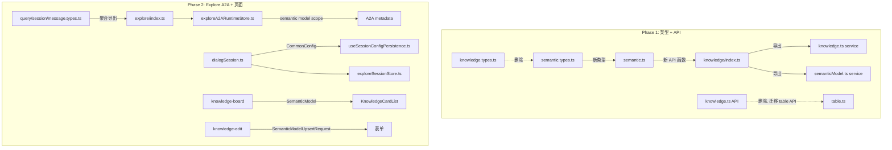

# 知识库管理设计 — Knowledge V2 整合

## 概述

后端将 `knowledge_base` + `nl2sql_knowledge` 统一到 `semantic_models` + `semantic_entries`，前端同步完成一次性切换。涉及两个包：

- `modules/shared-moi-api` — API 类型和函数
- `modules/moi-knowledge` — 业务模块（服务层 + 页面）

## 前后端统一口径

1. `POST /semantic-models/:id/import` 请求体仍为 `{"entries":[...]}`，不含 `name/description/tables/files`
2. 语义模型列表分页固定走 query：`?page_size=&page_token=`（cursor 分页，不支持 `?page=`）
3. session config 不做兼容：旧字段 `knowledge_base_ids` / `knowledge_bases` 不再读取；session config 根级只支持 `semantic_models: [{semantic_model_id: N}]`；A2A metadata 注入 semantic model scope
4. 前后端需同版本发布

## 变更影响链



## 数据模型

### SemanticModel（语义模型）

```typescript
interface SemanticModel {
  id: number;
  semantic_model_id: number;
  name: string;
  description: string;
  tables: SemanticModelTable[]; // 结构化：{db_name, table_names, parents}
  files?: SemanticModelFiles; // {file_ids, parents}
  table_set_hash: string;
  created_at: number;
  updated_at: number;
}
```

### Session Config

```typescript
// 根级字段（非 data_sources 下）
interface CommonConfig {
  type?: 'free' | 'fixed';
  semantic_models?: Array<{ semantic_model_id: number }>;
}
```

### Explore A2A Metadata

```typescript
interface ExploreA2AMetadata {
  semantic_model_ids: number[];
  scope_metadata: {
    semantic_model_ids: string;
    semantic_model_names?: string;
  };
  scope: {
    session_id: string;
    workspace_id?: string;
    scope_metadata: Record<string, string>;
  };
}
```

## API 路由映射

路由前缀：`/newmoi/semantic-models/:model_id`

| 函数名                     | 旧路径                                             | 新路径                                     |
| -------------------------- | -------------------------------------------------- | ------------------------------------------ |
| `listSemanticModelsApi`    | _(新增)_                                           | `GET /semantic-models`                     |
| `createSemanticModelApi`   | _(新增)_                                           | `POST /semantic-models`                    |
| `getSemanticModelApi`      | `GET /knowledge_base/:id/semantic-model`           | `GET /semantic-models/:id`                 |
| `updateSemanticModelApi`   | _(新增)_                                           | `PUT /semantic-models/:id`                 |
| `deleteSemanticModelApi`   | _(新增)_                                           | `DELETE /semantic-models/:id`              |
| `listSemanticEntriesApi`   | `GET /knowledge_base/:id/semantic-entries`         | `GET /semantic-models/:id/entries`         |
| `createSemanticEntryApi`   | `POST /knowledge_base/:id/semantic-entries`        | `POST /semantic-models/:id/entries`        |
| `updateSemanticEntryApi`   | `PUT /knowledge_base/:id/semantic-entries/:eid`    | `PUT /semantic-models/:id/entries/:eid`    |
| `deleteSemanticEntryApi`   | `DELETE /knowledge_base/:id/semantic-entries/:eid` | `DELETE /semantic-models/:id/entries/:eid` |
| `importSemanticModelApi`   | `POST /knowledge_base/:id/semantic-model/import`   | `POST /semantic-models/:id/import`         |
| `exportSemanticModelApi`   | `GET /knowledge_base/:id/semantic-model/export`    | `GET /semantic-models/:id/export`          |
| `validateSemanticModelApi` | `POST /knowledge_base/:id/semantic-model/validate` | `POST /semantic-models/:id/validate`       |

## table_ids 替代策略

后端删除了 `table_ids`，前端使用 `${db_name}::${table_name}` 组合作为稳定 key：

```typescript
// 旧方案
const key = `table-${tableId}`; // 依赖 table.table_ids[index]

// 新方案
const key = `table-${db_name}::${tableName}`; // 从 SemanticModelTable 提取
```

`mapSelectedFilesToSourcePayload` 在按 `db_name` 分组后对 `table_names` 去重。

## 文件级变更清单

### shared-moi-api

| 文件                           | 操作 | 说明                                                  |
| ------------------------------ | ---- | ----------------------------------------------------- |
| `knowledge/knowledge.types.ts` | 删除 | 旧 KB 类型                                            |
| `knowledge/knowledge.ts`       | 删除 | 旧 KB API，表查询迁移到 `table.ts`                    |
| `knowledge/table.ts`           | 新建 | 3 个表查询 API + 6 个类型                             |
| `knowledge/semantic.types.ts`  | 重写 | 新增 7 个类型，修改 SemanticModel                     |
| `knowledge/semantic.ts`        | 重写 | 路由改 `/semantic-models/`，新增 4 个 CRUD 函数       |
| `knowledge/index.ts`           | 重写 | 导出更新                                              |
| `explore/query.types.ts`       | 更新 | `ExploreKnowledgeBaseRef` → `ExploreSemanticModelRef` |
| `explore/session.types.ts`     | 新建 | 会话类型拆分到独立文件                                |
| `explore/message.types.ts`     | 新建 | 消息类型拆分到独立文件                                |

### moi-knowledge 服务层

| 文件                       | 说明                                                  |
| -------------------------- | ----------------------------------------------------- |
| `service/knowledge.ts`     | 改调 semantic-models API，cursor 分页                 |
| `service/semanticModel.ts` | `knowledgeBaseId` → `modelId`                         |
| `service/dialogSession.ts` | `CommonConfig.knowledge_base_ids` → `semantic_models` |

### moi-knowledge 页面层

| 文件                              | 说明                                              |
| --------------------------------- | ------------------------------------------------- |
| `KnowledgeCardList.tsx`           | 字段映射 + cursor 分页 + token map                |
| `KnowledgeCard.tsx`               | `usage_notes` → `description`                     |
| `KnowledgeMetadataEditModal.tsx`  | 表单字段 `usage_notes` → `description`            |
| `KnowledgeAdvancedConfigPage.tsx` | `sourceEntries` 改用 `db_name::table_name` key    |
| `KnowledgeAdvancedConfig.tsx`     | `knowledgeBaseId` → `modelId`                     |
| `SemanticEntrySetting.tsx`        | `knowledgeBaseId` → `modelId`，移除 fallback      |
| `SemanticModelToolbar.tsx`        | `knowledgeBaseId` → `modelId`                     |
| `useSemanticEntries.ts`           | `knowledgeBaseId` → `modelId`                     |
| `shared/knowledge/utils.ts`       | 映射函数重写，`table_ids` → `db_name::table_name` |

### moi-knowledge Explore 链路

| 文件                             | 说明                                                   |
| -------------------------------- | ------------------------------------------------------ |
| `exploreA2ARuntimeStore.ts`      | A2A metadata 写入 semantic model scope                 |
| `exploreSessionStore.ts`         | `createFixedSession` config 改为 `semantic_models`     |
| `useSessionConfigPersistence.ts` | persist 前清除遗留旧字段                               |
| `sessionConfig.ts`               | `normalizeKnowledgeIds` → `normalizeSemanticModelRefs` |
| `index.tsx`                      | session defaults 从 `cfg.semantic_models` 解析         |
| `useExploreKnowledgeOptions.ts`   | 列表调用适配 cursor 分页                               |

## 错误处理

- API 层：`unwrapApiResponse` 统一处理非 OK 响应
- 服务层：`modelId` 校验（`Number.isFinite && > 0`），无效时 warn + throw
- 页面层：列表失败 → `message.error` + 清空；编辑失败 → 错误状态；A2A stream 错误 → failed projection
- Session Config：`parseSessionConfig` 对非法 JSON 返回 `{}`；`normalizeSemanticModelRefs` 对非数组返回 `[]`

## 正确性属性

1. 所有 API 函数构造的 URL 以 `/semantic-models/` 为前缀，`:id` 被正确替换
2. session config 写入 `semantic_models` 后解析回来，ID 列表（排序去重后）与输入一致
3. A2A 请求 metadata 包含 semantic model scope，ID 一一对应
4. 知识源映射往返（`mapKnowledgeDetailToSelectedFiles` → `mapSelectedFilesToSourcePayload`）后 `table_names` 和 `file_ids` 与输入一致
