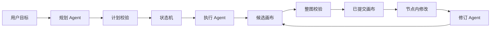

# CanvasFlow：工作流交互与实现梳理

[观看工作流交互演示](../moi-platform-prototype/videos/workflow-interaction-demo.mp4) · [CanvasFlow 源项目](https://github.com/Bai-009/canvas-first-workflow)

## 项目关系

CanvasFlow 是同事 **Bai-009** 维护的独立项目。本页根据其公开仓库的 [`824397e` 版本](https://github.com/Bai-009/canvas-first-workflow/tree/824397ed995dc7e1293a383bf3b90d1bc1cdf63e)整理工作流产品与实现机制；源代码仍由原项目维护。它提供了一个观察 AI 辅助工作流编排的具体交互案例，与本案例集中的 [MOI 工作流产品设计](../../docs/product-overview.md#3-工作流从能力配置到运行结果)相互参照。

## 值得呈现的四个设计点

| 设计点 | 用户在界面中看到什么 | 背后的规则 |
| --- | --- | --- |
| 先形成计划，再构建画布 | 目标、处理路线和需要补充的信息先呈现给用户 | 规划 Agent 提交结构化计划，校验通过后才成为当前版本；信息不足可以继续追问或保留待补项。 |
| 构建过程留在画布 | 节点和连线按依赖关系逐步出现 | 状态机依据步骤依赖安排构建顺序；执行 Agent 从节点目录选择能力、配置参数与连接。 |
| 从节点发起，审视整条工作流 | 用户在某个节点提出修改，并能看到关联节点的变化 | 修订携带完整计划、当前画布、发起节点和相关历史；Agent 判断全局影响，只提交必要的节点与连线差量。 |
| 校验后一次应用 | 无效、停止或过期的修改不覆盖已有画布 | 候选画布先经过契约、节点配置、连线和粗粒度数据形态检查，通过后才整体提交新版本。 |

这组设计把交流位置与作用范围分开：底部输入面向整条工作流，节点内输入面向该节点的具体问题；节点是修订的发起点，修改仍需要检查全图。比如“把字段抽取改为模型处理”从抽取节点提出，后续写入节点若依赖字段类型或单位，也要纳入影响判断。

## 一次完整的交互

1. 用户描述目标，例如定时处理新增合同 PDF、抽取字段并写入数据表。
2. 规划 Agent 整理目标、步骤、依赖与尚未确认的条件；用户可以补充或修正。
3. 用户开始构建后，执行 Agent 依照计划生成节点配置与连接，画布逐步呈现状态。
4. 用户打开节点检查参数，在该节点提出修改；修订 Agent 根据完整工作流生成候选版本。
5. 校验通过后，界面更新画布并显示本次修改；失败或停止时保留上一个已提交版本。

## 可以借鉴的验收问题

- 计划能否把用户已确认的事实和待补信息分开，避免替用户猜测目录、表名或字段？
- 修改一个节点时，是否检查依赖它的下游节点，并让用户看到实际改变的位置？
- 参数、连线或数据形态不合法时，是否能给出明确原因，同时保留旧版画布？
- 停止、刷新或重启后，已提交的计划和画布是否仍可恢复？
- 画布上的“生成配置”“保存版本”和“运行数据处理”是否有清楚的状态边界？

这些问题可作为本案例集 [工作流安全预览与验收场景](../../storybook/workflow/safe-workflow-review-and-qa-package.md)的交互补充。现有 [MOI 工作流管理 PRD](../../docs/prd/02-workflow-processing/complex-workflow-management-prd.md)还覆盖输入输出范围、作业、运行记录和异常定位；CanvasFlow 重点展示人与 AI 如何共同形成及修改流程定义。

## 实现范围与依据

CanvasFlow 的浏览器端负责画布与交互；Node 服务负责模型调用、状态、校验和本机会话保存，两端通过 HTTP 与事件流通信。当前项目实现了规划、节点配置生成和修订，数据处理节点尚未接入实际 OCR、嵌入或数据库写入能力。会话数据保存在本机；跨设备同步、多人协作和公网账户不在当前项目范围内。

本文依据源项目的 [项目说明](https://github.com/Bai-009/canvas-first-workflow/blob/824397ed995dc7e1293a383bf3b90d1bc1cdf63e/README.zh-CN.md)、[开发指南](https://github.com/Bai-009/canvas-first-workflow/blob/824397ed995dc7e1293a383bf3b90d1bc1cdf63e/docs/开发指南.md)及 [工作流修订实现](https://github.com/Bai-009/canvas-first-workflow/blob/824397ed995dc7e1293a383bf3b90d1bc1cdf63e/src/state-machine/workflow-revision.mts)整理。
